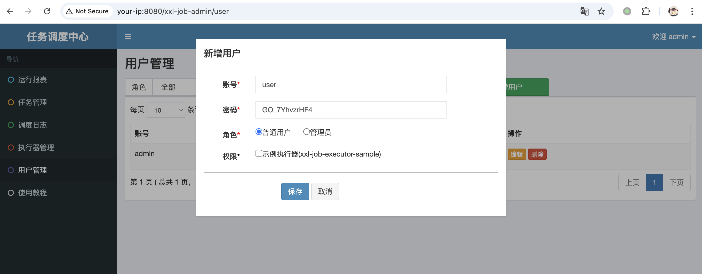
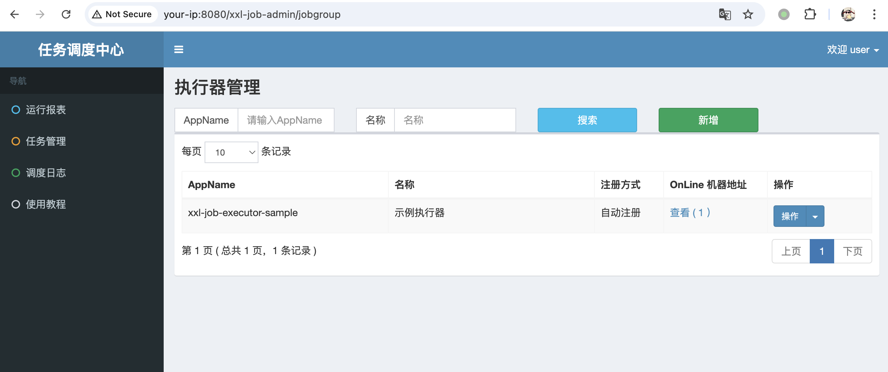

## 核对与使用边界

本文已按保存的全文审阅记录进行文字校订；本轮仅静态核对，未运行 PoC、请求目标或逐图验证。

适用条件与版本记录（来源主张，未列为明确更正的部分仍待权威资料核对）：&lt;=2.3.1修复2.4.0，需低权限登录

代码与实验材料：展示普通用户导航与直接GET jobgroup，未给管理写操作成功

来源证据范围：GitHub advisory及源码tag

- **操作与副作用边界（1）**：页面访问不等于全部执行器管理权限；依据：只演示jobgroup页面，可确认未授权界面/数据访问候选，新增删除等操作仍需单独验证。保留原步骤及请求方法。执行条件包括隔离且获授权的可恢复环境、预先记录相关文件/账号/配置/业务记录状态；响应完成不能等同无副作用，恢复时须核对该操作涉及的实际对象。

- **操作与副作用边界（2）**：范围及修复缺commit；依据：单2.3.1实验不能自动覆盖所有旧版，需官方分支范围。保留原步骤及请求方法。执行条件包括隔离且获授权的可恢复环境、预先记录相关文件/账号/配置/业务记录状态；响应完成不能等同无副作用，恢复时须核对该操作涉及的实际对象。

历史原文标识：下文原技术材料按来源保留；仅本节明确确认的更正替代相应旧说法，标为待核的观察仍不是事实确认。

# XXL-JOB 垂直越权漏洞 CVE-2022-36157

## 漏洞描述

XXL-JOB 是一个分布式任务调度平台，其核心设计目标是开发迅速、学习简单、轻量级、易扩展。现已开放源代码并接入多家公司线上产品线，开箱即用。XXL-JOB 分为 admin 和 executor 两端，前者为后台管理页面，后者是任务执行的客户端。

在 XXL-JOB v.2.3.1 版本及以前， 存在垂直越权漏洞，能够使用低权限帐户执行管理员功能。该漏洞在 v.2.4.0 版本修复。

参考链接：

- https://github.com/advisories/GHSA-7qq9-9g2w-56f9

## 漏洞影响

```
XXL-JOB <= v2.3.1
```

## 网络测绘

```
app="XXL-JOB" || title="任务调度中心" || ("invalid request, HttpMethod not support" && port="9999")
```

## 环境搭建

本地搭建 XXL-JOB v2.3.1，源码 https://github.com/xuxueli/xxl-job/archive/refs/tags/2.3.1.zip

环境启动后，访问 `http://your-ip:8080/xxl-job-admin/toLogin` 即可查看到管理端（admin），访问 `http://your-ip:9999` 可以查看到客户端（executor）。

默认口令 `admin/123456` 登录后台：


## 漏洞复现

创建一个普通用户 user：

```
user/GO_7YhvzrHF4
```




以普通用户 user 身份重新登录：


普通用户与管理员用户导航栏：

- 管理员用户 admin：运行报表、任务管理、调度日志、执行器管理、用户管理、使用教程
- 普通用户 user：运行报表、任务管理、调度日志、使用教程

以普通用户 user 身份直接访问 `http://your-ip:8080/xxl-job-admin/jobgroup`，即可获取执行器管理权限：




## 漏洞修复

该漏洞在 v.2.4.0 版本修复。


---

> 来源：Threekiii/Vulnerability-Wiki（https://github.com/Threekiii/Vulnerability-Wiki）
