## 核对与使用边界

- 分类更正：正文研究对象为 ManageEngine Desktop Central；目录中的语言/协议或其他产品名不能代替实际受影响产品。本次只更正元数据和分类建议，原材料保持原路径。

本文已按保存的全文审阅记录进行文字校订；本轮仅静态核对，未运行 PoC、请求目标或逐图验证。

适用条件与版本记录（来源主张，未列为明确更正的部分仍待权威资料核对）：&lt;10.0.474，实验10.0.465 x64；历史10.0.515已修复说法不矛盾但需确切首修复

代码与实验材料：完整链路说明：上传udid穿越→cewolf读文件→gadget，关键HTTP仅图

来源证据范围：原披露srcincite、官方修复页、安全客，图片原域显示Y4er/Chabug转载

- **证据待核（1）**：源码/路径转码损坏；依据：DesktopCentral_Serverwebapps...丢目录分隔；Java contains("\")原文仅单反斜杠破引号；u0000缺转义。保留原引用、截图位置和实验叙述；本项所缺材料未被补造，截图存在或作者宣称成功都不等于已核验其内容。

- **事实待核（2）**：产品分类不应只用Zoho厂商；依据：Desktop Central独立产品/版本，非开发框架本体。该项尚不能从转载本身确定外部事实；下文相应编号、版本或修复说法只作为来源记录，不能据此判定部署受影响或已修复。明确更正另列于本节。

- **适用与权限边界（3）**：关键实验请求和依赖锁定不足；依据：上传包仅图，ysoserial pom版本需匹配特定gadget而非所有jar一律相同；缺JDK条件和清理。按此限制解释本文结论，版本相同不足以证明所需角色、入口、配置、依赖或可控参数均已满足；原操作和失败记录一并保留。

历史原文标识：下文原技术材料按来源保留；仅本节明确确认的更正替代相应旧说法，标为待核的观察仍不是事实确认。

# CVE-2020-10189 Zoho ManageEngine反序列化RCE

## 漏洞描述

在3月6日，[@steventseeley](https://twitter.com/steventseeley/status/1235635108498948096) 在twitter上发布了关于 Zoho 企业产品 Zoho ManageEngine Desktop Central 中的[反序列化](https://www.chabug.org/tags/反序列化)远程代码执行漏洞。该产品是一款基于 Web 的企业级服务器、桌面机及移动设备管理软件，可对桌面机以及移动设备管理的整个生命周期提供完全的支持，提供软件分发、补丁管理、资产管理、系统配置、远程控制、USB 外设管理、移动设备及应用管理等功能模块，帮助 IT 管理员集中远程管理大量的 PC 和 IOS/Android/Windows 移动设备。

## 影响版本

Zoho ManageEngine Desktop Central < 10.0.474

## 漏洞分析

本文使用10.0.465 x64复现分析，[历史版本下载移步](http://archives.manageengine.com/desktop-central/)。

### 寻找反序列化点

首先反序列化漏洞，肯定需要先找到反序列化的点。

查看 `DesktopCentral_ServerwebappsDesktopCentralWEB-INFweb.xml` 发现了名为 `CewolfServlet` 的`servlet`，对应的类为 `DesktopCentral_Serverlibcewolf-1.2.4.jar` 中的 `de.laures.cewolf.CewolfRenderer`，对应的url为`/cewolf/*`


[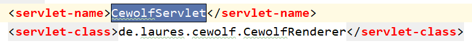](https://y4er.com/img/uploads/20200321182965.png)


[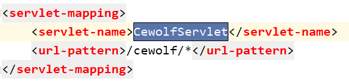](https://www.chabug.org/wp-content/uploads/2020/04/20200321185502.png)


`CewolfRenderer` 类继承 `HttpServlet` 是一个 `servlet`，在其 `doGet` 方法中


[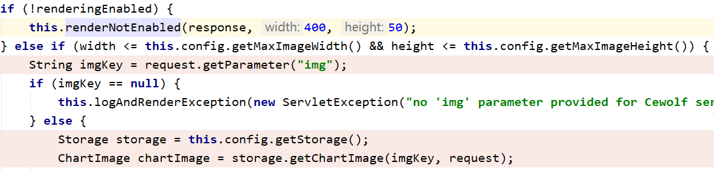](https://www.chabug.org/wp-content/uploads/2020/04/20200321182003.png)


`imgKey` 可控，然后调用 `storage.getChartImage(imgKey, request)` 。`Storage` 类是一个接口，在这个jar包中，`FileStorage` 类实现了 `Storage` 接口的 `getChartImage` 方法。


[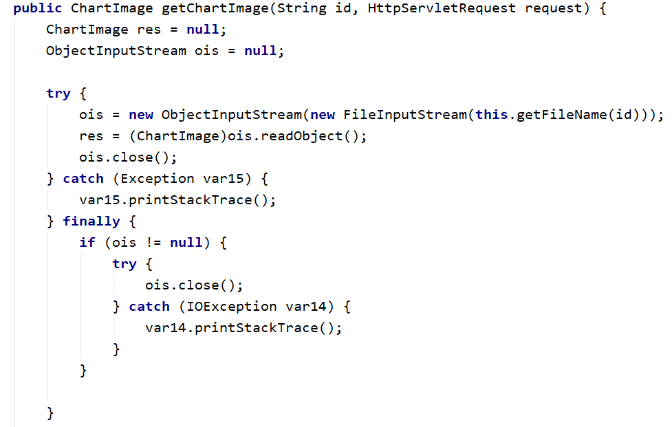](https://www.chabug.org/wp-content/uploads/2020/04/20200321181041.png)


很明显的看到直接将之前传入的 `img` 当作 `imgKey` 参数，然后通过 `getFileName()` 获取文件名然后进行 `ObjectInputStream` 的 `readObject()`，再看 `getFileName()`。


[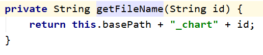](https://www.chabug.org/wp-content/uploads/2020/04/20200321183565.png)


进行了一个简单的拼接，无伤大雅。

捋一下，通过img传入参数触发读文件进而反序列化，现在的问题就是这个恶意的序列化文件我们怎么传上去，并且路径要有`_chart`。

### 寻找上传点

web.xml中寻找上传的servlet


[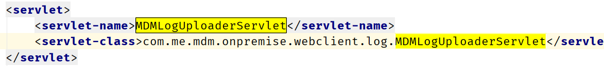](https://www.chabug.org/wp-content/uploads/2020/04/20200321186974.png)


跟进之后发现udid、filename可控，并且udid被拼接到文件保存目录中。


[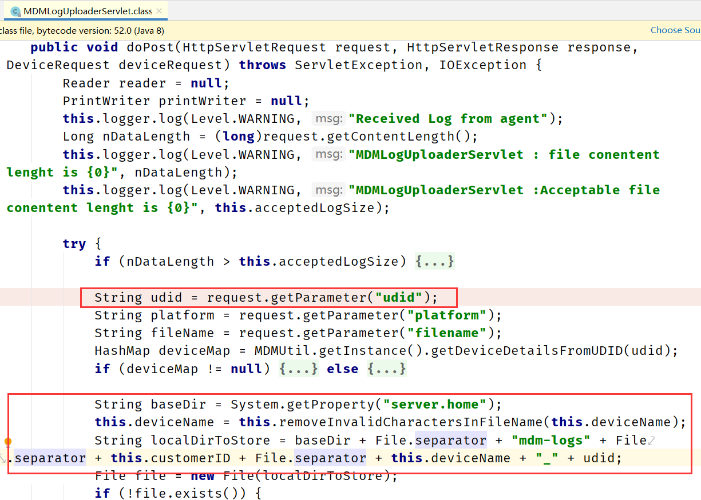](https://www.chabug.org/wp-content/uploads/2020/04/20200321185491.png)


```java
String localDirToStore = baseDir + File.separator + "mdm-logs" + File.separator + this.customerID + File.separator + this.deviceName + "_" + udid;
```


那么我们可以跨目录上传，在上文中我们传入文件名触发反序列化时会拼接 `this.basePath + "_chart" + id` 到路径中，所以我们需要构造一个 `_chart` 的路径 `aaa......webappsDesktopCentral_chart`。

再来看对文件名的处理


[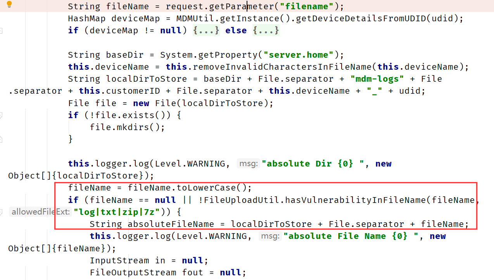](https://www.chabug.org/wp-content/uploads/2020/04/20200321186665.png)


然后文件名转小写之后进行了 `FileUploadUtil.hasVulnerabilityInFileName(fileName, "log|txt|zip|7z")` 的校验，然后拼接为完整的文件路径，看下校验了什么。


[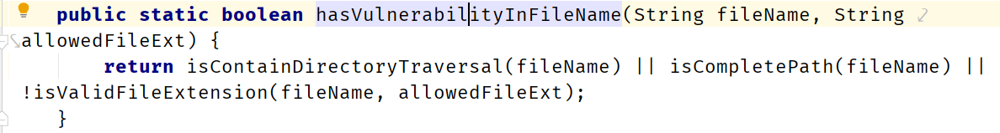](https://www.chabug.org/wp-content/uploads/2020/04/20200321184618.png)


然后进行 `isContainDirectoryTraversal()` 、 `isCompletePath()` 、 `isValidFileExtension()` 的校验。

```java
private static boolean isContainDirectoryTraversal(String fileName) {
    return fileName.contains("/") || fileName.contains("\");
}

private static boolean isCompletePath(String fileName) {
    String regexFileExtensionPattern = "([a-zA-Z]:[\ \\ / //].*)";
    Pattern pattern = Pattern.compile(regexFileExtensionPattern);
    Matcher matcher = pattern.matcher(fileName);
    return matcher.matches();
}

private static boolean isContainExecutableFileExt(String fileName) {
    if (fileName.indexOf("u0000") != -1) {
        fileName = fileName.substring(0, fileName.indexOf("u0000"));
    }

    String fileExtension = FilenameUtils.getExtension(fileName).trim();
    if (!fileExtension.trim().equals("")) {
        fileExtension = fileExtension.toLowerCase();
        ArrayList executableFileExts = new ArrayList(Arrays.asList("jsp", "js", "html", "htm", "shtml", "shtm", "hta", "asp"));
        if (executableFileExts.contains(fileExtension)) {
            return true;
        }
    }

    return false;
}
```


判断是否文件名进行了目录穿越、是否是合法后缀等，但是因为之前的目录是由udid控制的，并不影响我们的文件上传。而在web.xml中引入了security-mdm-agent.xml


[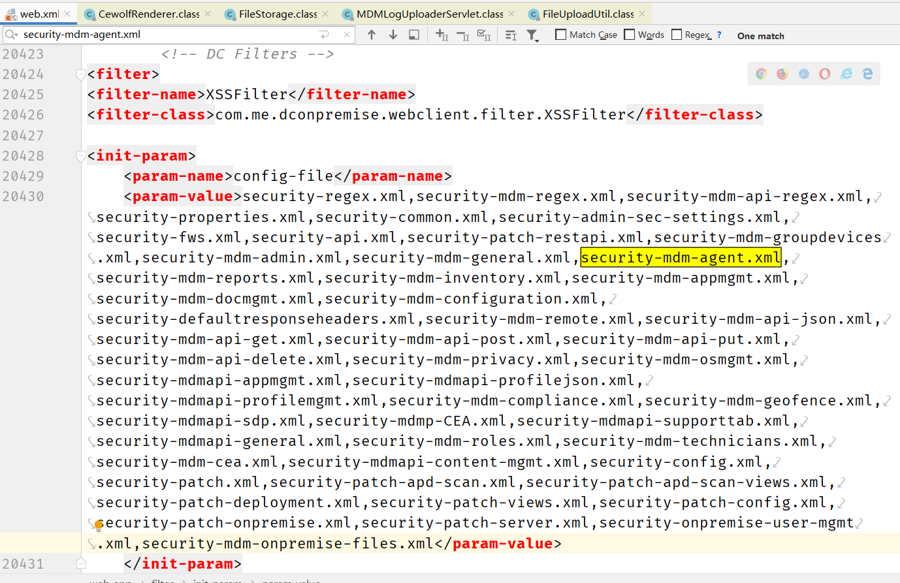](https://www.chabug.org/wp-content/uploads/2020/04/20200321187536.png)


在 `security-mdm-agent.xml` 中有一个校验，只允许文件名为 `logger.txt|logger.zip|mdmlogs.zip|managedprofile_mdmlogs.zip`


[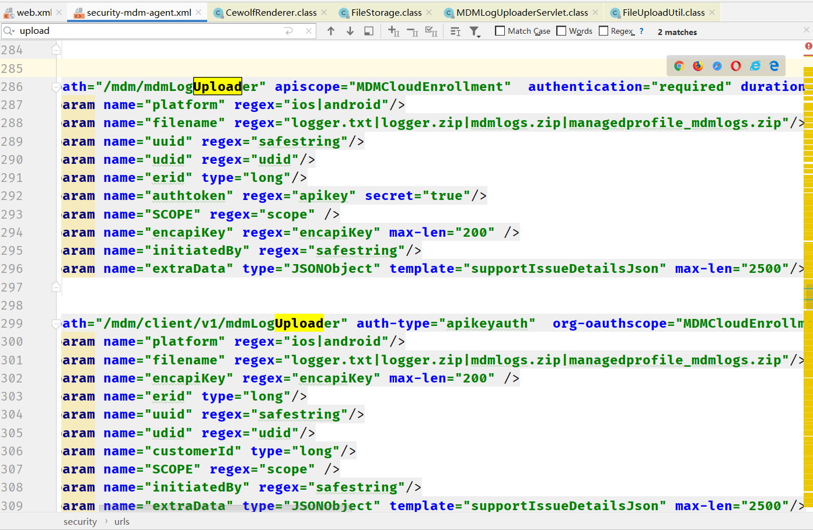](https://www.chabug.org/wp-content/uploads/2020/04/20200321183022.png)


所以构造如下请求，即可上传文件


[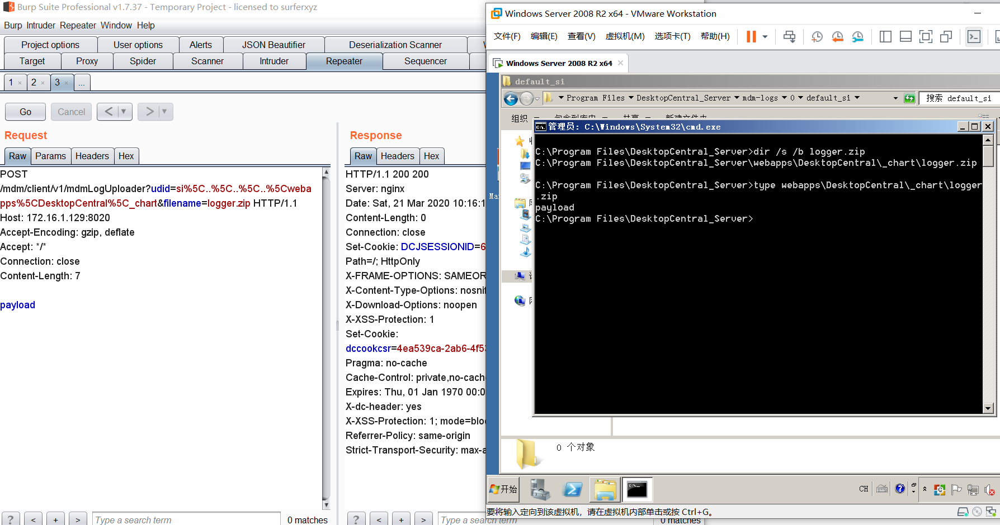](https://www.chabug.org/wp-content/uploads/2020/04/20200321181636.png)


### 寻找gadgets

`DesktopCentral_Serverlib` 中有 `commons-collections.jar(3.1)`、`commons-beanutils-1.8.0.jar`，完美。使用ysoserial生成序列化文件，先上传然后触发反序列化就完事了。注意ysoserial的pom.xml要和目标的jar版本一样。


[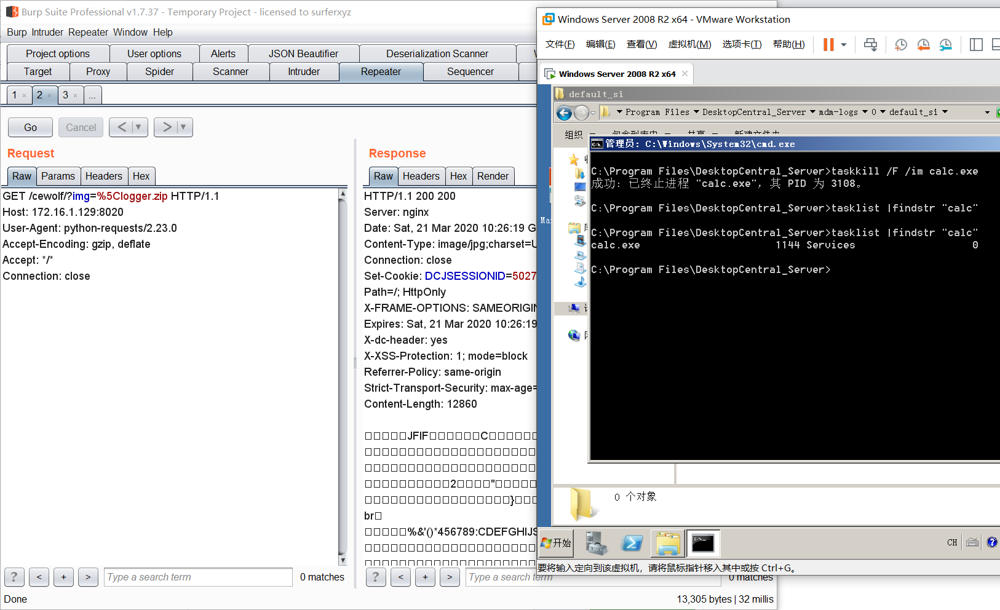](https://www.chabug.org/wp-content/uploads/2020/04/20200321181885.png)


## 漏洞修复

截至2020/03/20 9.34分，官网版本为10.0.515，已经修复了漏洞，请更新。

## 参考链接

1. https://srcincite.io/pocs/src-2020-0011.py.txt
2. https://www.anquanke.com/post/id/200474
3. https://www.manageengine.com/products/desktop-central/remote-code-execution-vulnerability.html