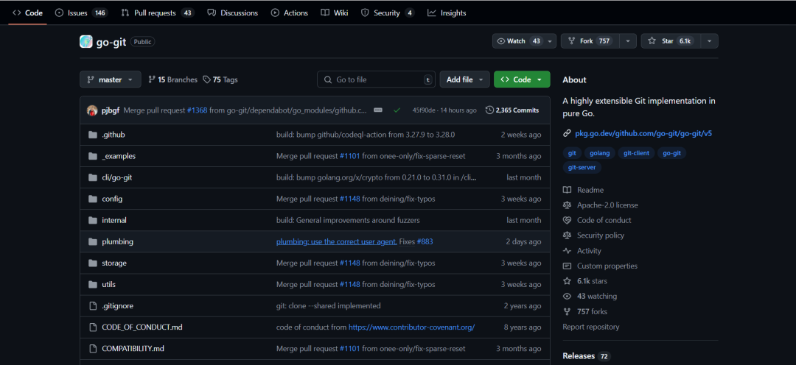

## 核对与使用边界

本文已按保存的全文审阅记录进行文字校订；本轮仅静态核对，未运行 PoC、请求目标或逐图验证。

适用条件与版本记录（来源主张，未列为明确更正的部分仍待权威资料核对）：4.0.0–&lt;5.13.0，需应用把不可信file URL传入本地git调用

代码与实验材料：无PoC或参数实例，只概述flag注入

来源证据范围：官方仓库首页，缺具体公告/patch

- **证据待核（1）**：命令执行影响与证据强度不匹配；依据：影响写任意命令，详情只讲可控制upload-pack标志，需原始链证据与限制。保留原引用、截图位置和实验叙述；本项所缺材料未被补造，截图存在或作者宣称成功都不等于已核验其内容。

- **结论使用边界（2）**：应前置应用输入和本地git依赖；依据：库被安装不等于可远程触发，需要调用路径。此项限制直接适用于下文对应结论；现有正文不足以作更宽泛推论，所列方法和原始证据均保留。

- **事实待核（3）**：未公开状态应冻结日期；依据：2025-01-15的PoC状态不是当前结论。该项尚不能从转载本身确定外部事实；下文相应编号、版本或修复说法只作为来源记录，不能据此判定部署受影响或已修复。明确更正另列于本节。

历史原文标识：下文原技术材料按来源保留；仅本节明确确认的更正替代相应旧说法，标为待核的观察仍不是事实确认。

#  漏洞预警 | go-git参数注入漏洞   
浅安  浅安安全   2025-01-15 00:00  
  
**0x00 漏洞编号**  
- # CVE-2025-21613  
  
**0x01 危险等级**  
- 高危  
  
**0x02 漏洞概述**  
  
go-git是一个用Go语言编写的高度可扩展的git实现库。  
  
  
  
**0x03 漏洞详情**  
###   
  
**CVE-2025-21613**  
  
**漏洞类型：**  
参数注入  
  
**影响：**  
执行任意命令  
  
****  
  
**简述：**  
go-git中存在参数注入漏洞，该漏洞源于go-git库在使用文件传输协议时，未能正确处理或验证通过URL字段传入的输入，导致攻击者可能注入恶意参数到本地调用的git二进制文件中。攻击者可利用该漏洞修改git-upload-pack命令的标志，从而控制命令行为。成功利用该漏洞的攻击者可以设置任意的git-upload-pack标志值，进而导致未授权访问、信息泄露或执行其他恶意操作。  
  
**0x04 影响版本**  
- 4.0.0 <= go-git < 5.13.0  
  
**0x05****POC状态**  
- 未公开  
  
**0x06****修复建议**  
  
**目前官方已发布漏洞修复版本，建议用户升级到安全版本****：**  
  
https://github.com/go-git/go-git/  
  
  
  

---

> 来源：gelusus/wxvl（微信公众号漏洞文章自动归档，原文见文首链接）
