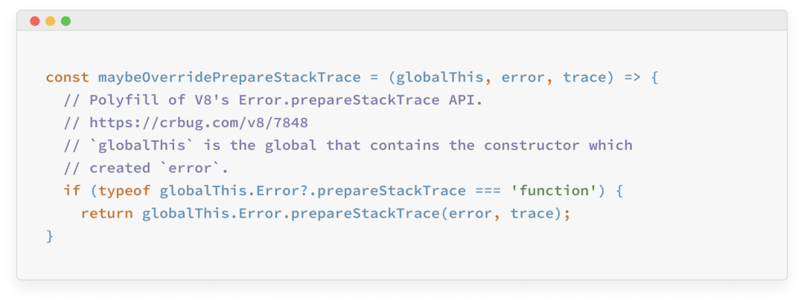
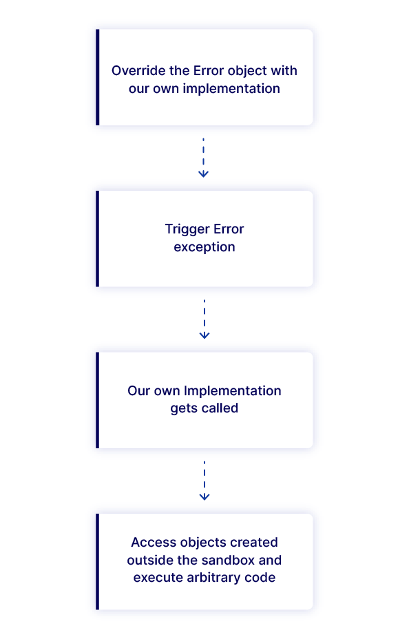
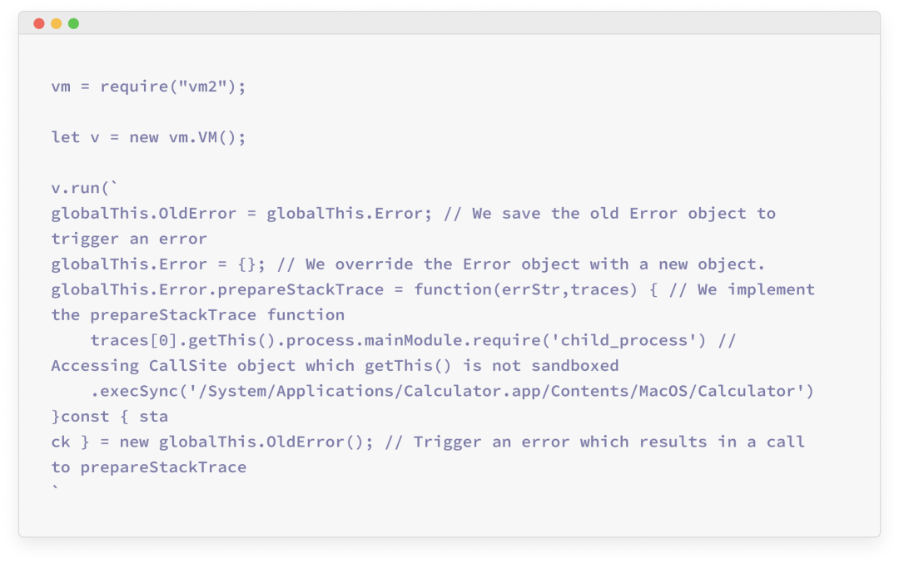

## 核对与使用边界

本文已按保存的全文审阅记录进行文字校订；本轮仅静态核对，未运行 PoC、请求目标或逐图验证。

适用条件与版本记录（来源主张，未列为明确更正的部分仍待权威资料核对）：修复3.9.11，未完整列受影响范围；需运行不可信脚本

代码与实验材料：分析与PoC只截图，宿主CallSite.getThis链文字说明

来源证据范围：Oxeye原始研究及BleepingComputer

- **事实待核（1）**：主编号不在元数据；依据：正文有36067但frontmatter仅source。该项尚不能从转载本身确定外部事实；下文相应编号、版本或修复说法只作为来源记录，不能据此判定部署受影响或已修复。明确更正另列于本节。

- **代码与转录边界（2）**：V8调用参数描述不准；依据：prepareStackTrace接收错误对象与CallSite数组，文说字符串和CallSite对象，易误解接口。相应原代码作为存在此问题的历史样本保留，不能直接当作可运行、成功复现的 PoC；缺失内容需回原稿核对，不据此补造可执行攻击链。

- **适用与权限边界（3）**：语言沙箱不等于操作系统隔离；依据：泛称与OS其余隔离会过强，vm2是在同进程运行时边界；需明确应用入口。按此限制解释本文结论，版本相同不足以证明所需角色、入口、配置、依赖或可控参数均已满足；原操作和失败记录一并保留。

历史原文标识：下文原技术材料按来源保留；仅本节明确确认的更正替代相应旧说法，标为待核的观察仍不是事实确认。

#  VM2远程代码执行漏洞曝光   
ang010ela  嘶吼专业版   2022-10-14 12:05  
  
  
  
VM2现10分漏洞，可在沙箱外运行代码。  
  
vm2是JS沙箱库，每个月通过npm的下载量超过1600万。Oxeye安全研究人员在vm2中发现了一个非常严重的远程代码执行漏洞，漏洞CVE编号为CVE-2022-36067，CVSS评分10分，攻击者利用该漏洞可以从沙箱环境逃逸并在主机系统上运行命令。  
  
沙箱是与操作系统其他部分隔离开来的隔离环境。开发者常用沙箱来运行或测试不安全的代码，因此从受限的环境中逃逸并在主机上执行代码是一个非常大的安全隐患。  
# 漏洞分析  
  
Node.js允许应用开发者定制应用遇到错误时的调用stack。定制调用stack可以通过Error对象的“prepareStacktrace”方法来实现。也就是说错误在发生时，错误对象的stack属性会被访问，node.js会调用该方法，并提供给该方法一个字符串表示和“CallSite”对象作为参数。Node.js调用“prepareStackTrace”函数如下所示：  
  
  
  
数组中的每个“CallSite”对象都表示不同的stake帧。“CallSite”对象的严格方法getThis负责返回this对象。该行为可能会引发沙箱逃逸，因为有“CallSite”对象可能会返回通过调用“getThis”方法时创建的对象。在获得沙箱外创建的“CallSite”对象后，就可能访问节点的全局对象并执行任意系统命令。  
  
  
  
PoC代码如下所示：  
  
  
  
攻击者利用该漏洞可以绕过vm2沙箱环境，并在沙箱主机上运行shell命令。  
# 漏洞修复  
  
Vm2维护人员意识到覆写“prepareStackTrace”可能会引发沙箱逃逸，并尝试封装Error对象和“prepareStackTrace”方法来进行应对。Vm2已于v 3.9.11版本中修复了该漏洞。使用沙箱的用户应检查确认是否依赖vm2，并更新到最新版本。  
  
完整技术分析参见：https://www.oxeye.io/blog/vm2-sandbreak-vulnerability-cve-2022-36067  
  
参考及来源：https://www.bleepingcomputer.com/news/security/critical-vm2-flaw-lets-attackers-run-code-outside-the-sandbox/  
  
  
  
  
  
  

---

> 来源：gelusus/wxvl（微信公众号漏洞文章自动归档，原文见文首链接）
