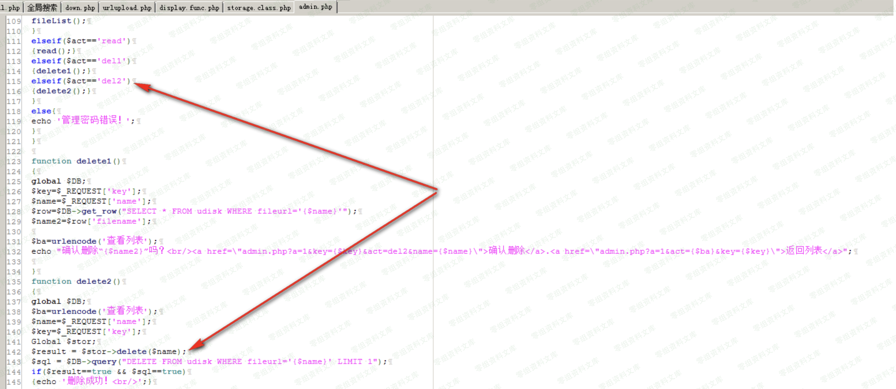
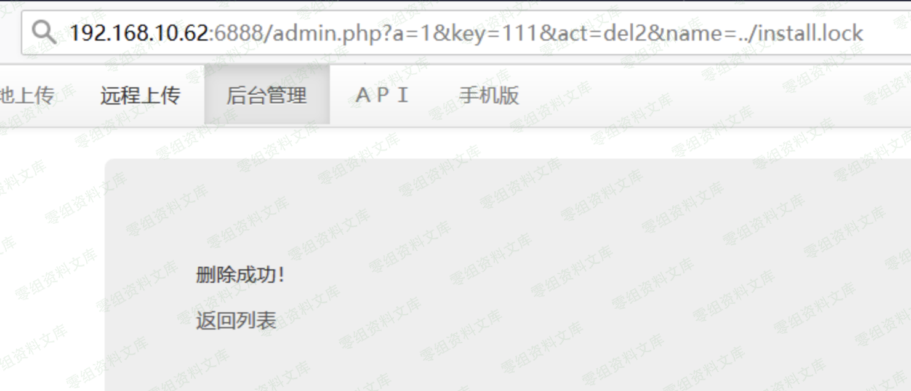

彩虹外链网盘 v4.0 后台任意文件删除漏洞
======================================

一、漏洞简介
------------

二、漏洞影响
------------

彩虹外链网盘 v4.0

三、复现过程
------------

在admin.php传入act为del2,然后传入name为文件名就可以删除了

{width="5.833333333333333in"
height="2.5367639982502186in"}

调用的是storage.class.php中的delete函数然后掉用unlink,就不多说了

{width="5.833333333333333in"
height="2.5067563429571305in"}
