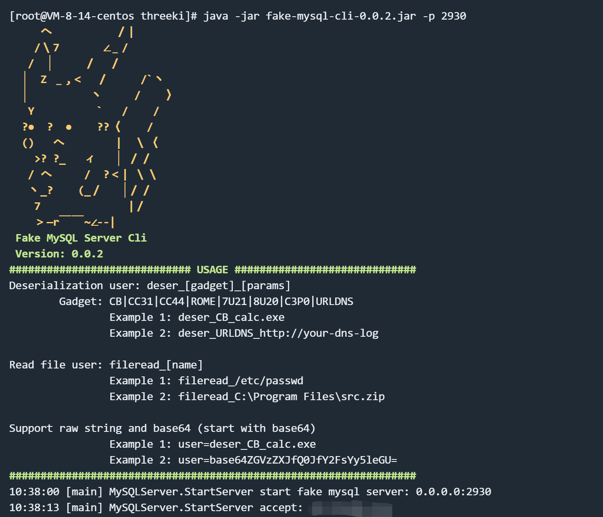
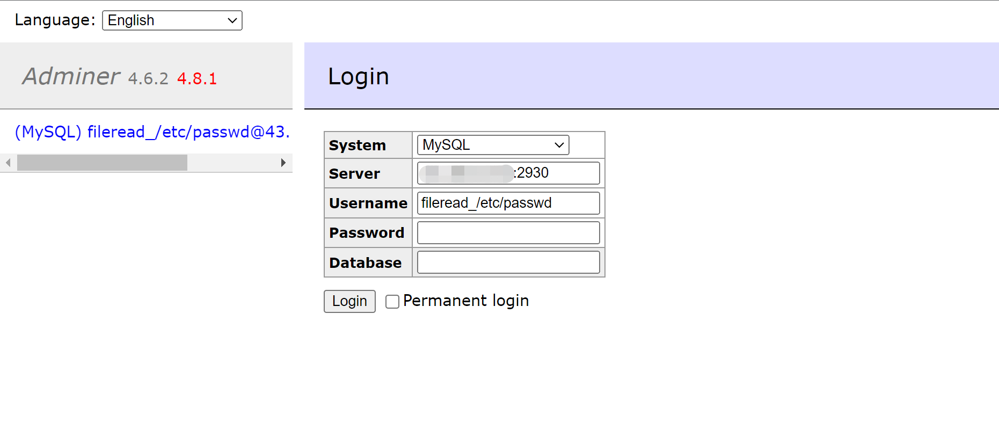
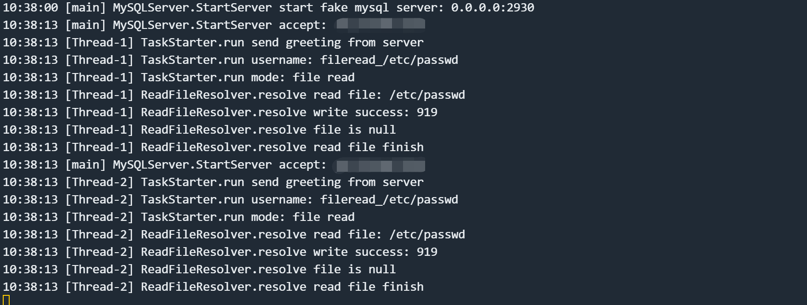
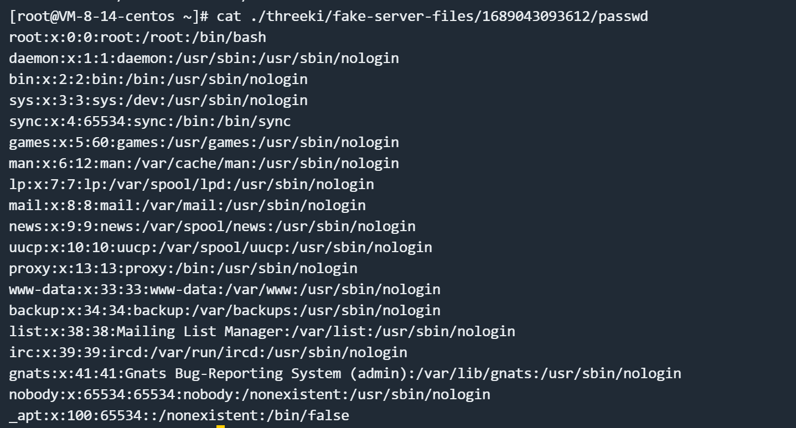

# Adminer 远程文件读取 CVE-2021-43008

<!-- vulwiki-editorial:start -->
## 校订与适用边界

- 适用前提：1.12.0-4.6.2;connect UI to rogue MySQL server;local-infile client behavior and read permissions
- 证据范围：Specific fake-server demonstration and screenshot result;no inline server code

### 本次正文校订

- 按实际内容修正 1 处代码围栏语言标记，保留其中方法与请求内容。

### 尚未解决的证据缺口

以下限制仍适用于后文历史材料；相关版本、结果或修复结论不能据此视为已验证：

- No explicit fixed version/patch source;pin lab and server-tool revision
- 'Remote file read' means files on web/Adminer host acting asMySQL client,not remote DB host
- Link broad protocol explanation0 without duplicating whole article

本页为文本校订，未执行代码、PoC 或目标请求；原图仅保留引用，未据此确认复现成功。
<!-- vulwiki-editorial:end -->

## 技术正文与历史材料

## 漏洞描述

Adminer是一个PHP编写的开源数据库管理工具，支持MySQL、MariaDB、PostgreSQL、SQLite、MS SQL、Oracle、Elasticsearch、MongoDB等数据库。

在其版本1.12.0到4.6.2之间存在一处因为MySQL LOAD DATA LOCAL导致的文件读取漏洞。

参考链接：

- https://github.com/p0dalirius/CVE-2021-43008-AdminerRead
- http://sansec.io/research/adminer-4.6.2-file-disclosure-vulnerability

## 漏洞环境

Vulhub执行如下命令启动Web服务，其中包含Adminer 4.6.2：

```shell
docker compose up -d
```

服务启动后，在`http://your-ip:8080`即可查看到Adminer的登录页面。

## 漏洞复现

使用[mysql-fake-server](https://github.com/4ra1n/mysql-fake-server)启动一个恶意的MySQL服务器。




在Adminer登录页面中填写恶意服务地址和用户名`fileread_/etc/passwd`：




可见，我们已经收到客户端连接。




读取到的文件`/etc/passwd`已保存至当前目录：




---

> 来源：Threekiii/Vulnerability-Wiki（https://github.com/Threekiii/Vulnerability-Wiki）
