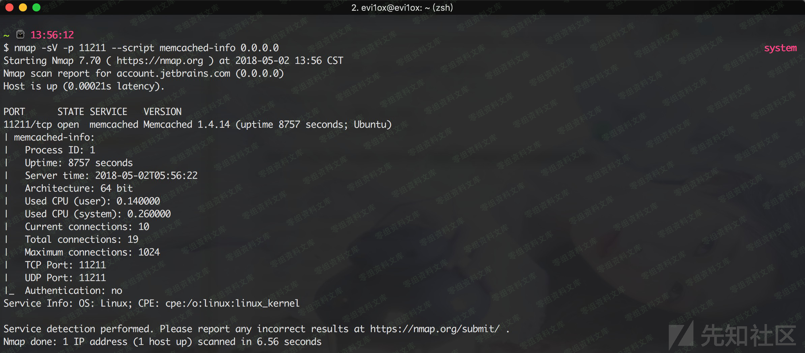
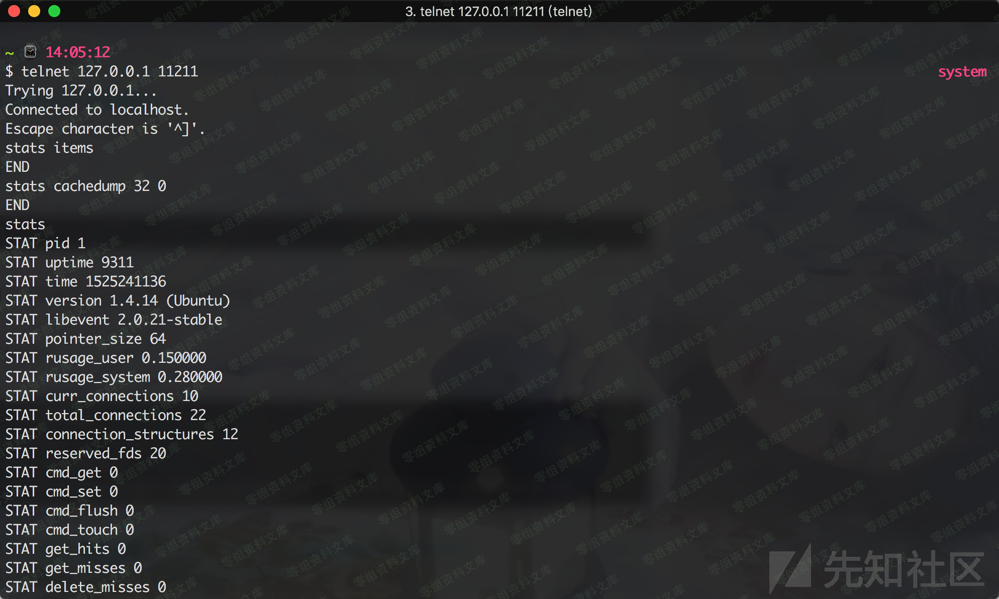

# Memcache未授权访问

<!-- vulwiki-editorial:start -->
## 校订与适用边界

- 适用前提：11211可达且未限制访问/认证；协议及版本条件未列
- 证据范围：协议、缓存读写和部署加固综合说明；扫描代码存在明显复制错误

### 尚未解决的证据缺口

以下限制仍适用于后文历史材料；相关版本、结果或修复结论不能据此视为已验证：

- P0脚本缺import socket且main调用Elasticsearch_check而非Memcache_check，无法按文运行
- telnet/nc示例缺目标主机；0.0.0.0扫描目标含糊
- 防火墙先-A允许后-I拒绝会把拒绝置顶，次序可能阻断全部流量
- SASL链接指向Postfix手册而非Memcached，缺协议/启动选项说明
- 修改端口不是认证防护；root启动示例与最小权限建议冲突
- 影响范围为空，区分配置暴露与产品CVE；flush_all有破坏性

本页为文本校订，未执行代码、PoC 或目标请求；原图仅保留引用，未据此确认复现成功。
<!-- vulwiki-editorial:end -->

## 技术正文与历史材料

一、漏洞简介
------------

> memcached是一套分布式的高速缓存系统。它以Key-Value（键值对）形式将数据存储在内存中，这些数据通常是应用读取频繁的。正因为内存中数据的读取远远大于硬盘，因此可以用来加速应用的访问。

二、影响范围
------------

三、复现过程
------------

#### 1.扫描探测

    nmap -sV -p 11211 --script memcached-info 0.0.0.0

    ##! /usr/bin/env python
    ## _*_  coding:utf-8 _*_
    def Memcache_check(ip, port=11211, timeout=5):
        try:
            socket.setdefaulttimeout(timeout)
            s = socket.socket(socket.AF_INET, socket.SOCK_STREAM)
            s.connect((ip, int(port)))
            s.send("stats\r\n")
            result = s.recv(1024)
            if "STAT version" in result:
                print '[+] Memcache Unauthorized: ' +ip+':'+str(port)
        except Exception, e:
            pass
    if __name__ == '__main__':
        Elasticsearch_check("127.0.0.1")

#### 2.攻击利用

##### 2.1 基础部分

通过一个cheat
sheet了解一下Memcached的协议。Memcached的语法由如下元素组成

-   {COMMAND}0x20{ARGUMENT}(LF\|CRLF)

command字段有如下几条命令

-   存储操作(set, add, replace, append, prepend, cas)

-   检索操作 (get, gets)

-   删除操作 (delete)

-   增减操作 (incr, decr)

-   touch

-   slabs reassign

-   slabs automove

-   lru\_crawler

-   统计操作(stats items, slabs, cachedump)

-   其他操作 (version, flush\_all, quit)

  Command        描述                实例
  -------------- ------------------- --------------------
  get            读某个值            get mykey
  set            强制设置某个键值    set mykey 0 60 5
  add            添加新键值对        add newkey 0 60 5
  replace        覆盖已经存在的key   replace key 0 60 5
  flush\_all     让所有条目失效      flush\_all
  stats          打印当前状态        stats
  stats malloc   打印内存状态        stats malloc

version \| 打印Memcached版本 \| version

    stats  //查看memcache 服务状态
    stats items  //查看所有items
    stats cachedump 32 0  //获得缓存key
    get :state:264861539228401373:261588   //通过key读取相应value ，获得实际缓存内容，造成敏感信息泄露

#### 2.2 建立连接并获取信息

telnet 11211，或 nc -vv 11211，无需用户名密码，可以直接连接memcache
服务的11211端口。

 附赠大佬写的文章
[Discuz!因Memcached未授权访问导致的RCE](https://xz.aliyun.com/t/2018)

#### 3.防范措施

##### 1.限制访问

如果memcache没有对外访问的必要，可在memcached启动的时候指定绑定的ip地址为
127.0.0.1。其中 -l 参数指定为本机地址。例如： memcached -d -m 1024 -u
root -l 127.0.0.1 -p 11211 -c 1024 -P /tmp/memcached.pid

或者 vim /etc/sysconfig/memcached，修改配置文件 OPTIONS=\"-l
127.0.0.1\"，只能本机访问，不对公网开放，保存退出 /etc/init.d/memcached
reload

##### 2.防火墙

    // accept
    ## iptables -A INPUT -p tcp -s 127.0.0.1 --dport 11211 -j ACCEPT
    ## iptables -A INPUT -p udp -s 127.0.0.1 --dport 11211 -j ACCEPT

    // drop
    ## iptables -I INPUT -p tcp --dport 11211 -j DROP
    ## iptables -I INPUT -p udp --dport 11211 -j DROP

    // 保存规则并重启 iptables
    ## service iptables save
    ## service iptables restart

##### 3.使用最小化权限账号运行Memcached服务

使用普通权限账号运行，指定Memcached用户。

    memcached -d -m 1024 -u memcached -l 127.0.0.1 -p 11211 -c 1024 -P /tmp/memcached.pid

##### 4.启用认证功能

Memcached本身没有做验证访问模块,Memcached从1.4.3版本开始，能支持SASL认证。[SASL认证详细配置手册](http://www.postfix.org/SASL_README.html?spm=a2c4g.11186623.2.5.RpKdcX##saslauthd)

##### 5.修改默认端口

修改默认11211监听端口为11222端口。在Linux环境中运行以下命令：

    memcached -d -m 1024 -u memcached -l 127.0.0.1 -p 11222 -c 1024 -P /tmp/memcached.pid

##### 6.定期升级

参考:

<http://lzone.de/cheat-sheet/memcached>

<https://www.secpulse.com/archives/49659.html>

<https://www.sensepost.com/blog/2010/blackhat-write-up-go-derper-and-mining-memcaches/>

<https://www.blackhat.com/docs/us-14/materials/us-14-Novikov-The-New-Page-Of-Injections-Book-Memcached-Injections-WP.pdf>

<http://niiconsulting.com/checkmate/2013/05/memcache-exploit/>

<https://xz.aliyun.com/t/2018>

<http://drops.xmd5.com/static/drops/web-8987.html>

https://blog.csdn.net/microzone/article/details/79262549\<
