# Oracle MySQL Server 漏洞

<!-- vulwiki-editorial:start -->
## 校订与适用边界

- 适用前提：不同组件、分支及角色条件未分清；全部为公告摘录，无复现
- 证据范围：正文十项均主要实体，不是同漏洞；标题反复误用Server覆盖Connectors和Firewall

### 尚未解决的证据缺口

以下限制仍适用于后文历史材料；相关版本、结果或修复结论不能据此视为已验证：

- P0 21548应归Connector/Python，21495为Enterprise Firewall，不是Server组件
- 21548标识被换行打断为CV/E-，提取器可能漏记
- 每分支<=写法缺下界；未列所需权限/组件和准确补丁版本
- 通用型/未明只是来源缺失，不应被归为已知技术弱点
- 拆为CPU汇总页及十个关联实体，避免全文复制十次

本页为文本校订，未执行代码、PoC 或目标请求；原图仅保留引用，未据此确认复现成功。
<!-- vulwiki-editorial:end -->

## 技术正文与历史材料

一天  漏洞更新   2025-01-27 02:01  
  
# Oracle MySQL是美国甲骨文（Oracle）公司的一套开源的关系数据库管理系统。MySQLServer是其中的一个数据库服务器组件。  
# Oracle MySQL Server存在未明漏洞  
# Oracle MySQL的MySQL Server存在安全漏洞。攻击者可利用该漏洞导致MySQL Server挂起或频繁重复崩溃。  
  
CVE ID：  
CVE-2025-21505  
  
危害级别：  
中  
  
影响产品：  
  
Oracle   
MySQL Server <=8.  
0.40  
  
Oracle MySQL Server <=8.4.3  
  
Oracle MySQL Server <=9.1.0  
  
漏洞类型：  
通用型漏洞  
  
漏洞解决方案：  
厂商已发布了漏洞修复程序，请及时关注更新：  
  
https://www.oracle.com/security-alerts/cpujan2025.html  
  
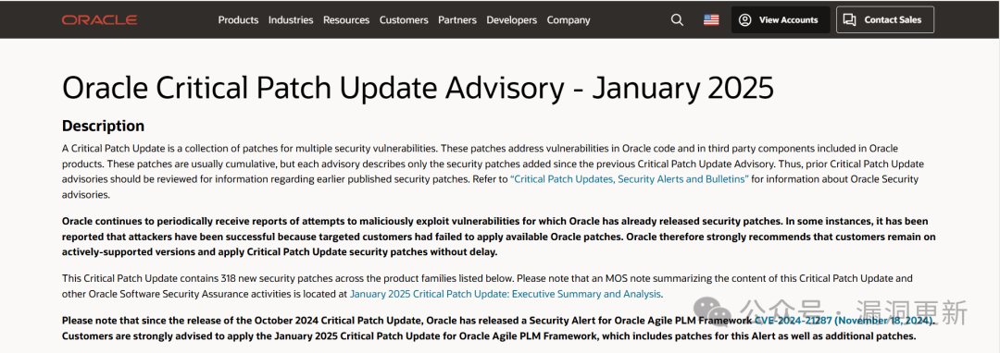  
  
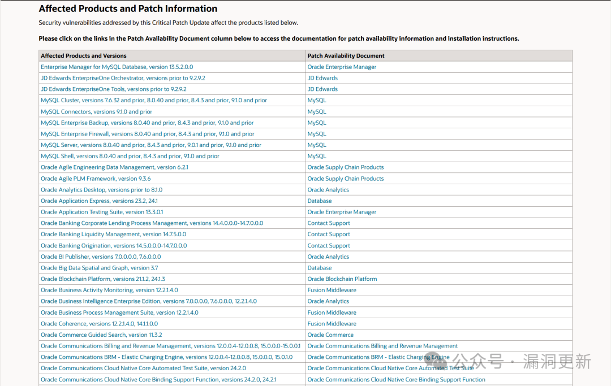  
  
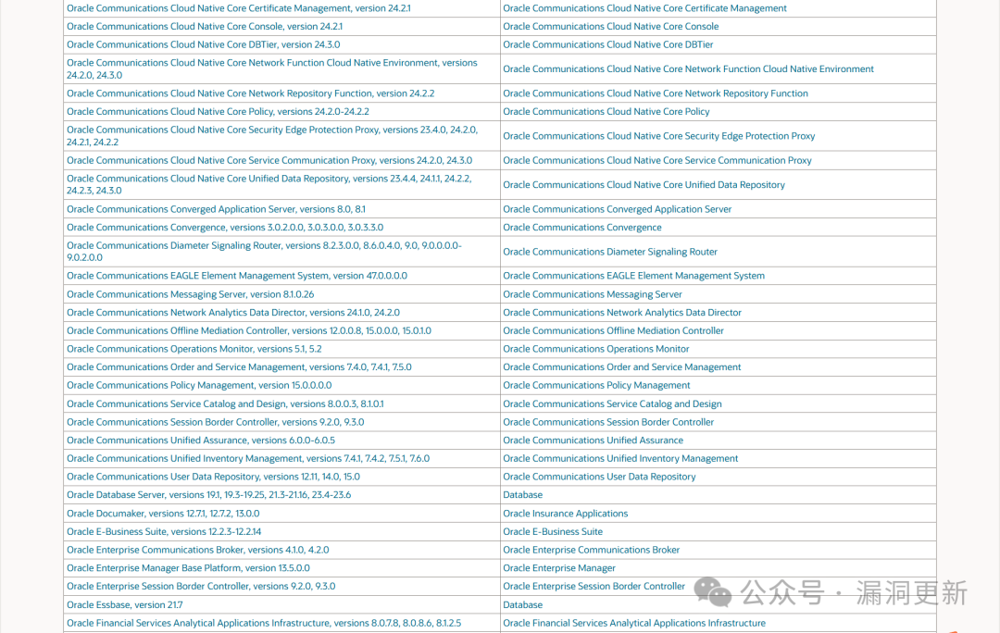  
# Oracle MySQL Server存在未明漏洞  
  
Oracle MySQL 9.1.0版本及之前版本存在安全漏洞。攻击者可利用该漏洞创建、删除或修改对关键数据或所有MySQL Connectors可访问数据的访问，以及未经授权读取MySQL Connectors可访问数据子集，并导致未经授权导致MySQL Connectors挂起或频繁重复崩溃。  
  
CVE ID：  
CV  
E-2025-21548  
  
危害级别：  
高  
  
影响产品：  
Oracle MySQL Connectors <=9.1.0  
  
漏洞类型：  
通用型漏洞  
  
漏洞解决方案：  
厂商已发布了漏洞修复程序，请及时关注更新：  
  
https://www.oracle.com/security-alerts/cpujan2025.html  
  
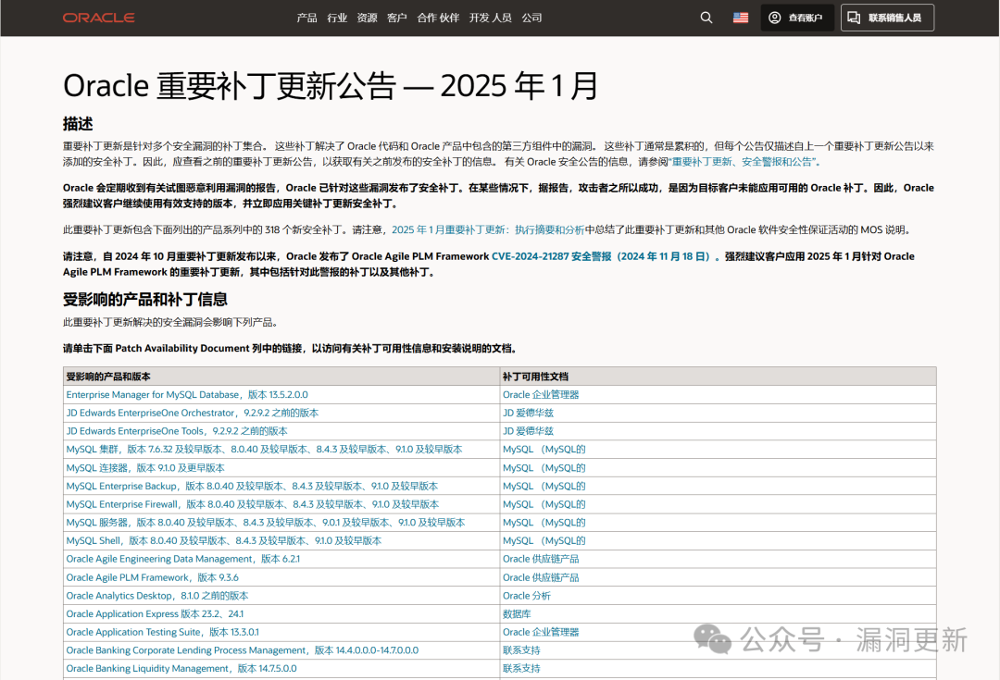  
  
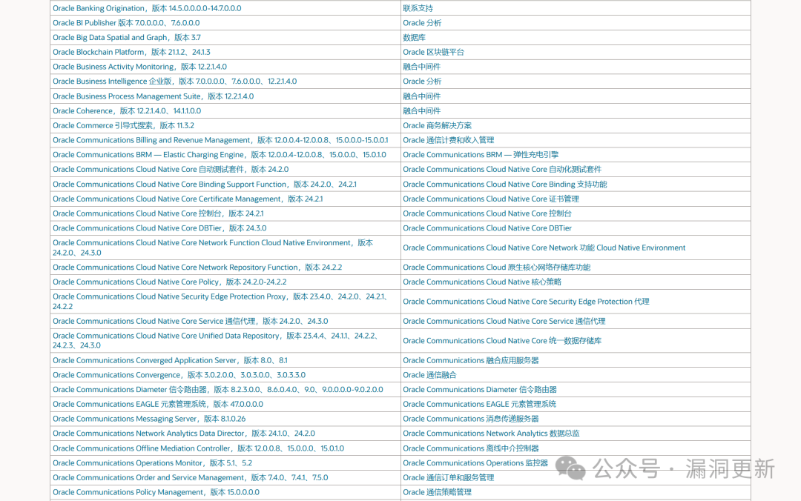  
  
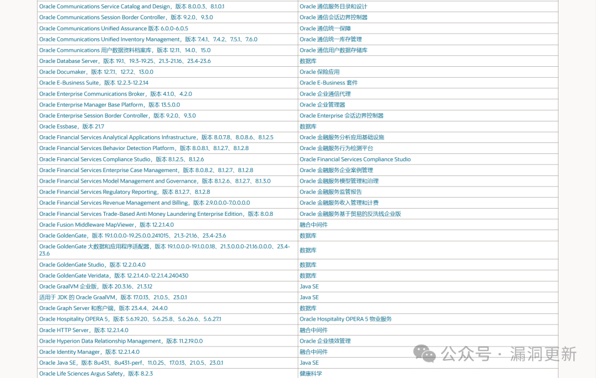  
  
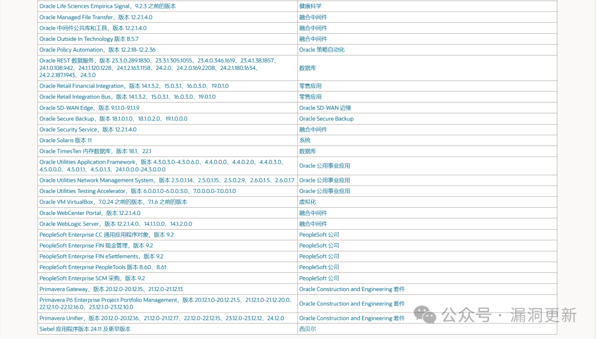  
  
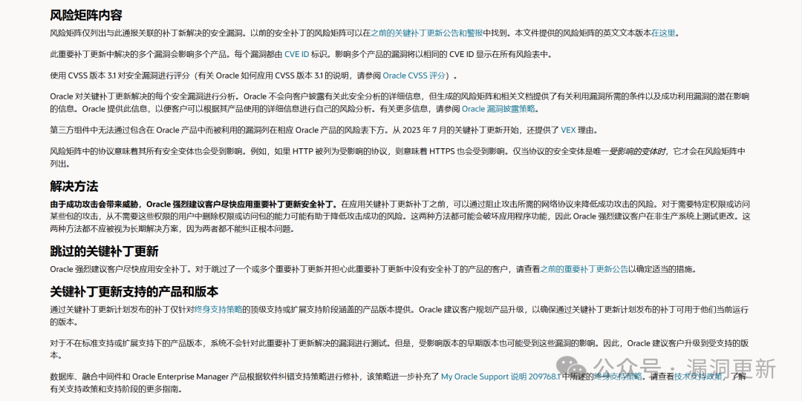  
# Oracle MySQL Server存在未明漏洞  
  
Oracle MySQL的MySQL Server存在安全漏洞。攻击者可利用该漏洞导致MySQL Server挂起或频繁重复崩溃。  
  
CVE ID：  
CVE-2025-21534  
  
危害级别：  
中  
  
影响产品：  
  
Oracle MySQL Server <=8.0.39  
  
Oracle MySQL Server <=8.4.2  
  
Oracle MySQL Server <=9.0.1  
  
漏洞类型：  
通用型漏洞  
  
漏洞解决方案：  
厂商已发布了漏洞修复程序，请及时关注更新：  
  
https://www.oracle.com/security-alerts/cpujan2025.html  
# Oracle MySQL Server存在未明漏洞  
  
Oracle MySQL的MySQL Server存在安全漏洞。攻击者可利用该漏洞导致MySQL Server挂起或频繁重复崩溃。  
  
CVE ID：  
CVE-2025-21493  
  
危害级别：  
中   
  
影响产品：  
  
Oracle MySQL Server <=8.4.3  
  
Oracle MySQL Server <=9.1.0  
  
漏洞类型：  
通用型漏洞  
  
漏洞解决方案：  
厂商已发布了漏洞修复程序，请及时关注更新：  
  
https://www.oracle.com/security-alerts/cpujan2025.html  
  
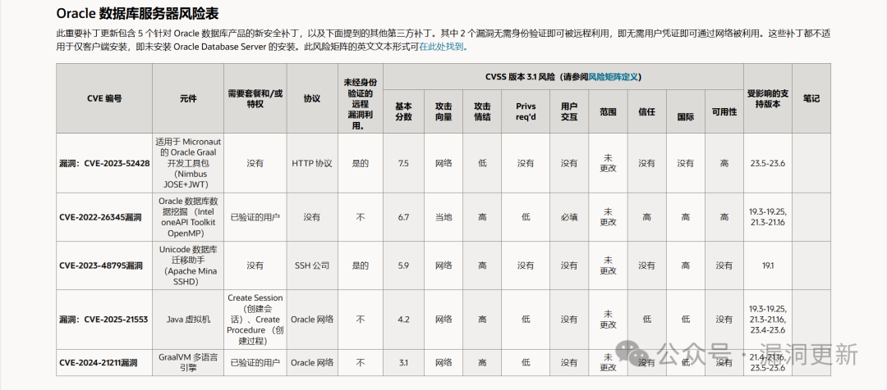  
  
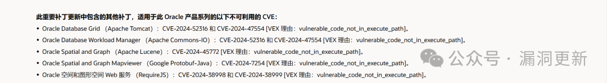  
# Oracle MySQL Server存在未明漏洞  
  
Oracle MySQL的MySQL Server存在安全漏洞，攻击者可利用该漏洞导致MySQL Server挂起或频繁重复崩溃，以及更新、插入或删除MySQL Server可访问数据。  
  
CVE ID：  
CVE-2025-21555  
  
危害级别：  
中  
  
影响产品：  
  
Oracle MySQL Server <=8.0.40  
  
Oracle MySQL Server <=8.4.3  
  
Oracle MySQL Server <=9.1.0  
  
漏洞类型：  
通用型漏洞  
  
漏洞解决方案：  
厂商已发布了漏洞修复程序，请及时关注更新：  
  
https://www.oracle.com/security-alerts/cpujan2025.html  
# Oracle MySQL Server存在未明漏洞  
  
Oracle MySQL的MySQL Enterprise Firewall存在安全漏洞，攻击者可利用该漏洞导致MySQL Enterprise Firewall挂起或频繁重复崩溃。  
  
CVE ID：  
CVE-2025-21495  
  
危害级别：  
中  
  
影响产品：  
  
Oracle MySQL Enterprise Firewall <=8.0.40  
  
Oracle MySQL Enterprise Firewall <=8.4.3  
  
Oracle MySQL Enterprise Firewall <=9.1.0  
  
漏洞类型：  
通用型漏洞  
  
漏洞解决方案：  
厂商已发布了漏洞修复程序，请及时关注更新：  
  
https://www.oracle.com/security-alerts/cpujan2025.html  
  
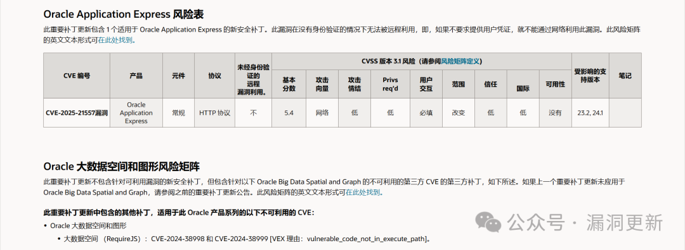  
# Oracle MySQL Server存在未明漏洞  
  
Oracle MySQL的MySQL Server存在安全漏洞。攻击者可利用该漏洞导致MySQL Server挂起或频繁重复崩溃。  
  
CVE ID：  
CVE-2025-21500  
  
危害级别：中  
  
影响产品：  
  
Oracle MySQL Server <=8.0.40  
  
Oracle MySQL Server <=8.4.3  
  
Oracle MySQL Server <=9.1.0  
  
漏洞类型：  
通用型漏洞  
  
漏洞解决方案：  
厂商已发布了漏洞修复程序，请及时关注更新：  
  
https://www.oracle.com/security-alerts/cpujan2025.html  
# Oracle MySQL Server存在未明漏洞  
  
Oracle MySQL的MySQL Server存在安全漏洞。攻击者可利用该漏洞导致MySQL Server挂起或频繁重复崩溃。  
  
CVE ID：  
CVE-2025-21523  
  
危害级别：中  
  
影响产品：  
  
Oracle MySQL Server <=8.0.40  
  
Oracle MySQL Server <=8.4.3  
  
Oracle MySQL Server <=9.1.0  
  
漏洞类型：  
通用型漏洞  
  
漏洞解决方案：  
厂商已发布了漏洞修复程序，请及时关注更新：  
  
https://www.oracle.com/security-alerts/cpujan2025.html  
# Oracle MySQL Server存在未明漏洞  
  
Oracle MySQL的MySQL Server存在安全漏洞。攻击者可利用该漏洞导致MySQL Server挂起或频繁重复崩溃。  
  
CVE ID：  
CVE-2025-21536  
  
危害级别：中  
  
影响产品：  
  
Oracle MySQL Server <=8.0.39  
  
Oracle MySQL Server <=8.4.2  
  
Oracle MySQL Server <=9.0.1  
  
漏洞类型：  
通用型漏洞  
  
漏洞解决方案：  
厂商已发布了漏洞修复程序，请及时关注更新：  
  
https://www.oracle.com/security-alerts/cpujan2025.html  
  
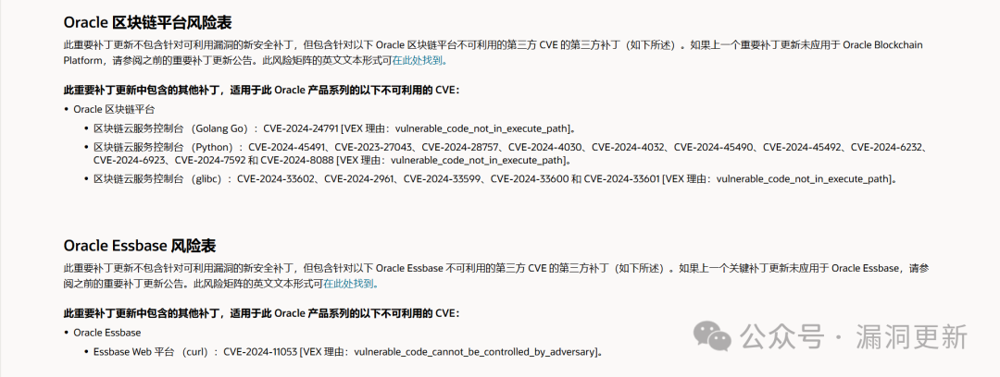  
  
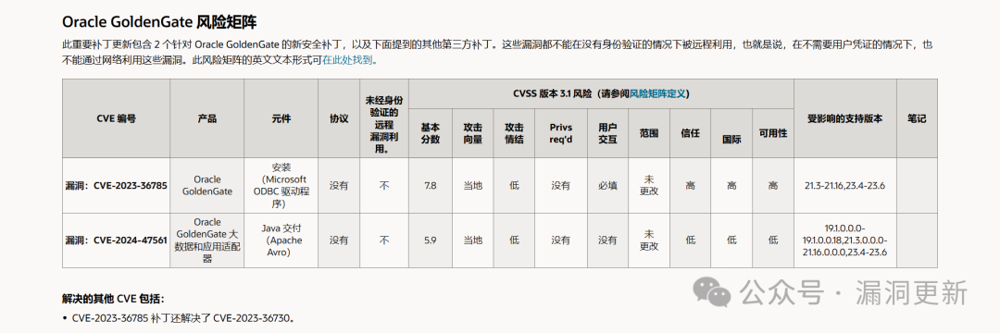  
  
  
  
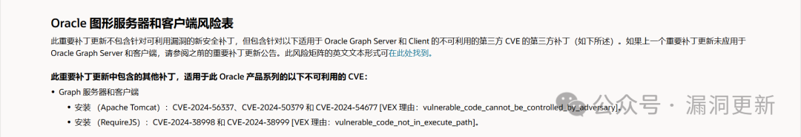  
  
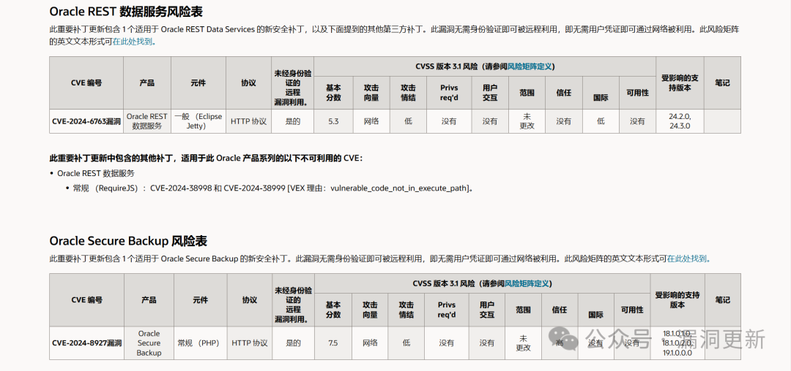  
# Oracle MySQL Server存在未明漏洞  
  
Oracle MySQL的MySQL Server存在安全漏洞。攻击者可利用该漏洞导致MySQL Server挂起或频繁重复崩溃。  
  
CVE ID：  
CVE-2025-21499  
  
危害级别：中  
  
影响产品：  
  
Oracle MySQL Server <=8.4.3  
  
Oracle MySQL Server <=9.1.0  
  
漏洞类型：  
通用型漏洞  
  
漏洞解决方案：  
厂商已发布了漏洞修复程序，请及时关注更新：  
  
https://www.oracle.com/security-alerts/cpujan2025.html  
  
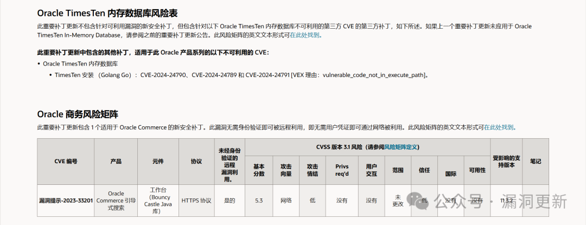  
  
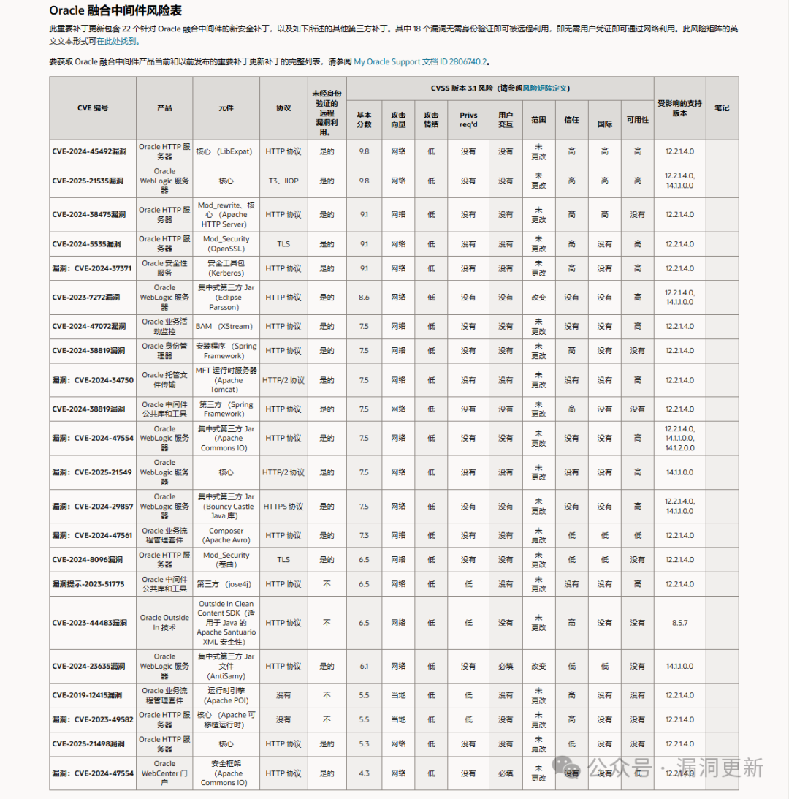  
  
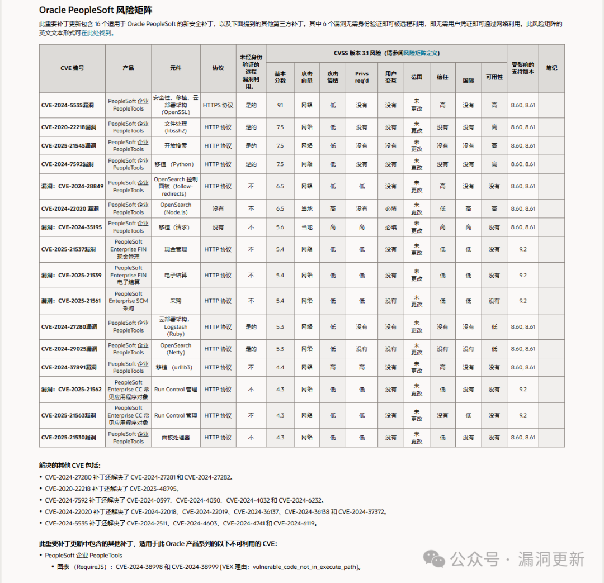  
  
  
  
点个关注：  
  
  
******声明：发布结果公告信息之前，我们决定声明力争保证每条公告的准确性和可靠性建议。同时，采纳和实施公告中的则完全由用户自己决定，可能出现的问题也完全由用户承担。采纳您的建议，您提出您的个人或企业的决策，您应考虑其或个人或您的企业的策略和流程。**  
  

---

> 来源：gelusus/wxvl（微信公众号漏洞文章自动归档，原文见文首链接）
