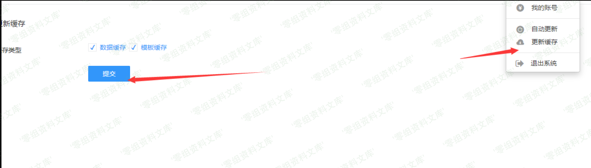

## 2026-10-03 技术核验

phpMyAdmin 官方 PMASA-2019-5 将 CVE-2019-18622 描述为 Designer 功能中的 SQL 注入，并确认受影响版本早于 4.9.2、至少可追溯至 4.7.7；4.9.2 是修复版本，原文“≤4.9.2”不能用于判断该修复版本仍受影响。本文独立分析中的宽字节失败实验、Twig raw 输出与 XSS 推理均保留，但它们不等于官方已经将此编号重分类为 XSS；两种结论需要区分各自证据。本次核对公告和版本边界，未执行验证或确认截图中的实验结果。

# （CVE-2019-18622）Phpmyadmin xss

<!-- vulwiki-editorial:start -->
## 校订与适用边界

- 适用前提：可控制 Designer 显示的表名/请求，受害者打开对应页面；具体账号权限未充分明确
- 证据范围：独立分析从 SQL 注入假设转向 Twig raw 输出，正文展示宽字节不成立的原因及 XSS 修复，应保留论证；其断言官方漏洞类型错误仍需原始公告佐证

### 本次正文校订

- 修正正文 designer 文件名的字母转置。

### 尚未解决的证据缺口

以下限制仍适用于后文历史材料；相关版本、结果或修复结论不能据此视为已验证：

- 影响范围<=4.9.2与末尾4.9.2已转义修复直接冲突
- db_desingner.php 拼写与 db_designer.php 不一致
- Twig 示例未明确 autoescape 环境配置，演示与产品实际配置需区别
- 截图密集且引用有重复残尾

本页为文本校订，未执行代码、PoC 或目标请求；原图仅保留引用，未据此确认复现成功。
<!-- vulwiki-editorial:end -->

## 技术正文与历史材料

一、漏洞简介
------------

官方公布的是sql注入漏洞，但是实际是xss漏洞

二、漏洞影响
------------

Phpmyadmin \<=4.9.2，至少影响到4.7.7。

三、复现过程
------------

### 漏洞分析

首先看官方修复的方式：

Phpmyadminxss/media/rId25.png)

如上图，先关注/js/designer/move.js文件，可以看到单纯的修改了取值方式，最终的值通过POST
方式提交到db\_designer.php文件，关键内容如下：

    if (isset($_POST['dialog'])) {

         ....

        } elseif ($_POST['dialog'] == 'add_table') {
            // Pass the db and table to the getTablesInfo so we only have the table we asked for
            $script_display_field = $designerCommon->getTablesInfo($_POST['db'], $_POST['table']);
         ...
    }

传到了getTablesInfo()函数中，该函数内容主要如下：

    public function getTablesInfo($db = null, $table = null)
        {
            .....
            foreach ($tables as $one_table) {
                $DF = $this->relation->getDisplayField($db, $one_table['TABLE_NAME']);
                $DF = is_string($DF) ? $DF : '';
                $DF = ($DF !== '') ? $DF : null;
                $designerTables[] = new DesignerTable(
                                        $db,
                                        $one_table['TABLE_NAME'],
                                        $one_table['ENGINE'],
                                        $DF
                                    );
            }

            return $designerTables;
        }

跟进getDisplayField()，内容如下：

    public function getDisplayField($db, $table)
        {
            $cfgRelation = $this->getRelationsParam();

            /**
             * Try to fetch the display field from DB.
             */
            if ($cfgRelation['displaywork']) {
                $disp_query = '
                    SELECT `display_field`
                    FROM ' . Util::backquote($cfgRelation['db'])
                        . '.' . Util::backquote($cfgRelation['table_info']) . '
                    WHERE `db_name`    = \'' . $GLOBALS['dbi']->escapeString($db) . '\'
                        AND `table_name` = \'' . $GLOBALS['dbi']->escapeString($table)
                    . '\'';

                $row = $GLOBALS['dbi']->fetchSingleRow(
                    $disp_query, 'ASSOC', DatabaseInterface::CONNECT_CONTROL
                );
                if (isset($row['display_field'])) {
                    return $row['display_field'];
                }
            }
       ....

通过escapeString过滤 table 名，查看该过滤函数：

    public function escapeString($link, $str)
        {
            return mysql_real_escape_string($str, $link);
        }

引入了mysql\_real\_escape\_string()函数

这个函数类似于addslashes()函数，当编码不当的时候，可能导致宽字节注入

但真的那么简单吗？继续往下看

这里获得的table\_name 参数会传入以下语句：

    SELECT *, `COLUMN_NAME` AS `Field`, `COLUMN_TYPE` AS `Type`, `COLLATION_NAME` AS `Collation`, `IS_NULLABLE` AS `Null`, `COLUMN_KEY` AS `Key`, `COLUMN_DEFAULT` AS `Default`, `EXTRA` AS `Extra`, `PRIVILEGES` AS `Privileges`, `COLUMN_COMMENT` AS `Comment` FROM `information_schema`.`COLUMNS` WHERE `TABLE_SCHEMA` = 'day1' AND `TABLE_NAME` = '$table_name';

这里的\$table\_name在
db\_designer.php中可控，然而当环境准备好，语句配置好后，却出现了以下错误：

Phpmyadminxss/media/rId26.png)

    JSON encoding failed: Malformed UTF-8 characters, possibly incorrectly encoded

提示是因为编码问题，因此我们重新将 payload url 编码后再传入：

Phpmyadminxss/media/rId27.png)

这次无误，查看执行的语句：

Phpmyadminxss/media/rId28.png)

%df%27并没有按照我们想法闭合单引号，到底是什么原因呢？

Phpmyadminxss/media/rId29.png)

在数据库连接的时候，phpmyadmin会将默认的字符格式设置为
utf8mb4，而我们宽字节注入必须要求编码为g
bk，因此其实这里不存在宽字节注入。

说明这里的修复对SQL
漏洞并无多大关系（其实从修复文件上看，就知道了），继续看下一处修复。

    /templates/database/designer/database_tables.twig处

diff 如下：

    -                    {{ designerTable.getTableName()|raw }}
    +                    {{ designerTable.getTableName() }}

可以看到，唯一的差别就是删除了\|raw，这种写法是Twig模板语言的写法，raw
的作用就是让数据在 autoescape过滤器里失效，可以安装一个 twig
模板看看实例。

    composer require "twig/twig:^3.0"

Phpmyadminxss/media/rId30.png)

运行命令后该目录下会生成2个文件：composer.json、composer.lock以及一个目录vendor

然后在同目录下创建文件夹templates、tmp

进入templates目录下创建index.html.twig文件，内容如下

    <!DOCTYPE html>
    <html lang="en">
    <head>
        <meta charset="UTF-8">
        <title>twig</title>
    </head>
    <body>
    <h1>test</h1> 
     {{ name |raw}}
     
    {{ name }}
    </body>
    </html>

根目录下创建index.php，内容如下：

    require_once 'vendor/autoload.php';

    $loader = new \Twig\Loader\FilesystemLoader('templates');
    $twig = new \Twig\Environment($loader, [
        'cache' => '/Library/WebServer/Documents/twig/tmp',
    ]);

    echo $twig->render('index.html.twig', ['name' => 'panda\' union select 1,2, from a']);

访问index.php可以发现：

Phpmyadminxss/media/rId31.png)

单引号被转义成了实体字符

修复的 SQL 漏洞点在这里吗？

并不是。这里修复的仅仅是前端显示字符串的问题，与后端的 sql
注入也并无关系。

前文中提到的move.js修复的也是前端的内容，其实也和后端的 sql
注入并无关系。

那么这个修复方式和 sql 注入到底是什么关系呢？

可能没关系吧。

考虑到该修复内容全部为前端的内容，于是将表名改为 XSS 的 payload：

    

果然，和当初想的一样，触发了 XSS 漏洞。

Phpmyadminxss/media/rId32.png)

Phpmyadminxss/media/rId33.png)

然后看v4.9.2版本的 phpmyadmin：

Phpmyadminxss/media/rId34.png)

Phpmyadminxss/media/rId35.png)

转义成实体字符，无法触发 XSS
