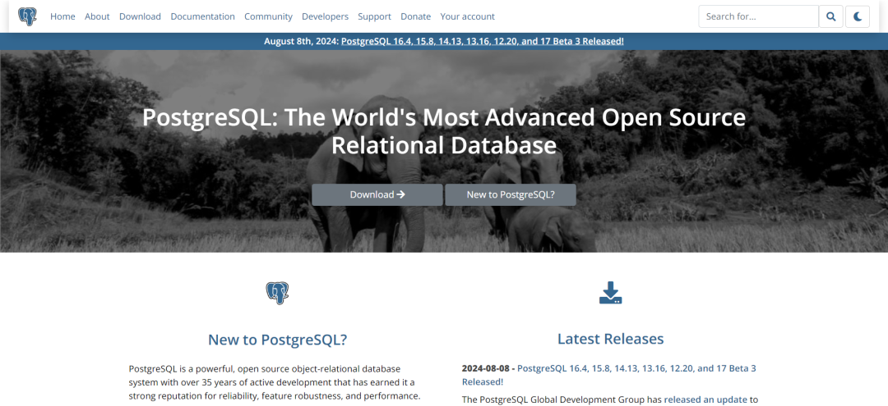

# 漏洞预警 | PostgreSQL竞争条件漏洞

<!-- vulwiki-editorial:start -->
## 校订与适用边界

- 适用前提：可创建数据库对象，等待另一用户执行 pg_dump 并利用关系替换竞争
- 证据范围：正文机制和16.4/15.8/14.13/13.16/12.20修复边界均与官方7348一致，与所标2454不一致

### 已有来源支持的更正

- 官方 pg_dump TOCTOU 机制与本文全部修复边界一致
- 官方2454是 CREATE SCHEMA/search_path 提权，修于2023年15.3等，与本文不符

### 尚未解决的证据缺口

以下限制仍适用于后文历史材料；相关版本、结果或修复结论不能据此视为已验证：

- 标题、frontmatter 与正文内 CVE-2023-2454 均应纠正，不能与真实2454合并

### 核验来源

- https://www.postgresql.org/support/security/CVE-2024-7348/
- https://www.postgresql.org/support/security/CVE-2023-2454/

本页为文本校订，未执行代码、PoC 或目标请求；原图仅保留引用，未据此确认复现成功。
<!-- vulwiki-editorial:end -->

## 技术正文与历史材料

浅安  浅安安全   2024-08-16 08:00  
  
**0x00 漏洞编号**  
- # CVE-2023-2454  
  
**0x01 危险等级**  
- 高危  
  
**0x02 漏洞概述**  
  
PostgreSQL是一个免费的对象-关系数据库服务器，它的Slogan是“世界上最先进的开源关系型数据库”。它具有强大的功能、稳定的性能、高度的可扩展性和丰富的数据类型。  
  
  
  
**0x03 漏洞详情**  
  
**CVE-2023-2454**  
  
**漏洞类型：**  
竞争条件  
  
**影响：**  
代码执行  
  
**简述：**  
PostgreSQL多个受影响版本在pg_dump工具中存在TOCTOU竞争条件漏洞，pg_dump是PostgreSQL用于备份数据库的工具，它通常由具有较高权限的用户运行。pg_dump工具在导出数据库对象时会检查数据库中的对象类型并在之后处理这些对象，由于pg_dump在检查对象类型和实际使用这些对象之间存在检查时间使用时间竞争条件漏洞，威胁者可利用该漏洞来替换某些数据库对象，从而在pg_dump的执行过程中插入和执行恶意SQL代码/函数，从而可能控制数据库或破坏数据完整性。  
###   
  
**0x04 影响版本**  
- PostgreSQL 16 < 16.4  
  
- PostgreSQL 15 < 15.8  
  
- PostgreSQL 14 < 14.13  
  
- PostgreSQL 13 < 13.16  
  
- PostgreSQL 12 < 12.20  
  
**0x05****修复建议**  
  
**目前官方已发布漏洞修复版本，建议用户升级到安全版本****：**  
  
https://www.postgresql.org/  
  
  
  

---

> 来源：gelusus/wxvl（微信公众号漏洞文章自动归档，原文见文首链接）
