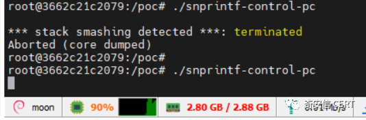

# SQLite拒绝服务漏洞(CVE-2022-35737)安全风险通告

<!-- vulwiki-editorial:start -->
## 校订与适用边界

- 适用前提：应用将攻击者可控的大字符串传给特定 SQLite C API；不是安装 SQLite 即自动远程可利用
- 证据范围：完整读取 HTML 表格及正文；文主要论拒绝服务，表格又提潜在执行，需要区分已演示影响与条件性扩展

### 尚未解决的证据缺口

以下限制仍适用于后文历史材料；相关版本、结果或修复结论不能据此视为已验证：

- 缺具体函数、字符串尺寸、格式和应用可达性条件，广泛受影响平台的表述易夸大
- 已复现仅为发布者声明及未视检截图，正文无PoC
- 大段内联HTML/CSS、营销内容可规范化

### 操作风险与资料使用

- 含资源消耗、延时或崩溃验证：可能影响服务可用性；限制请求次数、并发与超时，保留无攻击负载的对照结果。

本页为文本校订，未执行代码、PoC 或目标请求；原图仅保留引用，未据此确认复现成功。
<!-- vulwiki-editorial:end -->

## 技术正文与历史材料

原创 QAX CERT  奇安信 CERT   2022-10-28 10:47  
  
  
  
奇安信CERT  
  
**致力于**  
第一时间  
为企业级用户提供安全风险  
**通告**  
和  
**有效**  
解决方案。  
  
  
**安全通告**  
  
  
  
SQLite是使用广泛的开源数据库引擎，默认包含在 Android、iOS、W  
indows 和 macOS 以及流行的 Web 浏览器（ 如 Google Chrome、Mozilla Firefox 和 Apple Safari）中。  
  
  
近日，奇安信CERT监测到SQLite存在拒绝服务漏洞(CVE-2022-35737)。攻击者可以将大字符串传递给SQLite的某些函数，触发数组越界导致拒绝服务，消耗系统内存和CPU资源。**目前，此漏洞技术细节与POC已公开。****鉴于此漏洞影响范围极大，建议客户尽快做好自查，及时更新至最新版本。**  
  
****  
<table><tbody><tr style="height:25px;"><td style="border-color: rgb(221, 221, 221);padding: 0px 7px;" height="25" width="57">
<strong>漏洞名称</strong>
</td><td colspan="3" style="border-color: rgb(221, 221, 221);border-left-width: initial;border-left-style: none;padding: 0px 7px;" height="25">
<strong>SQLite</strong><strong>拒绝服务漏洞</strong><strong>(CVE-2022-35737)</strong>
</td></tr><tr style="height:25px;"><td style="border-color: rgb(221, 221, 221);border-top-width: initial;border-top-style: none;padding: 0px 7px;" height="25" width="72">
<strong>公开时间</strong>
</td><td style="border-top: none rgb(221, 221, 221);border-left: none rgb(221, 221, 221);border-bottom-color: rgb(221, 221, 221);border-right-color: rgb(221, 221, 221);padding: 0px 7px;" height="25" width="169">
2022-08-03
</td><td style="border-top: none rgb(221, 221, 221);border-left: none rgb(221, 221, 221);border-bottom-color: rgb(221, 221, 221);border-right-color: rgb(221, 221, 221);padding: 0px 7px;" height="25" width="128">
<strong>更新时间</strong>
</td><td style="border-top: none rgb(221, 221, 221);border-left: none rgb(221, 221, 221);border-bottom-color: rgb(221, 221, 221);border-right-color: rgb(221, 221, 221);padding: 0px 7px;" height="25" width="163">
2022-10-26
</td></tr><tr style="height:48px;"><td style="border-color: rgb(221, 221, 221);border-top-width: initial;border-top-style: none;padding: 0px 7px;" height="48" width="85">
<strong>CVE</strong><strong>编号</strong>
</td><td style="border-top: none rgb(221, 221, 221);border-left: none rgb(221, 221, 221);border-bottom-color: rgb(221, 221, 221);border-right-color: rgb(221, 221, 221);padding: 0px 7px;" height="48" width="175">
CVE-2022-35737
</td><td style="border-top: none rgb(221, 221, 221);border-left: none rgb(221, 221, 221);border-bottom-color: rgb(221, 221, 221);border-right-color: rgb(221, 221, 221);padding: 0px 7px;" height="48" width="135">
<strong>其他编号</strong>
</td><td style="border-top: none rgb(221, 221, 221);border-left: none rgb(221, 221, 221);border-bottom-color: rgb(221, 221, 221);border-right-color: rgb(221, 221, 221);padding: 0px 7px;" height="48" width="166">
CNVD-2022-62235
</td></tr><tr style="height:25px;"><td style="border-color: rgb(221, 221, 221);border-top-width: initial;border-top-style: none;padding: 0px 7px;" height="25" width="94">
<strong>威胁类型</strong>
</td><td style="border-top: none rgb(221, 221, 221);border-left: none rgb(221, 221, 221);border-bottom-color: rgb(221, 221, 221);border-right-color: rgb(221, 221, 221);padding: 0px 7px;" height="25" width="173">
拒绝服务
</td><td style="border-top: none rgb(221, 221, 221);border-left: none rgb(221, 221, 221);border-bottom-color: rgb(221, 221, 221);border-right-color: rgb(221, 221, 221);padding: 0px 7px;" height="25" width="138">
<strong>技术类型</strong>
</td><td style="border-top: none rgb(221, 221, 221);border-left: none rgb(221, 221, 221);border-bottom-color: rgb(221, 221, 221);border-right-color: rgb(221, 221, 221);padding: 0px 7px;" height="25" width="165">
数组索引验证不当
</td></tr><tr style="height:25px;"><td style="border-color: rgb(221, 221, 221);border-top-width: initial;border-top-style: none;padding: 0px 7px;" height="25" width="100">
<strong>厂商</strong>
</td><td style="border-top: none rgb(221, 221, 221);border-left: none rgb(221, 221, 221);border-bottom-color: rgb(221, 221, 221);border-right-color: rgb(221, 221, 221);padding: 0px 7px;" height="25" width="171">
SQLite
</td><td style="border-top: none rgb(221, 221, 221);border-left: none rgb(221, 221, 221);border-bottom-color: rgb(221, 221, 221);border-right-color: rgb(221, 221, 221);padding: 0px 7px;" height="25" width="138">
<strong>产品</strong>
</td><td style="border-top: none rgb(221, 221, 221);border-left: none rgb(221, 221, 221);border-bottom-color: rgb(221, 221, 221);border-right-color: rgb(221, 221, 221);padding: 0px 7px;" height="25" width="163">
SQLite
</td></tr><tr style="height:25px;"><td colspan="4" style="border-color: rgb(221, 221, 221);border-top-width: initial;border-top-style: none;padding: 0px 7px;" height="25">
<strong>风险等级</strong>
</td></tr><tr style="height:25px;"><td colspan="2" style="border-color: rgb(221, 221, 221);border-top-width: initial;border-top-style: none;padding: 0px 7px;" height="25">
<strong>奇安信</strong><strong>CERT</strong><strong>风险评级</strong>
</td><td colspan="2" style="border-top: none rgb(221, 221, 221);border-left: none rgb(221, 221, 221);border-bottom-color: rgb(221, 221, 221);border-right-color: rgb(221, 221, 221);padding: 0px 7px;" height="25">
<strong>风险等级</strong>
</td></tr><tr style="height:25px;"><td colspan="2" style="border-color: rgb(221, 221, 221);border-top-width: initial;border-top-style: none;padding: 0px 7px;" height="25">
<strong>高危</strong>
</td><td colspan="2" style="border-top: none rgb(221, 221, 221);border-left: none rgb(221, 221, 221);border-bottom-color: rgb(221, 221, 221);border-right-color: rgb(221, 221, 221);padding: 0px 7px;" height="25">
<strong>蓝色（一般事件）</strong>
</td></tr><tr style="height:25px;"><td colspan="4" style="border-color: rgb(221, 221, 221);border-top-width: initial;border-top-style: none;padding: 0px 7px;" height="25">
<strong>现时威胁状态</strong>
</td></tr><tr style="height:25px;"><td style="border-color: rgb(221, 221, 221);border-top-width: initial;border-top-style: none;padding: 0px 7px;" height="25" width="105">
<strong>POC</strong><strong>状态</strong>
</td><td style="border-top: none rgb(221, 221, 221);border-left: none rgb(221, 221, 221);border-bottom-color: rgb(221, 221, 221);border-right-color: rgb(221, 221, 221);padding: 0px 7px;" height="25" width="170">
<strong>EXP</strong><strong>状态</strong>
</td><td style="border-top: none rgb(221, 221, 221);border-left: none rgb(221, 221, 221);border-bottom-color: rgb(221, 221, 221);border-right-color: rgb(221, 221, 221);padding: 0px 7px;" height="25" width="137">
<strong>在野利用状态</strong>
</td><td style="border-top: none rgb(221, 221, 221);border-left: none rgb(221, 221, 221);border-bottom-color: rgb(221, 221, 221);border-right-color: rgb(221, 221, 221);padding: 0px 7px;" height="25" width="162">
<strong>技术细节状态</strong>
</td></tr><tr style="height:25px;"><td style="border-color: rgb(221, 221, 221);border-top-width: initial;border-top-style: none;padding: 0px 7px;" height="25" width="108">
<strong>已发现</strong>
</td><td style="border-top: none rgb(221, 221, 221);border-left: none rgb(221, 221, 221);border-bottom-color: rgb(221, 221, 221);border-right-color: rgb(221, 221, 221);padding: 0px 7px;" height="25" width="169">
未发现
</td><td style="border-top: none rgb(221, 221, 221);border-left: none rgb(221, 221, 221);border-bottom-color: rgb(221, 221, 221);border-right-color: rgb(221, 221, 221);padding: 0px 7px;" height="25" width="137">
未发现
</td><td style="border-top: none rgb(221, 221, 221);border-left: none rgb(221, 221, 221);border-bottom-color: rgb(221, 221, 221);border-right-color: rgb(221, 221, 221);padding: 0px 7px;" height="25" width="161">
<strong>已公开</strong>
</td></tr><tr style="height:104px;"><td style="border-color: rgb(221, 221, 221);border-top-width: initial;border-top-style: none;padding: 0px 7px;" height="104" width="111">
<strong>漏洞描述</strong>
</td><td colspan="3" style="border-top: none rgb(221, 221, 221);border-left: none rgb(221, 221, 221);border-bottom-color: rgb(221, 221, 221);border-right-color: rgb(221, 221, 221);padding: 0px 7px;" height="104">
SQLite存在数组边界溢出，攻击者将大字符串传递给SQLite的CAPI字符串参数，导致拒绝服务，可能实现任意代码执行。
</td></tr><tr style="height:61px;"><td style="border-color: rgb(221, 221, 221);border-top-width: initial;border-top-style: none;padding: 0px 7px;" height="61" width="113">
<strong>影响版本</strong>
</td><td colspan="3" style="border-top: none rgb(221, 221, 221);border-left: none rgb(221, 221, 221);border-bottom-color: rgb(221, 221, 221);border-right-color: rgb(221, 221, 221);padding: 0px 7px;" height="61">
1.0.12 &lt;= SQLite &lt; 3.39.2
</td></tr></tbody></table>  
  
奇安信CERT已成功复现**SQLite拒绝服务漏洞(CVE-2022-35737)**，截图如下：  
  
  
  
  
威胁评估  
  
<table><tbody><tr style="height:25px;"><td style="border-color: rgb(221, 221, 221);padding: 0px 7px;" height="25" width="63">
<strong>漏洞名称</strong>
</td><td colspan="4" style="border-color: rgb(221, 221, 221);border-left-width: initial;border-left-style: none;padding: 0px 7px;" height="25" width="66">
<strong>SQLite</strong><strong>拒绝服务漏洞</strong><strong>(CVE-2022-35737)</strong>
</td></tr><tr style="height:50px;"><td style="border-color: rgb(221, 221, 221);border-top-width: initial;border-top-style: none;padding: 0px 7px;" height="50" width="63">
<strong>CVE</strong><strong>编号</strong>
</td><td style="border-top: none rgb(221, 221, 221);border-left: none rgb(221, 221, 221);border-bottom-color: rgb(221, 221, 221);border-right-color: rgb(221, 221, 221);padding: 0px 7px;" height="50" width="109">
CVE-2022-35737
</td><td colspan="2" style="border-top: none rgb(221, 221, 221);border-left: none rgb(221, 221, 221);border-bottom-color: rgb(221, 221, 221);border-right-color: rgb(221, 221, 221);padding: 0px 7px;" height="50" width="166">
<strong>其他编号</strong>
</td><td style="border-top: none rgb(221, 221, 221);border-left: none rgb(221, 221, 221);border-bottom-color: rgb(221, 221, 221);border-right-color: rgb(221, 221, 221);padding: 0px 7px;" height="50" width="119">
CNVD-2022-62235
</td></tr><tr style="height:25px;"><td style="border-color: rgb(221, 221, 221);border-top-width: initial;border-top-style: none;padding: 0px 7px;" height="25" width="63">
<strong>CVSS 3.1</strong><strong>评级</strong>
</td><td style="border-top: none rgb(221, 221, 221);border-left: none rgb(221, 221, 221);border-bottom-color: rgb(221, 221, 221);border-right-color: rgb(221, 221, 221);padding: 0px 7px;" height="25" width="109">
高危
</td><td colspan="2" style="border-top: none rgb(221, 221, 221);border-left: none rgb(221, 221, 221);border-bottom-color: rgb(221, 221, 221);border-right-color: rgb(221, 221, 221);padding: 0px 7px;" height="25" width="172">
<strong>CVSS 3.1</strong><strong>分数</strong>
</td><td style="border-top: none rgb(221, 221, 221);border-left: none rgb(221, 221, 221);border-bottom-color: rgb(221, 221, 221);border-right-color: rgb(221, 221, 221);padding: 0px 7px;" height="25" width="119">
7.5
</td></tr><tr style="height:25px;"><td rowspan="8" style="border-color: rgb(221, 221, 221);border-top-width: initial;border-top-style: none;padding: 0px 7px;" height="25" width="63">
<strong>CVSS</strong><strong>向量</strong>
</td><td colspan="2" style="border-top: none rgb(221, 221, 221);border-left: none rgb(221, 221, 221);border-bottom-color: rgb(221, 221, 221);border-right-color: rgb(221, 221, 221);padding: 0px 7px;" height="25" width="66">
<strong>访问途径（</strong><strong>AV</strong><strong>）</strong>
</td><td colspan="2" style="border-top: none rgb(221, 221, 221);border-left: none rgb(221, 221, 221);border-bottom-color: rgb(221, 221, 221);border-right-color: rgb(221, 221, 221);padding: 0px 7px;" height="25">
<strong>攻击复杂度（</strong><strong>AC</strong><strong>）</strong>
</td></tr><tr style="height:25px;"><td colspan="2" style="border-top: none rgb(221, 221, 221);border-left: none rgb(221, 221, 221);border-bottom-color: rgb(221, 221, 221);border-right-color: rgb(221, 221, 221);padding: 0px 7px;" height="25" width="218">
网络
</td><td colspan="2" style="border-top: none rgb(221, 221, 221);border-left: none rgb(221, 221, 221);border-bottom-color: rgb(221, 221, 221);border-right-color: rgb(221, 221, 221);padding: 0px 7px;" height="25" width="172">
低
</td></tr><tr style="height:25px;"><td colspan="2" style="border-top: none rgb(221, 221, 221);border-left: none rgb(221, 221, 221);border-bottom-color: rgb(221, 221, 221);border-right-color: rgb(221, 221, 221);padding: 0px 7px;" height="25" width="218">
<strong>所需权限（</strong><strong>PR</strong><strong>）</strong>
</td><td colspan="2" style="border-top: none rgb(221, 221, 221);border-left: none rgb(221, 221, 221);border-bottom-color: rgb(221, 221, 221);border-right-color: rgb(221, 221, 221);padding: 0px 7px;" height="25" width="172">
<strong>用户交互（</strong><strong>UI</strong><strong>）</strong>
</td></tr><tr style="height:25px;"><td colspan="2" style="border-top: none rgb(221, 221, 221);border-left: none rgb(221, 221, 221);border-bottom-color: rgb(221, 221, 221);border-right-color: rgb(221, 221, 221);padding: 0px 7px;" height="25" width="218">
不需要
</td><td colspan="2" style="border-top: none rgb(221, 221, 221);border-left: none rgb(221, 221, 221);border-bottom-color: rgb(221, 221, 221);border-right-color: rgb(221, 221, 221);padding: 0px 7px;" height="25" width="172">
不需要
</td></tr><tr style="height:25px;"><td colspan="2" style="border-top: none rgb(221, 221, 221);border-left: none rgb(221, 221, 221);border-bottom-color: rgb(221, 221, 221);border-right-color: rgb(221, 221, 221);padding: 0px 7px;" height="25" width="218">
<strong>影响范围（</strong><strong>S</strong><strong>）</strong>
</td><td colspan="2" style="border-top: none rgb(221, 221, 221);border-left: none rgb(221, 221, 221);border-bottom-color: rgb(221, 221, 221);border-right-color: rgb(221, 221, 221);padding: 0px 7px;" height="25" width="172">
<strong>机密性影响（</strong><strong>C</strong><strong>）</strong>
</td></tr><tr style="height:25px;"><td colspan="2" style="border-top: none rgb(221, 221, 221);border-left: none rgb(221, 221, 221);border-bottom-color: rgb(221, 221, 221);border-right-color: rgb(221, 221, 221);padding: 0px 7px;" height="25" width="218">
不改变
</td><td colspan="2" style="border-top: none rgb(221, 221, 221);border-left: none rgb(221, 221, 221);border-bottom-color: rgb(221, 221, 221);border-right-color: rgb(221, 221, 221);padding: 0px 7px;" height="25" width="172">
无
</td></tr><tr style="height:25px;"><td colspan="2" style="border-top: none rgb(221, 221, 221);border-left: none rgb(221, 221, 221);border-bottom-color: rgb(221, 221, 221);border-right-color: rgb(221, 221, 221);padding: 0px 7px;" height="25" width="218">
<strong>完整性影响（</strong><strong>I</strong><strong>）</strong>
</td><td colspan="2" style="border-top: none rgb(221, 221, 221);border-left: none rgb(221, 221, 221);border-bottom-color: rgb(221, 221, 221);border-right-color: rgb(221, 221, 221);padding: 0px 7px;" height="25" width="172">
<strong>可用性影响（</strong><strong>A</strong><strong>）</strong>
</td></tr><tr style="height:25px;"><td colspan="2" style="border-top: none rgb(221, 221, 221);border-left: none rgb(221, 221, 221);border-bottom-color: rgb(221, 221, 221);border-right-color: rgb(221, 221, 221);padding: 0px 7px;" height="25" width="218">
无
</td><td colspan="2" style="border-top: none rgb(221, 221, 221);border-left: none rgb(221, 221, 221);border-bottom-color: rgb(221, 221, 221);border-right-color: rgb(221, 221, 221);padding: 0px 7px;" height="25" width="172">
高
</td></tr><tr style="height:114px;"><td style="border-color: rgb(221, 221, 221);border-top-width: initial;border-top-style: none;padding: 0px 7px;" height="114" width="63">
<strong>危害描述</strong>
</td><td colspan="4" style="border-top: none rgb(221, 221, 221);border-left: none rgb(221, 221, 221);border-bottom-color: rgb(221, 221, 221);border-right-color: rgb(221, 221, 221);padding: 0px 7px;" height="114" width="66">
由于SQLite存在数组边界溢出，攻击者将大字符串传递给SQLite的某些函数，导致拒绝服务，消耗系统的内存和CPU资源。
</td></tr></tbody></table>  
  
处置建议  
  
目前SQLite官方已发布安全版本修复该漏洞，建议受影响用户尽快更新至对应的安全版本。  
  
https://sqlite.org/releaselog/3_39_2.html  
  
  
  
产品解决方案  
  
**奇安信开源卫士已支持**  
  
奇安信开源卫士20221028.1211版本已支持对sqlite拒绝服务漏洞(CVE-2022-35737)的检测。  
  
  
  
参考资料  
  
[1]https://nvd.nist.gov/vuln/detail/CVE-2022-35737  
  
[2]https://blog.trailofbits.com/2022/10/25/sqlite-vulnerability-july-2022-library-api/  
  
  
时间线  
  
2022年10月28日，  
奇安信 CERT发布安全风险通告。  
  
  
点击**阅读原文**  
到奇安信NOX-安全监测平台查询更多漏洞详情  
  

---

> 来源：gelusus/wxvl（微信公众号漏洞文章自动归档，原文见文首链接）
